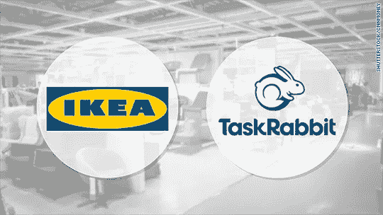
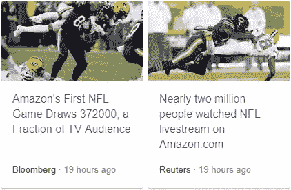

# 在本周的商战中

> 原文：<https://medium.com/hackernoon/this-week-in-the-commerce-wars-a4d15d6f522b>

一些人抱怨我保持沉默，并告诉我他们指望我提供电商大战的新闻消费。这是我们本周看到的一些有趣的东西。

1.  **宜家正在收购 TaskRabbit** 。

TaskRabbit 是一个在线市场，它将自由职业者与当地需求相匹配，让消费者能够立即找到任务帮助(最受欢迎的任务之一是组装宜家家具)。据消息来源称:

> “收购 TaskRabbit 是因为宜家需要进一步加强其数字客户服务能力，以更好地与亚马逊等竞争对手竞争，亚马逊已经增加了其家居商品和安装服务”。

[https://www . recode . net/2017/9/28/16377528/IKEA-acquisition-task rabbit-shopping-home-contract-labor](https://www.recode.net/2017/9/28/16377528/ikea-acquisition-taskrabbit-shopping-home-contract-labor)

**2。** **谷歌已将 YouTube 从 Echo Show 设备中撤出**

亚马逊周二表示，其 Echo Show 设备无法再播放 YouTube 上的视频，因为该网站的母公司谷歌(Google)停止支持这项服务。EchoShow 类似于常规的、 [Alexa](https://hackernoon.com/tagged/alexa) 供电的 Echo 设备，但带有视频屏幕(于[6 月](https://techcrunch.com/2017/06/26/the-echo-show-is-a-small-step-for-echo-a-big-leap-for-amazon)发布)。

[https://www . the verge . com/2017/9/26/16371292/Google-YouTube-Amazon-echo-show](https://www.theverge.com/2017/9/26/16371292/google-youtube-amazon-echo-show)

亚马逊在一份声明中表示:

> “从今天下午开始，谷歌已经决定不再在 Echo Show 上提供 YouTube，没有任何解释，也没有通知客户。这一决定没有任何技术上的原因，这令人失望，并伤害了我们双方的客户。”

昨天，多个消息来源报道——令人惊讶的是——谷歌将推出自己的“Echo Show”杀手:它正在为视频通话和更多功能构建桌面智能屏幕，将与亚马逊的 Echo Show 竞争。

[https://techcrunch.com/2017/09/28/google-homescreen/](https://techcrunch.com/2017/09/28/google-homescreen/)

我们在这里观看的是真正的大男孩联盟比赛，请继续关注《声音的游戏》。(见[我之前关于空间](https://hackernoon.com/game-of-voice-72b98dce5b31)的帖子)。

**3。** **亚马逊开始了它的足球实验——在其视频服务中加入了周四晚足球。**

[http://www . fox news . com/tech/2017/09/28/how-important-is-amazons-NFL-deal-for-Amazon-and-future-league . html](http://www.foxnews.com/tech/2017/09/28/how-important-is-amazons-nfl-deal-for-amazon-and-future-league.html)

据报道，亚马逊为版权支付了 5000 万美元。据一些媒体报道，第一次尝试是失败的，但也有人认为是成功的…

Emmmm…

今天到此为止，请补充我错过的有趣/酷的东西。

下集再见。