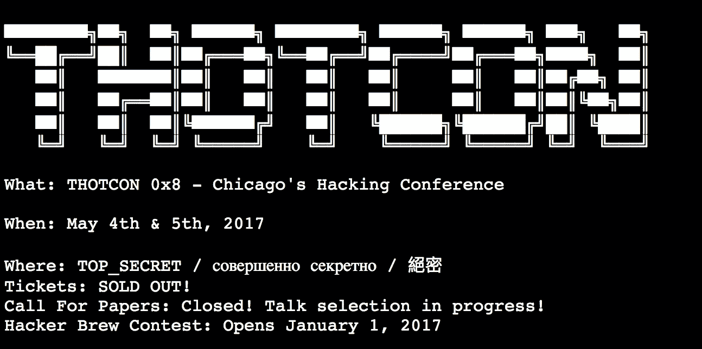
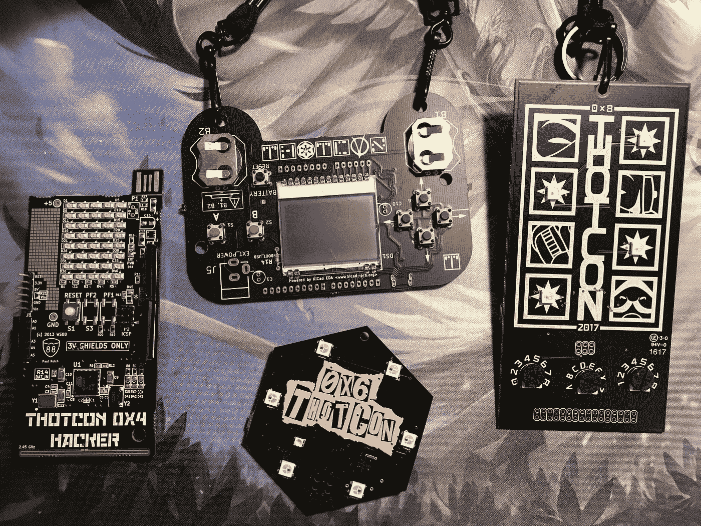
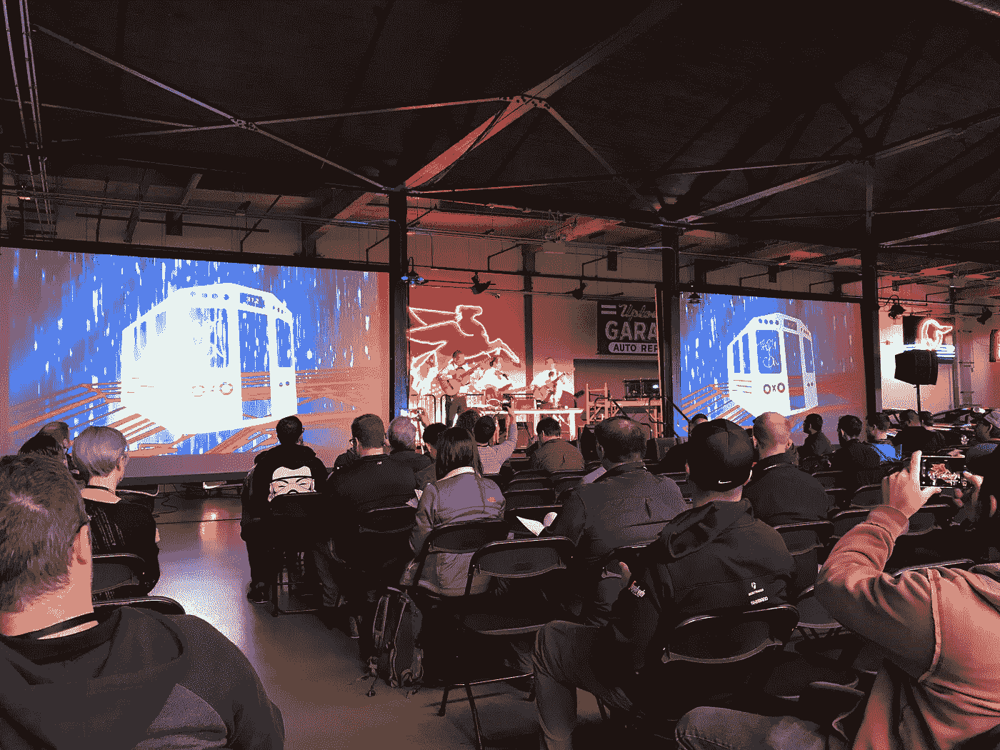

# THOTCON 0x8

> 原文：<https://medium.com/hackernoon/thotcon-0x8-3c97a67c7fcf>

screenshot courtesy thotcon.org

第七天晚上**晚上**晚上**晚上**晚上

 [## THOTCON -芝加哥黑客大会

### 芝加哥黑客大会

芝加哥在黑 Conferencewww.thotcon.org](http://www.thotcon.org/) 

有一个“超级秘密”黑客会议已经在芝加哥举行了 8 年。这是一个类似于 Defcon、Shmocon 和 Derbycon 的信息安全会议。这些会议基本上是一群信息安全书呆子聚在一起谈论他们的行业，分享一些技巧和诀窍，交换故事，喝啤酒，通常不会引起太大的骚动。然而，新闻会用一个点击诱饵标题让你相信并非如此:

 [## 数千人参加芝加哥秘密黑客会议

### Nick Percoco 领我们进去，我们被发给闪烁的电子徽章。徽章基本上是迷你电脑…

www.nbcchicago.com](http://www.nbcchicago.com/investigations/Inside-Chicago-Hacking-Conference-Thotcon-303960871.html) 

那么 Thotcon 是什么？这是一个草根会议，就像其他专业会议一样。Thotcon 与众不同的地方有几个。

1.  没有一次谈话被记录下来。这使得敏感话题的讨论没有律师担心，适当的披露等等。
2.  会议本身没有企业赞助，这有助于避免企业偏见。这有助于保持草根性，草根是吸引力的一部分。余兴派对是有赞助的，但那是出于娱乐和成本的目的。
3.  地点只对与会者和演讲者公开，但在芝加哥。这增加了超级秘密黑客的角色，但它也只是好玩。

我参加这个会议已经 5 年了，今年是这个会议存在的第 8 个年头。我曾在一个有 3000 人参加的全球会议上发言(无耻的 splunk conf plug ),那是我公司的内部迷你会议、迷你黑客会议和成熟的黑客马拉松。

c7five 是大会的主要 OPER(ater)，他全身心地投入到大会中，并且相信大会。令人耳目一新的是，有人已经这样做了 8 年，仍然有激情推动会议。我参加过很多会议/聚会/活动。我在一个全球数千人的会议上做过演讲，我能体会到大型活动的一些困难，需要几个月的计划。https://conf.splunk.com/speakers/2014.html#search=fettis&
后勤工作非常复杂，你希望所有的会谈都令人惊叹。甚至当我在办公室里开一个只有 20-30 人的小型会议时，工作量也超出了我的预期。

主要问题出在科技/安全领域，前沿都在 twitter 或 reddit 或 irc 上。当征集论文的事情发生时，离会议真正召开已经有几个月了。到那时，流血的边缘已经被遗忘。这是一个艰难的决定，试图举办一个仍然有足够的动力和诱惑让人们进门的技术会议。

那么会谈的内容是什么呢？幸运的是 Thotcon 保留了它的黑客和迂回的根源，黑客喜欢说话和吹牛。该会议的一个好处是，政府类型或承包商可以进来谈论他们所做的非常酷的事情，他们不允许谈论这些事情，甚至不允许在 twitter 上谈论。然后，有哲学，伦理和理论类型的话题引发辩论，甚至更多，一旦喝了几杯啤酒，真正有趣的故事开始流动。此外，会议吸引了广泛的与会者，有些人还在大学，有些人有 20 多年的经验。如果我们谈论的是一个技术领域，那么这个领域就非常多样化。

拥有多样化的受众会让社交变得有些困难。今年，会议期间有几次发布通知，要求招聘人员发布自己的信息，然后找工作的人就会蜂拥而至。这是一个新颖的想法，我认为需要在这次会议和其他会议上进一步推广。有时人们实际上是为了找工作，而其他人只是想和朋友出去玩。然后像我这样的人参加，然后只和几个人说话，因为我很害羞。像我这种情况的人很难走出自己的外壳，如果我有好的解决方案，我会和大家分享。最后，还有一个被称为 after party 的社交活动，每个人都回到会议空间，有啤酒食物和音乐，每个人都度过了一段美好的时光。我写这篇文章的时候，派对正在进行，所以我打赌你能猜到谁没有参加，没有喝酒？

每个会议都有徽章。过去 4 年的 Thotcon 徽章是一个内置于徽章中的微控制器，具有某种用途或游戏。徽章中使用了标准的微控制器，允许重写和重复使用徽章，这也允许有趣的徽章游戏和通过所有可用的手段探索徽章的代码，以满足技能组合正是如此的群体。节目中还有另一个谜题，提示和线索贯穿其中。每年第一个解决这个问题的人将获得一枚金质徽章，可以终身免费进入 Thotcon。

badge 7 is missing (its in my desk elsewhere)

为了参加会议，你需要一个胸卡，胸卡在芝加哥西郊的 88 号工作室进行本地组装，这是一个黑客空间/创客空间，位于 http://workshop88.com/的 T1，胸卡是在本地设计和组装的。这是黑客社区的另一个不为外人所知的方面。黑客们真的互相关心，他们周围真的有这样的社区。

最后，这个会议是我每年参加的比较独特和有趣的会议之一。在第一天(2017 年 5 月 4 日)，我在登记处被一个穿着星球大战紧身裤的女人说了一句“愿四月四日与你同在”。然后，第二天开始了，墨西哥流浪乐队为纪念五月五日节而演奏，龙舌兰酒已经开始了。

why? because its cinco de mayo, thats why.

我称自己为黑客已经超过 15 年了，当我和其他亲戚一起参加这样的活动时，我从未如此自豪。

> [黑客中午](http://bit.ly/Hackernoon)是黑客如何开始他们的下午。我们是 [@AMI](http://bit.ly/atAMIatAMI) 家庭的一员。我们现在[接受投稿](http://bit.ly/hackernoonsubmission)并乐意[讨论广告&赞助](mailto:partners@amipublications.com)机会。
> 
> 如果你喜欢这个故事，我们推荐你阅读我们的[最新科技故事](http://bit.ly/hackernoonlatestt)和[趋势科技故事](https://hackernoon.com/trending)。直到下一次，不要把世界的现实想当然！

