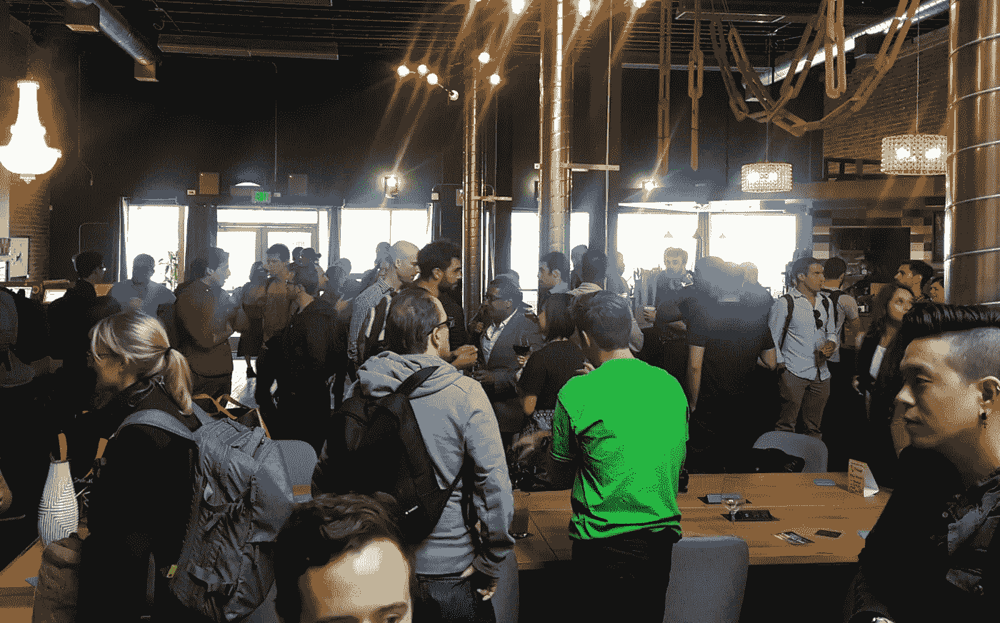

# 这三个时刻提醒了我为什么创办《黑客正午》

> 原文：<https://medium.com/hackernoon/three-moments-that-reminded-me-why-i-started-hacker-noon-fdc1096f8c67>

## 所以我们最近举办了第一次派对。聚会策划可能很费事，但有时你会想起为什么社区需要聚会的更大图景。

photo credit, [Paul Andre de Vera.](https://twitter.com/paulandre/status/877340028686393344)

在 Workshop Cafe，我正在向 Scott 解释他将如何在[黑客午间派对](https://www.eventbrite.com/e/inaugural-hacker-noon-party-tickets-34596684615)中扮演一半执行主编和一半展台宝贝的角色(即接受在 iPad 上提交的故事)，坐在我旁边的陌生人插嘴说，“Cya 在那里。”

*“什么？”*我说。

“在黑客正午派对上。”

“酷。你已经买到票了吗？”我问。

"是的，我在脸书工作的女朋友告诉我的."

在聚会上，我和一位欧洲软件工程师攀谈起来。我问他，“*你为什么看黑客正午？”*

“这真是一个悲伤的故事。我的朋友去世后，我在纽约翻阅他的笔记本，发现他的工作参考了《黑客午报》…”

我打了寒战。

我还问过一个 Ruby 开发者，“你怎么会在这里？”

“一个朋友向我转发了一份活动邀请，当时，在另一个选项卡中打开了您的一篇 Hacker Noon 文章，所以我决定来参加。”

派对图片和视频即将发布。现在，到下一次会议。

> [黑客中午](http://bit.ly/Hackernoon)是黑客如何开始他们的下午。我们是 [@AMI](http://bit.ly/atAMIatAMI) 家庭的一员。我们现在[接受投稿](http://bit.ly/hackernoonsubmission)并乐意[讨论广告&赞助](mailto:partners@amipublications.com)机会。
> 
> 如果你喜欢这个故事，我们推荐你阅读我们的[最新科技故事](http://bit.ly/hackernoonlatestt)和[趋势科技故事](https://hackernoon.com/trending)。直到下一次，不要把世界的现实想当然！

