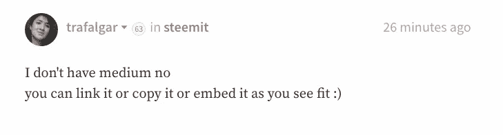
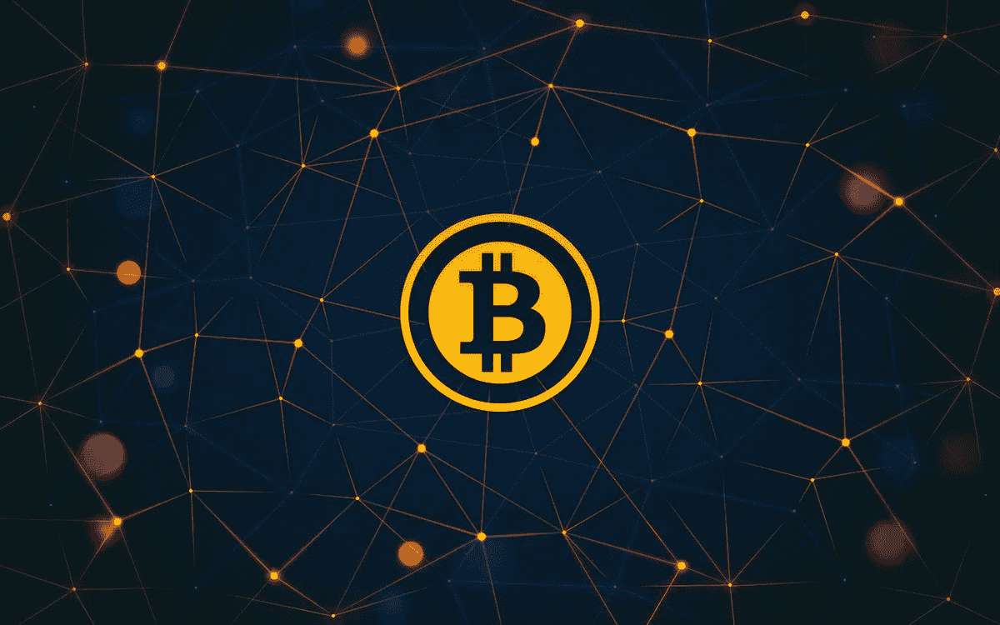
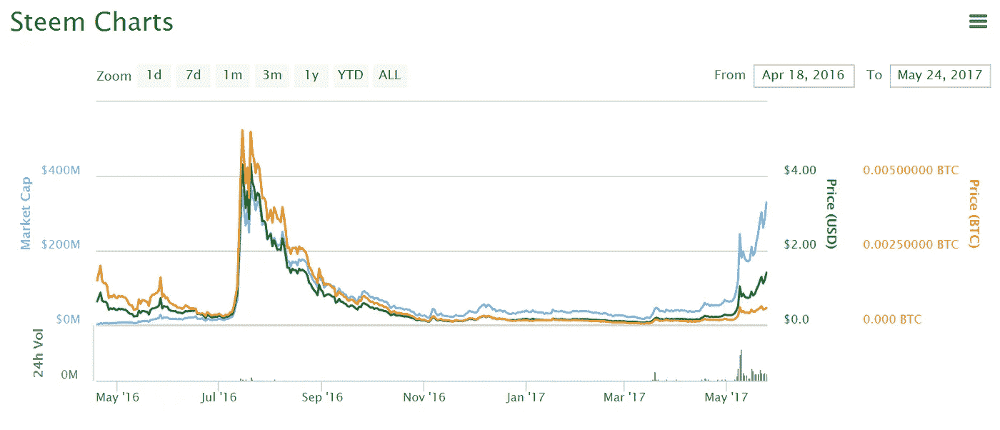
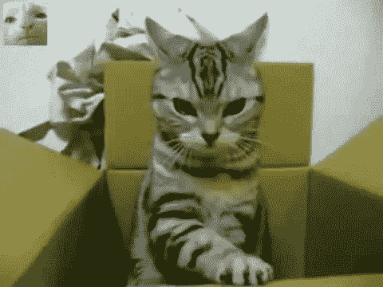

# 三个月，1000 名追随者和 100 万美元之后

> 原文：<https://medium.com/hackernoon/three-months-one-thousand-followers-and-one-million-dollars-later-1a9aa6686ea5>

unsplash

这是一个名叫 [@trafalgar 的人在 Steemit.com 的客座博文。](https://steemit.com/steemit/@trafalgar/3-months-1000-followers-and-usd1-million-later)当我请求他在 Medium 上发布他的精彩故事时，他告诉我他没有帐户，但他允许我代表他发布。

## 这是他从 Steemit 得到的许可意见:

他的故事很疯狂，也很鼓舞人心。这是一个需要以某种方式传播给更多人的故事。所以，这就是:

由 [@trafalgar 从 Steemit.com 撰写的故事:](https://steemit.com/steemit/@trafalgar/3-months-1000-followers-and-usd1-million-later)

# 当我在 Steemit 上发表我的第一篇[帖子](https://steemit.com/introduceyourself/@trafalgar/satirical-columnist-getting-steemed-up)时，感觉就像是昨天，但实际上已经过去将近 90 天了。

在这个网站上赚一百万确实需要一段时间，不是吗？我在 Steemit 的旅程无疑是一次超现实的经历，我希望在这里给出一个长的描述，这取决于在我写完这篇文章后这篇文章结束的时间。

# **免责声明**

那些不幸认识我的人会意识到，我通常不喜欢在这里张贴关于 Steemit 的内容。也许这完全是因为我被困在我自己的小小的社会政治泡沫中，但我的脸书 feed 没有充满关于脸书的帖子，我的 Reddit 主页没有充斥着关于 Reddit 的谈论，我请求的 80%的优步骑行不会自动将我带到优步总部作为他们的唯一目的地。因此，我通常在打一场艰苦的战斗，试图让更多的主流话题在这里流行，因为我认为它们对平台的长期健康更好，但我认为这个里程碑证明了一个例外。

## 我也敏锐地意识到，这并不完全是一个鼓舞人心的致富的迪士尼童话，所以我不会通过伪装成一个来光顾我的读者。

这更像是卡西莫多中了彩票，用这笔钱去做整容手术，结果还是被埃斯梅拉达拒绝了，所以他求助于迷奸药。我不是励志写作的粉丝，基本上认为这些自助大师中的大多数都类似于灵媒，他们被欺骗到相信自己可以与死者交流。如果你曾经通过首字母缩写给出过人生建议，那么你要么是个白痴，要么是个骗子，要么就是我喜欢记住的 I . y . e . e . g . l . a . a . a . t . y . e . a . m . o . a . s。所以这不是投资、理财或一般的生活建议。

希望这是对我如何来到这里的有趣描述，也是对这个帮助我一路走来的美好社区的敬意。

# **购买我的第一枚比特币**

今年 2 月左右，我在听了 2014 年录制的 EconTalk 播客后，第一次认真考虑投资比特币。当然，我以前听说过比特币，但认为它就像《糖果粉碎传奇》中购买黄金一样，只是没有实际的游戏。

## 直到听了这位嘉宾的播客，我才意识到安全和分散的在线账本背后的天才之处，它能够在一个不信任的环境中达成共识。

这将意味着世界各地的男人将免于被踢出家门的屈辱，因为他们的妻子发现了出现在他们信用卡收据上的三陪服务，如果他们一开始没有被踢出家门，这些服务也许就不会被要求。播客的主持人并不完全相信他的嘉宾对比特币的看法。他对当时高达 200 美元的比特币被高估的可能性表示担忧。在这段对话被录下 3 年后，当我在听这段对话时，我拿出手机查看了当时比特币的价格。

## 它是 1200 美元。

我真的不需要更多的说服力。我在一个交易平台上开了一个账户，开始慢慢地把我为买房和陪护服务攒下的钱变成比特币。这个过程一开始相当令人生畏；得到一个看起来像是我的猫在键盘上跑过的地址真的很令人讨厌。但最终我让它正常工作，并在我新安装的钱包里有了一大笔比特币。

# **发现 Steemit**

当我在 YouTube 上进一步研究比特币时，一个名叫阿曼达·b·约翰逊(Amanda B. Johnson)的女孩的视频开始进入我的推荐名单。她不停地说下一代加密货币，比特币 2.0， [Dash 数字现金](https://www.dash.org/)和所有其他我不明白的东西，这让手淫很难，但我最终明白了她的意思是还有其他像比特币一样的硬币存在。

我开始搜索这些“crytpocurrencies”的列表，找到了 [Coinmarketcap](https://coinmarketcap.com/) 。 ***我立刻就懵了*** :这种东西有 600 多种，任何一种都有可能崛起，取代比特币成为未来的主导货币选择。它们都拥有一套精彩的功能，更普通的只是自封为“全球超级计算机”，而其他人则承诺每周自动为你取出垃圾箱。

在研究这些的时候，我很幸运地看到了一个视频，视频中一个叫 [Steemit](https://steemit.com/) 的家伙 *FUD* 把这个加密货币平台弄得屁滚尿流。尽管有他的评价，我还是对分散化社交媒体平台的概念很感兴趣，这种平台根据作者在帖子上获得的喜欢程度来奖励他们。我在推特上花了大部分空闲时间想出了一些东西，比如*‘当你用完口香糖时，调味避孕套也很不错’*，我迫不及待地想试试！也就是说，不是口香糖替代品。

## **钢铁的力量**

我在三月份建立了我的 Steemit 账户，并测试了这个平台。我惊呆了:这该死的东西刚刚…起作用了。我可以投票、发帖、评论，这一切都是那么无缝，没有排队，没有交易费；它只是工作。有一条错误信息告诉我每 3 秒钟不要投票超过一次，这让我想起了以前的微软回形针，它会弹出来说*‘嗨，看起来你想写一封勒索信，也许我可以帮忙？’但是它远没有我用比特币习惯的 3 小时等待糟糕。我喜欢它。*

## 我想买 Steem。

*At the time, most people thought it was short for a Steeming pile of shit*

我去检查了它在 Coinmarketcap 上的图表，我的天啊，它丑吗！从去年 8 月开始，它看起来就像是 10 月份落在人行道上的尿迹，并在接下来的 6 个月里继续沿着斜坡缓慢地运球。这就像一个刚刚死于心脏病的人最后时刻的心电图。另外，出于某种原因，我从未得到过商业频道技术分析师的工作。

我当时并不知道，但这就是内德和丹有意识地分开的时候。市场对我们的两个爸爸将要开始和其他人约会的事实反应不佳。管它呢，我想，我要全押在 Steem 上，结果是当时每张 20 美分大约 50 万 Steem。看，这就是为什么你应该认真对待免责声明中的“不要在家尝试”部分。如果这还不明显，我是一个有点疯狂的人，仅仅因为我很幸运地用一种非常不负责任的方法进行加密投资并不意味着你也应该这样做。

## 许多交易者和投资者认为没有足够的理由持有 Steem Power，但从内容创作者的角度来看，我认为他们大错特错。

它不仅可以让你奖励那些你重视其内容的作者，也是一种在平台上投资自己的非常直接的方式。如果你真的相信自己有能力成为一名出色的内容创作者，并且想要一鸣惊人，那么在 Steem 上，你可以购买这些影响力令牌！就像一位 80 岁的对冲基金经理被年轻模特包围一样，我多少意识到，吸引这些男生的不完全是我出色的文笔和帅气的外表。但是我愿意相信在我的帖子里有幽默感肯定有助于成长。直接投资 Steem 可以快速跟踪你的职业生涯，对于那些真正考虑在该平台上全职写作的人来说，这无疑是一个可行的选择。

# **到月球**

*I had a lot of fun googling ‘moon’ but ended up going with this PG image. To make up for it, I’ll use the word fuck here*

在第一个月，我也开始研究潜在的竞争*在*我把我所有的积蓄都投资到 Steem 之后。这是由于我的懒惰和老式的愚蠢的结合。我找到了阿卡夏、辛尼里欧、你的和贝拉科因，由于一个小小的奇迹，它们都成了垃圾。(郑重声明，撰写本文时情况如此。如果你在几年后读到这篇文章，而 Coinmarketcap 读到的是 BelaCoin Dominance: 94%，那么请不要给我添麻烦，因为如果是这样的话，这篇文章也会成为一封遗书。

每天我都会查看 Steemit 的 Alexa 排名，每天都会有一点点攀升。价格在一段时间内保持低位，可能是因为当时的最新变化重置了奖励池，但我就像口袋里装着一瓶迷药的卡西莫多一样有信心，事情会变得更好。

## 剧透:该死的，我是对的。

5 月初的某个时候，市场从冬眠中醒来，斯蒂姆·普莱斯又有了脉搏。一周之内，它的价格突然上涨了六倍。就像有人给它喂了伟哥。为了获得更多的奖励，人们开始将他们的帖子分成多个部分，就像流行的年轻成人小说系列的电影改编版。突然之间，Steemit 看到了比青少年电脑桌下面更多的活动。

唉，我们看到‘C’字终于出现了。市场修正。Steem 的价值单日暴跌约 50%。想想看，不到两周前，我写了一篇[文章](https://steemit.com/steemit/@trafalgar/it-s-more-important-than-ever-to-post-while-the-market-is-falling)，鼓励人们更频繁地发帖，不要因价格下跌而沮丧。然而 12 天后，我们就在这里了:超过 2 美元的价格，让我成为了 Steem 的百万富翁。

# **结论**

我写这个部分是为了分享一个有趣的故事，但主要是为了吹牛。手指交叉我的前任会看到它，并醉短信我一个变化。

把笑话放在一边，我想感谢我所有的追随者以及整个 Steemit 社区。从评论来看，我知道你们中至少有 3、4 个人读过我的文章，你不知道我有多感激有类似幽默感的人在这里分享欢笑。

*Steem at $2? Do you see me flinching?*

*由* [*【特拉法尔加】从 Steemit.com*到 ](https://steemit.com/steemit/@trafalgar/3-months-1000-followers-and-usd1-million-later)

> [黑客中午](http://bit.ly/Hackernoon)是黑客如何开始他们的下午。我们是 [@AMI](http://bit.ly/atAMIatAMI) 家庭的一员。我们现在[接受投稿](http://bit.ly/hackernoonsubmission)并乐意[讨论广告&赞助](mailto:partners@amipublications.com)机会。
> 
> 如果你喜欢这个故事，我们推荐你阅读我们的[最新科技故事](http://bit.ly/hackernoonlatestt)和[趋势科技故事](https://hackernoon.com/trending)。直到下一次，不要把世界的现实想当然！

