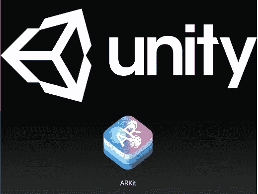

# 创建 ARKit 应用程序的三个选项

> 原文：<https://medium.com/hackernoon/three-options-for-creating-arkit-applications-d156f21a370f>

根据你的经验和目标，我认为进入 ARKit 有三个主要选择。

## 选项 1——在苹果生态系统中发展

如果你是一名在 Swift 和 Cocoa 上投入了大量资金的 iOS 开发者，你可以利用你对苹果生态系统的知识，开始直接在 [SceneKit](https://hackernoon.com/tagged/scenekit) 、SpriteKit 或低级金属中构建 ARKit 应用。

## 选项 2 —从 Unity 或虚幻游戏框架构建

如果你没有太多的 iOS 开发经验，跳过 Apple stack，直接在一个游戏框架中开始可能更有优势。Unity 是一个成熟的平台，有很多内置的功能、支持和文档。许多没有太多编程经验的人能够相对快速地在这些平台上创建交互体验。

## 选项 3 —设计 3D 图形

我猜 ARKit 应用程序的第一波浪潮将集中在放置和探索 3D 对象上。如果这描述了你的想法，我认为在图形管道中工作可以带你走大部分的路。使用像 3DS Max、Maya 或 Blender 这样的建模软件，你可以[设计](https://hackernoon.com/tagged/design)物体和动画。一旦你有了这些，在 Unity 或者 SceneKit 中的简单布局将会非常简单。