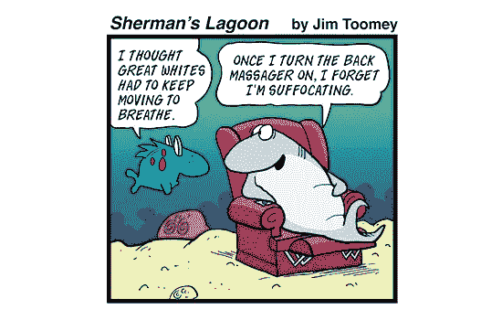

# 通往 DevOps 的三条道路

> 原文：<https://medium.com/hackernoon/three-paths-to-devops-f02a0770c55f>

3-Paths, by [Thom Dougherty](http://thomdougherty.com/locations/)

> 如果你不知道从哪里出发，就不可能规划出到达目的地的路线。
> ——苏茜·欧曼

DevOps 是关于软件开发和软件运营之间的关系——从想法到代码再到部署的路径。它是关于应用程序的开发，以及操作流程和环境的开发。

实现 DevOps 有三条途径。

第一条途径是创建新的应用程序，同时创建其操作流程。这在很多方面都很理想。

第二条途径是创建一个新的应用程序，使用现有的环境和流程进行部署。

第三条途径是为现有的遗留应用程序创建一个新的“开发运维”流程。

## 第一条路径:新应用程序、新环境

在大多数情况下，这是最理想的情况。使用敏捷过程，应用程序、连续交付管道和部署环境的开发可以同时进行。

不过，这并不一定都是有趣的游戏。这条路充满了危险。首先，有新技术的危害。这种情况通常是绿地项目的结果，通常涉及新的项目管理方法和新技术。如果团队以前没有使用过新工具，他们有一个学习曲线和潜在的陷阱(这可能会因为许多 DevOps 工具的快速发展和缺乏记录的本质而变得更糟)。或者，团队可能依赖新员工或顾问的技术专长，这些人并不总是理解(或尊重)企业文化。新技术，新风险。

## 第二条路径:新应用程序，现有环境

还是那句话，这有利有弊。关键优势是降低风险。操作环境是一个已知的、经过测试的量。如果新的应用程序和以前的应用程序是由同一个团队开发的，那就非常简单了。然而，这并不总是容易的。一个新的团队，或者一个有积极进取的新开发人员的团队，可以推动不太适合现有环境的新技术。或者更糟的是，一个新的应用程序可能会被迫适应以前的约束——一个“这就是我们一直在做的”的[熔岩流](http://antipatterns.com/lavaflow.htm)。

## 第三条道路:遗留应用程序，新环境

这可能是最可怕的一条路——将一个遗留应用程序从一个舒适但有问题的遗留操作环境迁移到一个新的、现代化的开发环境中。这可能非常困难。管理过程可能是手动的，没有记录的，充满了秘密和惊喜。年长的团队成员可能害怕或抵制变革。遗留应用程序可能依赖于难以自动化的中间件，要么需要困难的修改，要么需要修改应用程序以使用更现代的中间件。数据可能很难移动。这种情况经常从外部强加给团队，在组织内部产生官僚摩擦和怨恨。

## 鲨鱼会游泳

传统观点告诉我们，鲨鱼必须不停地游动，否则它们会因缺氧而死亡。这是对软件的一个很好的比喻。它不能永远呆在一个地方，不然会淹死的。

了解应用程序及其环境是如何随着时间的推移而创建和发展的，有助于我们在艰难地发现风险之前就认识到它们…