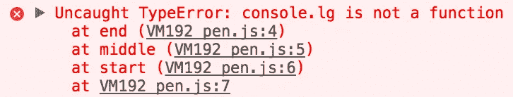
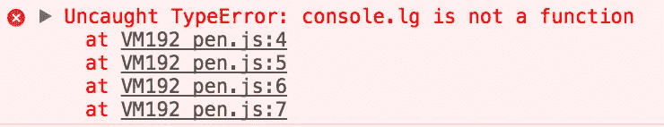

# 我像躲避瘟疫一样避开匿名 JS 函数的三个原因

> 原文：<https://medium.com/hackernoon/three-reasons-i-avoid-anonymous-js-functions-like-the-plague-7f985c27a006>

每当你读代码时，你一定会看到一个匿名函数。有时它们被称为 lambdas，有时是匿名函数，不管怎样，*我认为它们不好*。


如果你不知道什么是匿名函数，这里有一个引用:

> 匿名函数是在运行时动态声明的函数。它们被称为匿名函数，因为它们的命名方式不同于普通函数。—海伦·爱默生，Helephant.com

它们看起来有点像这样:

```
function () { ... code ... }OR(args) => { ... code .. }
```


今天我想试着让你明白，一般来说，你只应该在绝对必要的时候使用匿名函数。他们不应该是你的首选，你应该明白为什么。一旦你这样做了，你的代码将会更干净，更容易维护，错误也将变得更容易追踪。让我们从避免它们的三个原因开始:

# 堆栈跟踪

最终，当你写代码的时候，你会遇到错误，不管你有多擅长编码。有时这些错误很容易跟踪，有时却不容易。

如果你知道错误是从哪里来的，那么追踪错误是最容易的。为此，我们使用所谓的堆栈跟踪。如果你对堆栈跟踪一无所知，[谷歌给了我们一个很棒的介绍](https://developers.google.com/web/tools/chrome-devtools/console/track-exceptions)。

假设我们有一个非常简单的项目:

```
function start () {
 (function middle () {
   (function end () {
     console.lg('test');
    })()
  })()
}
```

但是看起来我们做了一些非常愚蠢的事情，比如拼错了`console.log`。在我们的小项目中，没什么大不了的。但也许这是一个巨大项目的一个片段，有大量的模块被组合在一起。最重要的是，让我们假设你不是犯这个愚蠢错误的人。那个新来的小戴夫昨天去度假前把它存进了回购协议里！

现在，我们必须找到它。通过我们精心命名的函数，我们可以得到这样的堆栈跟踪:



初级开发人员，感谢您命名您的函数！现在我们可以很容易地找到那个 bug。

但是..一旦我们解决了这个问题，就会发现还有另一个问题。这次是更资深的开发者介绍的。这个人知道 lambdas(匿名函数),并在其代码中大量使用它们。原来他们不小心检入了一个 bug，我们的工作就是追踪它。

代码如下:

```
(function () {
 (function () {
   (function () {
     console.lg('test');
    })();
  })();
})();
```

令人惊讶的是，这位开发者还忘记了如何拼写`console.log`！几率有多大？！但可悲的是，他们没有命名他们的功能。

控制台向我们展示了什么？



嗯…至少我们有行号？在这个例子中，看起来我们有大约 7 行代码。如果我们正在处理一个巨大的代码库呢？10k 行代码？如果行号相距很远呢？如果代码被缩小，没有映射文件，导致行号几乎完全没有用，那会怎样？

我认为你可以很容易地回答所有这些问题。答案是:*你会度过非常糟糕的一天。*

# 可读性

我听说你还没被说服。你仍然热爱你的匿名函数，你从不制造错误。我很抱歉，我忘了对你们中那些完美编码的人说。让我们再试一次！

检查这两个不同的代码示例:

```
function initiate (arguments) {
  return new Promise((resolve, reject) => {
    try {
      if (arguments) {
         return resolve(true);
      }
      return resolve(false);
    } catch (e) {
      reject(e);
    }
  });
}initiate(true)
  .then(res => {
        if (res) {
          doSomethingElse();
        } else {
          doSomething();
        }
  ).catch(e => {
            logError(e.message);
            restartApp();
          }
  );
```

这是一个非常做作的例子，但我想你明白了。我们有一个方法，它返回一个承诺，我们使用承诺对象/方法来处理不同的可能响应。

您可能认为这段代码并不难阅读，但我认为它可以做得更好！

如果我们去掉了所有的匿名函数，然后呢？

```
function initiate (arguments) {
  return new Promise(checkForArguments);
}function checkForArguments (resolve, reject) {
  try {
    if (arguments) {
     return resolve(true);   
    }
    return resolve(false);
  } catch (e) {
    reject(e);
  }
}function evaluateRes (res) {
  if (res) {
    doSomethingElse();
  } else {
    doSomething();
  }
}function handleError (e) {
  logError(e.message);
  restartApp();
}initiate(true)
  .then(evaluateRes)
  .catch(handleError);
```

好吧，让我们明确一下:这段代码比较长，但是我认为它的可读性要好得多！代替匿名函数，我们有很好命名的函数。我们一看到它们，这个名字就给了我们一个提示，告诉我们发生了什么。它消除了评估代码时的心理障碍。

这也有助于分离关注点。在第二个例子中，不是创建一个方法，传入它，然后运行逻辑，而是给`then`和`catch`的参数简单地指向所有事情发生的函数。

我没什么别的办法可以让你相信这本书更具可读性。但是如果你仍然不相信，我可以试试最后一个论点..

# 复用性

你注意到上一个例子了吗？这些函数从作用于参数和 initiate 函数变成了该作用域中的所有其他函数都可以使用！

当你使用匿名函数时，它们在你的应用程序中很难使用。可重用性下降了，你最终会一遍又一遍地写同样的代码。众所周知，你写的代码越少，你引入的 bug 越少，你的用户要加载的就越少！大家都赢了！

相反，命名函数可以在其整个范围内使用，而不需要作为变量传递。您的代码自动地变得更加可重用，因为，嗯，您可以重用它！

# 匿名函数有用吗？

是的。我讨厌承认这一点，但他们有时可能是最好的选择！

```
const stuff = [ 
  { hide: true, name: 'justin' }, 
  { hide: false, name: 'lauren' },
  { hide: false, name: 'max' },
];const filteredStuff = stuff.filter(s => !s.hide);
```

那个匿名函数`s => !s.hide`是如此的小和简单，在其他地方不能使用它不会伤害任何人。它还会显示在`stuff.filter`下的堆栈跟踪中。如果你需要重用它，你最好全部重用:

```
function filterByHide (array) {
  return array.filter(item => !item.hide);
}
```

有时你想把所有的代码包装在一个匿名函数中，以确保全局范围不会被污染。

```
(() => {
 ... your code here ...
})();
```

在堆栈跟踪中使用顶级匿名函数不会伤害任何人。没有代码重用是有害的，因为整个目的是保持方法被包含。

我相信还有其他好的用途，欢迎在评论中分享！

感谢阅读，现在出去吧，不要再写匿名函数了！

嗨，我是贾斯汀·富勒。很高兴你看了我的帖子！我需要让你知道，我在这里写的一切都是我自己的观点，并不代表我的雇主。所有代码样本都是我自己的，与美国银行的代码完全无关。

我也很想收到你的来信，请随时通过 [LinkedIn](https://www.linkedin.com/in/justin-fuller-8726b2b1/) 、 [Github](https://github.com/justindfuller) 或 [Medium](/@justindanielfuller) 与我联系。再次感谢阅读！

[](http://bit.ly/HackernoonFB)[](https://goo.gl/k7XYbx)[](https://goo.gl/4ofytp)

> [黑客中午](http://bit.ly/Hackernoon)是黑客如何开始他们的下午。我们是 [@AMI](http://bit.ly/atAMIatAMI) 家庭的一员。我们现在[接受投稿](http://bit.ly/hackernoonsubmission)并乐意[讨论广告&赞助](mailto:partners@amipublications.com)机会。
> 
> 如果你喜欢这个故事，我们推荐你阅读我们的[最新科技故事](http://bit.ly/hackernoonlatestt)和[趋势科技故事](https://hackernoon.com/trending)。直到下一次，不要把世界的现实想当然！

