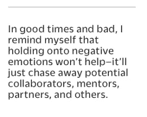
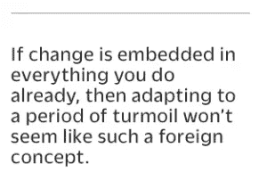

# 在不确定的时期，我不断回顾的三个可靠的领导力课程

> 原文：<https://medium.com/hackernoon/three-reliable-leadership-lessons-i-keep-going-back-to-in-uncertain-times-91f01b661eae>

[Photo: Arto Marttinen Via Unsplash]

## 政治和经济的逆风可以摇动你的船，但不会把它弄翻。以下是我如何学会牢牢抓住舵柄的方法。

还记得“VUCA”(波动性、不确定性、复杂性和模糊性)只适用于公司的时候吗？那些日子，是吧？最近，随着国外地缘政治的不和谐，美国国内的政治紧张，以及各种可能影响美国企业的政策转变，许多企业家可能希望更稳定的领导。我知道我是。

一度被保留给董事会和管理场景的 VUCA，似乎正在成为一种新的常态，几乎在任何地方影响着各种规模的领导者和组织。在川普总统任期的头几周， [*《华盛顿邮报》*的 Jena MacGregor 报道](https://www.washingtonpost.com/news/on-leadership/wp/2017/02/03/anxiety-unease-and-eagerness-to-move-on-workers-cope-with-trumps-first-two-weeks/)“许多人力资源顾问说，与过去的总统交接相比，变革和新闻的洪流占据了员工更多的精力和注意力。“自那以后，新闻周期还没有完全稳定下来，我们可能不得不适应这一点。

我们现在生活和工作的世界与一年前大不相同。没有人真正知道下一个拐角处会发生什么，我们都在不稳定的基础上运作。尽管如此，商业领袖的工作并没有从根本上改变——我们仍然需要激发创造力，推动创新，并确保可持续性。因此，最近我试图提醒自己，虽然我无法预测未来，但我可以确保我准备好生活在其中，理解它，尽可能战略性地应对任何剧变。为了做到这一点，我不断回顾这三条屡试不爽的经验。

## 1.你的态度要么吸引支持，要么排斥支持

情绪是人类的自然组成部分，控制情绪并不意味着成为机器人。但是我们如何管理我们的感受不仅影响我们自己的表现，也影响我们与他人的互动。这听起来很明显，但在不确定时期很容易被忽视。

对于如何应对自我怀疑和对自己能力的焦虑，有很多领导力建议，但是对于外界的悲观情绪呢——那些你无法控制的事情——呢？我发现，每当我把注意力集中在我周围发生的事情上时，我更容易关注我发现缺少的东西。

当这种情况发生时，需要真正的努力来保持积极的想法。但就个人而言，我发现使用肯定有助于保持自己的目标，并应对我无法改变的事情。我试着提醒自己我能改变什么——变得更好。我重新关注我的直接影响范围，提醒自己无论发生什么，我仍然需要与他人合作来实现我们的目标。

无论顺境还是逆境，我都提醒自己，抓住负面情绪不放不会有任何帮助——它只会赶走潜在的合作者、导师、伙伴和其他人。这需要努力、练习和耐心，但培养吸引支持而不是排斥支持的态度至关重要——尤其是当这很难做到的时候。

## 2.同理心总是有回报的

为了让沟通在各个方面都畅通无阻，我们必须清楚我们想从对方那里得到什么。这在任何时候都是正确的，尤其是在高度不确定的时期。

除非每个人都明白共同的目标是什么，以及对他们的期望是什么，否则没有办法开始朝着共同的目标努力。作为一名领导者，我特别努力地保持平易近人，并保持开放的对话。当很多事情发生变化时，很难让每个人都保持积极性，提出问题，分享他们的担忧。但要做好这一点，就意味着要加倍重视领导者喜欢在更稳定的条件下谈论的那种同理心。

# 相关:

*   [让你公司的每个人都成为未来主义者的四个问题](https://www.fastcompany.com/3066740/four-questions-to-turn-everyone-in-your-company-into-a-futurist)
*   [战胜 3 种最常见的公司危机](https://www.fastcompany.com/3062710/the-three-kinds-of-crisis-companies-face-and-how-to-pull-through)
*   [成为更真实领导者的自我提升策略](https://www.fastcompany.com/3004785/self-improvement-strategies-becoming-more-authentic-leader)

这意味着不仅要清楚地表达我们的信息，还要积极倾听——不带偏见或判断，真正愿意考虑不同的观点。同样，这是一个如此熟悉的格言，听起来几乎是老生常谈，但这是我这些天来不断回想的事情。这是关于尊重和准确地交换信息，而不仅仅是传递信息。关注他们的事实和情感内容有助于在急需的时候相互理解。

领导者可能觉得他们的工作是让他们的团队放心——比以前说得更多。但是我发现倾听更重要。当我积极倾听时，我会听到真正的担忧，并为冷静地讨论如何共同应对这些担忧留出空间。

## 3.你不能慢下来

人类是适应力强的动物。我们有一种天生的能力走向光明，充分利用糟糕的情况。在混乱中，我知道作为一名商业领袖[为未来定义一个更好的愿景是最重要的。但是过于哲学化会有失去动力和行动冲动的风险。](https://www.fastcompany.com/3056841/the-ancient-storytelling-secret-that-every-leader-needs-to)

我发现，在试图向我的组织灌输使命感和目标感时，我需要不断强调手头任务的紧迫性。没有什么使命是一成不变的——它从来都不仅仅是原则问题。重要的是你*对他们做了什么。目标驱动的组织行动并适应。无论政治、社会或经济环境如何，总有办法在现有市场中找到新的市场空间或缺口。总有问题需要解决。*

为了保持敏捷并应对我和我的团队永远无法预测的变化，我试着不断问自己:

1.  什么样的产品或服务需求、顾客口味、技术、社会经济因素和文化习俗已经在发生变化——不管我们对此做了什么？
2.  我们的竞争对手目前和未来的战略是什么？在下一个季度或下一年，他们相对于我们会在哪里？
3.  我的组织现在做得好的是什么？我们总是比别人做得更好的是什么？
4.  通过寻找新的合作伙伴或合作者，或者考虑并购，我们可以做得更好？

当然，这一直是一个有用的清单，但是在快速变化的时期，我尽量把它放在前面和中心。如果改变已经嵌入到你所做的每一件事情中，那么适应一段动荡时期就不会像是一个陌生的概念。根据我的经验，这需要一种实验和负责任的文化。当事情进展顺利时，创新往往会带来更多的好处，但当环境要求迅速做出重大转变时，你需要让每个人都知道承担风险是他们义不容辞的责任，而且他们有这样做的自由。

你可能不知道接下来会发生什么，但不确定性是一种从未有过的陌生感觉。有一个较早的时刻，你感到同样不确定，但你不知何故通过了。对我来说，无论如何，关键不仅仅是耐心等待；你们一起做的事情才是最重要的。

*【图片:Arto Marttinen Via Unsplash】*

**原创文章**[**@ fast company**](https://www.fastcompany.com/3069131/three-reliable-leadership-lessons-i-keep-going-back-to-in-uncertain-times)**。**

***版权所有 2017 费萨尔·霍克。保留所有权利。***

*我是一名* [企业家兼作家](http://faisalhoque.com/speaking/)。SHADOKA 等公司创始人。Shadoka 让抱负成为领导、创新和变革的动力。Shadoka 的加速器和解决方案汇集了管理框架、数字平台和思想领导力，以实现创新、转型、创业、增长和社会影响。

《万物互联——如何在创意、创新和可持续发展的时代进行变革和领导》(麦格劳·希尔)和《生存与发展:富有弹性的企业家、创新者和领导者的 27 种实践》(励志出版社)。在推特上关注我。*免费使用* [*万物互联*](http://app.everythingconnectsthebook.com/login.php) *领导力 app 和* [*生存茁壮*](http://app.survivetothrive.pub/login.php) *弹性 app。*

> [黑客中午](http://bit.ly/Hackernoon)是黑客如何开始他们的下午。我们是 [@AMI](http://bit.ly/atAMIatAMI) 家庭的一员。我们现在[接受投稿](http://bit.ly/hackernoonsubmission)，并乐意[讨论广告&赞助](mailto:partners@amipublications.com)机会。
> 
> 如果你喜欢这个故事，我们推荐你阅读我们的[最新科技故事](http://bit.ly/hackernoonlatestt)和[趋势科技故事](https://hackernoon.com/trending)。直到下一次，不要把世界的现实想当然！

