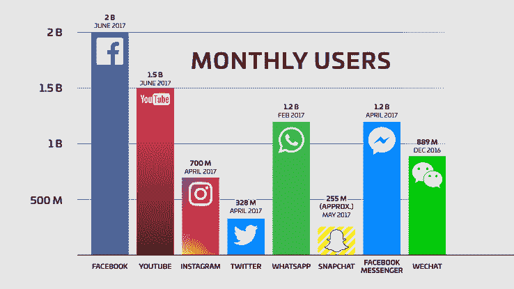

# WhatsApp 的三条战略路径

> 原文：<https://medium.com/hackernoon/three-strategic-paths-for-whatsapp-d91ab5c498e4>

## 回顾短期和中期的挑战

WhatsApp [在一年多前就突破了 10 亿客户群](https://www.theverge.com/2016/2/1/10889534/whats-app-1-billion-users-facebook-mark-zuckerberg)，仅在去年 2 月就达到了 12 亿，但他们未来的重点应该是什么？

(source [TechCrunch](https://techcrunch.com/2017/06/27/facebook-2-billion-users/))

## 主要战略驱动因素

对于一个基于受众的业务来说，有三个关键方面已经清楚地涵盖了他们的纯“增长”阶段:

*   **保持增长**。当然 [WhatsApp](https://hackernoon.com/tagged/whatsapp) 应该努力保持增长，因为他们可以渴望[达到脸书的 20 亿基数](https://techcrunch.com/2017/06/27/facebook-2-billion-users/)，但这主要意味着在现有市场上与他们自己的 Facebook Messenger 竞争。对于新市场，尤其是微信覆盖的中国，这可能会很困难。
*   **确保不要失去当前的观众**。当前用户可以停止使用 WhatsApp。
*   **将现有受众货币化**。但任何业务的主要目的都是带来利润，如果不将利润转化为收入，扩大已经庞大的基础只会推高成本。

这方面没有什么特别新的东西，这是一个经典的 ARM 战略:收购、保留、货币化。但是暂且把收购放在一边——考虑到超过 10 亿的观众本身就是一个成功——我认为真正有趣的是**WhatsApp 的主要保留威胁是什么，以及 WhatsApp 计划如何将他们的服务货币化。**

就留住人才而言，我不认为人们对沟通的需求会自然下降，因此这一领域的主要风险将来自:

*   用户将他们的交流活动转移到竞争应用上。不仅仅是那些专注于信息传递的公司，社交通讯领域的新进入者也覆盖了不同的需求。
*   更广泛的行为变化可能会影响 WhatsApp 等基于移动应用的产品的参与度。手机目前是社交生活的中心，WhatsApp 在这方面的定位非常牢固，但如果手机变得不那么重要了怎么办？

鉴于 WhatsApp 是一项没有广告的免费服务，这是其母公司脸书的基本模式，盈利方面也很棘手。

我之前已经在单独的帖子中涉及了这些方面，但我认为这是一个很好的机会来将他们聚集在一起，看看我认为他们应该关注的三条道路。

# 在社交领域保持相关性

WhatsApp 的服务一直在不断发展，因为用户的沟通需求也在发展。

今天看来不可或缺的东西，如照片分享或群组，并不是这项服务的第一个版本的一部分。

为了保持相关性，关注新客户对其沟通需求的期望以及如何在他们当前使用 WhatsApp 的情况下以合理的方式解决这些期望也很重要。

这就是 WhatsApp 状态功能改变的原因，它已经成为脸书的另一个“SnapChat 克隆”。我个人觉得“故事”的性质并不符合 WhatsApp 的模式。更简单的视频共享和过滤器在群组环境中有意义，但是不需要“状态”广播选项。

**我在我的文章《** [**【脸书和克隆人的进攻】**](/@jorge.serna/facebook-and-the-attack-of-the-clones-f82f6979ee13) **中谈到了这一点，在这篇文章中，我还谈到了群组视频如何成为一个相关且合适的功能，以保持 WhatsApp 未来的参与度。**

# 不要忽视潜在的智能手机解体

前一段时间，我写了一篇关于行业驱动因素和不断变化的消费者需求可能会推动我所谓的“智能手机解体”的文章。

总之，新的互联设备最终可能不仅补充，而且在某些情况下取代智能手机，成为用户的通信中心。

目前最大的例子是正在进行的客厅争夺战，亚马逊、谷歌和苹果试图通过各自的智能扬声器控制互动:Echo、Google Home 和 HomePod。[他们都在提供通信选项](/@jorge.serna/wwdc-2017-social-comms-5-homepod-and-social-communications-475839fdf457)，我预计他们最终也会允许第三方通信服务。

随着这种模式扩展到其他设备(如联网的[手表、耳机](/@jorge.serna/wwdc-2017-social-comms-2-watchos-4-and-the-smartphone-disintegration-340050269251)、眼镜、汽车等……)，与他人互动并保持持续对话的能力将依赖于能够在所有设备上使用该通信服务(或至少在一些相关设备上)。

**这就是我在** [**中讨论的，多设备是 WhatsApp 的致命伤吗？**](https://hackernoon.com/i-s-multidevice-the-achilles-heel-for-whatsapp-1ac91c3edf07) **”，因为目前他们只支持每个用户一台设备，这可能到目前为止已经足够了，但很快就不行了。**

# 通过业务部门货币化

WhatsApp 最初的盈利模式是向用户收取 1 美元的年费，但在脸书收购他们之后，这种模式消失了。

由于 WhatsApp 给用户的一个关键信息一直是[他们不会在应用](https://blog.whatsapp.com/245/Why-we-dont-sell-ads?)中显示广告，因此需要另一个收入点。

WhatsApp 已经表示，他们将提供“*工具，让你可以使用 WhatsApp 与你希望从*听到的企业和组织进行沟通”，因此很明显，盈利将来自于向企业收取访问这一极其相关的渠道的费用。但不仅仅是 WhatsApp 想要这块业务，[就连苹果也想分一杯羹](/@jorge.serna/wwdc-2017-social-comms-3-imessage-and-business-messaging-65d0021bf7d9)。

**我在我的文章《**[**WhatsApp Business in Enterprise Messaging**](/@jorge.serna/whatsapp-for-a2p-messaging-39c5a4d7bb8d)**》中谈到了这一点，看了一些已经使用 WhatsApp 与客户互动的大型企业的例子，以及 WhatsApp 应用程序中对用户体验的控制如何产生巨大差异，特别是与短信营销的糟糕体验相比时。**