# 三个 VR 头戴设备走进苹果商店…

> 原文：<https://medium.com/hackernoon/three-vr-headsets-walk-into-an-apple-store-ccc2c073ac00>

## 外行人的技术:新设备、产品和乐趣的指南——给那些没有计算机科学学位的人。

这些天来，虚拟现实耳机似乎以圣经瘟疫的速度从天而降——当然，苹果在这个领域非常明显的缺席除外。那么，你选择哪款耳机呢？很明显，每个产品的网站都会给你他们自己的销售卖点，用最高分描述他们的产品，并切实保证这是自[快速拉面炊具以来最好的东西。](http://www.rapidramen.com/)亚马逊类型的网站评论稍微靠谱一点，但只针对单一产品。

下面，我将比较三种不同的耳机，每一种的价格都大不相同。为了保持两者之间的平等，我们不会深入研究虚拟现实中的游戏。当你阅读下面的内容时，想象你的唯一目标是在设备上观看视频。也许那是你唯一的目标(我没那么了解你)。简单地说，这样一个简单的操作在所有这些操作中是非常不同的。

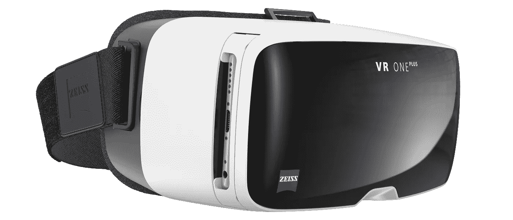

# [VR One Plus](http://vrone.us/vr-one-headset-917)

## 首先是蔡司的 VR One Plus。

这款耳机本身并不是三款中最便宜的，但它有能力成为最便宜的*操作包*。这款产品售价仅为 129 美元，是许多大型零售商的常见商品。如果你需要和家人一起度过一个愉快的周末，你几乎可以保证在当地找到这个选择。

乍一看，这不是市场上最别致的钻机。白色的外壳有助于它从货架上的许多全黑产品中脱颖而出，但在触摸它时，很容易看出这种白色塑料会很快变黄。

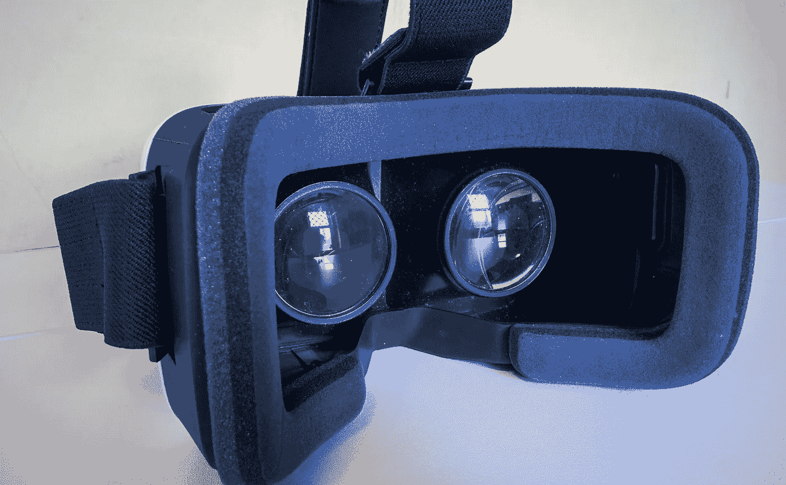

Look at all that cushiony goodness!

耳机只是一个握持手机的装置，功能类似于[谷歌 Cardboard](https://vr.google.com/cardboard/) 。相比之下，它有舒适的头带和面部垫，所以长期使用很舒服，让你的手可以自由洗碗或遛狗。此外，头带很容易调整，所以从一个用户切换到另一个用户很快，几乎没有痛苦，只要你三岁的侄女，萨莎，不觉得把你的头发放在 velcro 上很幽默。

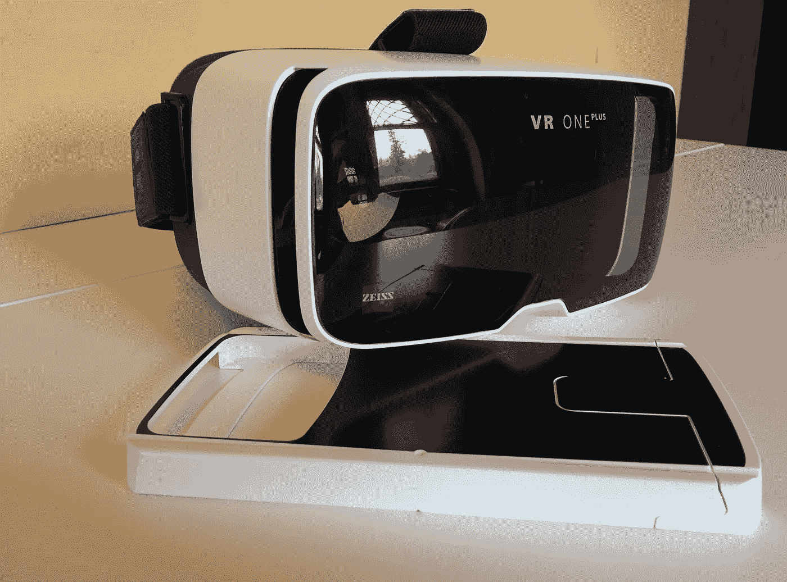

要使用该套件，只需拿起你的手机(或任何智能手机)并找到一个 360 视频。确保视频设置为虚拟现实(YouTube 右下角有一个小图标，看起来像谷歌纸板)，将手机放入附带的托盘中。托盘似乎可以适应几乎所有尺寸的智能手机(*声明:我没有购买所有的智能手机来尝试这个*)，一个巧妙放置的衬垫有助于保持一切安全。点击播放，将托盘滑回耳机，开始观看。

YouTube makes it easy to view 360 videos on your phone or in a VR headset.

空托盘时易于插入和取出。不过，随着手机重量的增加，它变得有点太容易移除了。将你的头大幅度倾斜到一边，或者仅仅是拿着耳机不稳都会导致托盘移动。它很容易重新定位，但当试图与另一个观众分享活动视频时，可能会有点麻烦。

除了托盘，没有额外的按钮或旋钮装饰这一套。从使用过其他设备，我知道这意味着没有调整镜头。作为一个只在需要时才使用作弊眼镜的人，这对我来说并不是一个失败——调整其他耳机上的镜片通常不会带来明显的差异。我不能准确地说这对那些经常戴眼镜的人是否有巨大的影响，所以我不会去尝试。

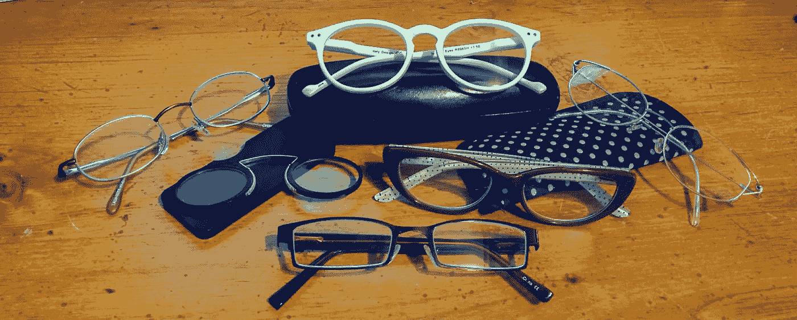

I have a minor addiction to glasses.

这种耳机的一个主要缺点是需要提前播放。不可避免地，你会错过视频的开始时刻。此外，一旦视频进入 360 度模式，“播放”图标很小，第一次尝试时更具挑战性。然而，当谈到负担得起和可访问的虚拟现实时，这是一个小小的不便。

最后，和谷歌 Cardboard 一样，这款耳机只能让你查看照片和视频。我听说这被限制为三个自由度，而 VR“应该允许”六个自由度。本质上，你真的不能探索区域或进行任何类型的游戏，但如果你只是想在周日早午餐后 Snapchat 你的南娜体验世界上最陡的过山车，这可能是你的完美选择。

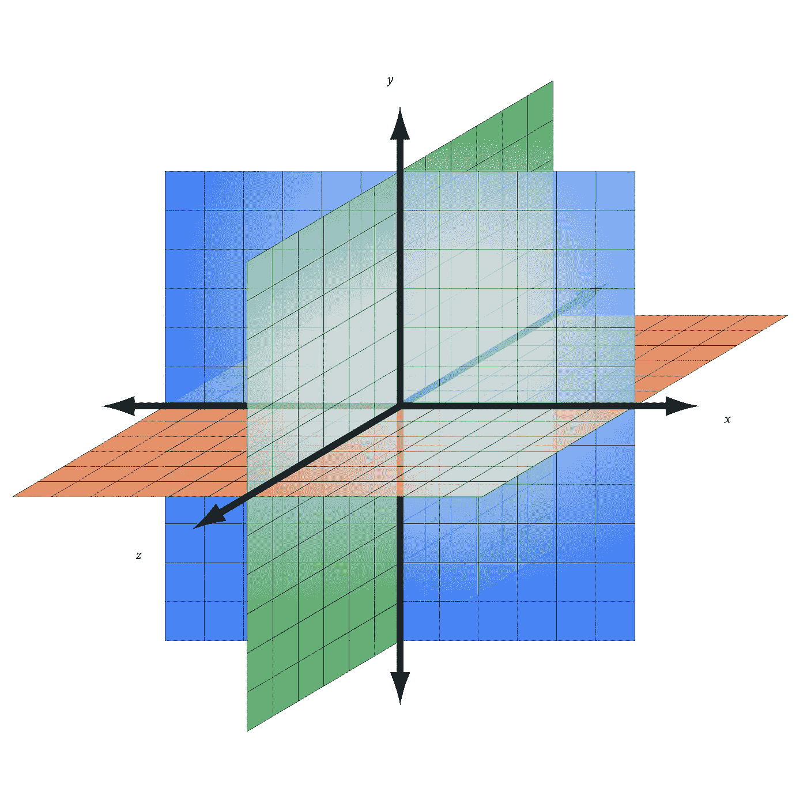

Graph coloring courtesy of the 1990s.

> 让我们花一点时间来描述一下 3 自由度和 6 自由度。想象一下，在大一的几何课上，你正处于那些无情地钻入你脑海的令人生畏的 X，Y，Z 轴上。在这张图上，你有三条线。一个上下，一个左右，一个前后。如果你静止地坐在这些线汇聚的地方，从那个位置观察你的周围，你会得到三个自由度。然而，六个自由度允许你 ***探索*** 那些空间。你可以在这些轴上移动，而不是上下左右前后左右。这是很多 VR 程序和 VR 游戏中常见的功能。

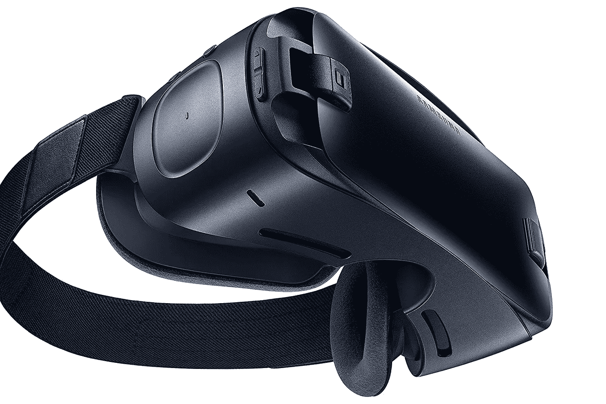

# [Gear VR](http://www.samsung.com/us/explore/gear-vr/?cid=ppc-)

## 接下来是 Oculus 的 Gear VR (2016)。

需要说明的是，这不是最新的型号，但它只有几个月的历史，功能与最新版本基本相同。**原价仅 99 美元**，这是我今天评测的最便宜的耳机。不过，这款耳机有一个问题:你必须使用他们认可的三星手机。同样，我不是电脑开发人员，我也同样不擅长阅读手机合同。所以，如果你愿意，你可以自己算一算，在你的世界里，一部三星手机要花多少钱。然而，无锁版本的安全价格范围是 700-900 美元左右。**合在一起，这款耳机的价格接近 1000 美元。**

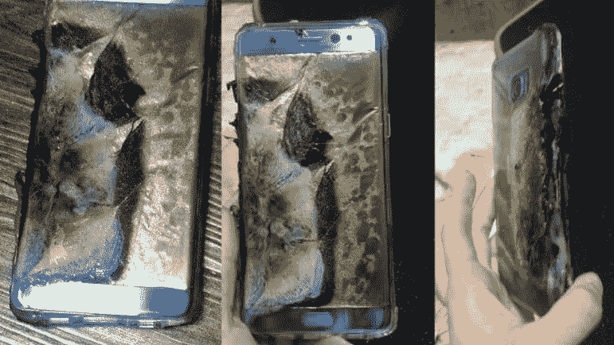

Photo courtesy of [patentlyapple.com/](http://www.patentlyapple.com/).

*谢天谢地，三星似乎已经控制住了手机爆炸的事情。我不知道你是怎么想的，但是在他们的手机如此危险以至于被禁止上飞机的那段时间里，我想到的最后一件事就是拿起一部手机，把它绑在我的脸上。今天的俄罗斯轮盘赌？*

乍一看，抛开颜色不谈，Gear VR 和 VR One Plus 看起来非常相似。Gear VR 稍微宽一点，盒子大一点，仔细观察可以看到旋钮和按钮。它有相同的软垫头靠，头带实际上是相同的。

然而，查看连接电话的应用程序证明要复杂得多。一侧允许你移动支架以适应不同的三星手机，而另一侧则连接到你选择使用的手机上的充电器端口。调整尺寸并不像三星希望的那样容易或优雅。我猜在反复使用之后，这变得更容易了，但我也假设我大部分时间会使用同一部手机，所以调整不是特别必要。

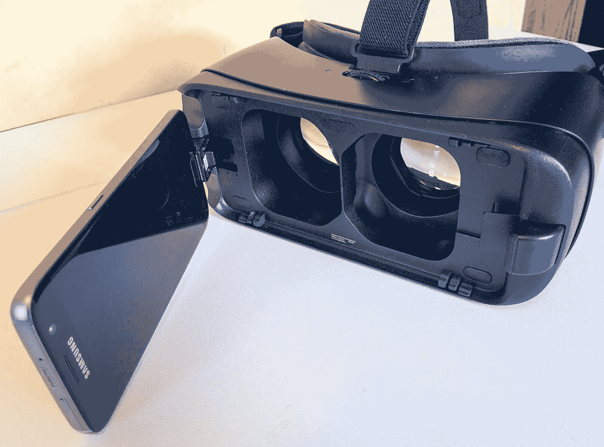

左舷似乎脆弱而可怕。你必须把它翻过来，连接上你的手机，然后再把它摔下来——所有这些都是因为你的手机只有一个接口。它会有点摇晃，我建议站在非常近的表面上，比如桌子上。我并不自称是地球上最协调的人(我永远也不会去参加耍刀奥运会)，但当设置虚拟现实需要如此集中的协调时，我已经有点失望了。此外，在重复使用后，端口变得更加不稳定。设置变得不太可靠，视频要么中途中断，要么完全收不到信号。

不过，使用 Gear VR 比 VR One Plus 更具互动性。一旦你解锁手机(如果你不解锁，一个令人毛骨悚然的机械女人会对你大喊大叫)并将其连接到你的电视机上，Oculus 应用程序(你必须下载)就会触发。戴上耳机后，您可以通过耳机进行所有控制。突然，按钮和旋钮变得有用，你的眼睛和触摸板的组合变成了你的鼠标。

> 作为一个旁注:这是我使用过的唯一一个焦点转盘实际上向我显示级别之间明显差异的 VR 耳机。既轻松又可爱。

现在还需要一些额外的步骤。你必须创建帐户，并设置你的虚拟区域(一个我想花所有时间的客厅)，就像你最初设置你的电脑桌面一样。对于经常使用智能手机的人来说，这些步骤中的大部分都相当简单。这里增加了时间，所以它不像 VR One Plus 那样立即令人满意，但未来组织寻找视频/图片的好处是显而易见的。

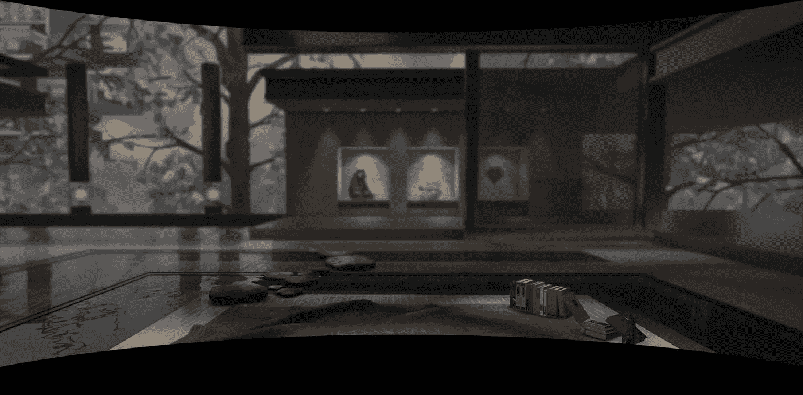

Oculus’s home screen: a beautiful living space. All it needs is a sweet-looking cat to wander toward me, rub up on my leg asking for pets followed by hissing and clawing for not doing it “just right.” Photo courtesy of VRHeads.com.

不好的一面？嗯，是 Oculus 运行的一款耳机(和 app)。在虚拟现实领域，现在有两个主要玩家:脸书和谷歌。Oculus 与脸书合作，所以他们非常坦率和有效地将谷歌旗下的 YouTube 从可用网站列表中删除。有一些方法可以绕过这个问题——我不会在这里一一列举，但是它们相当繁琐。更重要的是，这个博客的目的是让你知道在耳机上你能做什么或不能做什么。Oculus **不希望**你在他们的产品上观看 YouTube 视频，所以他们让这变得格外困难。

撇开 YouTube 不谈，Gear VR 上还是有很多值得看的。你可以下载游戏应用，在他们的服务器上观看视频，或者把你自己的下载到你的手机上。耳机附带有相当简单的说明，告诉您如何操作，但请务必严格遵守。您无法在此设备上浏览手机中的照片，因此您必须创建特定的文件夹来存放您要在 VR 中查看的照片。我很乐意看到这种基于云的服务，因为视频和照片占据了手机相当大的空间。在这样一个内存有限的设备上保存一个大型数字图书馆只能在一小段时间内正常工作。

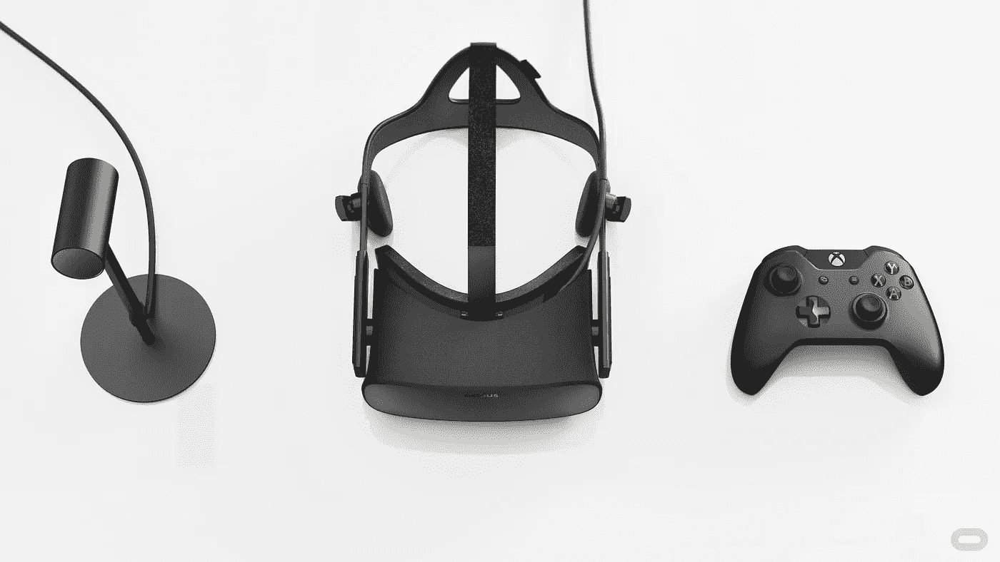

Photo courtesy of [anandtech.com](http://www.anandtech.com/show/10149/hands-on-with-the-retail-oculus-rift/2).

# [Oculus Rift](https://www.oculus.com/rift/)

## 今天的重头戏是:Oculus Rift(你猜对了，是 Oculus)

我首先要说的是，鉴于这款耳机在虚拟现实领域的能力，它有理由进行自我评估。我还会说，我更希望这份名单上的第三条是活着。拥有两个 Oculus 产品并不像我期望的那样多样化，但这两个产品之间的功能应该足以满足今天的目标。

Oculus Rift 的设置相当不错。做好和弦纠结的准备，你可能会想给这个装置一个单独的出口。耳机本身**在购买时的价格是 599.99 美元**。这让你得到一个包装精美的虚拟现实设备。它配有一个控制器(对我来说，这是一个 Xbox)、一个遥控器、一个追踪器/传感器、一个耳机和一根足够长的电线。这些东西加在一起，会让你一无所获。

Sadly, this is the one instance where “42” is not the answer.

要实际使用耳机和配件，您需要一台电脑。对于游戏或长期使用，高性能计算机是首选。老实说，Oculus 从未声称这是一个独立的系统。他们甚至提供电脑建议来优化他们的设置。你会注意到我展示的这个使用笔记本电脑来实现便携性，但为了实现最高效率，还需要额外的附件(如冷却倾斜台)。

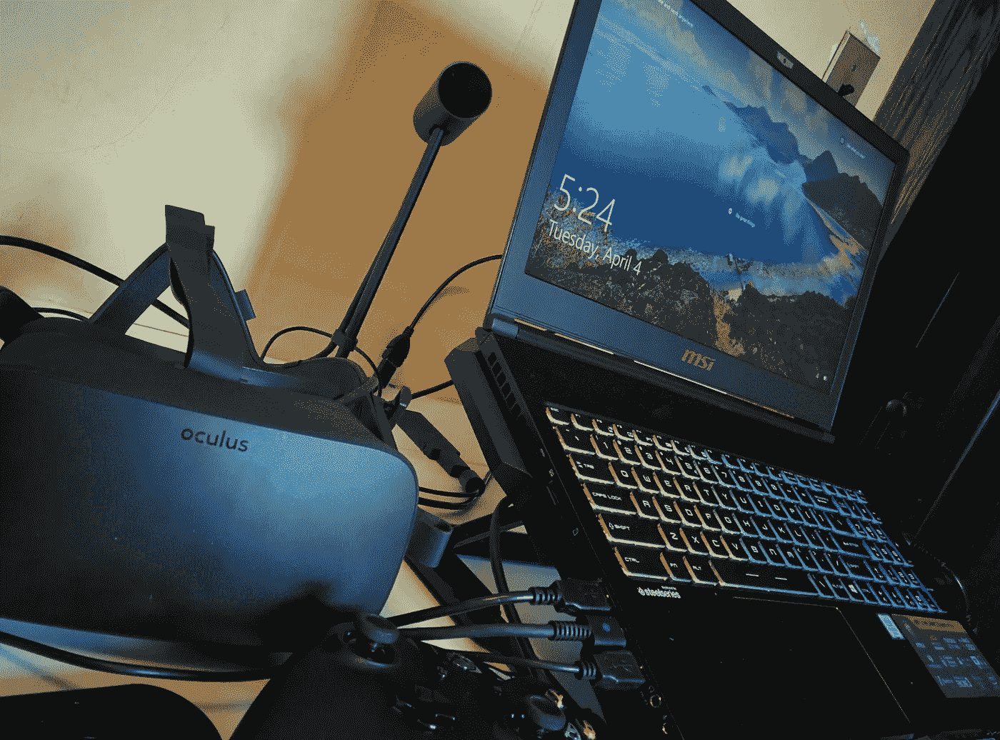

我们可以在以后的某个时间讨论这些。现在，让我们来看看为了观看视频的目的，整个装置的基本设置和可用性。虽然之前的 Oculus 钻机已经让我设置了配置文件等，但现在还需要更多的 Rift。初始设置(确定跳线走向，购买扩展器以便它们实际接入端口，以及额外的配置文件管理)花费了数小时。

不过，这款 Oculus 的工作方式与之前的类似。一旦连接正确，只需把它放在我的头上，程序就会打开。在我的数字客厅里，我甚至比在我的三星设备上有更多的选择(*虽然，仍然没有暴躁的猫*)。我也更倾向于下载应用和程序，因为我不太担心存储空间不足。下载需要相当多的时间；做好准备。这些更新是频繁和不断的。

和之前的 Oculus 套装一样，我无法观看 YouTube 视频。再说一次，我有办法解决这个问题，但是在 Rift 上这些方法更加繁琐、耗时、昂贵。

有了 Gear VR，我可以将自己的视频放入一个文件夹中进行观看。这款耳机声称同样是可能的(在一个不同的*文件夹中，所以要注意方向)，但我还没有让它工作。虽然 Oculus 网站上的在线说明清晰而简单(我相信只有四个步骤)，但目前还没有视频可以通过他们的程序观看。*

*无数个小时后 ***(实际上是把某人拉进了计算机科学学校——谢谢，Jaron！)*** 我不知所措；我直接联系了 Oculus。他们的反应非常迅速，非常有礼貌。然而，这与大多数技术支持是一样的游戏:以三种不同的方式向三个不同的人写三遍同样的问题，一遍又一遍地被引导到同样的四个步骤，而解决方案还没有出现。我会说，他们似乎非常致力于帮助我解决这个问题。我毫不怀疑这是他们想要解决的问题，他们正在积极寻找解决方案——毕竟，他们投资于该产品的未来——但目前，我的视频被扣为人质。*

*也许在以后的某一天，我会讲述我是如何让一切工作的(在我的计算机科学朋友的帮助下)。这是一条复杂的道路，它涉及到购买三个额外的应用程序，这些应用程序需要一起工作，一起更新，并连接到互联网上观看硬盘上的视频。我现在几乎没有耐心写下这些步骤，我敢说，如果你还在读到这里，你也可以休息一下。*

**

*Come on, you deserve it!*

# *概括一下*

*很明显，每套产品的制造商都有不同的客户群。将苹果比作小丑装的鸽子似乎不太公平，但知道哪种装备最适合你是很重要的。*

*   *VR One Plus:非常适合扑通一声就走。如果你只是想快速、廉价、便携地在 3DOF 中查看 360，这是一个很好的选择。*
*   ***Gear VR:小众三星市场。**不是扑通一声就走，但也不能给你 6DOF。可以说，它比 VR One Plus 更贵，并且需要更多的时间进行设置。对于已经拥有一部未爆炸的三星手机的人来说，这是一个不错的选择，但对于大多数人来说不是一个好选择。*
*   ***Oculus Rift:为了坐着和停留。**考虑到更多的功能(如游戏)，使用正确的程序，该套装可为您提供 6 自由度。任何事情都是如此，更多的选择会让位于更多有问题的机会。我不会说观看视频是不可能的，因为我知道很快就会有一个解决方案，但这种类型的设置对那些真正进入 VR 领域的人来说更是一种投资。*

# *虚拟现实快乐！*

> *我们都非常习惯于今天的电视、相机和电脑显示器的清晰。VR 还不是一个级别的。每款耳机的清晰度略有不同，但分辨率方面最大的改变将来自 360°相机的发展。出于这个原因，实际观众的清晰度似乎是不必要的。敬请关注 360 相机评论。*

******

> *[黑客中午](http://bit.ly/Hackernoon)是黑客如何开始他们的下午。我们是 [@AMI](http://bit.ly/atAMIatAMI) 家庭的一员。我们现在[接受投稿](http://bit.ly/hackernoonsubmission)并乐意[讨论广告&赞助](mailto:partners@amipublications.com)机会。*
> 
> *如果你喜欢这个故事，我们推荐你阅读我们的[最新科技故事](http://bit.ly/hackernoonlatestt)和[趋势科技故事](https://hackernoon.com/trending)。直到下一次，不要把世界的现实想当然！*

**