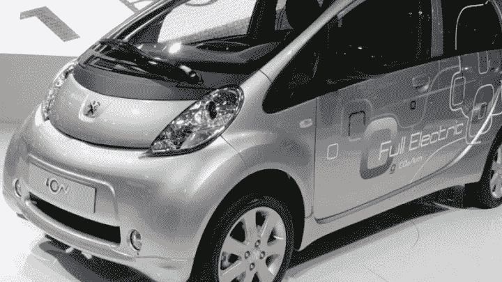
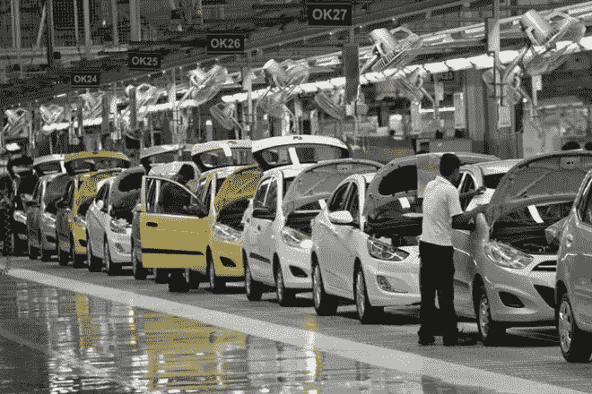
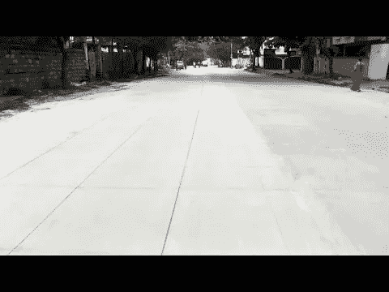
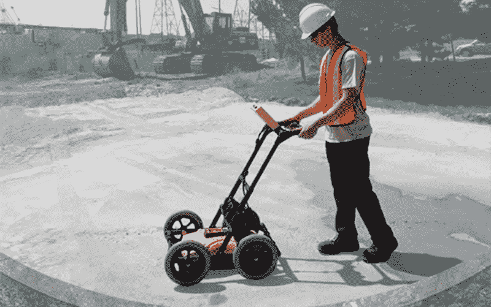

# 汽车工业应对环境危机的三种方式

> 原文：<https://medium.com/hackernoon/three-ways-the-auto-industry-is-responding-to-the-environmental-crisis-3f39a7dcbad8>

几十年来，汽车工业一直是环境健康这场危险战争的对立面。然而，随着埃隆·马斯克(Elon Musk)和其他许多致力于环保的绿色企业成为汽车行业的领导者，毫不奇怪，我们世界的制造商、燃料公司、主要城市和科学家现在已经开始与汽车行业携手合作，一步一步地创造一个更光明的未来和更绿色的世界。

然而，随着汽车行业的许多部分受到影响，该行业参与绿色倡议的三个很少被认识到的方面可能会产生比你长期想象的更大的影响。因此，通过回顾这三个要素，我们可以看到汽车行业是如何发挥作用的，以及这对我们的世界和我们的后代意味着什么。毕竟，每一条人迹罕至的道路开始都是崎岖不平的，但是，经过几次之后，即使是最崎岖的道路也会形成一条前进的道路。

# **1)绿色生产**

汽车制造是汽车工业的一个方面，多年来一直缺乏绿色商业实践。然而，在过去的五年中，汽车制造业已经向绿色计划进行了重大转变，在汽车生产中加入了更多的可回收材料，选择了允许公司减少化石燃料摄入量的替代燃料，并制造了总体上更加可靠和环保的汽车零件。

当谈到更多可回收材料节省燃油经济性时，我们可以快速回顾一下我以前的文章[铝及其对汽车工业的影响](https://hackernoon.com/will-aluminum-be-at-the-forefront-of-the-green-initiative-within-the-automotive-industry-e9d5efc8924b)。因为铝的重量很轻，可塑性很强，这意味着它可以用来制造任何汽车，减少汽车的燃料摄入，并且同样容易回收。尽管出于安全考虑，汽车不能完全由铝构成，但据估计，到 2025 年，汽车将由大约 550 磅的铝构成。这将最终导致一种更高效、更便宜、更环保的交通方式，可以快速回收和重新分配。

此外，在燃料替代品的情况下，很明显，许多汽车公司已经开始转向电力和各种其他形式的燃料，以减少他们的碳足迹和美国人民每天使用的石油量。事实上，回到铝，一种新的[革命性的铝空气电池](http://www.aluminum.org/go-further-aluminum)据说在需要充电之前能够无气行驶 1000 英里。也就是说，这不仅会大幅减少对燃料的需求，还会为普通美国人节省时间，减少人们发现自己被困在路边没有汽油的次数。最重要的是，为了进一步降低这种风险，据说将会有快速充电设备，即使附近没有充电站，个人也可以购买这些设备来快速给他们的汽车充电。

最后，一辆汽车需要的零件通常由不容易回收的材料组成，这些材料会在垃圾场存放几十年，在使用几年后很容易损坏。因此，许多汽车零部件公司加入了绿色倡议，只提供环保、可回收和耐用的零部件材料。例如，目前，[轮胎正在通过使用耐用的绿色材料走向环保](https://www.tires-easy.com/blog/eco-friendly-tires/)。这使得普通消费者能够以相同的价格，甚至更低的价格，购买耐用的绿色轮胎。

最终，汽车工业的制造部分真正接受了绿色信息，并在汽车生产过程的每一个部分灌输了这种主动性。然而，这远不是汽车行业多年来为帮助减少碳排放和负面环境影响所做的唯一事情，也许，它对我们国家城市社区的帮助才是它们真正闪耀的地方。

# **2)降低城市温度**

在无数科学家和汽车行业的支持下，各种城市社区已经开始将他们的大面积沥青街道完全涂成白色，以减少城市街道上积聚的热量。事实上，尽管特朗普声称要限制保护环境的法律，汽车行业巨头们表示他们仍然致力于减排。虽然看起来没什么大不了的，但这样做已经被证明可以[显著降低城市的热度](http://www.greencarreports.com/news/1092561_want-to-cut-heat-in-the-city-paint-the-roads-white)，这不仅有助于环境，因为它提供了一种温和的城市生活，植被可以再次生存，而且还减少了多少人转向空调来缓解令人疲惫的炎热。

事实是，汽车和家庭中的空调设备[排放出令人发指的碳水平](http://www.nbcnews.com/science/environment/world-s-air-conditioning-boom-would-worsen-greenhouse-gas-emissions-n583816)，这些碳在我们的大气中堆积，每天都在破坏我们的臭氧。通过减少特定城市的热量，你可以大幅减少这些碳排放。您还可以帮助提高燃油经济性，因为汽车轮胎的橡胶将不再粘在热沥青上，从而导致阻力，随着时间的推移，这实际上大大降低了您的燃油经济性。最后，你还可以减少路上的汽车数量，因为如果天气允许，人们会更倾向于选择自行车或步行。

到目前为止，已经证明这些白色街道实际上可以降低一个城市的温度超过 44 华氏度，这意味着创纪录的高温很快就可以与稍微温暖的一天相媲美。也就是说，我们可以减少道路上的汽车数量，增加植被，鼓励替代交通方式，并减少空调的使用量，只需要大量的白色油漆和一些专门的工人来涂抹。然而，正如在现有情况变得更糟之前阻止它们是很重要的一样，汽车行业也开始采取类似的预防措施，帮助我们在问题发生之前就将其解决掉。

# **3)支持 GPR 风险评估计划**

对于那些不知道探地雷达是什么的人来说，探地雷达最终给了科学家一张地表下的图片。然而，探地雷达在环境方面的应用真正让汽车工业和全国抗击环境危机的科学家们感兴趣。

这是因为 GPR 允许科学家评估垃圾填埋场的界限，绘制污染羽流的范围，并确定污染物迁移的方向。正因为如此，科学家能够识别污染物何时影响我们的环境，并在这些问题变得严重之前确定如何解决它们。

此外，这使得汽车行业认识到他们最需要回收的地方，以减少垃圾填埋场发现的汽车数量，并减少这些垃圾填埋场每天产生的碳排放量。从那时起，汽车行业可以开始以更有效的方式回收旧汽车，将这些汽车改造成新的铝突出的汽车，并创造一个比以往任何时候都更可回收的汽车未来。

最终，汽车行业是一个真正认识到自身缺点并做出改进的行业。随着朝着正确方向迈出的每一步，汽车行业的每一个方面都获得了新的绿色外观，今天的消费者慢慢成为明天产品的测试者——随着时间的推移，这条少有人走的崎岖道路慢慢变得越来越可靠。