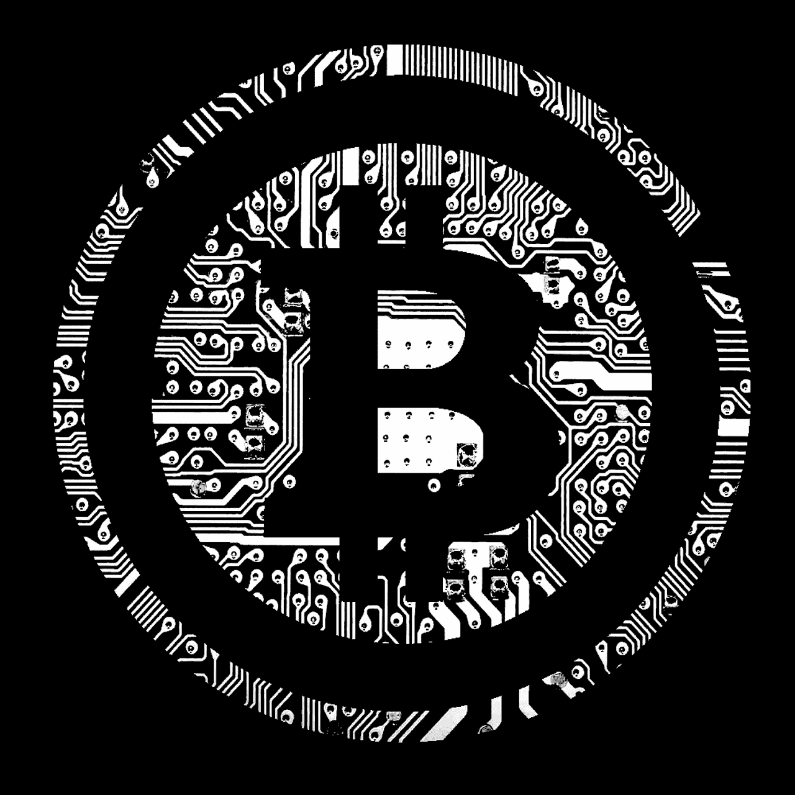
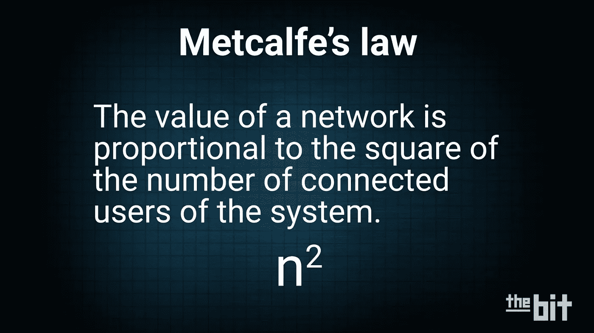
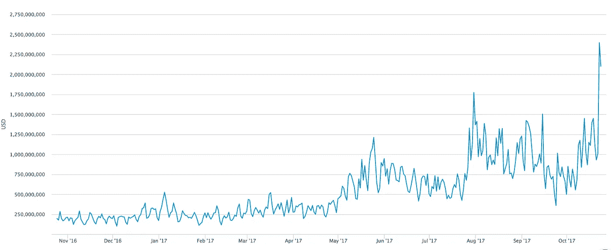
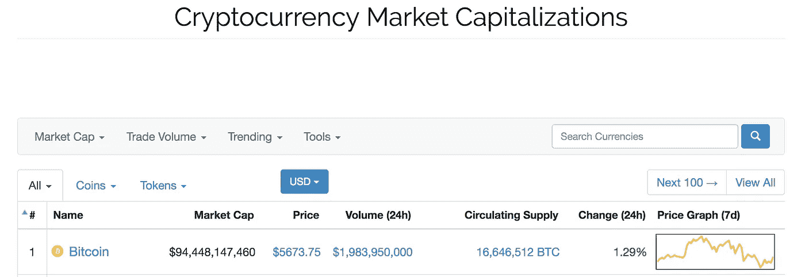

# 比特币的三种估值方式

> 原文：<https://medium.com/hackernoon/three-ways-to-value-bitcoin-e5823bfe6540>

当与任何对交易比特币感兴趣的人交谈时，不可避免地会问的问题是，“比特币值多少钱？”这是一个很难回答的问题。在评估比特币的价值时，有 3 种方法可以考虑。

## 作为资产/商品

如果你想尝试从比特币是一种商品的角度来评估它的价值，一种方法可能是估计它占黄金总价值的百分比。目前开采的所有黄金的市值约为 8 万亿美元。相比之下，黄金是一种很好的商品，因为它不是消费品，主要用作价值储存手段。黄金是一代人的价值储存手段。今天，一切都是数字化的，比特币可以成为下一代的价值储存手段。如果比特币获得了黄金总价值的 10%，那么比特币的市值可能会升至 8000 亿美元。迄今为止，比特币在 T2 的市值约为 1000 亿美元。

这是 FundStrat Global Advisor 联合创始人[汤姆·李试图对比特币](http://www.businessinsider.com/bitcoin-price-how-to-value-fundstrat-tom-lee-2017-10)估值的一种方式，尽管他使用了 5%的黄金。这可能是评估比特币价值的一种方式。这仍将使比特币的长期价值达到 4000 亿美元。

## 作为一种技术/网络

李还解释了网络效应和[梅特卡夫定律](https://en.wikipedia.org/wiki/Metcalfe%27s_law)。价值是这样建立的:参与越多，创造的价值就越多。随着越来越多的人使用比特币，因为网络效应，价值就越高。这种对比特币作为一种技术或社交网络的关注传达了非线性增长的强大机遇。

**7 比特币的网络效应:**

1.  **投机**——比特币交易中的每一块投机美元都会增值
2.  **商户采用**——每一个接受比特币的新商户都会增加网络的价值
3.  **消费者接受度**——每当新消费者可以用比特币买东西时，比特币的价值就会增加
4.  **安全/激励** —随着投机者以及商家和消费者采用提高价格，矿工和节点的激励也增加
5.  随着围绕比特币的护城河的增加，其价值也在增加
6.  **金融化**——随着越来越多的金融产品，如加密货币和保险的期权被创造出来，网络的附加值也越来越高
7.  **成为世界储备货币**——这是未来的事，但随着其他法定货币的崩溃，比特币的价值增加。我们已经从委内瑞拉和非洲国家的事件中看到了这一点。

*这来自于* [*痕迹所做的工作*](http://www.thrivenotes.com/the-7-network-effects-of-bitcoin/)

所有这些“网络效应”正在协同工作，共同为比特币创造越来越多的价值。汤姆·李做了大量工作来证明比特币的[价格变动可以用一个等式](http://www.businessinsider.com/bitcoin-price-movement-explained-by-one-equation-fundstrat-tom-lee-metcalf-law-network-effect-2017-10)来解释。例如，如果我们平均每天有 310，000 个唯一地址，那么比特币的总价值将为 961 亿美元(310，000 ^2).如果未来这个数字翻倍，那么比特币的价值也将翻倍。如果这个数字翻倍至 620，000，那么比特币的总价值将膨胀至 384.4 亿美元！这就是网络效应的力量。

## 作为一种替代货币

过去 5 年的历史平均值显示了每日交易量和比特币市值(价格)之间的关系。平均下来，比特币的市值= 50 x 日交易量。

[*https://blockchain.info/ch…/estimated-transaction-volume-usd*](https://blockchain.info/charts/estimated-transaction-volume-usd)

昨天，我们完成了约 21 亿美元的交易，这意味着比特币的历史市值(价格)将达到 1050 亿美元。目前，比特币的市值为 945 亿美元，因此这表明比特币价格在上涨，这是由更高的日交易量支撑的。

跟踪每日交易量，这应该是比特币价格的一个指标。这可能是评估比特币价值的一种方式。观察一段时间内的每日交易量。

## 价值的关键驱动因素

随着比特币继续以各种方式被使用，它的价值将继续增长。在委内瑞拉和津巴布韦等正在抗击高通胀的发展中国家，作为交易媒介、价值储存手段和记账单位，比特币比本国货币更强大。

比特币也越来越多地用于国际支付和汇款领域。据估计，这是一个 5000 亿美元的产业。越来越多的比特币用户上网，因为它比使用西联汇款等其他传统汇款和支付系统更便宜、更快。

最后，越来越多的供应商将其作为支付系统提供。 [Expedia](https://news.bitcoin.com/bitcoin-accepting-expedia-accelerate-global-expansion/) 拿比特币。Overstock.com 接受比特币。传言称[亚马逊将收购比特币](https://futurism.com/rumor-suggests-amazon-will-begin-accepting-bitcoin/)。所有这些都是推高每日交易量的关键驱动因素。

________________________________________________________________

*免责声明:以上仅代表一种观点，仅供参考。它无意成为投资建议。请自己做作业。*

[***Jake Ryan***](/@jake_ryan)***是 Tradecraft Capital 的创始人，创业顾问，天使投资人&投资方面的作家。如果你喜欢这篇文章，请“鼓掌”帮助别人找到它！欲知详情，敬请关注*** [***【脸书】***](https://www.facebook.com/WealthRituals/)*[***推特***](https://twitter.com/TradecraftJake) ***。****