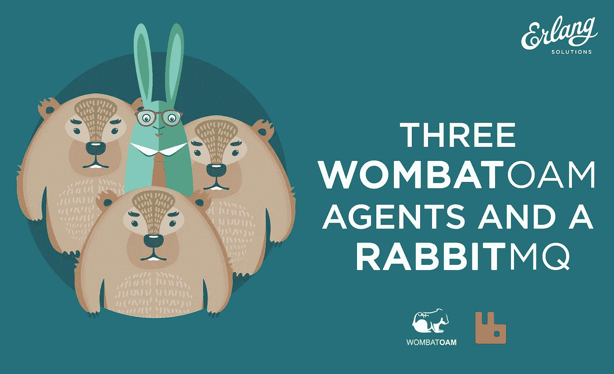
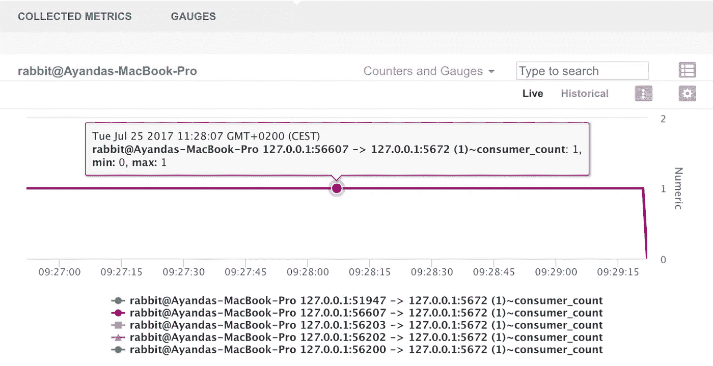
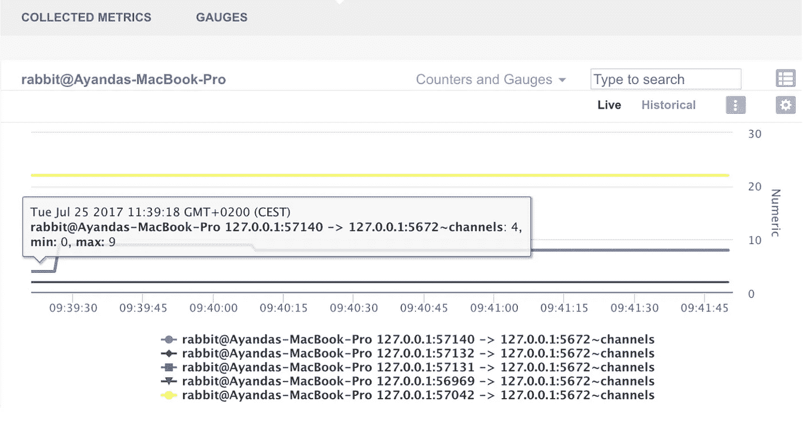

# 三个 WombatOAM 特工和一个 RabbitMQ

> 原文：<https://medium.com/hackernoon/three-wombatoam-agents-and-a-rabbitmq-d5e2c0513fab>

作者[阿扬达·杜贝](http://www.twitter.com/dube_aya)

在你继续之前，你应该知道你可以今天用 WombatOAM 3.0.0beta 的 [**45 天免费试用来测试 WombatOAM。**](https://www.erlang-solutions.com/products/wombat-oam.html#FreeTrial)

从版本 2.7.0 开始， [**WombatOAM**](http://bit.ly/2hwI6HZ) 增加了三个 [**RabbitMQ**](http://bit.ly/2hwqn3v) 代理，它们是作为 RabbitMQ 主插件的一部分提供的。这三个代理更特定于 RabbitMQ 的内部元素，即 ***队列*** 、 ***通道*** 和 ***连接*** ，每个代理为单独配置和选择的度量属性提供更精细和更详细的度量。

以前，WombatOAM 的单个 RabbitMQ 插件会提供聚合指标的概述，而现在，这三个额外的代理提供了所管理的 RabbitMQ 节点的更低级别的指标信息。这些如下图所示。

# RabbitMQ 队列代理

**RabbitMQ 队列**代理提供了单独监控队列的能力，每个队列的以下属性是可配置的。

*   `messages`
*   `messages_ready`
*   `messages_unacknowledged`
*   `messages_ready_ram`
*   `messages_unacknowledged_ram`
*   `messages_ram`
*   `messages_persistent`
*   `message_bytes`
*   `message_bytes_ready`
*   `message_bytes_unacknowledged`
*   `message_bytes_ram`
*   `message_bytes_persistent`
*   `disk_reads`
*   `disk_writes`
*   `consumers`
*   `memory`

默认情况下，RabbitMQ 队列代理被配置为监视被监视节点上每个队列的消息总数。关于如何配置这个代理的更多细节可以在 WombatOAM 文档中找到。下图说明了该代理的使用情况:

*RabbitMQ Queues Plugin message metric illustration*

# **RabbitMQ 渠道代理**

**RabbitMQ 通道**代理提供了单独监控通道的能力，对于每个捕获的(活动的)通道，以下属性是可配置的。

*   `number`
*   `reductions`
*   `consumer_count`
*   `messages_unacknowledged`
*   `messages_unconfirmed`
*   `messages_uncommitted`
*   `acks_uncommitted`
*   `prefetch_count`
*   `global_prefetch_count`

下图显示了使用中的代理，其中的`consumer_count`属性被配置为对所有通道进行监控:

*RabbitMQ Channels Plugin message metric illustration*

# RabbitMQ 连接代理

**RabbitMQ Connections** 代理提供了单独监控连接的能力，对于每个捕获的(活动的)连接，可以配置以下属性。

*   `frame_max`
*   `channel_max`
*   `recv_oct`
*   `recv_cnt`
*   `send_oct`
*   `send_cnt`
*   `send_pend`
*   `channels`

下图说明了使用中的代理，其中的`channels`属性被配置为对所有连接进行监视:

*RabbitMQ Connections Plugin message metric illustration*

这篇博文摘自 Ayanda Dube 的 [**RabbitMQ 操作&使用 WombatOAM**](http://bit.ly/2hxGiib) 维护。点击 下载 [**全攻略。**](http://bit.ly/2hxGiib)

*原载于*[*www.erlang-solutions.com*](http://bit.ly/2AGZnSz)*。*