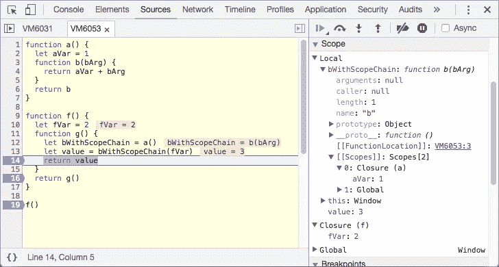

# 挣脱我们的镜链

> 原文：<https://medium.com/hackernoon/throwing-off-our-scope-chains-7567beb2d0b6>

## Eve 只使用了一个全局范围和一个局部范围

欢迎来到我关于 Eve 的系列文章的第三部分，这是一种令人兴奋和着迷的新编程语言。

*   [*一、*Eve 如何统一你的整个编程栈](https://hackernoon.com/how-eve-unifies-your-entire-programming-stack-900ca80c58a7)
*   [*二世。*当逻辑编程遇上 CQRS](https://hackernoon.com/when-logic-programming-meets-cqrs-1137ab2a5f86)
*   ***三世。*挣脱我们的镜链**
*   [*四世。* Smalltalk 和蛋白质编程](https://hackernoon.com/smalltalk-and-protein-programming-4da245ac93e2)
*   [*五、*夏娃远大理想的坚实基础](https://hackernoon.com/the-rock-solid-foundation-for-eves-big-vision-225b80b91e11)
*   [*六。*为什么 Eve 是实时应用的完美选择](https://hackernoon.com/why-eve-will-be-perfect-for-realtime-apps-92b965b80ad)

几十年来，词法范围一直是主流编程的一个固定部分。但是当它支持一些优雅的模式时，它也增加了额外的复杂性，使你很难推断程序的状态。

如果我们在调试器中暂停一个典型的程序，看到所有模糊不清的小状态池都保存在内存中，这是非常令人震惊的:

1.  当前函数或块的局部范围
2.  存储所有代码块的局部变量的闭包链，当前块嵌套在这些代码块中
3.  额外的闭包链，每个函数对应一个我们可以从当前作用域访问的函数

这里有一个*简单的*例子:

当我们看到第 14 行时，看看所有存在的小状态池:

1.  `bWithScopeChain`和`value`是`g`本地的
2.  `fVar`是范围链的上一级，是`Closure (f)`的一部分
3.  `aVar`不在`g`的作用域链中，但是它的值`1`仍然在内存中，因为它当前在`bWithScopeChain`的作用域链中

当你编写代码的时候，词法范围看起来是一种不错的方式`f`。但是当你已经运行了*`f()`并且现在有些事情不能完美地工作时，词法范围突然变成了一场噩梦，因为没有办法从命令行进入*的任何*状态。你能做什么？*

*我们都知道你可能会被一些`console.log`动作吓到。除非你更喜欢使用调试器来一步一步地调试你的程序，这就像使用谷歌地球来可视化密西西比河一样方便……但却卡在了最大的缩放比例。*

**

*有办法摆脱这种混乱。有了 Eve，我们只需要处理两个范围:*

*   ***局部范围** Eve 代码的每个块都可以有自己的局部变量*
*   ***全局范围** 任何从一个时间步长持续到下一个时间步长的状态必须存在于某个数据库中，程序的任何部分都可以查询任何数据库*

*Eve 没有作用域*链*，因为你不能将代码块嵌套到其他代码块中。都很平；模糊的小国家无处可藏。这也意味着 Eve 不能有[闭包](https://en.wikipedia.org/wiki/Closure_(computer_programming))，因为闭包根据定义是一种创建持久本地状态的模糊小池的机制。*

*现在知道没有范围链的编程有多可行还为时过早。我们还不知道没有词法范围我们能活得多好，因为 Eve 0.2 中对编写函数的语言支持还没有完全成熟。词法范围可能对编写某种类型的程序有很大的帮助，也许是像象棋人工智能这样的算法密集型程序。*

*然而，对于我们许多程序员来说，“分流数据”，也就是写“胶水代码”，是我们花费大量时间的地方。这部分工作也是最容易想象没有词法范围的地方。因此，我们可以期待摆脱我们的作用域链，因为即使我们最终没有在我们的代码库中到处使用 Eve，我们也会从在某些部分使用它中获得很多价值。*

***下篇:** [*四。* Smalltalk 和蛋白质编程](https://hackernoon.com/smalltalk-and-protein-programming-4da245ac93e2)*

******

> *[黑客中午](http://bit.ly/Hackernoon)是黑客如何开始他们的下午。我们是 [@AMI](http://bit.ly/atAMIatAMI) 家庭的一员。我们现在[接受投稿](http://bit.ly/hackernoonsubmission)，并乐意[讨论广告&赞助](mailto:partners@amipublications.com)机会。*
> 
> *如果你喜欢这个故事，我们推荐你阅读我们的[最新科技故事](http://bit.ly/hackernoonlatestt)和[趋势科技故事](https://hackernoon.com/trending)。直到下一次，不要把世界的现实想当然！*

**