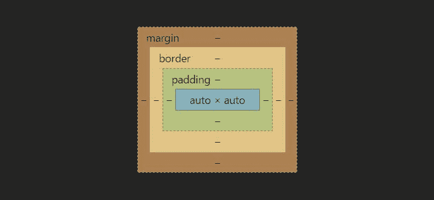
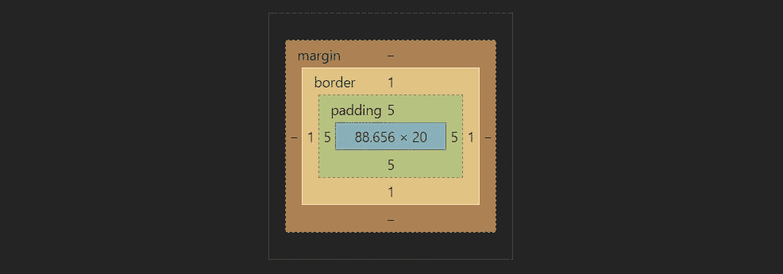

# TIL——使用 Chrome 开发工具的“盒子模型”

> 原文：<https://medium.com/hackernoon/til-using-box-model-of-chrome-dev-tools-c1cdd4081693>

我们都知道当谈到网络调试功能时，Chrome Dev T2 工具 T3 有多好。开发工具中有许多非常有用的特性，但是我们没有意识到。

我今天发现的一个特征是“盒子模型”。那么，到底是什么呢？

*“这是 Chrome Dev Tools 提供的一个功能，它向我们展示了 HTML 页面上一个元素的可视化表示，包括相对于其他元素的边距、填充和边框。”*

Box Model

基本上，它向我们展示了特定元素的以下信息:

如图所示，它通过颜色向我们展示了相对边距、填充、边框。所以，每样东西都用不同的颜色来表示。主元素为蓝色，填充为绿色，边框为棕色，等等。它还以数字的形式显示每边的填充/边距量。即顶部、底部、左侧和右侧。

Box Model Representations

在上面的图片中，你可以看到，一个元素每边有 5px 的填充，1px 的边框，两边没有空白。关于这个盒子模型的一个有趣的事情是，你实际上可以修改其中的任何数字，并且可以看到相应的变化，如下所示。

Box Model in Action

当我们希望看到跨元素的填充和边距的实际行为，而不只是在 CSS 中随机更改它们时，这非常方便。

> [黑客中午](http://bit.ly/Hackernoon)是黑客如何开始他们的下午。我们是 [@AMI](http://bit.ly/atAMIatAMI) 家庭的一员。我们现在[接受投稿](http://bit.ly/hackernoonsubmission)并乐意[讨论广告&赞助](mailto:partners@amipublications.com)机会。
> 
> 如果你喜欢这个故事，我们推荐你阅读我们的[最新科技故事](http://bit.ly/hackernoonlatestt)和[趋势科技故事](https://hackernoon.com/trending)。直到下一次，不要把世界的现实想当然！

