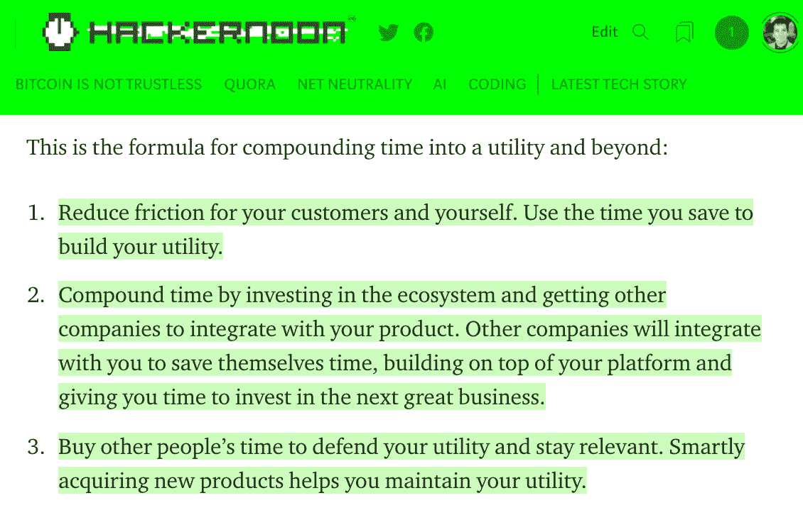
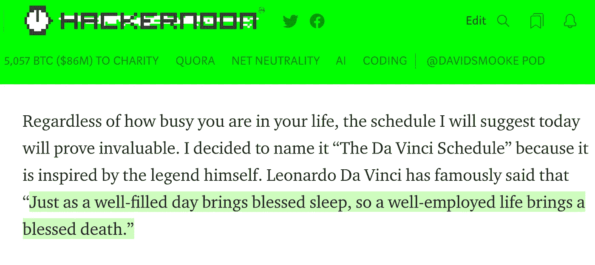
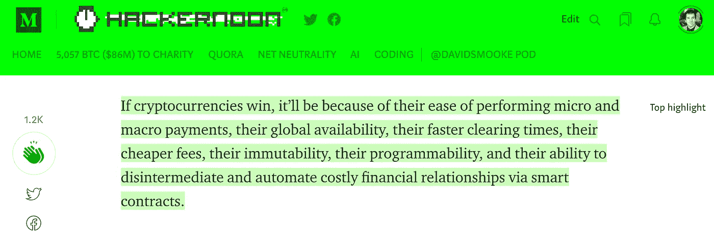

# 科技时代

> 原文：<https://medium.com/hackernoon/time-for-tech-730ddb288b5c>

The interwebs’ best tech stories.

*如果你想更多地了解我，* [*黑客正午*](http://hackernoon.com) *，以及我们为什么要做我们所做的事情——*[***听这个软件工程每日播客我做了***](https://goo.gl/SwJptN) *与* [*杰夫·梅尔森*](https://medium.com/u/8dd9e862cfe4?source=post_page-----730ddb288b5c--------------------------------) *。*

## 亲爱的黑客午间读者:

时间一直是专业人士最宝贵的财富。

不像货币，你不能积累更多的时间。

你可以购买别人的时间——但是除了昂贵的医疗程序，比如在华特·迪士尼旁边低温冷冻你的身体——你不能为自己购买时间。但是，企业能争取时间吗？还是创造时间？如果是的话，效用和利润是如何产生的？

如果你努力运营你的基础设施，你的业务可以创造时间…或者至少在阅读了社会资本合伙人 Arjun Sethi 的 [**“时间单位是新的货币】**](https://hackernoon.com/units-of-time-are-the-new-currency-6f2cb28657cb)**之后，这就是我的想法。**

**这里是 1，2，3:**

****

**时间构建了我们对谁、什么、哪里和为什么的认知。**

**没有场景就没有场景，没有时间就没有地点。**

**优化时间从优化自己的时间开始。**

**“如果没有结构，你享受完整而平衡的生活方式的机会就会大大减少，你的动力和情绪也会受到影响，”思想家安德里安·伊利欧普洛斯在《达芬奇时间表》****中写到。******

********

# ****在 2017 年即将结束之际，这里有 17 个[趋势科技故事](https://hackernoon.com/trending)引起了我的共鸣:****

1.  ****[比特币到底是什么](https://hackernoon.com/this-time-is-different-part-2-what-bitcoin-really-is-ae58c69b3bf0)(以及[它不是什么](https://hackernoon.com/this-time-is-different-part-i-what-bitcoin-isnt-eb9f645239b1))作者[马克·e·杰夫维奇](https://medium.com/u/8b1a1eb2cb1f?source=post_page-----730ddb288b5c--------------------------------)。****
2.  ****如何帮助各州— [像加州](https://hackernoon.com/now-that-the-fcc-has-repealed-net-neutrality-lets-adopt-it-in-california-fa3bd02101ee) &他们的州参议员[斯科特·维纳](https://medium.com/u/5a2e5d91f709?source=post_page-----730ddb288b5c--------------------------------) —实现[网络中立](https://hackernoon.com/net-neutrality/home)。****
3.  ****机器能训练乌鸦捡起你城市里的每一个烟头吗？按[下一张网](https://medium.com/u/ce54ae6f1976?source=post_page-----730ddb288b5c--------------------------------)****
4.  ****【Apple TV 哪里出问题了？由 [Quora](https://medium.com/u/3853f85f7d5e?source=post_page-----730ddb288b5c--------------------------------)****
5.  ****工程总监 [Allan MacGregor](https://medium.com/u/4d0ae48f37f9?source=post_page-----730ddb288b5c--------------------------------) 的[2018 年值得关注的 5 大技术趋势](https://hackernoon.com/5-trends-to-watch-out-on-2018-e9db73107ebf) : [区块链](https://hackernoon.com/blockchain/home)、[对话界面](https://hackernoon.com/tagged/conversational-interfaces)、[人工智能](https://hackernoon.com/artificial-intelligence/home)、 [BaaS(后端即服务)](https://hackernoon.com/tagged/BaaS)、[增强现实](https://hackernoon.com/tagged/augmented-reality)。****
6.  ****Scrum 是世界上最好的东西吗？产品开发坚果[约翰·卡特勒](https://medium.com/u/4c3f4fe11e6b?source=post_page-----730ddb288b5c--------------------------------)这样认为。****
7.  ****[2018 年成功创始人将如何融资](https://hackernoon.com/how-successful-founders-will-raise-money-in-2018-69a6cf68f447)由 Intermix.io 创始人[拉斯·坎普](https://medium.com/u/c919c8b77e17?source=post_page-----730ddb288b5c--------------------------------)****
8.  ****巨大的加密货币狂潮刚刚开始——这对 2018 年意味着什么？由企业家[克里斯·赫德](https://medium.com/u/da7b665f3cc7?source=post_page-----730ddb288b5c--------------------------------)****
9.  ****[为什么 NEO 可能是 2018 年最强的加密货币](https://hackernoon.com/neo-versus-ethereum-why-neo-might-be-2018s-strongest-cryptocurrency-79956138bea3)区块链投资者[诺姆·莱文森](https://medium.com/u/409f06c945b0?source=post_page-----730ddb288b5c--------------------------------)****
10.  ****[2018 年软件工程人才短缺——是质量，而不仅仅是数量](https://hackernoon.com/2018s-software-engineering-talent-shortage-its-quality-not-just-quantity-6bdfa366b899)Auction.com 平台设计负责人[贾斯汀·贝克](https://medium.com/u/f713ef315ee8?source=post_page-----730ddb288b5c--------------------------------)****
11.  ****[让你的创新、改变游戏规则、协同增效的网站在 2018 年脱颖而出的 10 种方法](https://hackernoon.com/10-ways-to-make-your-innovative-game-changing-synergistic-website-stand-out-in-2018-c2f491199549)营销大师&顶级作家[惠特尼·米尔斯](https://medium.com/u/d151cd4ba000?source=post_page-----730ddb288b5c--------------------------------)****
12.  ****[SXSW 2018 年值得关注的 12 个趋势](https://hackernoon.com/12-trends-to-watch-for-at-sxsw-2018-5b2464e08f0f)SXSW 首席项目官 [Hugh Forrest](https://medium.com/u/25e4f2ec328a?source=post_page-----730ddb288b5c--------------------------------)****

****货币和时间之间的界限正在偏离我们目前的巨头成长的行业。当使用货币费用的成本降低时，新的利润和新的市场就会出现。[硬币和加密](https://medium.com/u/fffbcf90a5c9?source=post_page-----730ddb288b5c--------------------------------)证明了“[亚马逊现在是比特币最大的威胁](https://hackernoon.com/amazon-is-the-biggest-threat-to-bitcoin-right-now-62a56d8435e4)”(13)。crypto boss[Leah Stella Stephens](https://medium.com/u/82ca64410a76?source=post_page-----730ddb288b5c--------------------------------)认为“[时间只是储存的能量](http://Money Is Just Stored Energy)”(14)。SPiCE VC 的管理合伙人卡洛斯·多明戈(Carlos Domingo)认为，比特币与维萨卡(Visa)之间存在电力消耗谬误。最终，不妨让未来学家丹尼尔·杰弗里斯来阐明比特币在 20 年后会是什么样子？ (16)最好把它交给一些比我聪明的人手中……在这种情况下，是工程师(&退役职业扑克选手) [Haseeb Qureshi](https://medium.com/u/8bc4e5f8b505?source=post_page-----730ddb288b5c--------------------------------) 在[《为什么比特币不是不可信的》](https://hackernoon.com/bitcoin-is-not-trustless-350ba0060fc9) (17):****

********

****每一种货币——就像每一个人、每一种观点和每一种出版物——都有自己的利益。它会带着这种兴趣运行。随着货币的分散化，也许——仅仅是也许——这种根本利益可能与政治无关…****

****我的兴趣是创造更多的阅读时间。[黑客正午](http://hackernoon.com)在过去 30 天里大约有 1300 万分钟的阅读量。**谢谢读者！！******

********

****不管怎样，我工作过度，人手不足，总是在寻找下一个故事。如果你有的话，[发邮件给我们](mailto:stories@hackernoon.com)。如果你只是想谈谈，你也可以给我们发电子邮件[。](mailto:partners@amipublications.com)****

****直到下一次，不要把世界的现实想当然。****

****亲切的问候，****

****[大卫·斯穆克](http://www.davidsmooke.net/)，[@阿米](http://twitter.com/ami)****

*******P.S.*** *查看我最近的* [***播客关于数字出版的状态***](https://goo.gl/SwJptN) ***。*******