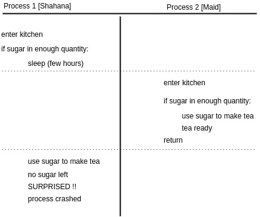

# 检查时间到使用时间(TOCTOU):一种竞争条件

> 原文：<https://medium.com/hackernoon/time-of-check-to-time-of-use-toctou-a-race-condition-99c2311bd9fc>

Race condition

为了更好地理解这个概念，对这个主题的解释从一个真实生活中的例子开始。

这是下午，当约翰去办公室，他告诉他的妻子莎哈娜，他将在晚上 5:00。他告诉她到时候把茶准备好。

莎哈娜照顾她的丈夫。所以她做的第一件事是检查泡茶所需的所有材料是否都在。一切都很好，除了糖，糖的量少一些，但足以为她的丈夫泡茶。

她感到很满足，在她丈夫来之前睡了几个小时。当她睡觉的时候，他们的女仆来了，做她的日常家务。

完成任务后，她觉得累了，所以她想喝杯茶。通常，她在使用厨房里的任何东西之前都会问莎哈娜，但是，因为莎哈娜正在睡觉，她继续为自己泡了一杯茶。

她看到厨房里备有泡茶所需的一切。几分钟后茶就准备好了。她喝完就走了。

至此，故事看起来有点简单，但问题现在开始了。

莎哈娜醒了，因为她确信每种成分都有足够的量泡茶，她开始泡茶。

在制作过程中间，她意识到糖不在那里。
天啊！！

她现在该做什么？

这就是 TOCTOU(检查时间到更新时间)概念的由来。

## 什么是*托头*？

维基百科称

> 在软件开发中，从检查时间到使用时间(TOCTTOU 或 TOCTOU，发音为“TOCK too”)是一类软件错误，由系统在检查条件(如安全凭证)和使用检查结果之间的变化引起。这是竞争条件的一个例子。

TOCTOU 指出，如果在某个进程检查某个条件的时刻和同一进程基于该条件采取行动的时刻之间，系统的状态发生变化，就会出现竞争条件。

**上面写的例子有什么关系？**

Race condition

如果我们看到上面的例子，shahana 和 maid 是两个试图访问一个公共资源的进程，这个资源就是 **sugar** 。

当单个资源(对象/变量)被多个进程访问和修改时，在并发编程环境中也会出现同样的情况。

*操作系统可以暂停正在运行的进程，允许另一个进程使用 CPU 一段时间。*

现在可能发生的情况是，新的进程也正在修改被前一个进程访问的同一资源，因此发生争用情况的机会爆发了！！

如果你喜欢这篇文章，请点击♥按钮，这样其他媒体用户可能会发现它，也会喜欢它。