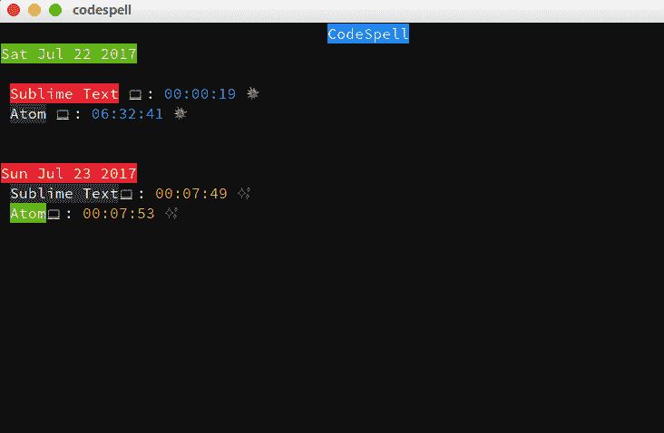

# 编程顿悟花费的时间

> 原文：<https://medium.com/hackernoon/time-spent-programming-epiphanies-c29a4800e0bb>

## 这不仅仅是提交计数

我把自己定位为*的初级开发人员，试图在社区中安顿下来，与在我之前破解了“代码”的人一起工作，努力，坚持，并到达我想去的地方。*

*我每天做的最重要的事情之一就是醒来后相信我能做到。当然，另一件重要的事情是启动我最喜欢的编辑器，开始编程我的顿悟。*

*我闺蜜的闺蜜有个规矩:她不算去过多少地方。相反，她会计算自己在那里度过的时间。*

*当我问她这背后的哲学是什么时，她说，*

> *60 秒听起来超过 1 分钟。*

*我们还是孩子，我不知道她想表达什么意思，所以我耸耸肩说:“真是废话，你数学不及格多少次了？”*

**

*[Tenor](http://Tenor.com) | ***Modern Family****

*所有这些东西都伴随着你，当你准备好的时候，它们就像曳光弹一样击中你。*

*当我意识到她真正的意思时，我决定为开发人员制作一个工具来记录他们花了多少小时/分钟/秒来编程。*

> ****代码简介****

*CodeSpell 是一个简单的 node.js **CLI** 工具，它可以帮助你“记录花在编程顿悟上的时间”,这只是我用来向我的朋友描述我在生活中所做的事情的一个花哨术语。*

*一旦安装完毕，你可以使用 npm 或 yarn(🎉)，你可以在一个终端里开火`codespell`，看着你无形的一天活过来。*

**

*[CodeSpell](https://github.com/abhisheksoni27/codespell)*

*除了为所有打开的编辑器显示一个正在运行的计时器，它还优雅地输出前一天的时间跨度。(只是 **JSON** 。你可以自己看，对吧？)*

*这有助于我获得自信，因为我可能不会每周收到 10 个 pull 请求，但我肯定会看到周二我花了 10 个小时制作一个工具。*

*它在，是的，Github 上，特此征集贡献者和 bug 捕捉者。 [codespell — Github](https://github.com/abhisheksoni27/codespell) 🎉*

****注意:*** Windows 还不支持(*嗯*)，还没！但是很快就要到了。比你从澳大利亚订购的还要快。*