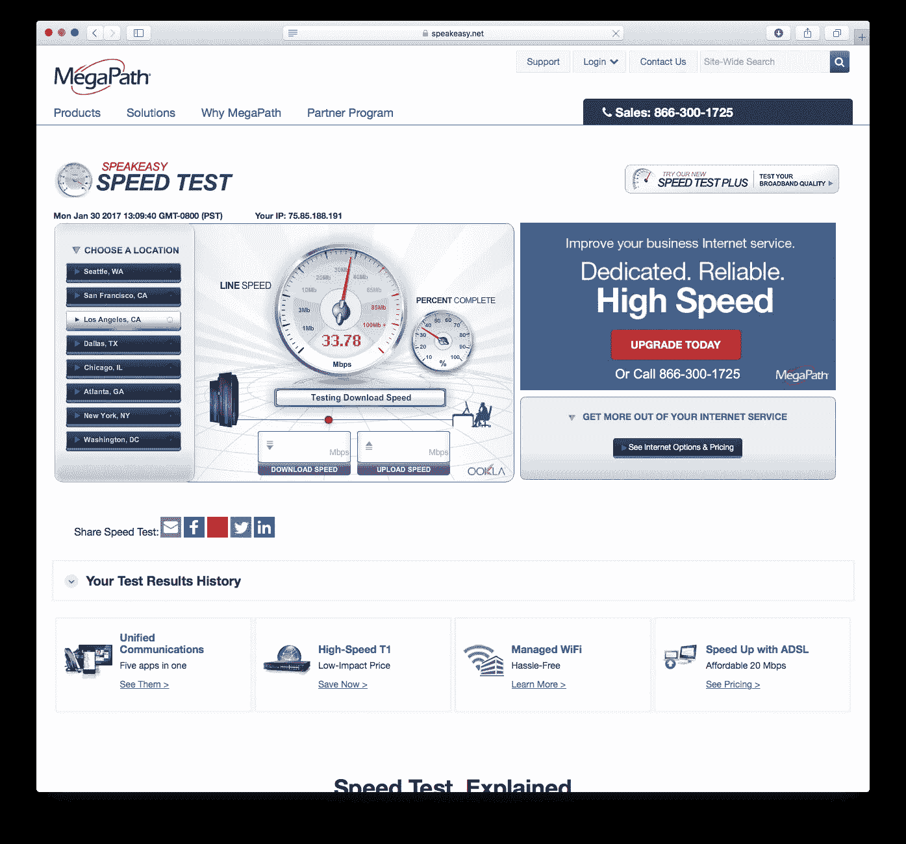
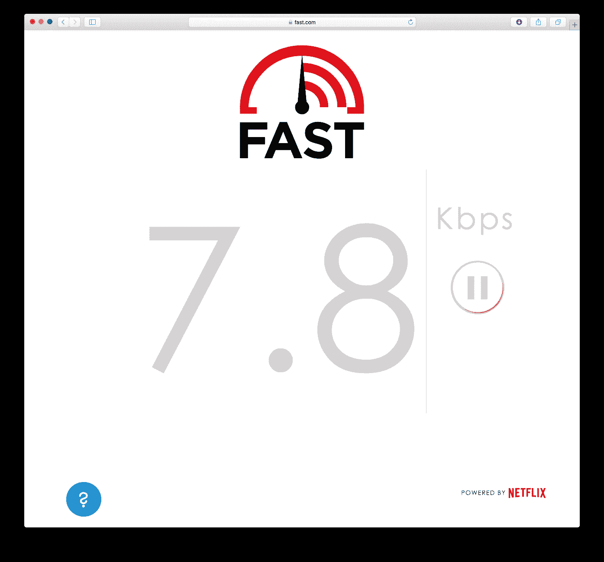

# 时代华纳有线对 CDN 流量并不中立

> 原文：<https://medium.com/hackernoon/time-warner-cable-is-not-neutral-toward-cdn-traffic-8becc758c07c>

我是时代华纳有线(TWC)有线互联网用户。我每月支付 100 美元来购买我所在地区最快的网速。我的 Eero wifi 路由器会定期报告速度高达 130 Mbps 和 30 Mbps，这将是伟大的。

然而，我经常遇到家庭网络上的视频流的缓冲问题。网飞秀，iTunes 上的电影，最令人沮丧的是，Instagram 上的视频都经历了可怕的加载时间，缓冲，掉线等。

我注意到，基本上任何从内容分发网络(CDN)获得的数据都会遇到这些问题，而从其他来源获得的流量则没有问题。作为证据，我可以从 Speakeasy 的速度测试中展示大约 30Mbps 的速度:

…而 10 秒钟后，网飞的 Fast.com 显示 7.8 kbps:

第三级 TWC 技术支持人员坚持认为问题出在我的本地网络上。我已经经历了三个调制解调器，和 3 个高端路由器(目前在一个 Eero 上)，所有的设置显示完全相同的问题。**有人能提出为什么我的本地网络会将 CDN 流量与其他互联网流量区别对待吗？这可能吗？**

如果我说这个问题出在 TWC 的网络上是正确的，这本质上是对网络中立性的侵犯，即使这是无意的。我认为，如果最常见的互联网流量来源(网飞)正在经历 7.8 kbps 的下降，宣传 80 Mbps 的下降是不公平的。

> [黑客中午](http://bit.ly/Hackernoon)是黑客如何开始他们的下午。我们是 [@AMI](http://bit.ly/atAMIatAMI) 家庭的一员。我们现在[接受投稿](http://bit.ly/hackernoonsubmission)并乐意[讨论广告&赞助](mailto:partners@amipublications.com)机会。
> 
> 如果你喜欢这个故事，我们推荐你阅读我们的[最新科技故事](http://bit.ly/hackernoonlatestt)和[趋势科技故事](https://hackernoon.com/trending)。直到下一次，不要把世界的现实想当然！

