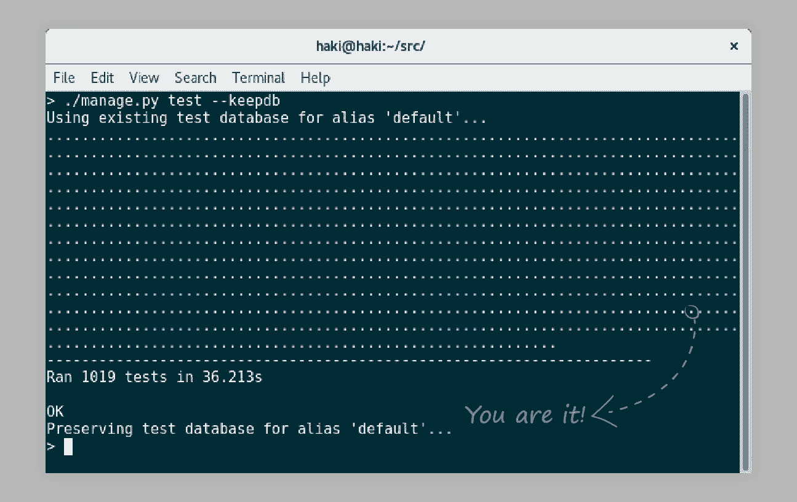

# 为了乐趣和利益用 Python 进行计时测试

> 原文：<https://medium.com/hackernoon/timing-tests-in-python-for-fun-and-profit-1663144571>

## 因为提高测试性能的第一步是意识！

为了更好的阅读体验，请在我的网站上查看[这篇文章。](https://hakibenita.com/timing-tests-in-python-for-fun-and-profit)

几天前我正准备推动一些改变，像往常一样，我进行了测试。当这些点在屏幕上快速移动时，我坐回到椅子上，突然我注意到其中一个点还在徘徊。“操作系统可能正在后台运行一些更新或什么的”我对自己说，并再次运行测试只是为了确认。我仔细看着这些点填满了屏幕，它又出现了——**我有一个慢速测试**！



**Can you spot the slow test? Neither can I…**

**我们将通过报告耗时超过某个阈值的测试来追踪缓慢的测试。**

# 基础知识

为了开始，让我们创建一个简单的测试用例，包括一个快速测试和一个慢速测试:

```
import time
import unittestclass **SlowTestCase**(unittest.TestCase): def **test_should_run_fast**(self):
        self.assertEqual(1, 1) def **test_should_run_slow**(self):
time.sleep(0.5)        self.assertEqual(1, 1)
```

从命令行运行此脚本会产生以下输出:

```
> python -m unittest timing.py
..
Ran 2 tests in 0.502s**OK**
```

对不起 unittest，但是**这个** **肯定不行** —两次测试 0.5s？

为了找出哪些测试很慢，我们需要**测量每个测试执行**所花费的时间。

python 单元测试。TestCase 有按以下顺序执行的钩子:

```
> setUpClass
    > setUp
        > test_*
    > tearDown
> tearDownClass
```

如果我们想对单个测试(test_*)计时，我们需要在设置中启动一个计时器，并在拆卸时停止它:

```
import time
import unittestclass SlowTestCase(unittest.TestCase): ** def setUp(self):
        self._started_at = time.time()** **def tearDown(self):
        elapsed = time.time() - self._started_at
        print('{} ({}s)'.format(self.id(), round(elapsed, 2)))** def test_should_run_fast(self):
        self.assertEqual(1, 1) def test_should_run_slow(self):
        time.sleep(0.5)
        self.assertEqual(1, 1)
```

这会产生以下输出:

```
> python -m unittest timing.py__main__.SlowTestCase.test_should_run_fast (0.0s)
.__main__.SlowTestCase.test_should_run_slow (0.5s)
.Ran 2 tests in 0.503s
OK
```

太好了！我们得到了每次测试的时间，但我们真正想要的是**那些慢的**。

假设慢速测试是指耗时超过 0.3 秒的测试:

```
**SLOW_TEST_THRESHOLD = 0.3**class SlowTestCase(unittest.TestCase):
    …
    def tearDown(self):
        elapsed = time.time() - self._started_at
        **if elapsed > SLOW_TEST_THRESHOLD:**
            print('{} ({}s)'.format(self.id(), round(elapsed, 2)))
```

输出是:

```
> python -m unittest timing.py 
.__main__.SlowTestCase.test_should_run_slow (0.5s)
.
Ran 2 tests in 0.503sOK
```

厉害！我们完全得到了我们想要的，但它仍然是不完整的。我们是优秀的开发人员，所以我们很可能非常懒。我们不想到处去更新每个测试用例— **我们需要一个更健壮的解决方案**。

# 跑步者

**TestRunner** 的作用之一是将测试结果打印到输出流中。运行程序使用一个 **TestResult** 对象来格式化结果。unittest 模块自带默认的[**TextTestRunner**](https://docs.python.org/3/library/unittest.html#unittest.TextTestRunner)**和[**TextTestResult**](https://docs.python.org/3/library/unittest.html#unittest.TextTestResult)。**

**让我们实现一个定制的 TestResult 来报告缓慢的测试:**

```
import time
from unittest.runner import TextTestResultSLOW_TEST_THRESHOLD = 0.3class **TimeLoggingTestResult**(**TextTestResult**): def **startTest**(self, test):
        self._started_at = time.time()
        super().startTest(test) def **addSuccess**(self, test):
        elapsed = time.time() - self._started_at
        if elapsed > SLOW_TEST_THRESHOLD:
            name = self.getDescription(test)
            self.stream.write(
                "\n{} ({:.03}s)\n".format(
                    name, elapsed))
        super().addSuccess(test)
```

**几乎与我们已经拥有的相同，但使用了**不同的挂钩—** 我们使用 testStart 代替 setUp，使用 addSuccess 代替 tearDown。**

**内置的 TextTestRunner 使用 TextTestResult。为了使用不同的测试结果，我们用我们的 Runner 创建了一个 **TextTestRunner** 的实例:**

```
from unittest import TextTestRunnerif __name__ == '__main__':
    test_runner = **TextTestRunner**(**resultclass=TimeLoggingTestResult**)
    unittest.main(**testRunner=test_runner**)
```

**输出是:**

```
> python runner.py
.
test_should_run_slow (__main__.SlowTestCase) (0.501s)
.
Ran 2 tests in 0.501sOK
```

**我们得到了一份很好的报告**，而不需要对现有的测试用例做任何改变**。**

****盈利！****

# **我们能做得更好吗？**

**现在我们有一堆信息散布在屏幕上随机的地方。如果我们可以通过所有的慢速测试得到一个好的报告呢？嗯，我们可以！**

**让我们从让我们的测试结果存储计时而不报告计时开始:**

```
import time
from unittest.runner import TextTestResultclass TimeLoggingTestResult(TextTestResult):
    def __init__(self, *args, **kwargs):
        super().__init__(*args, **kwargs)
 **self.test_timings = []** def startTest(self, test):
        self._test_started_at = time.time()
        super().startTest(test) def addSuccess(self, test):
        elapsed = time.time() - self._test_started_at
        name = self.getDescription(test)
 **self.test_timings.append((name, elapsed))**        super().addSuccess(test) **def getTestTimings(self):
        return self.test_timings**
```

**测试结果现在包含一个元组列表，其中包含测试名称和运行时间。转到我们的定制 TestRunner:**

```
import unittestclass TimeLoggingTestRunner(unittest.TextTestRunner):

    def **__init__**(self, slow_test_threshold=0.3, *args, **kwargs):
 **self.slow_test_threshold = slow_test_threshold**        return super().__init__(
            **resultclass=TimeLoggingTestResult**,
            *args,
            **kwargs,
        ) def **run**(self, test):
        result = super().run(test) self.stream.writeln(
            "\nSlow Tests (>{:.03}s):".format(
                self.slow_test_threshold)) **for name, elapsed in result.getTestTimings():
            if elapsed > self.slow_test_threshold:
                self.stream.writeln(
                    "({:.03}s) {}".format(
                        elapsed, name))**return result
```

**让我们来分解一下:**

*   **我们已经用 init 的一个参数替换了 SLOW _ TEST _ THRESHOLD 更加简洁。**
*   **我们已经设置了适当的 TestResult 类。**
*   **我们已经覆盖了 run 并添加了自定义“慢速测试”报告。**

**这是输出的样子(我添加了一些缓慢的测试来说明):**

```
> python timing.py
.....
Ran 5 tests in 1.706sOK**Slow Tests (>0.3s):
(0.501s) test_should_run_slow (__main__.SlowTestCase)
(0.802s) test_should_run_very_slow (__main__.SlowTestCase)
(0.301s) test_should_run_slow_enough (__main__.SlowTestCase)**
```

**现在我们有了时间数据，我们可以用它来生成有趣的报告。我们可以按运行时间排序，显示潜在的时间减少，并突出显示缓慢的测试。**

# **这个怎么和 Django 一起用？**

**Django 有自己的测试程序，所以我们需要做一些调整:**

```
# common/test/runner.py**from django.test.runner import DiscoverRunner**class TimeLoggingTestRunner(DiscoverRunner):
    def **get_resultclass**(self):
        return TimeLoggingTestResult
```

**为了让 Django 使用我们的定制 runner，我们设置了以下内容:**

```
# settings.py**TEST_RUNNER** = ‘common.tests.runner.TimeLoggingTestRunner
```

# **最后的话**

**快去做些测试吧！**

**[](http://bit.ly/HackernoonFB)****[](https://goo.gl/k7XYbx)****[](https://goo.gl/4ofytp)**

> **[黑客中午](http://bit.ly/Hackernoon)是黑客如何开始他们的下午。我们是 [@AMI](http://bit.ly/atAMIatAMI) 家庭的一员。我们现在[接受投稿](http://bit.ly/hackernoonsubmission)并乐意[讨论广告&赞助](mailto:partners@amipublications.com)机会。**
> 
> **如果你喜欢这个故事，我们推荐你阅读我们的[最新科技故事](http://bit.ly/hackernoonlatestt)和[趋势科技故事](https://hackernoon.com/trending)。直到下一次，不要把世界的现实想当然！**

**[](https://goo.gl/Ahtev1)**