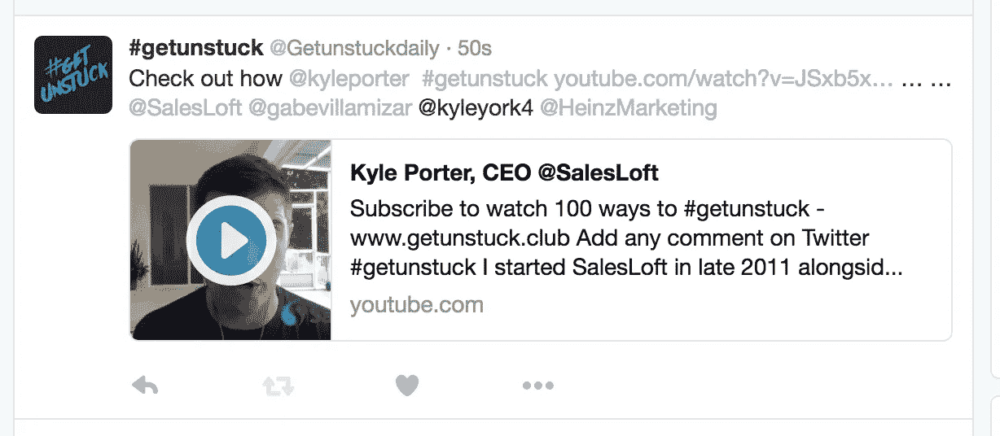

# TINT 案例研究 hacks —销售千禧一代# getunstuck 活动今天启动

> 原文：<https://medium.com/hackernoon/tint-case-study-hacks-sales-millennials-getunstuck-campaign-launches-today-1a4f75439afd>

Originally published at www.Tintup.com/casestudy — April 13, 2016

# getunstuck 是大规模销售视频微辅导，今天发布。

这是同类活动中规模最大的一次:由销售和商业领域的思想领袖发起，面向有抱负的新一代精英。这场运动让千禧一代的销售人员能够# getunstuck 并分享他们自己的故事。

**今天销售人员的挑战:**

*认知与现实:*对销售人员的一个传统认知是，他们完全是受金钱驱动的，会不择手段达成交易。销售作为一种职业正在发生变化——当前商业环境的现实是，销售人员不断寻求成就感，通过磨练自己的技能来提升自己。尽管普遍认为，销售是一个非常复杂的学科，可能是一种充满障碍的非常孤独的生活方式。

*大规模的指导:*在浩如烟海的互联网内容中寻找优质的[互联网内容](https://hackernoon.com/tagged/internet)颇具挑战性。销售人员希望有一个导师的感觉，一个与他们分享智慧金块的人，但当他们日复一日地做销售工作时，找到这种有价值的洞察力并不容易。我们通过将空前数量的最聪明的头脑聚集在一起，将他们所有的精华智慧聚集在一个地方，来提供这种大规模的指导。

*千禧一代如何消费内容？销售人员不是在寻找长篇文章来提升自己。我们消费内容的方式已经改变——我们选择了 60 秒的形式，以真正适合千禧一代的观众。*

**解决方案:提高# getunstuck 对 TINT 网络显示解决方案的认知度和参与度。**

为了发起该活动，我们联系了顶级销售思想领袖，并已开始在 [www.getunstuck.club](http://www.getunstuck.club) 上接收社区提交的内容。

参与的公司包括 SalesLoft、Marin Software、CenturyLink、Influitive、SAP、Fastly、Tint、Hubspot、Salesforce、UC Berkeley Extension、LeanData、HackerRank、HireVue、Dyn、TalentBin、Reward Gateway、Birst 等等。

以及我们最喜欢的来自可预测收入的思想领袖、销售人员、Score More Sales、Sales Pro Insider、Heinz [Marketing](https://hackernoon.com/tagged/marketing) 、销售培训师、销售黑客、Harris Consulting、Creation Agency、Sales-Shake 等等。

为了提高参与度，我们将在@getunstuckdaily 上围绕当天的特色视频开展#getunstuck daily tweet 讨论。

> *“TINT 使我们能够团结顶级销售领导，为下一代销售企业家分享智慧。”——布兰科·塞尔尼，Immediately 的首席执行官/联合创始人*

**TINT 已允许# getunstack:**

*   在 Twitter、YouTube 和 LinkedIn 上发现并增加顶级销售社区成员的参与度。
*   聚合和管理真实的视频内容，并在社交媒体和参与者的社交渠道上进行分享和再分享。
*   团结世界各地的销售领导，加入**[**www . getunstack . club**](http://www.getunstuck.club)上的运动，为销售人员赋能**

****如何使用# getunstuck 色调:****

**为了使用 TINT，# getunstuck 必须将收集的视频上传到 Youtube 播放列表上，名为“getunstack”。为了连接 Youtube 内容，我们利用 TINT 来聚合私人播放列表，并选择在公开之前**手动批准帖子。控制视频何时上线是很有价值的，因为一场运动不会在一夜之间发生。为了发起一场运动，我们必须及时、有策略地发布视频。****

**就我个人而言，我从 2013 年开始使用 Tint，它帮助我的项目节省了超过 5 万美元的总开发成本。TINT 帮助我们的项目像对待皇室一样对待每一个社会职位**

**W [*我们很高兴在活动结束后的后续帖子中分享结果，这样你就可以学习最佳策略了！*](http://www.getunstuck.club)**

**今天就通过上传你的社区视频到[Twitter](https://clicktotweet.com/cY42f)@ getunstackdaily 来加入这场运动吧。告诉我们你是如何在日常销售过程中摆脱困境的。**

************

> **[黑客中午](http://bit.ly/Hackernoon)是黑客如何开始他们的下午。我们是这个家庭的一员。我们现在[接受投稿](http://bit.ly/hackernoonsubmission)并乐意[讨论广告&赞助](mailto:partners@amipublications.com)机会。**
> 
> **如果你喜欢这个故事，我们推荐你阅读我们的[最新科技故事](http://bit.ly/hackernoonlatestt)和[趋势科技故事](https://hackernoon.com/trending)。直到下一次，不要把世界的现实想当然！**

****