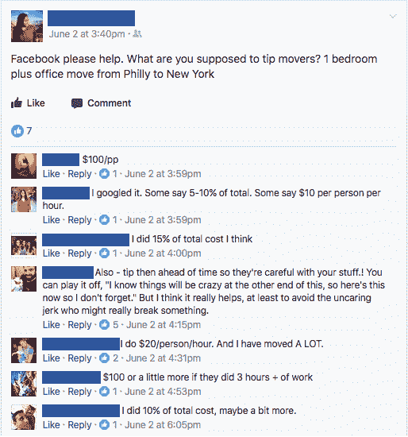

# “小费是一个奇怪的混乱系统”

> 原文：<https://medium.com/hackernoon/tipping-is-this-bizarre-mess-of-a-system-205a383be176>

## 核桃的每一个动作中都包含了小技巧，但这种做法可持续吗？

我已经搬到 Substack 了。 [**在这里订阅我的新帖子**](https://www.addtheegg.com/) **。**

> 这是一个跟进核桃，一个[创业](https://hackernoon.com/tagged/startup)搬家公司的试水。如果这是您第一次听说核桃，我们建议您从这里开始:
> 
> [“说真的，搬家公司？”](/startup-grind/seriously-a-moving-company-95568bc01117) — [尼克·金](https://medium.com/u/b08ea5afc5c6?source=post_page-----205a383be176--------------------------------)
> [核桃简介](/@dylankindler/an-introduction-to-walnut-febb4eebe84a) — [迪伦·金德勒](https://medium.com/u/ce57d122310a?source=post_page-----205a383be176--------------------------------)
> 
> 谢谢，尼克和迪伦
> 
> 更新:[为什么我们要关闭核桃](/@nickbkim/why-were-closing-walnut-a452225e7127)

在大多数服务行业，小费是客户定价和员工工资的基础，但这对双方来说都是一个破碎的系统。在 Walnut，我们已经取消了给小费，每个人都喜欢这种改变。不幸的是，它可能会以不可持续的方式影响我们的[商业模式。](https://hackernoon.com/tagged/business)

Even Kevin McCallister isn’t safe from the awkward linger (YouTube)

> “在某个时候，美国决定，消费者，而不是雇主，应该支付服务雇员的工资……**从那以后，这个体系就一直是这个奇怪的混乱局面。”**
> 
> —蒂姆·厄本， [*关于小费你不知道的一切*](https://waitbutwhy.com/2014/04/everything-dont-know-tipping.html)

到处都是 ipping。从酒店、餐厅、沙龙到服务员，几乎所有消费服务行业的员工都将小费作为工资的一部分。这个系统在很多方面都失败了:

## **倾斜有偏差**

不足为奇的是，研究人员发现漂亮的女服务员会收到更多的小费。不幸的是，偏见也会从另一个方向影响服务关系:员工可能会基于对他们小费行为的刻板印象而区别对待顾客。

## 小费是不可预测的

有些顾客给很多小费，有些给很少。收入更多的是运气，而不是服务质量。为了规划他们的生活，员工应该每周都得到公平一致的报酬。

## 小费是有压力的

给小费对顾客来说也是一种负担和困惑。为什么没有员工表现历史的人应该决定他们的工资？在大多数情况下，客户也不想承担这种责任。

## **给小费很尴尬**

给现金小费更好吗？给多少小费合适？如果员工和客户对服务质量有异议，会发生什么？有很多尴尬的沉默让双方都感到困惑和沮丧。

# “请帮帮忙”

小费尤其让搬家行业失望。每个人都有不同的想法:

For a three-hour move, tips could range from $30 to $100 per person!

这段简短的对话说明了为什么搬家时小费问题被夸大了。不像在已经建立规范的餐馆，人们不知道如何给搬运工小费。困惑的顾客导致沮丧的员工，而且很少有任何一方对交易感觉良好。两败俱伤。

在这种环境下，很明显为什么搬运工的工作方式可能会不同——这种不一致很自然地暴露了他们对小费的偏见。在最糟糕的情况下，他们会因为小费而彻底破坏客户关系。

我们从客户那里听说，其他搬运工大声表达了对他们每小时工资的不满，试图获得更多的小费:“我没有得到足够的小费。”其他人对客户的工作订单玩游戏:“这个沙发不在库存清单上，但如果你给我们 100 美元，我们会为你搬家。”有些人甚至拒绝离开，直到他们收到更多的小费！

这些问题都出现在我们的客户调查中。这就是为什么，在我们今年夏天的测试发布中，我们在每一个核桃移动的标价中都包含了提示。通过这种方式，我们的客户在搬家结束时可以避免尴尬的现金交易，我们的团队可以获得更高、更稳定的基本工资。

看起来是双赢，对吧？不完全是。

# 改变消费者的行为几乎是不可能的

我们付给搬家公司的基本工资比其他搬家公司多 15%,通常，他们会在搬家那天拒绝给小费。我们面试和雇佣的每个人都喜欢这种方法，但它带来了一个新的挑战:*当没有其他公司提供小费时，我们如何在基本价格上增加小费？*

虽然标价不同，但今年夏天，胡桃的价格和其他公司的价格差不多。对于另一家公司 1000 美元的报价，我们可以报 1150 美元，包括小费。普通的 150 美元小费，这些动作的价格是一样的。谁不会选择一种[式的好客体验](/@nickbkim/breaking-the-rules-by-design-6db486b9cf17)，没有尴尬的现金交易，价格与传统公司相同？

事实证明很多人。我们的小费政策基于这样一种信念，即顾客会认为上述两种选择是平等的。这是一个错误的假设。

## **一个真实的例子**

> 7 月份，我们向某人报价 1195 美元，买了一套大的一居室。她要求我们匹配她在别处得到的 1100 美元的报价，我们解释说我们向每一位顾客提供最优惠的价格，而且**的小费已经包含在价格**中。她只是停止了回应。她可能比买核桃花了更多的钱，但她选择了标价更低的公司。

心理学家可能已经预测到了这一点。有了这么多低成本、低服务的选择，[锚定偏差](https://en.wikipedia.org/wiki/Anchoring)可能会人为地设定较低的价格预期。购物者可能会用困难的问题来代替:“我总共要为我的举动支付多少钱？”用更简单的问题，“哪个报价更低？”

此外，目前还不清楚，即使是核桃的付费客户是否欣赏这种包含小费的政策。我们已经看到，85%的核桃顾客在行动结束时仍会尝试给小费。当我们拒绝小费时，他们认为他们在省钱。

这意味着两件事之一:

1.  小费包括在内的政策不明确也不可信。客户不知道，忘记了，或者说我们说包含了客户也不相信。或者，
2.  包含小费的政策无关紧要。顾客知道它，也相信它，但无论如何还是要给小费，只要不是烤到报价里。

如果我们的小费包含政策没有考虑到购物过程，如果它没有为客户的体验增加价值，它就不是核桃的差异化因素。在这种环境下，我们靠标价竞争。我们不能。

核桃公司的商业模式依赖于从基本价格中收集小费。在我们的商业模式中，当向我们的团队收取相同的基本价格并支付更高的基本工资时，很难甚至不可能盈利。

# 所以…我们应该接受小费？

取消小费客观上是对顾客和员工更好的体验。它一次又一次地出现在调查、采访以及我们对该行业所做的任何其他研究中。我们还特意着手创造最佳的搬家体验。我们怎么能忽视我们的发现呢？

但是，如果我们不能改变给搬运工小费的消费者行为，我们的免小费模式还能继续吗？这是否会以牺牲我们为员工提供良好、可靠工资的能力为代价？

这给我们留下了一个令人不安的问题:如果这种模式不起作用，我们不就成了另一家搬家公司了吗？

# 关于核桃

> 更新:[为什么我们要关闭核桃](/@nickbkim/why-were-closing-walnut-a452225e7127)
> 
> 我们开始了解我们是否能成为第一个搬家的酒店品牌。一个伟大的搬家公司不应该像匿名运输和物流公司那样简单地执行交易。我们的目标是与顾客建立关系，改变他们对搬家的感觉。
> 
> ***如果你要搬到纽约或纽约周边地区，请填写这张*** [***搬家路线图***](http://bit.ly/2v7v5sU) ***，以便我们更好地了解你。只说你好，电邮我们在***[***nick@walnuthome.com***](mailto:nick@walnuthome.com)***或***[***dylan@walnuthome.com***](mailto:dylan@walnuthome.com)***。***
> 
> *加入* [*我们的邮件列表*](https://www.walnuthome.com) *关注我们的故事！*
> 
> *谢谢，
> 尼克&迪伦*

