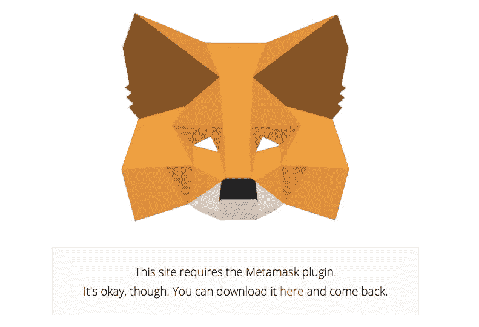

# 向用户界面添加元掩码的提示和技巧

> 原文：<https://medium.com/hackernoon/tips-and-tricks-for-adding-metamask-to-your-ui-32728b437194>



在过去的几周里，我一直在开发一款[以太坊应用](https://hackernoon.com/getting-started-as-an-ethereum-web-developer-9a2a4ab47baf)，它使用[元掩码](https://metamask.io/)进行用户管理，就像我[说过的那样](https://hackernoon.com/never-use-passwords-again-with-ethereum-and-metamask-b61c7e409f0d)。总的来说，这是一次不痛不痒的经历，但是我发现了一些我想分享的问题。希望这将在未来节省一些开发人员的时间。


## 1.确保您的以太坊客户端是最新的

我的第一个障碍来自我在交易弹出窗口中发现的一个错误。出于某种原因，当我点击“接受”发送我的交易时，迎接我的是一个不停旋转的橙色圆圈。展开弹出窗口的控制台后，我看到:

```
AssertionError: The field v must have byte length of 1 at FakeTransaction.setter [as v]
```

嗯……那是什么意思？

我在 slack 上 pinged 了 Kumavis，他告诉我这与最近刚刚得到支持的 [EIP155](https://github.com/ethereum/eips/issues/155) 有关。任何旧版本的 testrpc 都缺乏这种支持，所以我进行了升级，一切正常:

```
npm i -g ethereumjs-testrpc
```

## 2.每次重新启动 testrpc 时重置网络

又一个 testrpc 问题！一旦你打开[元掩码](https://hackernoon.com/tagged/metamask)并输入你的密码，你就连接到那个提供商了。如果您切换提供商(例如从 main net 切换到 kovan)并刷新页面，将重置您的连接，您需要再次输入密码。

但是如果重置 testrpc 会发生什么呢？你应该还在听`localhost:8545`，但是你会发现一旦你刷新页面，事情看起来就不对了。事实上，事情会看起来非常非常不对劲。

这是因为 metamask 正在跟踪块号，当您重新启动 testrpc 时，该号将重置为零。这是导致灾难的原因。幸运的是，有一个相对简单的方法可以避免这种情况:每当您重启 testrpc 时，打开 metamask 并重新选择`localhost:8545`作为您的提供者。现在刷新你的页面，点击 metamask，输入你的密码。瞧啊。您连接到了新的 testrpc 实例。

## 3.始终检查 web3 的类型

如果你没有正确检查 web3，你的应用可能会遇到竞争情况。如果你试图在 web3 注入之前渲染你的实际应用，一切都会崩溃。因此，我强烈建议您的应用程序的着陆组件使用如下内容(我假设您正在使用 react):

```
if (typeof web3 == 'undefined') {
  return (
    <NoMetamask/>
  );
} else if (web3.version.network == 'loading') {
  return (
    <WrongNetwork/>
  );
} else {
  return (
    <Landing/>
  );
}
```

请注意，检查`if (web3 !== undefined)`或`if (web3)`或任何等效的*将不起作用*。你需要比较`typeof`注入的 web3 对象。

## 4.将所有元掩码调用打包到一个 util 文件中

这可能是开发人员的偏好，但我强烈建议将所有元掩码调用抽象到一个文件中，因为您会发现自己会大量重用元掩码调用。与其以后折叠一堆相同函数的 copypasta 版本，为什么不从您的`util`目录中的一个元掩码文件开始呢？不要担心没有访问`web3`的权限:它只是一个 javascript 对象，你可以像传递一个烫手山芋一样传递它——它可以去任何地方！

```
// metamask.js
exports.doSomething = function(web3, param) {

  // I have access to web3, even though I'm not in the DOM!  
  const user = web3.eth.accounts[0]; // Do stuff
}
```

## 5.不要等待推进 UX！

我不敢相信我还在生产中看到这个。作为一个生态系统，我们在这方面做得更好，但我想像消灭天花一样消灭它。拜托了，各位。[以太坊](https://hackernoon.com/tagged/ethereum)有~15s 的封锁时间。在区块链世界里，这可能看起来很快，但在快速、反应式 web 应用程序的世界里，这是一生的时间。如果您使用 testrpc 进行开发，您可能会发现自己忘记了区块链有多慢。不要忘记区块链有多慢。每天大声说出来:“等待以太坊交易是不好的用户体验。”

请不要让你的用户在提交交易后无所事事。处理一个`sendTransaction`回调(它是一个事务散列)非常简单，只需将那个散列分派到一个队列中，并定期检查它的接收情况。请考虑以下情况:

```
// metamask.js
exports.doSomething = function(web3, param) {
  const user = web3.eth.accounts[0];
  web3.eth.getTransactionCount(owner, (err, nonce) => {
    // Form your tx object...
    web3.eth.sendTransaction(obj, (err, res) => {
      if (err) { cb(err); }
      else { cb(null, res); }
    })
}// component.jsx
callMetamask() {
  metamask.doSomething(web3, 'something', (err, result) => {
    if (err) { console.log('Error doing something.') }
    else { dispatch({ type: 'QUEUE_TXHASH', result: result }) }
  })
}
```

有了队列中的散列，您可以在工具栏中显示它，用户可以愉快地继续使用您的应用程序，同时等待事务通过。

*如果在改进你的 UI 之前处理交易真的很重要(你可以诚实地告诉我这是你能想到的最好的 UX 流程)，请给你的用户一些令人兴奋的东西* [*看看*](https://www.sitepoint.com/12-creative-clever-preloader-designs/)*——也许是* [*以太坊白皮书*](https://github.com/ethereum/wiki/wiki/White-Paper) *或者这只* [*带着浴帽的猫*](http://i.imgur.com/DPbRepM.gifv) *。*

## 6.是的，真的很简单

三周的重度变形面具开发，这些真的是我能想到的唯一抱怨。真的，metamask 很棒，也很容易设置。一般来说，如果你遵循了上面概述的规则/建议，并正确引用了 [web3 API](https://github.com/ethereum/wiki/wiki/JavaScript-API) ，你应该会做得很好(记住总是使用异步调用——同步调用在 metamask 中不起作用)。

如果你有一个问题，但在这里没有得到回答，我建议检查一下[以太坊栈交换](https://ethereum.stackexchange.com/)。

—

如果你喜欢我的文章，[在 twitter 上关注我](https://twitter.com/ethereum_alex)或者看看我的公司， [ConsenSys](https://twitter.com/ConsenSysLLC) ，因为我们做的东西很棒。

一如既往，我们公开邀请您加入[以太坊社区](https://www.reddit.com/r/ethereum/)，帮助我们征服世界。

[](http://bit.ly/HackernoonFB)[](https://goo.gl/k7XYbx)[](https://goo.gl/4ofytp)

> [黑客中午](http://bit.ly/Hackernoon)是黑客如何开始他们的下午。我们是阿妹家庭的一员。我们现在[接受投稿](http://bit.ly/hackernoonsubmission)并乐意[讨论广告&赞助](mailto:partners@amipublications.com)机会。
> 
> 如果你喜欢这个故事，我们推荐你阅读我们的[最新科技故事](http://bit.ly/hackernoonlatestt)和[趋势科技故事](https://hackernoon.com/trending)。直到下一次，不要把世界的现实想当然！

