# 记录和监控 AWS Lambda 函数的提示和技巧

> 原文：<https://medium.com/hackernoon/tips-and-tricks-for-logging-and-monitoring-aws-lambda-functions-885af6da29a5>

## 使用代理/守护进程来缓冲和批量发送日志和指标的常见做法在无服务器的世界中不再适用。这里有一些技巧可以帮助您最大限度地利用日志记录和监控基础设施来实现您的功能。


这是关于管理 AWS Lambda 日志的 3 部分迷你系列的第 2 部分。

如果你还没有读过第一部分，请现在读一读。我们将在这篇文章中详细描述的 CloudWatch 日志的基础设施之上构建日志。

**第一部分:** [集中伐木](/@theburningmonk/centralised-logging-for-aws-lambda-b765b7ca9152)

**第三部分:** [跟踪关联 id](/@theburningmonk/capture-and-forward-correlation-ids-through-different-lambda-event-sources-220c227c65f5)

# 新范式，新问题

无服务器模式改变了很多，它解决了我们面临的许多老问题，并用一些(我认为)更容易处理的新问题取代了它们。

因此，许多旧的实践不再适用，例如，使用代理/守护程序缓冲和批量发送指标和日志到监控和日志聚合服务。然而，即使我们为了无服务器的新世界抛弃了这些旧的实践，我们仍然在追求使我们的旧工具“好”的相同品质:

1.  能够收集丰富的系统和应用程序指标和日志
2.  发布指标和日志不应增加面向用户的延迟(即它们应该在后台执行)
3.  度量和日志应该实时出现(即几秒钟内)
4.  衡量标准应该是精细的

不幸的是，Lambda 的当前工具——cloud watch metrics 和 cloud watch Logs——在其中一些问题上失败了，有些问题比其他问题更严重:

*   发布定制指标需要在函数执行期间进行额外的网络调用，**增加了面向用户的延迟**
*   AWS 服务的 CloudWatch 指标只能精确到 1 分钟的时间间隔(自定义指标可以精确到 1 秒
*   CloudWatch 指标通常会落后几分钟(尽管自定义指标可能会有更少的延迟，因为它们可以以 1 秒的间隔记录)
*   CloudWatch 日志通常落后 10s 以上(不是精确测量，而是基于个人观察)

有了 Lambda，我们必须依靠 AWS 来改进 CloudWatch，以便让我们与现有的“全服务器”服务平起平坐。

很多厂商都宣布支持 Lambda，比如 [Datadog](https://www.datadoghq.com/blog/monitoring-lambda-functions-datadog/) 和 [Wavefront](https://www.wavefront.com/serverless-automatic-rollbacks-wavefront/) 。然而，由于他们使用的是来自 CloudWatch 的相同指标，因此会有相同的延迟。

[IOPipe](https://www.iopipe.com/) 是监控 Lambda 函数的一个流行的替代方案，它们做的事情略有不同——通过给你一个围绕你的代码的包装函数，这样它们可以注入监控代码(对于过去使用过 AOP 框架的人来说，这是一个熟悉的模式)。

对于他们的 1.0 版本，他们还宣布支持跟踪(见下面的演示视频)，我认为这很有趣，因为 AWS 已经提供了 X 射线，这是一个更完整的跟踪解决方案(尽管它有自己的缺点，正如我在[这篇文章](https://read.acloud.guru/im-here-to-tell-you-the-truth-the-good-the-bad-and-the-ugly-of-aws-x-ray-and-lambda-f212b5f332e9)中提到的)。

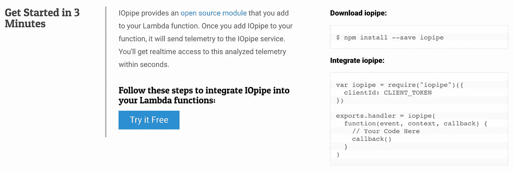

IOPipe 似乎是 CloudWatch 的一个可行替代方案，尤其是如果你是 AWS Lambda 的新手，并且只想快速入门的话。我完全明白这种简单的价值。

然而，我对 IOPipe 的方法有一些严重的保留意见:

*   包装我的每一个函数？对我的整个应用程序的这种无孔不入的访问需要大量的信任，尤其是在像这样的时候。
*   CloudWatch 异步收集日志和指标，不会增加我的函数的执行时间。但是使用 IOPipe，他们必须将指标发送到他们自己的系统，并且他们必须在我的函数执行期间这样做，因此**增加了面向用户的延迟**(对于 API)。
*   除了以上几点之外，即使在我的代码成功执行之后，还有一件事可能导致我的函数出错或超时。也许他们正在做一些聪明的事情来最小化风险，但我很难确定，我必须预见到失败。

在上述所有因素中，延迟开销是我最关心的问题。在 API 网关和 Lambda 之间，我已经不得不处理冷启动和 API 网关和 Lambda 之间的延迟。随着您的微服务架构的扩展和服务间通信数量的增加，这些延迟将进一步增加。

对于后台任务来说，这不是一个大问题，但是我编写的 Lambda 函数中有相当大一部分必须处理 HTTP 请求，我需要尽可能降低这些函数的执行时间。

[](/@theburningmonk/yubls-road-to-serverless-part-1-overview-ca348370acde) [## Yubl 的无服务器之路—第 1 部分，概述

### 这条路到此为止

medium.com](/@theburningmonk/yubls-road-to-serverless-part-1-overview-ca348370acde) 

# 异步发送自定义指标

我发现 Datadog 发送定制指标的方法非常有趣。本质上，您将自定义指标编写为 Datadog 将处理的特殊格式的日志消息(您必须为 CloudWatch 设置 IAM 权限以调用它们的函数),并将它们作为指标进行跟踪。

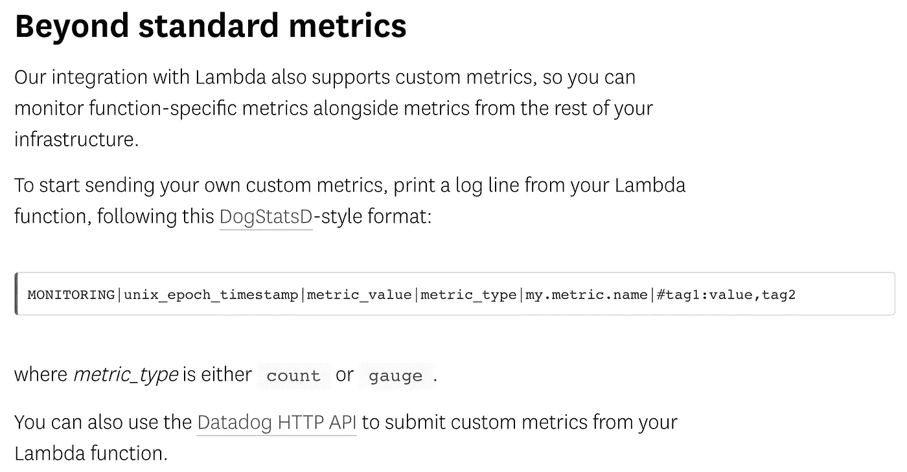

Datadog allows you to send custom metrics using log messages in their DogStatsD format.

这是一种简单而优雅的方法，即使我们决定使用另一种监控服务，我们也可以自己采用这种方法。

在第 1 部分中，我们建立了一个基础设施，将日志从 CloudWatch 日志传送到我们选择的日志聚合服务。我们可以扩展日志传送功能来查找如下所示的日志消息:

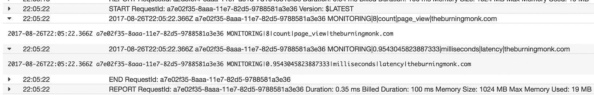

Log custom metrics as specially formatted log messages

对于这些日志消息，我们将其解释为:

```
MONITORING|metric_value|metric_unit|metric_name|metric_namespace
```

我们不会将它们发送给日志聚合服务，而是将它们作为指标发送给我们的监控服务。在这个例子中，我在演示中使用了 CloudWatch(见下面的链接)，所以日志消息的格式反映了我需要在 [PutMetricData](http://docs.aws.amazon.com/AmazonCloudWatch/latest/APIReference/API_PutMetricData.html) 调用中传递的字段。

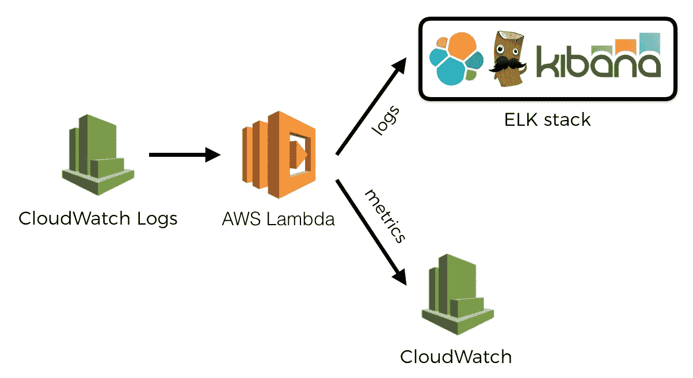

为了发送自定义指标，我们将它们作为日志消息写入。同样，**没有延迟开销**因为 Lambda 服务为我们收集这些，并在后台将它们发送到 CloudWatch。

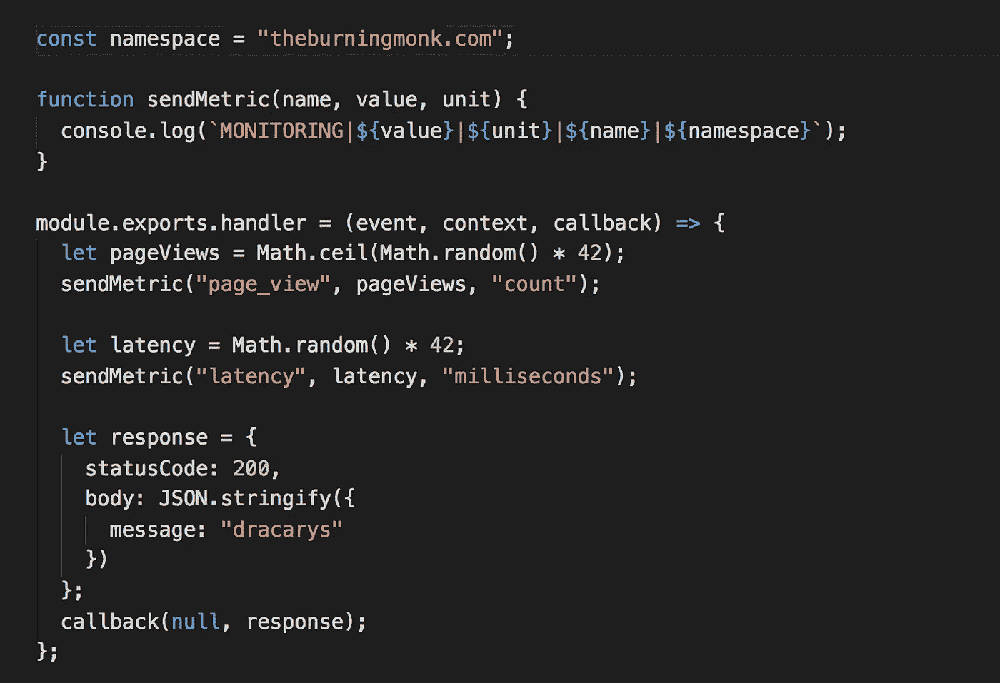

片刻之后，它们就出现在 CloudWatch metrics 中。

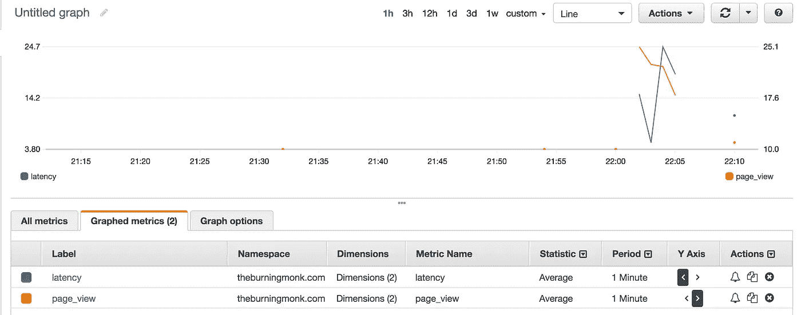

Custom metrics are recorded in CloudWatch as expected.

看看这个[回购](https://github.com/theburningmonk/lambda-logging-metrics-demo)中的`custom-metrics`函数。

[](https://github.com/theburningmonk/lambda-logging-metrics-demo) [## burning monk/lambda-记录-指标-演示

### lambda-logging-metrics-demo -如何应用 Datadog 的方法来异步发送自定义指标。

github.com](https://github.com/theburningmonk/lambda-logging-metrics-demo) 

# 在 CloudWatch 中跟踪 AWS Lambda 函数的内存使用情况和计费持续时间

Lambda 报告使用的内存量，以及每次调用结束时的计费持续时间。虽然这些在 CloudWatch 中没有作为指标发布，但是您可以在 CloudWatch 日志中找到它们作为日志消息。

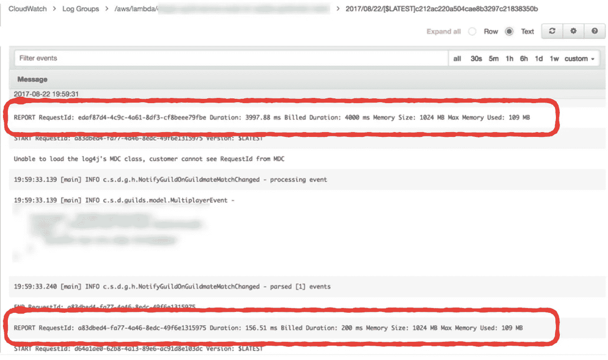

At the end of every invocation, Lambda publishes a REPORT log message detailing the max amount of memory used by your function during this invocation, and how much time is billed (Lambda charges at 100ms blocks).

我很少发现内存使用是个问题，因为 Nodejs 函数占用的内存很少。我对内存分配的选择主要是基于获得成本和性能之间的平衡。事实上，CloudAcademy 的 Alex Casalboni 写了一篇非常好的博文[介绍如何使用阶跃函数来帮助你找到最佳点。](https://serverless.com/blog/aws-lambda-power-tuning/)

[](https://serverless.com/blog/aws-lambda-power-tuning/) [## 带 AWS 阶跃函数的 AWS Lambda 功率调谐

### 在过去的几个月里，我意识到大多数使用无服务器技术的开发人员不得不依靠盲目的选择…

serverless.com](https://serverless.com/blog/aws-lambda-power-tuning/) 

另一方面，`Billed Duration`与`Invocation Duration`一起看是一个有用的指标。这让我大致了解了我的浪费量。例如，如果一个函数的平均`Invocation Duration`是 42 毫秒，但平均`Billed Duration`是 100 毫秒，那么有 58%的浪费，也许我应该考虑在较低的内存分配上运行这个函数。

有趣的是，IOPipe 将这些记录在开箱即用的仪表板中。

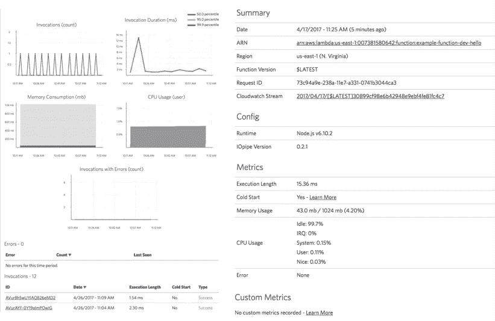

IOPipes records a number of additional metrics that are not available in CloudWatch, such as Memory Usage and CPU Usage over time, as well as coldstarts.

然而，我们不需要仅仅为了获得这些指标而添加 IOPipe。我们可以将类似的技术应用于前面的部分，并将它们作为自定义指标发布给我们的监控服务。

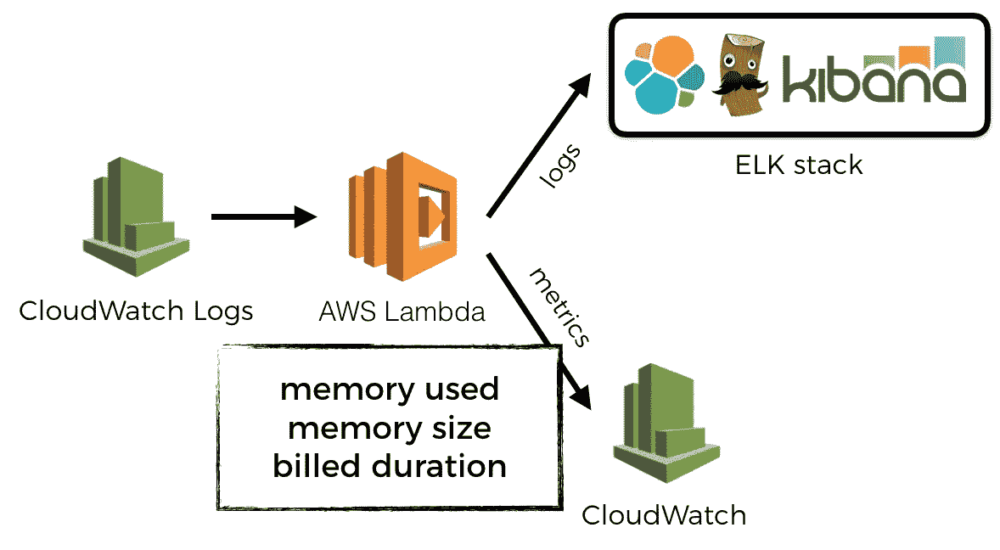

为此，我们必须寻找这些`REPORT`日志消息，并从中解析出相关信息。每条消息包含我们想要提取的 3 条信息:

*   计费持续时间(毫秒)
*   内存大小(MB)
*   使用的内存(MB)

我们将解析这些日志消息，并为每个消息返回一组 CloudWatch 指标数据，这样我们可以在以后对它们进行平面映射。

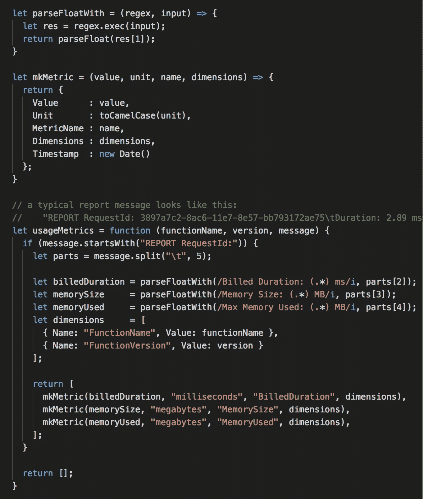

This is a function in the “parse” module, which maps a log message to an array of CloudWatch metric data.


Flat map over the CloudWatch metric data returned by the above parse.usageMetrics function and publish them.

果然，在为一个 API 订阅了日志组(在同一个演示项目中创建以测试这一点)并调用该 API 之后，我能够看到这些新的指标出现在 CloudWatch 指标中。

看这个图，也许我可以通过在更小的内存上运行它来降低成本。

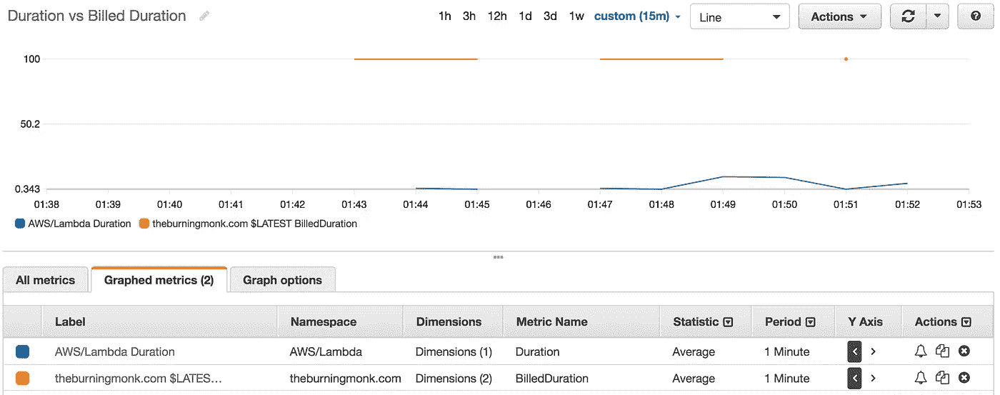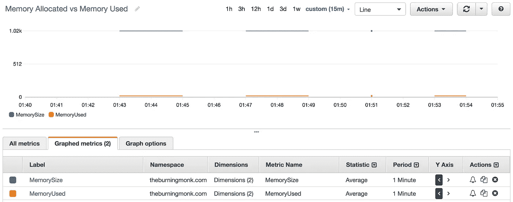

看看这个[回购](https://github.com/theburningmonk/lambda-logging-metrics-demo)中的`usage-metrics`函数。

[](https://github.com/theburningmonk/lambda-logging-metrics-demo) [## burning monk/lambda-记录-指标-演示

### lambda-logging-metrics-demo -如何应用 Datadog 的方法来异步发送自定义指标。

github.com](https://github.com/theburningmonk/lambda-logging-metrics-demo) 

# 注意并发性！

当使用 Lambda 函数处理 CloudWatch 日志时，您需要注意它所创建的并发执行的数量，以便不违反[并发执行限制](http://docs.aws.amazon.com/lambda/latest/dg/concurrent-executions.html)。

由于这是一个帐户范围的限制，这意味着您的日志传送功能可能会导致整个应用程序中的**级联故障**。关键功能可能会受到限制，因为太多的执行被用来将日志推出 CloudWatch 日志——这不是一个好办法；-)

我们需要的是一个更细粒度的 Lambda 节流机制。有一个帐户范围的限制是好的，但是我们应该能够创建一个函数池，它可以包含这个限制的一部分。例如，第 1 层功能(服务于核心业务需求的功能)获得了 90%的可用并发执行。而二级功能(商业智能、监控等。)得到另外的 10%。

就目前的情况而言，我们没有这样的功能，您所能做的最好的事情就是尽量简短地执行日志传送功能。也许这意味着在发送日志和指标时一劳永逸；或者将解码后的日志消息发送到 Kinesis 流中，这样您可以更好地控制并行性。

或者，您可能会监视这些第 2 层功能的执行计数，当每分钟的执行数超过某个阈值时，您会暂时取消日志组对日志传送功能的订阅，以缓解问题。

或者，也许你会通过将这些二级功能转移到一个单独的 AWS 帐户来安装一些隔板，并使用[跨帐户调用](https://read.iopipe.com/public-cross-account-functions-on-aws-lambda-bcc148303083)来触发它们。但是这似乎是一个解决问题的非常粗暴的方法！

[](https://read.iopipe.com/public-cross-account-functions-on-aws-lambda-bcc148303083) [## AWS Lambda 上的公共和交叉账户功能

### AWS Lambda 等无服务器平台上的公共和交叉帐户功能提供了引人注目的用例来构建非…

read.iopipe.com](https://read.iopipe.com/public-cross-account-functions-on-aws-lambda-bcc148303083) 

关键是，这不是一个已经解决的问题，我还没有找到一个令人满意的解决方法。AWS 意识到了这一差距，希望他们能增加对并发执行更好控制的支持。


嗨，我叫**崔琰**。我是一个 [**AWS 无服务器英雄**](https://aws.amazon.com/developer/community/heroes/yan-cui/) 和 [**量产无服务器**](https://bit.ly/production-ready-serverless) 的作者。我已经在 AWS 中运行了近 10 年的大规模生产工作负载，我是一名架构师或首席工程师，涉足从银行、电子商务、体育流媒体到移动游戏等多个行业。我目前是一名专注于 AWS 和无服务器的独立顾问。

你可以通过[邮箱](mailto:theburningmonk.com)、 [Twitter](https://twitter.com/theburningmonk) 和 [LinkedIn](https://www.linkedin.com/in/theburningmonk/) 联系我。

查看我的新课程，[**AWS 步骤功能完全指南**](https://theburningmonk.thinkific.com/courses/complete-guide-to-aws-step-functions) 。

在本课程中，我们将介绍有效使用 AWS Step Functions 服务所需了解的一切。包括基本概念、HTTP 和事件触发器、活动、设计模式和最佳实践。

点击获取您的副本[。](https://theburningmonk.thinkific.com/courses/complete-guide-to-aws-step-functions)


来了解 AWS Lambda: CI/CD 的操作性**最佳实践**、本地测试&调试功能、日志记录、监控、分布式跟踪、canary 部署、配置管理、认证&授权、VPC、安全性、错误处理等等。

代码 **ytcui** 还可以获得**票面价格 6 折**。

点击获取您的副本[。](https://bit.ly/production-ready-serverless)