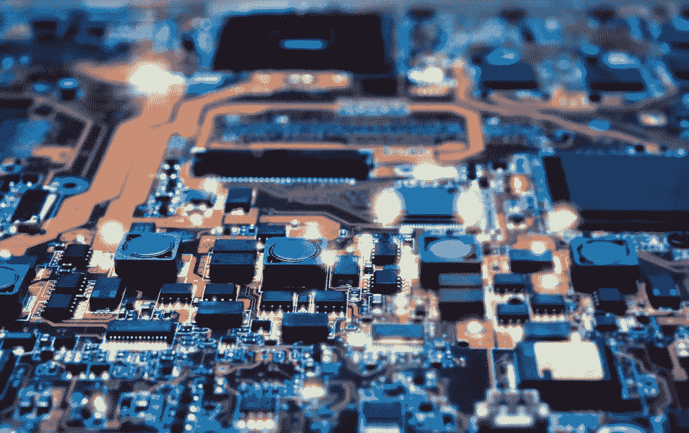

# 投资者在审查硬件产品时的提示

> 原文：<https://medium.com/hackernoon/tips-for-investors-when-vetting-a-hardware-product-11620be78b62>

*CEO 史蒂夫·迈尔斯，* [*Mindtribe*](http://www.mindtribe.com)

我在硬件方面做得很好。

每年在 Mindtribe，我们都会看到越来越多的公司进入硬件领域，致力于下一件大事。在过去的 18 个月里，我们和其中的 50 个人合作过。

有时他们是科技巨头，有时是创业公司。它涵盖了所有领域。他们都有机会创造出令人惊叹的东西。

然而，在物联网、虚拟现实和其他硬件相关趋势的背后，我们看到许多新进入该领域的人几乎没有经验或专业知识。这没什么——但这意味着每个人都必须多做一点跑腿的工作，多做一点研究。

尤其是风投和天使。

在过去的几年里，我们已经看到许多专注于软件的风投和天使投资人正在投资和推动新一轮的互联设备公司。这些风投在软件、移动或电子商务领域声名鹊起。但是他们投资的公司有一个关键的硬件组件，这是他们成功的关键。

不幸的是，我们看到太多的风投没有进行适当的尽职调查就进行投资。kickstarter 活动可能会证明产品市场适合这个想法，但他们对*定位的产品*是否可以制造——以及是否可以大规模制造——知之甚少。

这产生了两个相互交织的问题:

1.  风投和天使带着不切实际的期望进行投资
2.  公司承受着巨大的压力来满足这些期望

由于不规范的特性蔓延、意料之外的下滑和不必要的压力，这些问题很容易使产品开发失败。

无论好坏，硬件不是软件。它有较长的准备时间，而且错误很难修复。典型的硬件开发方法(以及来自不耐烦的风投的压力)也让初创公司很难在持续的开发过程中吸收和实施市场变化或学习。

在正确的基础上开始发展努力是很重要的，为此，我们需要更有见识的投资者，他们可以更好地指导公司。

我想建议的是一些尽职调查指南，让投资者透过推销的面纱，更好地审查和指导这些公司。

**投资者应该问的问题:**

以下是投资者应该问初创硬件公司的一些基本问题:

*有原型吗，可以看看吗？*

原型是走向可行产品的第一步。要求看，摸，戳洞。公司需要一个原型来进行用户研究和与制造商交流。构建互联硬件产品原型的成本从 5，000 美元(重新包装现成硬件并改变外形)到 5 万美元(连接一系列开发板、编写固件和定制机箱)不等。

如果一家公司还没有原型，你可能想从考虑一个涵盖原型开发的小天使轮开始。这将允许你投入一小笔资金，有一个非常明确的目标，然后看看团队进展如何。

有哪些发展挑战？

当构建一个在某些方面真正新颖的硬件产品时，总会有至少一个主要的技术挑战。该团队要么构建新的东西，将新的功能或技术添加到旧的东西中，要么将旧的东西构建到新的(可能更小的)外形中。这些挑战需要被识别和理解，而不是像通常那样被掩盖。

通常，挑战集中在从原型硬件到可制造产品的努力上:

*   固件:通常是拼凑起来的，不容易测试，也不是产品质量。通常它需要从头开始重新开发。
*   电子:从开发板和模块过渡到生产质量的定制电路板需要时间和金钱。
*   工业设计:许多人认为 ID 不重要，只是在产品成形时才意识到他们确实需要它。
*   制造:在没有得到制造商报价的情况下，围绕产品成本的假设。价格上涨通常需要对开发计划进行重大修改。

*你让制造商或制造专家运行过原型吗？*

制造商是产品能否问世的把关人。许多公司没有意识到制造商不太可能争夺生产他们产品的机会——事实上，公司的任务通常是*说服*制造商使用他们的生产线是值得的。制造商(或有制造专业知识的人)看过原型并提出他们的意见了吗？

*您的团队以前制造过硬件吗？*

如果没有，您需要确保他们带来了合适的技术顾问委员会，由必要硬件领域的专家组成。引入外部专家通常是成功的关键因素，因为他们可以提前发现潜在的陷阱。硬件产品通常涉及多个领域，所有这些领域都不太可能在内部找到。

**主要危险信号**

危险信号可以让我们了解一家公司是否能达到它的里程碑。这些并不一定意味着一家公司会失败，只是应该调整对时机和产品质量的预期。

*低质量进度*

*高质量的硬件开发计划需要协调组织内各种声音，包括产品、业务和工程。例如，你会想要寻找在设计、制造需求和营销之间做出的产品权衡。没有权衡的产品计划通常是白日梦，最终会碰壁，有时在开发的后期沉没成本巨大。*

*此外，寻找开发日程表中包含的意外事件——比如缓冲期或迭代周期。一个为最好的情况设定的时间表，一切顺利，也不太可能是可行的。*

****未经证实的科技，但没有权衡****

*如果该公司正在使用未经证实的技术，你会想深入了解他们将该技术产品化的计划。团队是否通过展示两种构建技术风险的方式，用最有价值的特性减轻了技术风险？他们的特定技术是依赖于单一供应商，还是可以从多个来源获得，以防主要来源折叠或提高价格，从而降低您的利润？*

*权衡在这里也很重要。如果一家公司正在以低成本将他们的产品做成一个小的外形，拥有许多功能——嗯，他们肯定会遇到障碍。当然，公司的技术团队会一直让你相信他们能做到。他们准备好投球了！但是你应该保持怀疑的态度。与能够进行技术尽职调查的人交谈，可以是同事或第三方工程公司。*

*最后，我们经常看到公司的成功依赖于领导层的开放态度。早期投资是关于人的，这是风投们很有眼光的。*

*但是产品的可行性是不应该被掩盖的。*

******

> *[黑客中午](http://bit.ly/Hackernoon)是黑客如何开始他们的下午。我们是 [@AMI](http://bit.ly/atAMIatAMI) 家庭的一员。我们现在[接受投稿](http://bit.ly/hackernoonsubmission)并乐意[讨论广告&赞助](mailto:partners@amipublications.com)机会。*
> 
> *如果你喜欢这个故事，我们推荐你阅读我们的[最新科技故事](http://bit.ly/hackernoonlatestt)和[趋势科技故事](https://hackernoon.com/trending)。直到下一次，不要把世界的现实想当然！*

**