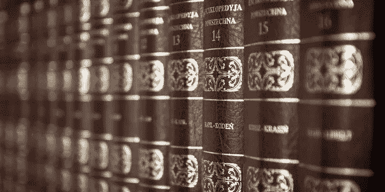

# TL；博士已经 100 岁了

> 原文：<https://medium.com/hackernoon/tl-dr-is-100-years-old-3fdc76076b80>

You have the time to read these?

在雷·布雷德伯里《华氏 451 度》的反乌托邦世界里，[的书](https://hackernoon.com/tagged/books)被禁，是阅读的[未来](https://hackernoon.com/tagged/future)，还是在可预见的事件中，我们的阅读习惯被‘浓缩’成短篇阅读？塞缪尔·理查逊的第一部英语小说《帕梅拉》出版于 1740 年。又过了一百年，黄皮书或平装本才出现。平装书向人们介绍了一种新的阅读方式——负担得起的休闲阅读。

> 到 19 世纪末，市场上出现了大量平装书。突然之间，20 世纪早期有太多的内容可以阅读，就像 21 世纪一样。

# 要读的东西这么多，时间却这么少

为了解决“阅读量大而时间少”的问题，压缩格式以书评的形式出现，1749 年拉尔夫·格里菲斯的《每月评论》，随后是 1809 年的《季度评论》。这种对浓缩信息的需求导致了 20 世纪早期现代百科全书的出现。1922 年，一个帮助人们阅读“策划和浓缩文章”的图标诞生了——**德威特·华莱士向世界介绍了《读者文摘》。**《读者文摘》的核心主张是帮助人们利用压缩文章在更短的时间内阅读更多的内容，它成为了世界上销量最高的付费订阅杂志，并在这个位置上保持了近一个世纪。

> 华莱士随后出版了《读者文摘浓缩书》,这是一份季刊，浓缩了当时流行的几本书。在某种意义上，TL；博士(年轻人的行话“太长了；没读过》)早在上世纪 20 年代就开始了！

接近 100 年后的今天，2016 年，我们还在 tl 里；世界博士。没有时间看报纸？印度有 inshorts 应用程序，美国有 Skimm 每日时事通讯。没有耐心看一部两个半小时的电影——YouTube 上有像《哎哟》和《Ahalya》这样的短片。没有时间阅读整本书，你有应用程序将非小说类书籍转换成小吃或简短摘要。

# **TL；博士不是一种时尚**

因此，当人们绝望地认为现在的年轻人没有他们的上一代人读得多时，你可以高枕无忧了。要读的书太多，时间太少，这个问题可以追溯到 20 世纪初——这至少是一个 100 年前的问题。那么这些把书汇总起来让你不需要去读的应用呢？1922 年，《读者文摘》将其视为一个机会，有了《读者文摘》,世界肯定会变得更好。

# **读书的未来**

人们会继续阅读。这显然是个好消息。会不断变化的是内容(长格式/短格式/TL；dr 格式)和容器(纸张/屏幕/音频)。**同样可能发生的是人们(包括不喜欢阅读的人)会使用目标语言；灾难恢复内容和屏幕到“样本”内容。如果他们喜欢自己略读几分钟所看到的内容，他们可能会深入内容。无论作者和出版行业喜欢与否，抽样将是未来阅读书籍或长格式内容的门户——就像 100 年前一样。**

*我正在用*[***bookbhook.com***](https://u82f.app.link/download-bookbhook-app)*——一款为 tl 设计的产品，枢转我的阅读爱好；世界博士。这篇文章最初发表于 anureviews.com*

> [黑客中午](http://bit.ly/Hackernoon)是黑客如何开始他们的下午。我们是 AMI 家庭的一员。我们现在[接受投稿](http://bit.ly/hackernoonsubmission)并乐意[讨论广告&赞助](mailto:partners@amipublications.com)机会。
> 
> 如果你喜欢这个故事，我们推荐你阅读我们的[最新科技故事](http://bit.ly/hackernoonlatestt)和[趋势科技故事](https://hackernoon.com/trending)。直到下一次，不要把世界的现实想当然！

