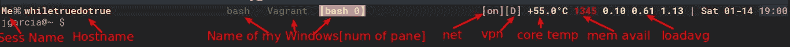
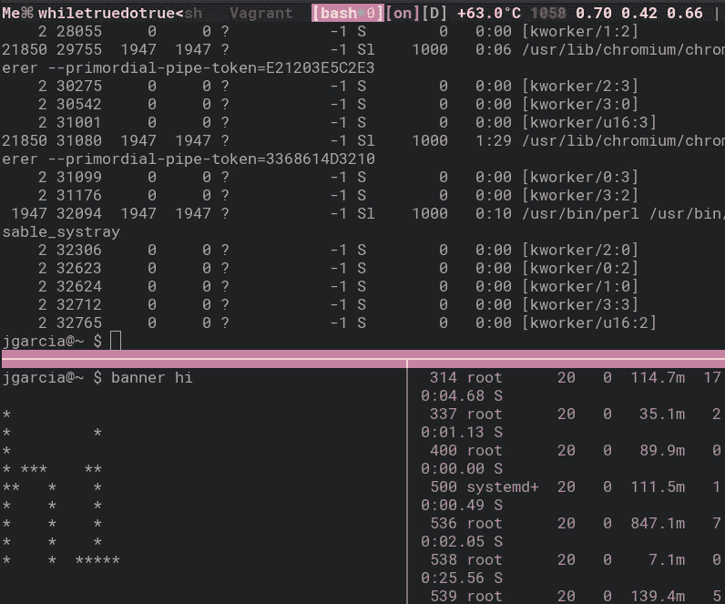
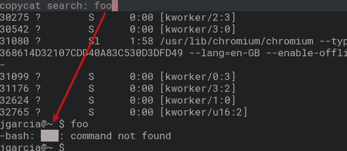

# Tmux 生产力！

> 原文：<https://medium.com/hackernoon/tmux-productivity-43f99e699d36>

屏幕多路复用器已经存在很长时间了，但对我来说，我从来都不是屏幕的忠实粉丝，很长一段时间我都使用专用终端，直到 tmux 出现。我已经花费了大量的时间来寻找尽可能少的努力工作，并且不使用鼠标，所以这个列表是我认为对我的工作效率至关重要的:

**设置您的前缀:**

**前缀**是你需要按下才能进入“tmux 模式”的组合键，类似于 vim 中的元键，例如我使用 **Ctrl + x**

```
set-option -g prefix C-x
```

我见过一些人使用大写字母作为前缀，这似乎是一个不错的主意。

**状态栏:**



当我使用**全屏**终端时，我显示了一些可能与你最喜欢的窗口管理器重叠的东西(这里是 **XFCE** ),但我仍然觉得它很有用

您可以将此添加到您的。 **tmuxrc** 实现类似的东西

```
set -g status-left '#[fg=brightblue,bg=grey]❐#[fg=white] #S | #h |'
 75 set -g 
status-right "#[fg=colour202]#(lastad.sh) #[fg=218,noblink,bg=colur235]#[fg=red]#(~/tmux/online.sh)
```

您可以在#()中传递任何您想要的 shell 命令。

**拆分和创建窗格:**

分割窗格是非常有用的，特别是如果你有一个大屏幕，可以更好地利用它们带来的真实状态，所以我通常使用

```
ctrl x " --> to split horizontally
ctrl x % --> to split vertically 
```



**调整窗格大小:**

调整窗格大小必须快速简单，否则你会很快感到厌烦，我使用了以下方法

```
 bind-key -n C-S-Up resize-pane -U 2
 bind-key -n C-S-Down resize-pane -D 2
 bind-key -n C-S-Left resize-pane -L 15
 bind-key -n C-S-Right resize-pane -R 15
```

也就是说，Ctrl +Shift +箭头键可以将当前窗格向上、向左、向下或向右调整许多单位，非常方便。

**Tmux 抄袭者。**

我不知道没有这个我怎么活了这么久:

[](https://github.com/tmux-plugins/tmux-copycat) [## tmux-插件/tmux-复制

### 一个增强 tmux 搜索的插件

github.com](https://github.com/tmux-plugins/tmux-copycat) 

基本上它让你搜索你的缓冲区，例如，你想在所有的缓冲区历史中搜索单词“foo”

```
Ctrl +x / "foo"
```



它的工作方式有点像 VIM，如果你按下“n ”,你将转到一个更老的比赛，等等。

**Tmux 变焦**

有时你想让一个窗格全屏显示，我通常会这样做

```
Ctrl + x + z
```

这将放大当前窗格，并使其全屏显示，做同样的事情返回。

**在单个窗口的窗格间移动:**

就像调整大小一样，在窗格之间移动必须很快，我喜欢这个快捷方式:

```
 bind -n S-Left select-pane -L
 bind -n S-Right select-pane -R
 bind -n S-Up select-pane -U
 bind -n S-Down select-pane -D
```

也就是说，Shit +箭头移动到箭头指向的窗格:)

就这些了，感谢阅读！！

[](http://bit.ly/HackernoonFB)[](https://goo.gl/k7XYbx)[](https://goo.gl/4ofytp)

> [黑客中午](http://bit.ly/Hackernoon)是黑客如何开始他们的下午。我们是 [@AMI](http://bit.ly/atAMIatAMI) 家庭的一员。我们现在[接受投稿](http://bit.ly/hackernoonsubmission)，并乐意[讨论广告&赞助](mailto:partners@amipublications.com)机会。
> 
> 如果你喜欢这个故事，我们推荐你阅读我们的[最新科技故事](http://bit.ly/hackernoonlatestt)和[趋势科技故事](https://hackernoon.com/trending)。直到下一次，不要把世界的现实想当然！

