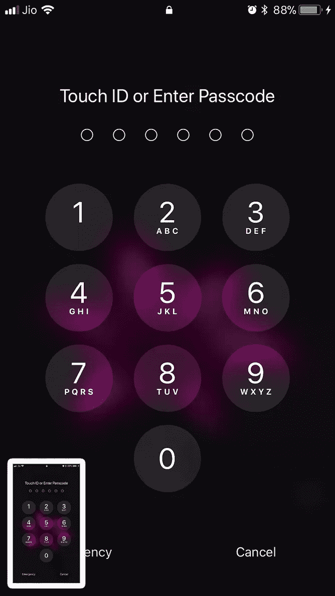
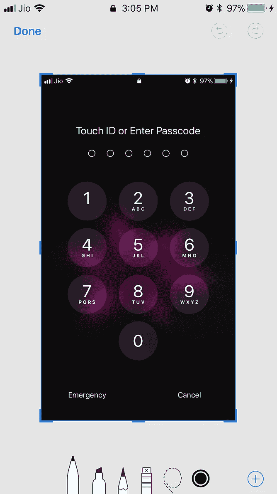
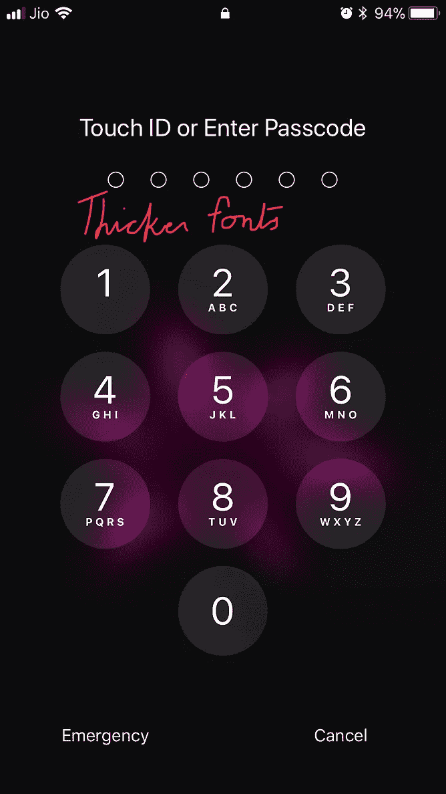
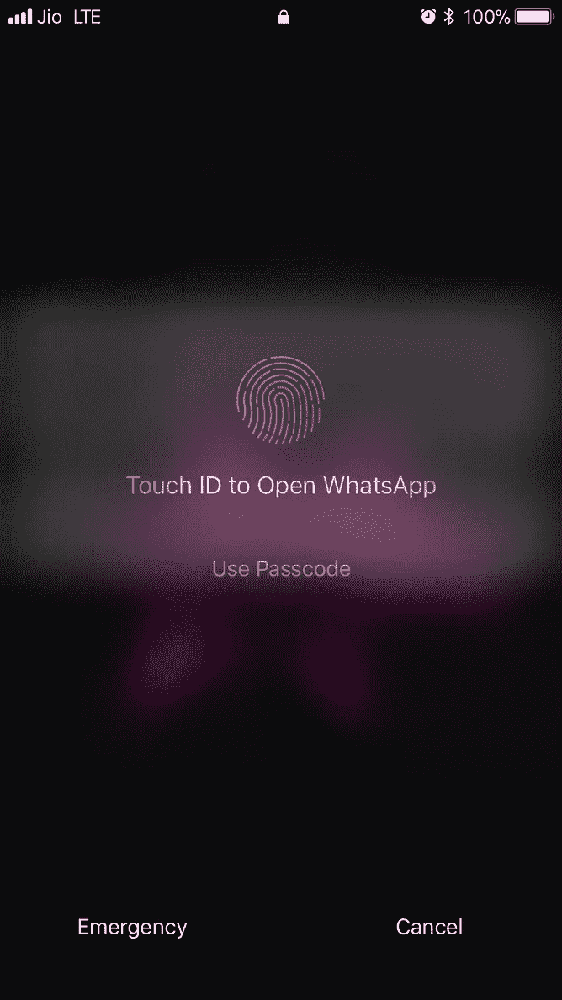
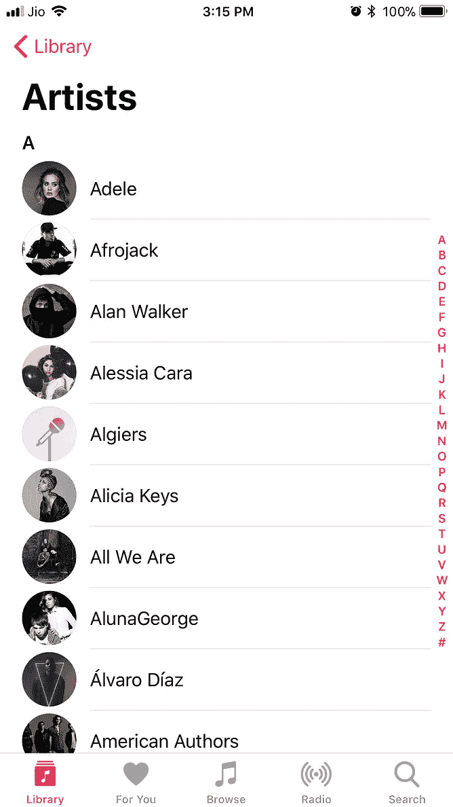
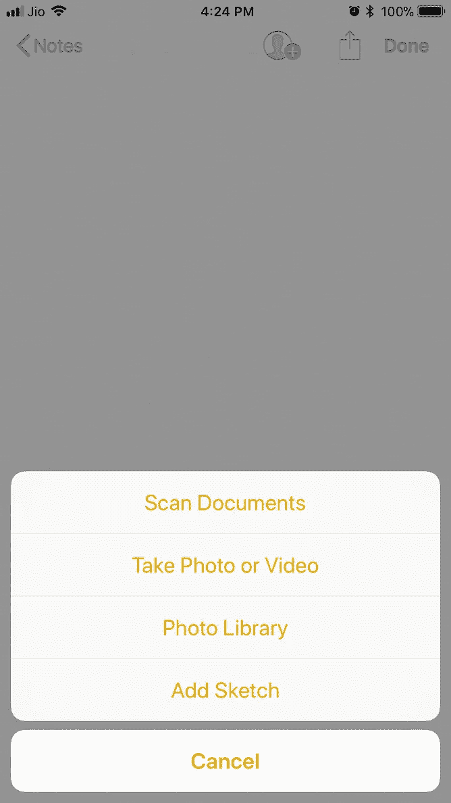

# 是，还是不是贝塔

> 原文：<https://medium.com/hackernoon/to-be-or-not-to-beta-610d443da698>

Photo by [Austin Neill](https://unsplash.com/photos/jB8WaHvHmoY?utm_source=unsplash&utm_medium=referral&utm_content=creditCopyText) on [Unsplash](https://unsplash.com/?utm_source=unsplash&utm_medium=referral&utm_content=creditCopyText)

iOS 11 测试版已经发布，但我一直试图忽略不断的聊天。我的 iPhone 是我的主要手机，所以为什么要冒险用一个自称的测试版来破坏它呢？为什么我会想成为苹果这个世界上最富有的公司之一的免费测试者呢？

我又不是没试过测试版。我在 iOS 10 测试版的经历足以让我发誓放弃我的主要手机上的测试版，当时我的银行应用突然停止工作，让我身无分文，直到我成功恢复 iOS 9。

因此，一周前，当苹果公司给我发来另一封电子邮件，邀请我成为他们的一名无线索、无报酬的测试员时，我认为明智的做法是忽略邀请，等待几个月，直到 iOS 11 正式推出。

问题是，当面临理智和理智之间的选择时，我总是选择理智。我开始思考新的可定制的控制中心，屏幕记录器，以及我读过的其他东西。在当今这个即时满足的世界，等待 iOS 上线两个月是很长的时间。

那我发誓永远不测试的誓言呢？算了，如果不能食言，许下的承诺还有什么意思？

我的手机崩溃的风险呢？实际上，我认为古老的谚语理解错了。生活的乐趣不在于变化，而在于风险。我们人类生来就是为了品尝禁果而甘冒一切风险。亚当离不开苹果，所以指望我抵制这个现代苹果的诱惑是不是太过分了？

想都没想，我把手机备份到 itunes 里，然后一头扎进了测试版。快速登录到我的 iCloud 帐户，然后我被要求下载一个新的描述文件到手机上。完成后，安装按钮出现。我点开，在手机上自己验证了一下，几分钟后，iOS 11 测试版就安装好了。这又快又简单，连小孩都能做。

我启动了电话。第一个明显的区别是字体变粗了。第二次是当我点击一个截图时，一个截图的小窗口掉到了屏幕的底部。在点击它的时候，我看到了一套在屏幕截图上写笔记的工具。这不是一个很大的功能，但仍然非常有用。

The purple flower on my lockscreen gives my lockscreen a weird purply feel

但是我觉得我以前见过这个。这里看一下 iOS 11 截屏的一个视频，和我运行 MiUI 8.2.1 的 Android 上的截屏对比一下。

iOS 11 beta screen capture feature

Existing MiUI 8.2.1 (Android modified) screen capture

MiUI 是小米的安卓版，这家中国公司一直在模仿苹果的硬件、软件，甚至商业模式。如果苹果抄袭小米这个就太讽刺了。这并不重要。也许他们都是从别人那里抄袭来的。有趣的是，这是一个非常有用的特性。所以我会接受苹果和安卓两种口味。

接下来，我使用新的 iOS 屏幕录制功能制作了上述视频。我在新的控制面板中寻找它，但是它不在那里。似乎必须在设置中启用它。这只用了几秒钟，之后我打开了屏幕录制器，录制了屏幕截图。将视频直接嵌入到一个媒体帖子中是可能的，所以我把它上传到了 YouTube。

我观察到的其他变化是音乐和 App store 等应用程序的新外观，手机在我开车时可以注意到并停止所有通知的功能，以及更多地方的 3D 功能，包括控制中心。

你也可以在旅途中发现一些东西。就像我在 Notes 应用程序中，我看到了一个新的+符号，出于好奇点击了它，意外地在其他选项中获得了一个扫描文档的选项。我相信在 iOS 11 中还有很多像这样的隐藏宝石。

iOS 周围还有很多更微妙的东西。很多是设计，但它确实让 iOS 感到耳目一新。

就性能而言，一些应用程序，如 WhatsApp，确实挂了我几次，但手机本身并没有崩溃。一些 32 位应用程序，如 Photogene，甚至没有道别就消失在过去。我确实注意到屏幕边缘的一些按钮不太容易记录我的触摸。但这可能是我手机硬件的问题。

安装 iOS 11 测试版而不是等待正式推出值得吗？

如果你有一个新的 iPad，那么也许，因为许多真正的变化，如双应用程序使用的分屏，拖放等，只在 iPad 上。在手机上，我发现除了我提到的屏幕截图和屏幕录制功能外，这些变化大多是表面的。

当然，这只是我作为一个相对无知的 iPhone 用户的观点。对于一个技术人员来说，这个测试版中可能有很多我完全看不到的有趣的东西。

试用测试版有什么缺点吗？

是的，一个大的。现在已经试用了 iOS 11，推出的时候也没什么可期待的了。iOS 12 还有很长的路要走，到那时我会对 iOS 11 的外观感到厌倦，因为我已经通过测试版开始使用它了。

其实 iOS 10 没什么问题。我安装 iOS 11 测试版只是为了改变一下。这就像某天早上醒来，看着镜子，对老样子感到厌倦，然后匆忙去剪了个新发型。

所以我想问题应该是，该理发了吗？