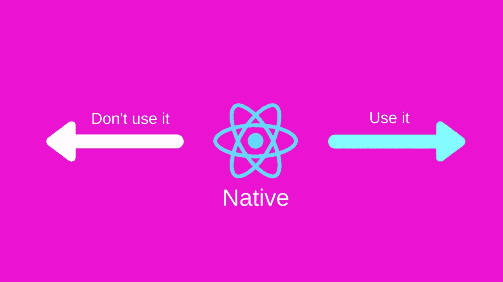

# 去还是不去反应自然

> 原文：<https://medium.com/hackernoon/to-go-or-not-to-go-react-native-e6f712739701>

关于何时使用或不使用脸书最热门的框架来编写应用程序的想法。

To choose React Native over Native or not?

几天前，我写了一篇关于[为什么我仍然选择 Native 而不是 React Native](/rayn-studios/react-native-first-impressions-40f70a45d55f) 的博文。当我编写我最新的应用程序 [Kiven Aa](https://kivenaa.com) 的初始架构时，它是这样的:

**对于 Web 客户端** : React

**对于移动客户端** : React Native ( [去世博或不去世博](/rayn-studios/expo-is-not-yet-ready-for-prime-time-a89e0a8f2ee7))

**盈利模式** : [Google Admob](https://www.google.co.in/admob/) 用于移动应用，类似于 web 应用。

值得注意的是，直到那时，在过去，我对 React Native 完全没有经验，我只是涉足 React，我完全喜欢它。但是，我看过一些 Airbnb 之类的演示，所以我确信这是我可以可靠地构建我的应用程序的东西。

## 当我真正潜入水中时，我的感觉改变了…

在为你的移动应用程序使用 React Native 之前，有一些地方你真的需要考虑一下。我已经在下面的文章中谈到了这些问题

 [## 反应本土:第一印象

### 如果你已经关注我一段时间了，你一定知道这些天我正在开发一个新的匿名聊天应用…

medium.com](/rayn-studios/react-native-first-impressions-40f70a45d55f) 

如果你不想再看另一篇文章，这里有一个快速纲要。在使用 React Native 之前，您需要彻底考虑以下几点

1.  你的盈利策略是什么？包括谷歌 Admob 还是脸书广告？
2.  你有计划使用 iOS 或 Android 的最新 API 吗？
3.  你打算使用一些独特的平台特有的功能吗，比如像脸书信使一样实现聊天气泡？
4.  你有计划发布 iOS 和 Android 的应用吗？

基于上述问题，我将用例分为两组，即 React Native 何时是好的选择，何时不是。让我们看一看…

# **去反应原生:**

1.  **电子商务应用**:如果你想构建外观相似的应用，尽可能多的共享代码，迭代更快，上市时间更短，React Native 是一个很好的选择。
2.  社交媒体应用:比如脸书、Instagram 等。应用程序应该看起来本地，足够快#可扩展。
3.  **基于跨平台 JavaScript 的游戏**:如果你对 JavaScript 足够精通，你可以使用框架编写跨平台的应用。然而，将这样一款应用货币化却是另一回事。
4.  使用脸书广告的应用:与 Google Admob 相比，React Native、*似乎更好地支持 FB 广告，原因很明显*。我没有脸书广告的经验，但作为 [Expo](https://expo.io) 的家伙提供了现成的 FB 广告组件，没有为 Admob(更有名)提供任何东西，因此猜测。

# 不要表现得像本地人

1.  **Messengers** :消息应用使用大量后台进程和定制设置，以便既“始终运行*”又“节省内存和电池*”。相信我，我知道这一点，[我拥有一个信息服务](https://pollenchat.com)。在消息应用程序中，我发现后台进程很难处理好，更不用说使用 React Native 实现它们了。
2.  **媒体播放器**:这类应用需要 GPU 处理、后台处理、多线程编程、异步编程、设备控制能力、OpenGL 等等。在这种情况下，你最好呆在土著营地。
3.  **实用程序**:使用底层平台提供的原生功能或 API，比编写 react 原生组件更容易编写亮度控制器、后台播放视频等应用程序。
4.  使用谷歌 Admob 作为主要盈利来源的应用:谷歌 Admob 似乎没有得到官方支持，也没有官方的 react 本地组件，比如按钮等等！因此，编写使用定制广告的应用程序可能会在 React Native 中遇到障碍。
5.  **非跨平台应用**:一个特定平台的应用！你可能会想在任何地方都使用 React 的声明式编程风格，但如果你不打算发布一款适用于 iOS 和 Android 的应用程序，我想使用 RN 来完成这项工作是多余的。当你陷入困境时，你会更容易找到解决问题的方法，如果是本地人的话。RN 还是很新的。

将来情况可能会改变。考虑到框架和社区发展的速度，我们可以看到一些“不要去反应本地”的项目跨越到“去注册护士”阵营。

> 老实说，我很乐意在 React Native 中编写 100%的应用程序，因为我只知道 Web 和 Android，但我想推出跨平台的应用程序。对于我们大多数人来说，使用 Web 的 HTML/CSS/JS、Android 的 JAVA/XML 和 iOS 的 Swift 来编写三个独立的应用程序并不是一件容易的事情。

直到那时，它还没有发生，我可以使用上面的列表来决定我什么时候应该使用 React Native。

你对此有什么想法？我错过了一个常见的用例吗？请在评论区分享您的反馈。我很高兴听到你对这个框架的看法。

如果你喜欢这篇文章，请将它推荐给你的社交网络，并关注我以获得更多类似的文章。如果你喜欢开发数字化的东西，你也应该订阅我的 YouTube 频道。

## [脸书](https://www.facebook.com/raynstudios) | [推特](https://twitter.com/rajat1saxena) | [YouTube](https://www.youtube.com/channel/UCUmQhjjF9bsIaVDJUHSIIKw)

直到下一次…