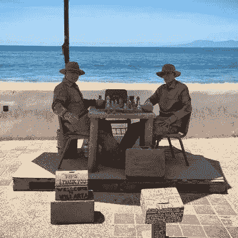

# 要想像象棋大师一样下棋，你需要学会如何忘记

> 原文：<https://medium.com/hackernoon/to-play-like-a-chess-master-you-need-to-learn-how-to-forget-ccdd37f0585e>

你有没有想过国际象棋大师是如何同时下这么多盘棋的？答案很简单，他们没有。取而代之的是，他们一次玩一个游戏。从第一眼看棋盘位置并不难，即使是新手，也能根治初学棋手的几个坏习惯。

第一次学国际象棋，对我来说最难的部分是在移动之前检查以确保我的所有棋子都是安全或平衡的。在我终于注意到这个习惯后，解决方法是忘记以前的移动，从零开始读每一个棋盘位置。

这种特殊的健忘策略可以被认为是一种脑残，因为它修复了人类理性的一个非常原始的弱点。这个问题在计算机术语中被称为*缓存中毒*。问题是人类大脑的思考速度没有我们记忆事物的速度快。因此，为了让自己在智力上更加强大，我们储存了一些不成熟的想法和部分记忆，并希望以后会用到它们。对于国际象棋来说，这成为了一个弱点，因为运动的本质是非常剧烈和逆向的。

骑士在棋盘上移动的方式，或者象倾斜，或者车滑动；这些动作没有一个适合未受过训练的人能够识别和适当处理的自然流程。国际象棋混淆了我们的自然本能，特别是在每次对手移动后棋盘的轻微重组。我们开始产生幻觉，“等等，我不记得对手的棋子在那里”，“什么！那是从哪里来的”。这是初学者学习玩游戏的自然反应。

试图通过自然游戏来学习国际象棋就像试图把一个圆柱体装进一个方孔。在这个版本中，方孔足够大，但是它也在角落留下了空白。这些*注意力的黑暗角落*是我们遭遇缓存中毒和部分幻觉的地方。当你回头看棋盘上你没有注意的那一面时，事情已经发生了变化，现在你的棋子处于弱势。除了国际象棋，这是许多棋盘游戏中常见的不幸。

缓存中毒也是医院检查清单取得如此巨大突破的原因之一。尽管医生无疑很聪明，但他们还是会犯一些简单的错误。反复检查病人标签和生日已经阻止了错误治疗的发生。这个简单的变化有时被誉为自青霉素以来最大的突破。

所以，如果你发现自己陷入沉思，记得偶尔检查一下你的边缘，尽管你很注意，事情可能已经改变了。

> [黑客中午](http://bit.ly/Hackernoon)是黑客如何开始他们的下午。我们是 [@AMI](http://bit.ly/atAMIatAMI) 家庭的一员。我们现在[接受投稿](http://bit.ly/hackernoonsubmission)，并乐意[讨论广告&赞助](mailto:partners@amipublications.com)机会。
> 
> 如果你喜欢这个故事，我们推荐你阅读我们的[最新科技故事](http://bit.ly/hackernoonlatestt)和[趋势科技故事](https://hackernoon.com/trending)。直到下一次，不要把世界的现实想当然！

