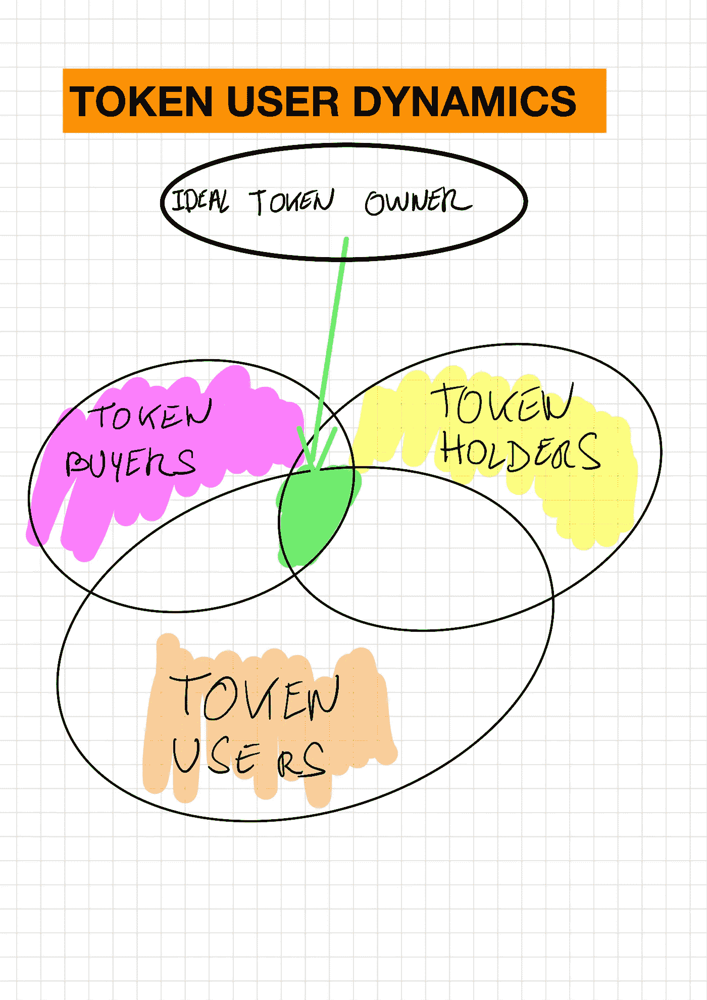

# 代币购买者、代币持有者和代币使用者

> 原文：<https://medium.com/hackernoon/token-buyers-token-holders-and-token-users-40e7234c46bb>

我想我终于找到了大多数 ico 真正困扰我的地方，以及为什么他们不是大多数人认为的价值创造者。请耐心听我分析。

# 首先是代币

任何区块链 Dapp 都以一个**令牌**开始，这个经济单位使这个应用程序能够工作，并给每个人足够的激励来建立和/或使用给定的服务。

令牌说明了分散网络效应的动态性。但是有一个先有鸡还是先有蛋的问题:当你的应用刚刚起步时，你如何获得一个令牌来获得足够的价值以使网络继续运行？区块链企业家已经找到了这个网络已经知道了 30 年的疯狂复杂问题的解决方案: **ICO**

# 网络效应的前景

通过出售一个梦想项目、一份白皮书、一个不错的 github 仓库、一个出色的顾问团队和一些宣传，代币被立即定价，并可以在项目生命周期的早期获得，让你有机会拥有这个未来项目%的经济(与股票相反，股票让你有机会拥有公司%的未来现金流和价值)。当甚至还没有一个产品来创建网络时，ico 就打开了增强网络效应的大门。这是一个二合一的系统，你可以像 kickstarter 一样获得一个“兴趣”社区，你还可以在没有稀释的情况下获得大量资金，让你的代币立即产生经济价值。

# 一切都很棒。但事实并非如此。

在当前的格式中，ico 提供早期令牌值，但也允许任何令牌购买者立即出售其令牌。这转化为围绕代币价值的超级投机活动市场，因为没有基本的网络效应指标来支持价值(除了极少数情况，见下文)

> 今天，95%的代币价值都是基于投机。

这之所以不好，不是因为投机本身，而是因为第一个代币**的购买者**不是代币**的持有者**。持有者(或者我们喜欢称之为 T9)有兴趣持有代币足够长的时间，直到网络价值取代投机价值。

> 想象一下支持一个 kickstarter 项目。捐款正在减少。这家公司很适合这个项目。但出于某种原因，此时此刻:每一个早期支持者开始要求退款或取消产品交付，即使钱没有回到他们的口袋里。贡献者对项目不感兴趣

当令牌在中期内没有建立真正的网络价值的情况下早期投入市场进行交易时，通过设计为令牌购买者、对快速交易感兴趣的令牌持有者(那些真正相信项目并希望始终支持项目的人)以及最终甚至令牌生产者(公司)创造了一套不同的激励机制。如果你在 ICO 中筹集了大量资金，但你的代币价值很低，那么你将很难激励你的网络(更不用说给你的经济带来价值)

# 令牌所有权图

您有不同类型的令牌所有者

1.  团队:他们在 ICO 中获得他们的份额，但被锁定一段时间，使他们与网络效应的里程碑保持一致。这些很少将代币价值置于风险之中
2.  **机构买家**:通常是早期支持 ico 的加密基金，或者说在 ico 之前，这些基金通常与第一组合作得很好。像 Polychain、潘迪拉、DCG 这样的基金，亚稳定基金，甚至像 Blocktower 这样的对冲基金都可以归入这一类。
3.  **公众 ICO 买家**:这就是风险所在。这里有大量的人是赏金猎人，有些人足够大(鲸鱼**和**)来创造一个抽水和倾倒的场景，这将有助于代币价值在交易的第一天获得高倍数，但也会导致它迅速崩溃
4.  **代币用户:**这些是当今*最稀有的。那些是创业公司设计的代币经济中代币的真正使用者。他们将是最初可能没有参与 ICO 但想要使用该服务的一群人，为此他们将不得不在市场上赚取或购买代币。例如，在预测市场/对冲基金服务**numeric**中，代币用户可能是一名优秀的科学/数学研究员，他希望应用自己的模型来预测市场，并获得一些奖金(当他们的股票预测准确时，他们会奖励科学家的代币)

此时此刻，在太多的情况下(大多数？)代币购买者和代币使用者是不一样的。在产品被制造出来并开始被采用之前，不可能是设计出来的。一些项目通过在 ICO 结束后不立即允许令牌交易，等待协议生效，来设法使买家和用户保持一致。TEZOS 就是一个很好的例子，它将在未来 3/4 个月内上线。迄今为止，token 还没有分发给 token 早期购买者，上市时间将与 Tezos 连锁店的生产时间几乎同时。

随着时间的推移，随着网络效应和经济的接管，代币的投机价值正在显著降低，代币购买者作为代币持有者或代币使用者对经济的贡献越来越大。理想的用户是购买者、持有者和使用者的混合体。

在某些情况下，你可能已经有了一个庞大网络。你可以利用它，并已经证明你的令牌“速度”有价值。但如果你更喜欢先去 ICO，这就不会发生了…

例如，我在 Kik ICO 上遇到的一个问题是，根据设计，ICO 的令牌购买者不是也不可能是令牌用户。KIK 的平均年龄组是 13/20 岁:不是典型的 ICO 买家。在 Kik 的案例中，网络已经启动并运行，Kik 没有理由不在走 ICO 的道路之前，通过首先将令牌交给用户来提升令牌。相反，代币所有者和代币使用者之间完全脱节，对我来说，这将是他们经济中的一个问题来源(这已经反映在他们的代币价值低于 ICO 价格)

# 摘要

区块链项目的主要挑战是设法在所有类型的令牌所有者之间找到正确的对齐方式。

今天设计的 ICO 格式只能产生不健康的不对准。您可以通过延迟您的令牌交易来解决这些问题，或者，如果您已经拥有一个网络，可以通过在 ICO 之前证明您的令牌的价值来解决这些问题。

在任何情况下，我不相信 ICO 格式，因为我们今天知道我们将继续。这是一个伟大的实验，也可能是必要的实验。下一代 ico 将找到更好的方法来协调所有令牌所有者的利益。