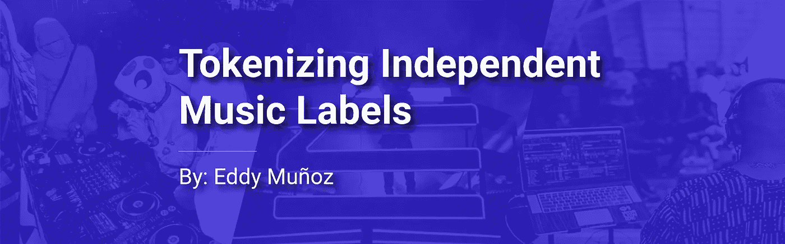
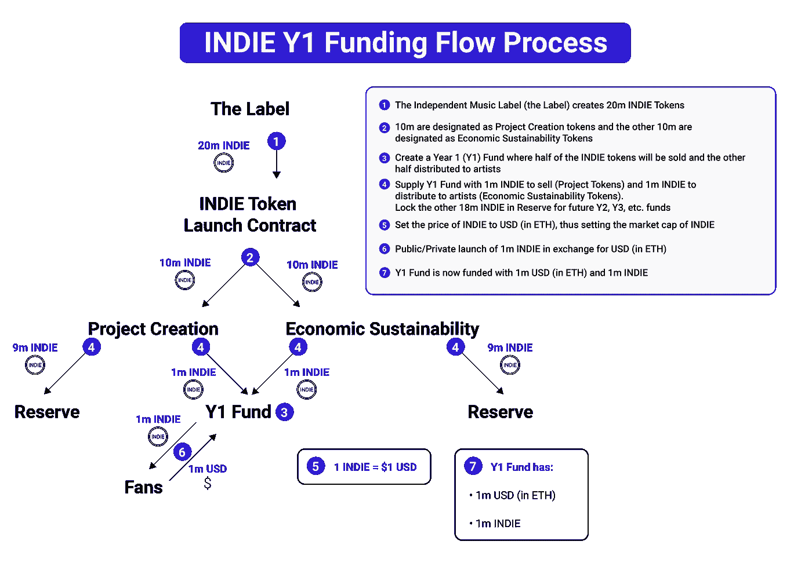
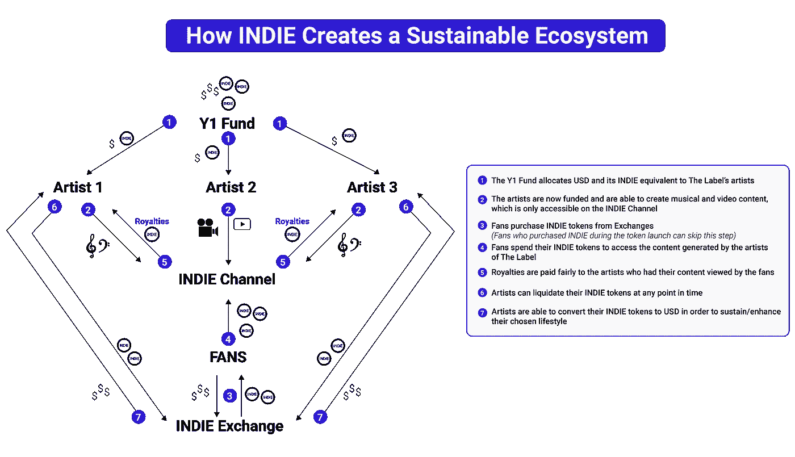
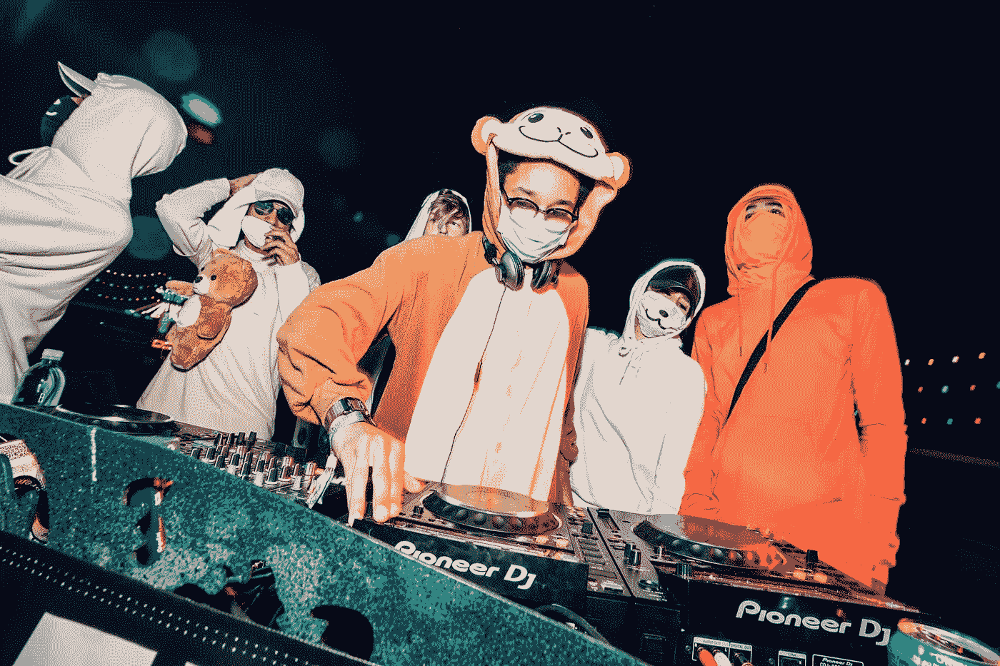

# 标记独立的音乐标签

> 原文：<https://medium.com/hackernoon/tokenizing-independent-music-labels-f322108695c>

FoFoFadi Crew of [FoFoFadi Records](http://fofofadirecords.com), Zhu of [M.O.A.G.](https://mindofagenius.co.uk), and Joe Kay of [Soulection](http://soulection.com)

## 实施 SingularDTV 的艺术家联盟模式

多亏了 [SingularDTV](http://singulardtv.com) 的团队，一种为艺术家创作提供合理报酬的新经济模式已经诞生。这种 [tokenomic](/singulardtv/tokenomics-101-the-emerging-field-of-token-economics-e253b9e72ba3) 模式，被称为艺术家联盟模式(AC 模式)，允许艺术家集体通过出售该团体的令牌由他们的粉丝资助。[独立](https://hackernoon.com/tagged/independent) [音乐](https://hackernoon.com/tagged/music)唱片公司将受益于采用这种模式，以便[通过经济上可持续的模式资助](https://www.thebalance.com/indie-record-deals-assesing-the-pros-and-cons-2460376)他们的艺术家的内容创作，并回报他们的粉丝从第一天起对他们的支持。

标签的令牌是一种数字货币(像比特币和以太坊一样，是标签独有的)，并激励早期采用者增加其价值。唱片公司代币销售产生的资金资助唱片公司内的艺术家创作只能通过唱片公司的数字渠道获得的数字内容。粉丝只能通过标签的令牌访问艺术家创作的数字内容。

因此，艺术家由他们的粉丝资助创作内容，并在粉丝访问他们的内容时获得公平份额的版税。艺术家还被给予标签的令牌，以激励他们继续为标签的频道产生内容，从而增加标签频道的价值。粉丝从早期贡献者那里获得未来价值。根据艺术家创造的内容质量和粉丝创造的访问内容的需求，标签令牌的价格将升值。

AC 模型并不意味着让艺术家成为百万富翁。相反，它创造了一个可持续发展的模式，在这个模式下，艺术家做他们喜欢的事情会得到公平的资助和补偿。这种模式使粉丝有能力资助他们喜欢的艺术家，从而奖励早期采用者和标签的真正信徒。因此，需要资金来扩大视野的独立音乐公司必须采用 AC 模式来创建经济上可持续的业务。

本文将涵盖:

*   (1)独立唱片公司如何推出自己的代币
*   (2)唱片公司的标志如何为他们的艺人创造一个可持续的资金生态系统
*   (3)粉丝如何消费标签的代币
*   (4)目前可以采用 AC token 模式的现有独立音乐厂牌的例子！

# 独立代币发行明细

*摘自 SingularDTV 的* [*词汇组学 101*](/singulardtv/tokenomics-101-the-emerging-field-of-token-economics-e253b9e72ba3)

出于本演练的目的，我们将使用一个理论上独立的音乐标签，名为 label，其本机标记名为 INDIE。

## 步骤 1:生成独立令牌

通过 [Tokit 的](http://tokit.io)多智能合约应用程序，总共创建了 20，000，000 个独立代币。

## 步骤 2:指定代币用途

10，000，000 INDIE 被指定为**项目创建**令牌，10，000，000 INDIE 被指定为**经济可持续性**令牌。

## 步骤 3:创建第一年基金

分配给项目创建的 10，000，000 INDIE 将用于 Tokit.io 上的多重令牌启动，第一年基金对 INDIE 的成功至关重要。

## 第四步:提供第一年的独立基金并建立储备金

第一年基金从 10，000，000 个项目创建代币中指定 1，000，000 个独立代币。剩余的 9，000，000 个项目创建令牌将作为“储备”持有，以备将来在任何时间间隔发行令牌时使用。

1，000，000 经济可持续性代币也被指定用于第一年基金，但不出售。这些代币将根据产生的知识产权(IP)分发给艺术家。根据经验，当艺人得到唱片公司的美元资助时，他们也会得到相应数额的独立代币。剩余的 9，000，000 个经济可持续性代币将作为“储备”持有，用于将来的代币分配。

**艺术家受到激励，继续为品牌创造价值，以创造对独立音乐的额外需求，从而提高他们持有的独立音乐的美元价值。**

## 第五步:设定理论市值

第一次代币发行(为第一年基金融资)将包括以 1 INDIE = 1 美元(以 ETH 计价)的价格为 ETH 出售 1，000，000 INDIE。因此，在一次成功的代币发行后，唱片公司将从他们的粉丝那里获得 100 万美元的 ETH，相当于 INDIE 总供应量的 5%。这使得 INDIE 的市值达到了 2000 万美元。

## 步骤 6:私人/公共独立令牌启动

1，000，000 个独立代币可以在私人或公共代币发布会上出售。如果一切按计划进行，唱片公司将获得价值 100 万美元的 ETH，以换取 100 万美元的独立代币。

## 第七步:Y1 基金成功融资

在步骤 6 中成功推出独立代币后，Y1 基金将获得 1，000，000 美元的 ETH 和 1，000，000 个独立代币。Y1 基金将用于资助唱片公司艺术家的内容创作。

My Design on the AC Model’s Y1 Funding Flow Process

# 独立如何创造一个可持续的融资生态系统

在 INDIE 成功推出后，Y1 基金将准备用 USD 和 ETH 资助艺术家。这笔资金将为艺术家提供创作内容所需的资本。

使 AC 模式可持续发展的基本流程可以遵循 7 个简单的步骤:

## 第一步:向艺术家分发美元和独立音乐

Y1 基金的所有者厂牌将美元和独立资金分配给旗下所有艺人。如果资金允许，将增加独立频道(所有标签内容的聚合)价值的新艺术家可以得到美元和独立的资助。

## 第二步:让艺术家做他们喜欢的事情

有了必要的资本，艺术家就能够走出去，创造、合作和创新他们认为合适的任何东西，为独立频道增加价值。无论是单曲的发行，2 小时的混音，他们巡回演出的纪录片，甚至是完整的专辑，艺术家都将产生粉丝们会喜欢的内容，从而增加独立频道的价值。

## 第三步:粉丝通过交易所购买独立

为了获得厂牌艺术家创作的所有精彩内容，粉丝们必须在交易所购买独立的内容。参与代币发行的粉丝可以跳过这一步，因为他们是该标签的早期信徒，能够以折扣价购买 INDIE(与交易所中 INDIE 的当前价格相比)。

## 第四步:粉丝在独立频道上消费他们的独立作品

现在，粉丝们拥有了独立频道，他们可以在独立频道上花费代币来解锁艺术家的内容。独立频道有几种不同的收入模式。第一种模式是订阅模式，粉丝每月支付 5 英镑观看频道上的所有内容。第二种模式是 per/transaction 模式，粉丝为每部剧支付 0.01 INDIE。第三种模式是购买模式，粉丝将花费 10 英镑购买一张完整的专辑，并将内容下载为 MP3 文件。

为了执行正确的收入模式，唱片公司必须将这三者结合起来，以最大限度地提高粉丝的用户体验。

## 第五步:版税支付给相关的艺术家

由于独立令牌可以有 2 个以上的小数位，因此艺术家每播放一首歌曲，就可能收到 0.009 的独立令牌。智能合同可以立即将独立作品支付给正确的艺术家。这是开创性的！

## 第六步:艺术家可以随时清算他们的独立作品

在收到他们的第一笔独立分配后，艺术家可以选择将他们的独立变现为美元或任何其他形式的加密货币。

## 第七步:艺术家舒适地做着他们喜欢的事情

为了维持他们喜欢的生活方式，艺术家们将清算他们的独立代币美元。对于艺术家来说，明智的选择是清算足够的资金以舒适地生存，同时也持有( [*霍德林*](https://www.urbandictionary.com/define.php?term=Hodling) )足够的独立资金，以备未来当每张独立代币的价格相对于美元上涨时清算。

**注:**独立频道的价格应该以独立频道的内容质量为准，而不是炒作。

My Design on the How the AC Model Creates a Sustainable Ecosystem

# 粉丝如何使用他们的独立音乐

独立是解开一切标签的关键。无论是专辑、演唱会，还是独家商品，粉丝能拿到厂牌商品的唯一途径就是通过 INDIE 的购买和交易。INDIE 将用于解锁独立频道上的所有内容，这是所有独立内容的中心枢纽。因此，该标签的艺术家创作的内容必须足够高，才能产生不断增长的粉丝群，从而购买独立音乐。对独立音乐的日益增长的需求将欣赏每个艺术家的独立音乐(IP)的价值，从而根据对其音乐的需求，正确地补偿内容创作者的艺术性。

## 1.解锁/购买音乐

*   订阅费:5 独立/月无限制流媒体
*   每次播放费用:每次播放收费 0.01 独立
*   购买费用:以 MP3 形式购买和下载歌曲需支付 1 英镑

## **2。看巡演和演唱会视频**

*   无广告的 YouTube，创作者的内容得到了公平的补偿
*   可以与上述收入模式联系起来

## 3.购买标签音乐会门票

*   演唱会门票可以在独立频道上以独立代币独家销售
*   或者在现有模式下，如果在独立影院购买，音乐会门票可以优惠 30%左右

## 4.访问仅限粉丝的内容/活动

*   该唱片公司与另一家音乐唱片公司合作，为超过 100 家独立唱片公司的持有人提供免费活动
*   免费的私人派对是为拥有超过 100 个独立作品的人举办的
*   潜行峰向订阅的独立持有者开放
*   艺术家混音仅在订阅模式下可用

## 5.标签商品的装载

*   独家品牌商品只能通过独立品牌购买
*   独家品牌合作商品只能通过独立品牌购买，弹出式商店的位置只对拥有 100 个或更多独立品牌的人公开
*   t 恤 10 独立，帽子 15 独立，等等。
*   100，000 独立的私人活动，标签艺术家为你表演

## **6。将标签作为分散的音乐标签进行管理**

*   这是一个有趣的想法，只有当唱片公司想让自己成为一个分散的音乐品牌(一个不是由一个人或一个团体管理的品牌)时，这个想法才行得通
*   在这种模式下，独立持有人可以根据艺术家的艺术能力来决定资助哪些艺术家
*   可能会有一个令人满意的中间点，即唱片公司拥有一半的权力，独立控股公司拥有另一半的权力(或者采用 51%/49%的模式来排除平局)

# 独立音乐公司可以凭借自己的标志蓬勃发展的例子

以下独立音乐公司有正确的愿景来采用艺术家联盟令牌模式并与之共同发展。虽然我目前没有与任何标签的关系，但我是每个标签的忠实粉丝，并且很乐意与他们联系，进一步讨论如何标记他们的标签。

*只需在下方评论或在 Twitter @eamunoz_me 上 DM 我；)*

## 福福法迪唱片公司:FOFO·托肯

The [FoFoFadi](https://www.fofofadirecords.com/blog/edc-fofo-recap) Crew at Broke LA

[FoFoFadi Records](http://fofofadirecords.com) 是一个由[艺术家](https://soundcloud.com/fofofadirecords)组成的合作团体，他们的动物名字如神龟、陈文静黑猩猩和可爱的熊猫。通过他们的 FOFO 代币的创造和发行，AC 代币模型将被创造，其中粉丝资助 FoFoFadi 内容(音乐、视频、音乐会等)的开发。)并通过 FOFO 令牌在 FOFO 频道上访问它们。

## 天才音乐组合的头脑:MOAG·托肯

The MOAG Logo

天才音乐组合 (MOAG)是一家成立于 2013 年的独立唱片公司，是像[朱](https://mindofagenius.co.uk/pages/zhu)、[浩](https://mindofagenius.co.uk/pages/gallant)和[他们](https://mindofagenius.co.uk/pages/they)这样的大艺术家的家园。有了 MOAG 令牌，天才之心将能够进一步扩大他们的艺术家线，并创建一个中心，在那里他们的愿景与世界共享。

## 灵魂印记:灵魂令牌

A Soulection event in Berlin

[Soulection](https://soulection.com/about/) 是一个独立的音乐厂牌，[在线广播节目](https://soundcloud.com/soulection)，来自洛杉矶的艺术家集体，他们的愿景是让每个人脸上都带着微笑。他们是一群拥有全球观众的热情驱动的人。他们寻找明日之声的追求不断引起人们的关注(以一种好的方式),因为他们是新的、实验性音乐风格发展的主要基石。

他们的明日之声格言可以通过他们的灵魂令牌得到呼应，因为他们为热爱自己工作的艺术家创造了一个可持续的资助生态系统。

# 后续步骤

AC 模式是为音乐社区设计的， [**艺术联盟**](https://tokit.io/campaign/0x61dae37ae79cbdd7d397c5af8f7918e40d3c74d0) 将于 11 月 12 日推出他们的代币。

再次感谢 SingularDTV 的[帖子](/singulardtv/tokenomics-101-the-emerging-field-of-token-economics-e253b9e72ba3)关于艺术家联盟的模式启发我创作了这个作品。

*感谢您的时间* ***:)*** *随时点击拍手按钮，与朋友分享！如果有什么意见，欢迎在下面提出来！*