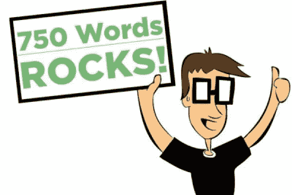
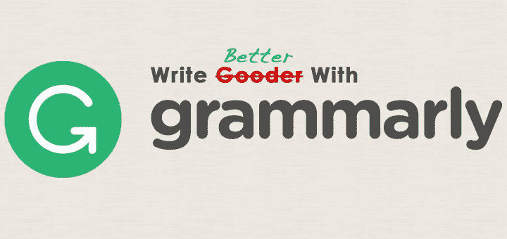

# 我用来提高沟通和写作能力的工具

> 原文：<https://medium.com/hackernoon/tools-ive-used-to-improve-my-communication-and-writing-skills-1217f2a296c1>

No matter how tall the mountain, you can take one step at a time to become a great writer.

我从来都不是那种喜欢写作的人。它的一切对我来说都是可怕的。在我看来，*写作相当于折磨*。

最近，我非常喜欢写作。我开始写博客和其他内容越多，我就越意识到这是我喜欢做的事情。

虽然我沉浸在写作的美中，但我也充分意识到我在这方面有多糟糕。我热衷于自我完善，所以我决定努力成为一名更好的作家。

当我第一次踏上自我提升的旅程时，我以为我可以找到一种方法来黑我的写作。我想一定有一种简单的方法可以在一夜之间提高写作水平。不仅是我错了，没多久我就意识到， ***写作和沟通没有速成*** 。如果我想变得更好，我必须努力。

随着我日复一日的工作，我逐渐注意到我的写作开始进步。我发现提高写作水平的最好方法就是写作。

我很高兴看到自己随着时间的推移取得的进步。我现在对我的写作很满意，但是仍然养成了每天提高写作的习惯。

最后，写作是最好的练习。如果你想提高你的写作水平，你需要停止找借口，直接去做！

虽然写作是最好的练习，但是在我的旅途中，我发现了一些帮助我的工具。我想我分享它们会对一些人有益，所以它们在这里！

# [750 字](https://750words.com/)

这个项目帮助我努力工作。它强化了让写作成为日常习惯的心态。

在 750 字之前，我每次写作都会有一种焦虑感，因为我认为人们只能带着目的写作。在我看来，如果人们只是为了某个目的而写作，那么*就必须*出版。我害怕写一些我必须发表的东西，因为我对我的写作有自我意识。这是一个恶性循环。

然后我发现 [750 字](https://750words.com/)。他们的目标是帮助你每天写 750 个单词，最终使之成为一种习惯。听起来很多，*但实际上很管用*！

我发现开始用这个工具为写作而写作是有益的。这是我每天的冥想时间，我可以进去写下我的任何感受。

它已经转化为我的个人日记，提高了我的写作技巧，帮助我理清思路。

下面是 750 个单词描述自己的方式:

> *“*[*750 字*](https://750words.com/) *是这个练习的在线化、未来化、趣味化翻译。”*

# [语法上](https://chrome.google.com/webstore/detail/grammarly-for-chrome/kbfnbcaeplbcioakkpcpgfkobkghlhen?hl=en)

Chrome extension 非常出色，它让我避免了无数不道德的语法错误。我自豪地向大家介绍— [语法上的](https://chrome.google.com/webstore/detail/grammarly-for-chrome/kbfnbcaeplbcioakkpcpgfkobkghlhen?hl=en)！

它不仅是一个 Chrome 扩展，可以在使用 Chrome 时纠正你的语法，而且付费版本还包括一个桌面应用程序。使用桌面应用程序，您可以上传要检查的文档或直接从 [Grammarly](https://chrome.google.com/webstore/detail/grammarly-for-chrome/kbfnbcaeplbcioakkpcpgfkobkghlhen?hl=en) 应用程序编写。

(我选择把我的[中型](https://medium.com/u/504c7870fdb6?source=post_page-----1217f2a296c1--------------------------------)帖子直接写在[语法](https://chrome.google.com/webstore/detail/grammarly-for-chrome/kbfnbcaeplbcioakkpcpgfkobkghlhen?hl=en)上。)

以下是他们在 Chrome 网上商店的描述:

> Grammarly 的免费写作应用程序确保你输入的所有内容都易于阅读、有效且无错误。向 Chrome 添加 Grammarly 意味着你的拼写和语法将在 Gmail、脸书、Twitter、Linkedin、Tumblr 以及你在网上写的几乎所有其他地方受到审查。一旦您注册了新帐户，您将开始收到每周一封的电子邮件，其中包含个性化见解和绩效统计数据(这是我们最受欢迎的新功能之一)。从事一个大项目、一篇文章或一篇博客文章？没问题。您可以在新的在线编辑器中创建和存储所有文档。”

# [海明威](http://www.hemingwayapp.com/)

你曾希望自己能像伟大的作家欧内斯特·海明威那样雄辩吗？现在你可以了！

实际上，这个程序可能无法帮你写出像《永别了，武器》这样的经典之作，但至少你可以听从海明威的建议，尝试一下！

海明威有一句我最喜欢的写作名言。 ***曾引用他的话说，写醉了。编辑清醒。***

实际上，这款应用程序不仅可以帮助你纠正语法错误，还可以通过用不同的颜色突出错误来改变你的写作风格。每种颜色高亮显示表示不同的书写错误。它不仅纠正了你，也教会了你！

以下是网站对该应用程序的描述:

> *“海明威 App 让你的文笔大胆清晰。”*

# 摘要

如果你投入时间(就像任何事情一样)，你将会成为一名伟大的作家。就像爬山一样，你需要一步一步来。

这些工具会有所帮助，但不会修复文字。这项任务仍将落在你身上。把这些工具想象成绷带，但是你需要努力提高。

通过努力工作、奉献和这些工具的帮助；不管怎样，你可以开始像欧内斯特·海明威那样写作。

我的目标是通过我的[消息应用](http://www.unummessenger.com)，让沟通变得更容易。 [UNUM messenger](http://www.unummessenger.com/) 帮助您统一您使用的所有其他消息应用程序，以简化消息传递。在[http://www.unummessenger.com/](http://www.unummessenger.com/)了解更多信息(我们正在开发中，所以请注册以便在发布时得到通知！)

> [黑客中午](http://bit.ly/Hackernoon)是黑客如何开始他们的下午。我们是 [@AMI](http://bit.ly/atAMIatAMI) 家庭的一员。我们现在[接受投稿](http://bit.ly/hackernoonsubmission)并乐意[讨论广告&赞助](mailto:partners@amipublications.com)机会。
> 
> 如果你喜欢这个故事，我们推荐你阅读我们的[最新科技故事](http://bit.ly/hackernoonlatestt)和[趋势科技故事](https://hackernoon.com/trending)。直到下一次，不要把世界的现实想当然！

