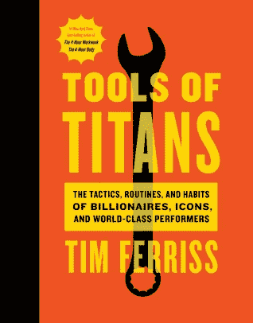
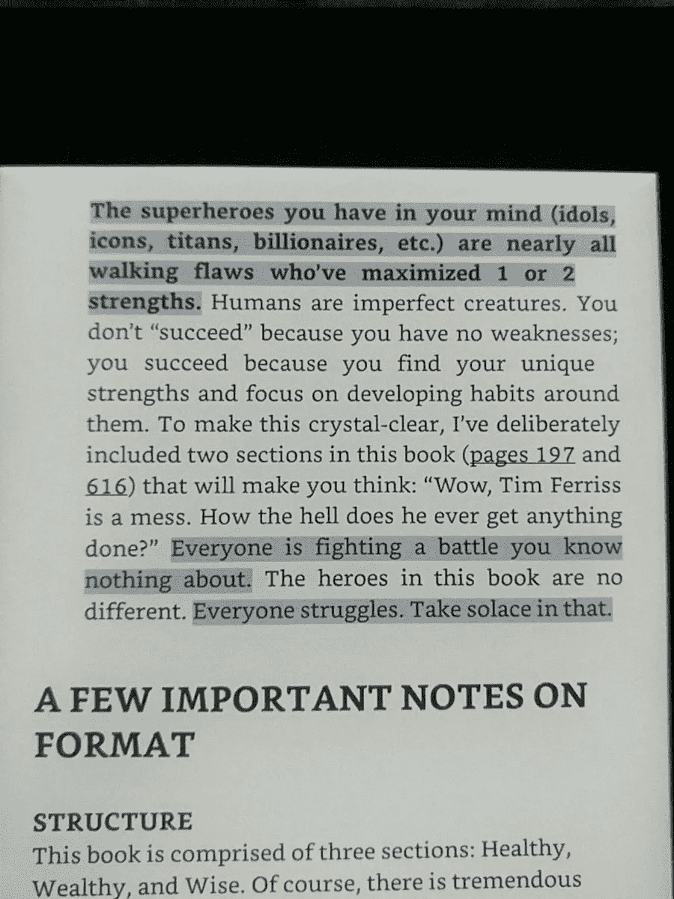

# 泰坦的工具

> 原文：<https://medium.com/hackernoon/tools-of-titans-36d2e24c04aa>

## 蒂姆·费里斯新书的高度概述以及你为什么要读它？

去年，我在蒂姆·菲利斯的博客上随机发现了一篇他采访玛丽亚·波波娃的帖子，并向他介绍了自己。事实上，我在搜索 Brain Picking 的 Maria Popova 的采访，因为她是一个如此鼓舞人心的博客人物，她策划每个帖子内容的方式令人惊讶，似乎是一个创造性过程的例子，就在她的想象之外。你必须检查一下[大脑精选](http://brainpickings.org)。此外，我浏览了蒂姆·费里斯的博客，名为 FourHourWorkWeek.com，并被介绍给他的播客，蒂姆·费里斯秀[ [播客](https://fhww.wordpress.com/podcast/)链接]。他做了一项了不起的工作，对一些成功和有趣的人进行了超过 100 次 60 分钟的采访，深入挖掘他们的“思想”，他们的工作过程，维护他们身体的过程，听取他们的建议，以及他们如何激励，鼓舞，生活和做他们喜欢做的事情。

**泰坦的工具**收集了大量的采访片段，可以在 Ferriss 的播客上找到，并突出了 Tim 在本书中包含的大多数采访的主题。这本书很大，超过了 700 页，当然不是要一次读完。这不是托尔斯泰的《战争与和平》或戴维·福斯特·华莱士的《无限的玩笑》，你可以在接下来的 7 到 10 天内不动身体的情况下连续阅读。请记住，泰坦的阅读工具将需要更多的时间，因为它有大量的实用信息需要我们的大脑处理。我建议你花点时间阅读 Tim 描述的每一次采访，仔细想想，如果中间有一本书被推荐，因为有很多有趣的书籍推荐，试着读几本，或者至少做一点研究，为什么这本书被推荐，里面有什么，这本书适合你吗？那你一定可以把它加入你的 TBR。

在过去的 18 天里，我一直早起阅读这本书的几个章节。我发现最好改变一下我的习惯，花些时间在媒体或 T2 上，当太阳升起的时候，我可以呆在书里。我一直在我的 Kindle 上看这本书，唯一的目的就是舒服地做笔记，不打扰我的阅读过程。我喜欢突出重点，最近几个月，事实证明，重复使用我博客文章中的重点是有益的，或者在以后的时间里浏览重点，以便瞥一眼我读过的某本书，不想再读一遍。*(我很快会上传我的笔记集…请留意)*

Tim Ferriss on *Successful* People

这本书分为三个部分:**健康，富有&明智**。如果巨人的工具还有另外一个头衔，我想应该是“健康、富有、明智”。

# 健康的

在这个版块中，有专业运动员、研究人员和世界著名医生分享他们关于健康生活和高效饮食的最佳见解、技巧和诀窍，将帮助你度过每一天。

# 富人

第二节是关于**。*这一节的事实是，这本书是一本伟大的商业书籍。令人难忘的部分，包括可行的想法，建议，工具，把你的个人品牌和业务提升到一个新的水平。这一节有一个主题，那就是从其他经验中学习。你在一段时间内只能经历一件事，但阅读是一笔巨大的财富，它能让你在一段特定的时间内熟悉不止一种经历。*

# *聪明的*

*上篇: ***睿智*** *。这是我最喜欢的书的一部分。我真的被人们在日常工作生活中实施的不同过程迷住了，包括精神坚韧、语言简洁和观察事物。学会如何学习可能是你对自己最好的投资。这部分就是关于这个的。仔细观察，你会发现蒂姆的问题是多么简单，而这些简单的问题却有更详细的答案。他甚至把他的连珠炮式的调查问卷放在了书的最后，我将看一看，并在我接受的采访中修改其中的一些。**

*我喜欢这本书的另一点是蒂姆在这些采访中表达自己声音的方式，这代表了他自我怀疑和自我激励的情绪。这样，随着对话的变化，这本书变得更有趣，我发现它们很有用，也很有启发性，因为它们在讨论的特定主题上更有启发性。*

*这本书里提到的每一件事，无论是一个人还是一本书，都被准确地编入索引，在这本书的结尾打开了参考的大门。*

*不管你是一名开发人员，还是一名崭露头角的企业家或首席执行官，如果你打算阅读这本书，你将在今年的最后一年以及未来几年里帮自己一个忙。*

****我的评分:5/5****

****感谢您的阅读。如果你觉得这篇文章有用，请点击*** 💚 ***按钮这样这个故事就能接触到更多的*读者*。如果你想谈论更多，请在***[***Twitter***](https://twitter.com/amanhimself)***|***[***Goodreads***](https://goodreads.com/amandeepmittal)***|***[***书博***](https://amandeepmittal.wordpress.com/)*

******

> *[黑客中午](http://bit.ly/Hackernoon)是黑客如何开始他们的下午。我们是 [@AMI](http://bit.ly/atAMIatAMI) 家庭的一员。我们现在[接受投稿](http://bit.ly/hackernoonsubmission)并乐意[讨论广告&赞助](mailto:partners@amipublications.com)机会。*
> 
> *如果你喜欢这个故事，我们推荐你阅读我们的[最新科技故事](http://bit.ly/hackernoonlatestt)和[趋势科技故事](https://hackernoon.com/trending)。直到下一次，不要把世界的现实想当然！*

**