# 十大 GitHub 开源 iOS 库

> 原文：<https://medium.com/hackernoon/top-10-github-open-source-ios-libraries-c39aebc25517>

iOS 是当今世界上最流行的操作系统之一。这意味着开发者需要构建应用程序来满足依赖 iOS 的设备用户的需求。然而，当你试图从头开始做任何事情时，开发可能会成为一项艰巨的任务。为什么要重新发明轮子？

有了像 [GitHub](https://dashbouquet.com/blog/web-development/github-octoverse-2017-overview-top-trends) 这样的开源平台，你可以非常容易地实现伟大开发者的项目，并使用它们来为你的项目添加伟大的特性。本文中讨论的库是按照星号的顺序排列的，从用于创建优秀日历的库到改进用户界面并使开发过程变得非常简单的库。别浪费时间了，让我们开始深入讨论吧。

# 洛蒂 Ios

## 11 915 ★

## Pod 2.1.5

Lottie 是一个 iOS 库，用于解析 Adobe After Effects 动画。它通过使用 Bodymovin After Effects 插件来实现这一点，并确保动画在移动和网络平台上呈现精美。

有了它，开发变得更加愉快，因为设计师可以轻松地创建漂亮的动画，让用户惊叹不已。

您可以使用 Cocoapods 安装这个库。只需使用以下命令将 pod 添加到您的 pod 文件中:

`pod 'lottie-ios'`

并使用以下命令运行:

`pod install`

此后，您可以使用以下命令将其导入目标 C:

`#import <Lottie/Lottie.h>`

在 Swift 中使用:

`import Lottie`

万一你觉得没那么忙，Airbnb 邀请你为这个开源的 iOS 库做贡献。可以从 [GitHub](https://github.com/airbnb/lottie-ios) 和[官网](http://airbnb.io/lottie/)了解更多。

 [## 介绍洛蒂

### 我们新的开源工具让向本地应用添加动画变得轻而易举。

medium.com](/airbnb-engineering/introducing-lottie-4ff4a0afac0e) 

# 变色龙

## 10 458 ★

## Pod 2.1.0

这里有一个 iOS 库，可以帮助改善用户界面。

变色龙是 iOS 的平面颜色框架，有助于使开发变得轻而易举。有了这个强大的工具，你的应用程序一定会得到一个非常漂亮的界面。

众所周知，在选择颜色时，需要选择正确的 RGB 值。但是有了变色龙，就更容易得到那些很棒的颜色组合，也省去了很多挫败感。

使用 Cocoapods，只需在 podfile 中添加以下命令就可以安装 Chameleon:

`use_frameworks!`

`pod 'ChameleonFramework'`

可以从 [GitHub](https://github.com/ViccAlexander/Chameleon) 和[官网](https://github.com/ViccAlexander/Chameleon#-documentation)了解更多。

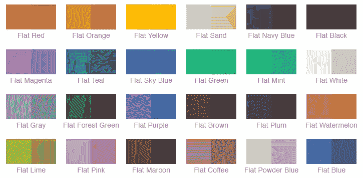

Chameleon basic flat colors

# FastImageCache

## 7 671 ★

## Pod 1.3

从磁盘上的图像数据切换然后将其渲染为核心动画层的过程通常会耗费时间、精力和资源。

但是，使用 FastImageCache，大小相似的图像会存储在一起，从而确保其持久存在，并且将图像数据更快地返回给用户。

快速图像缓存管理缓存到期的基础上，最近的图像使用，使开发过程更快，任务更少。

使用 [Cocoapods](https://cocoapods.org/pods/FastImageCache) 可以很容易地安装这个 iOS 库，这使得集成不那么耗时。

可以从 [GitHub](https://github.com/path/FastImageCache) 和[官网](https://s3.amazonaws.com/fast-image-cache/documentation/index.html)了解更多。

[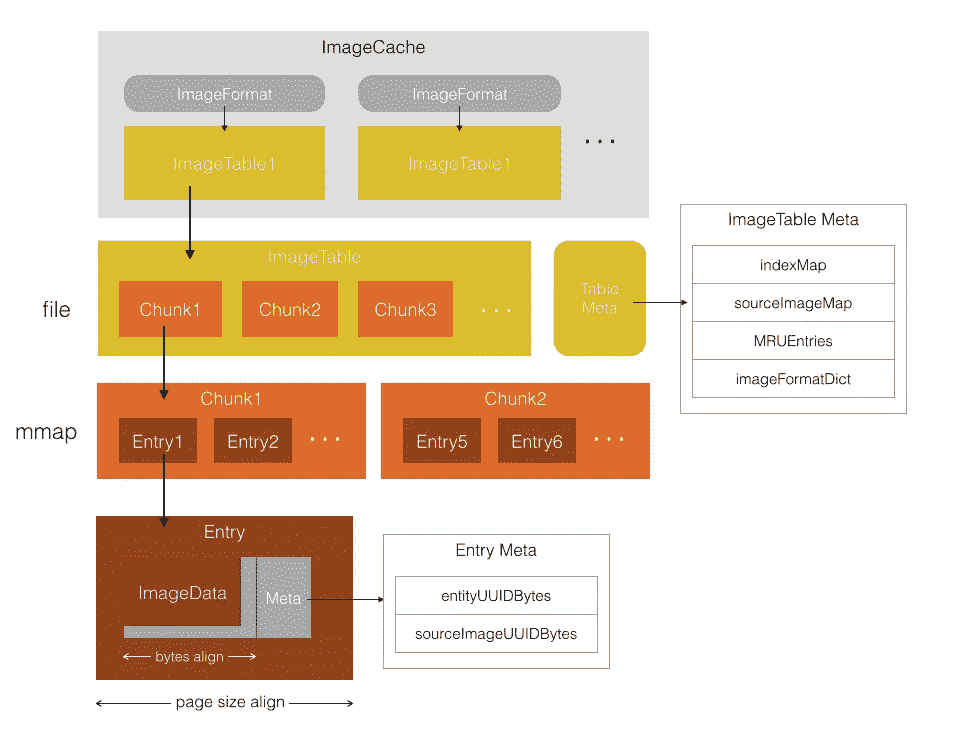](https://blog.cnbang.net/tech/2578/)

FastImageCache data structure

# FSCalendar

## 5 789 ★

## Pod 2.7.9

这是一个 iOS 快速日历开发库。使用 FSCalendar，您可以为兼容 Objective-C 和 Swift 的 iOS 应用程序创建令人惊叹的日历，而无需从头开始编写代码，从而获得更快的开发体验。

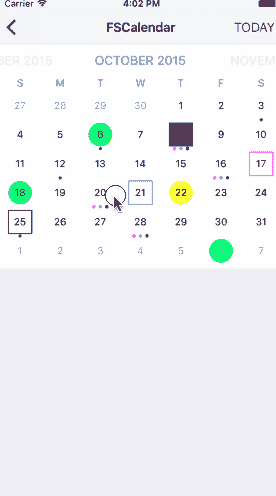

您可以使用 [Cocoapods](http://cocoadocs.org/docsets/FSCalendar/2.7.9/) 轻松安装它。

安装后，您可以使用以下方式将其包含在您的 iOS8+应用程序中:

`use_frameworks!`

`target '<Your Target Name>' do`

`pod 'FSCalendar'`

`end`

对于您的 iOS7+应用程序，使用:

`target '<Your Target Name>' do`

`pod 'FSCalendar'`

`end`

要在 iOS7+中使用它，您需要 [NSCalendarExtension](https://github.com/WenchaoD/NSCalendarExtension) 来实现兼容性。查看 [Github](https://github.com/WenchaoD/FSCalendar) 页面了解更多信息。

# XLForm

[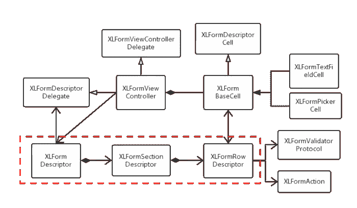](https://www.jianshu.com/p/47e96d025742)

XLForm structure

## 4 799 ★

## Pod 4.0.0

寻找一个用于创建表格视图表单的 iOS 库？

XLForm 是用于开发动态表格视图表单的最强大、最高效和可定制的库之一。开发变成了一种很好的体验，你可以节省很多时间并获得很好的结果。

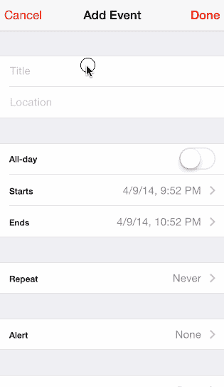

假设你可以吃你的蛋糕，并且拥有它。

XLForm 可以使用 Cocoapods 轻松安装。

可以使用以下命令将其添加到 pod:

`pod 'XLForm', '~> 4.0'`

然后:

`pod install`

如果您更喜欢使用 Swift 进行开发，XmartLabs 这个伟大库的创建者还创建了 [Eureka](https://github.com/xmartlabs/Eureka) 来更好地使用 Swift 创建表单。

了解更多关于 [Github](https://github.com/xmartlabs/XLForm) 的信息。

# JTAppleCalendar

## 4 082 ★

## Pod 7.1.4

就像 FSCalendar 一样，JTAppleCalendar 也可以用来创建可爱的日历，它的设计非常棒，也非常具有可定制性。您可以轻松创建自定义单元格和日历视图。

它是使用 [Cocoapods](http://cocoadocs.org/docsets/JTAppleCalendar/7.1.1/) 安装的。您可以使用以下方式将 JTAppleCalendar 集成到项目中:

`source 'https://github.com/CocoaPods/Specs.git'`

`platform :ios, '10.0'`

`use_frameworks!`

`target '<Your Target Name>' do`

`pod 'JTAppleCalendar', '~> 7.0'`

`end`

然后，运行以下命令:

`pod install`

可以从 [GitHub](https://github.com/patchthecode/JTAppleCalendar) 和[官网](https://patchthecode.github.io/)了解更多。

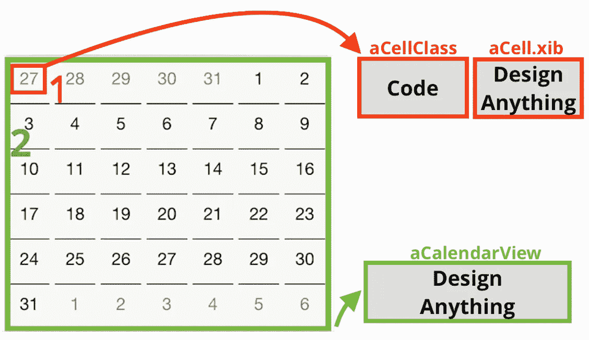

# JLRoutes

## 3 953★

## Pod 2.0.5

这是一个用于 URL 路由的 iOS 库，只使用了一个简单的基于块的 API。JLRoutes 由 Joel Levin 创建，它的作用是在你的 iOS 应用程序中有效地管理方案的 URL 路由。

JL 路由之所以非常好用，是因为它支持通配符匹配和路由名称空间，从而使这个过程更加流畅，耗时更少。

使用[椰子](https://cocoapods.org/pods/JLRoutes)安装 JLRoutes。

也可以使用 Carthage 进行安装。简单补充一下

`github "joeldev/JLRoutes" to your Cartfile.`

查看 [Github](https://github.com/joeldev/JLRoutes) 页面和[官方文档](http://cocoadocs.org/docsets/JLRoutes/)。

[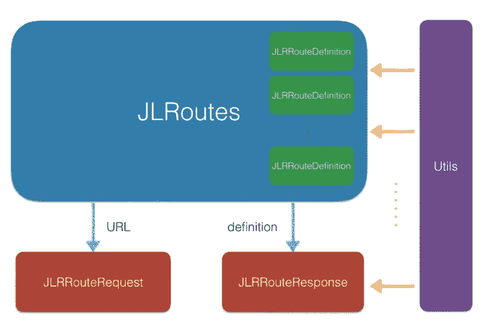](https://www.jianshu.com/p/d24e9a7c8d4e)

JLRoutes frame structure

# JBChartView

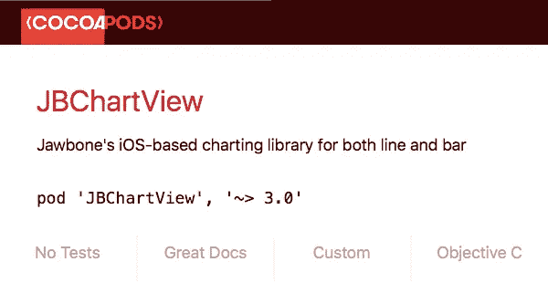

## 3 752 ★

## Pod 3.0.13

在开发过程中的某个时刻，需要将数据可视化以供用户查看。有了 JawBone 创建的 JBChartView，就更容易了。

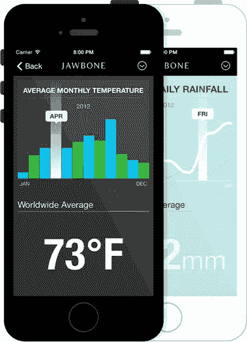

JBChartView 是一个基于 iOS 的线图和条形图图表库。它使得创建漂亮的图表变得更加容易和快速。另外，它还提供了许多定制选项。

除了支持创建线图和条形图，它还支持嵌入式 UI 视图子类和动画的展开和折叠。

可以使用 Cocoapods 安装 JBChartView，然后通过将以下命令添加到 podfile 中，将 jbc hartview 添加到您的项目中:

`platform :ios, '6.0'`

`pod 'JBChartView'`

了解更多关于 [Github](https://github.com/Jawbone/JBChartView) 的信息。

# BFMSimpleLineGraph

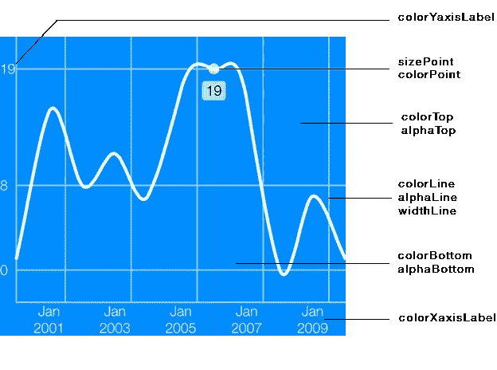

## 2 665 ★

## Pod 4.1

这是另一个用于 iOS 的图表库。BFMSimpleLineGraph 是一个库，它可以帮助开发人员为他们的应用程序创建高质量的线图，并且具有很好的可定制性。

缺点是除了线图之外，它不支持任何其他图形类型，但是，这并不意味着它不太有用，因为它也可以创建交互式图形。

这是一个易于安装的库，是轻量级的，没有依赖性的问题。

说到设置，您可以使用 Cocoapods 来完成，只需将以下命令添加到 podfile 中:

`pod 'BEMSimpleLineGraph'`

github link(2660 颗星):

查看 [Github](https://github.com/Boris-Em/BEMSimpleLineGraph) 页面和[官方文档。](https://github.com/Boris-Em/BEMSimpleLineGraph/wiki)

# FontAwesomeKit

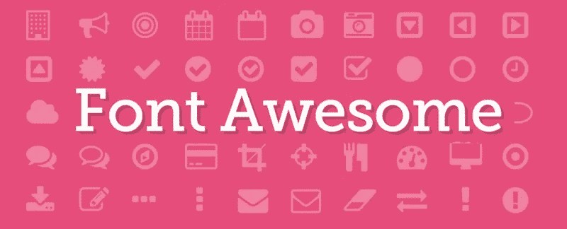

字体类型差的应用是什么？这很可能是一个用户界面很差的应用程序。

FontAwesomeKit 是由 Pride Chung 创建的 iOS 库，通过选择优秀的字体，可以更容易地创建漂亮的应用程序设计。

它对许多字体提供者有很大的支持:

目前，FontAwesomeKit 支持 6 种不同的图标字体，如 FontAwesome 4.7、 [Foundation](https://dashbouquet.com/blog/web-development/top-5-most-popular-css-frameworks-that-you-should-pay-attention-to-in-2017) icons、Zocial、ionicons、Octicons 和 Material 2.0.0。

使用 Cocoapods，通过将以下内容添加到 podfile，可以很容易地安装它:

`pod 'FontAwesomeKit', '~> 2.2.0'`

[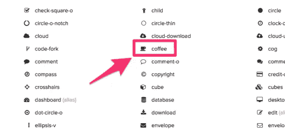](http://vdeep.net/swift-fontawesomekit)

也可以使用以下方法将字体库添加到 podfile 中:

`pod 'FontAwesomeKit/FontAwesome'`

`pod 'FontAwesomeKit/FoundationIcons'`

`pod 'FontAwesomeKit/Zocial'`

`pod 'FontAwesomeKit/IonIcons'`

`pod 'FontAwesomeKit/Octicons'`

`pod 'FontAwesomeKit/Material'`

然后，可以使用以下命令运行 podfile:

`pod install`

访问 Github 页面。

# 包装它

库的使用使得开发过程变得更皇家和更快，我们已经看过的库具有很大的能力。

然而，这并不是说它们是唯一的 iOS 库，还有更多。

所讨论的库的概述:

*   **Lottie-Ios** 为动画。
*   **变色龙**， **FontAwesomeKit** 进行设计。
*   **FSCalendar** ， **JTAppleCalendar** 用于可定制的日历。
*   **XLForm** 用于表单创建。
*   **JLRoutes** 用于 URL 路由。
*   **JBChartView** ，**bfmssimplelinegraph**用于数据可视化。

你还在等什么？

去那些在你的项目中使用的库。

[*安东·沙利尼科夫*](https://www.linkedin.com/in/anton-shaleynikov-45812a1/) 写的