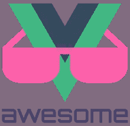
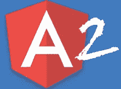
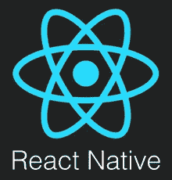
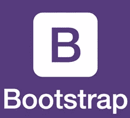

# GitHub 上十大最受欢迎的 JavaScript 项目

> 原文：<https://medium.com/hackernoon/top-10-most-popular-javascript-projects-on-github-cc5152e6d4a1>

几乎不可能统计 GitHub 上的所有项目，更不可能定义哪些是最优秀的。如果我们谈论 Javascript，曾经令人难以置信的创新会在几个月内变得过时。为了不被海量的项目埋没，让我们来看看 2016 年 GitHub 上最火的 Javascript 项目。

# 1.Vue。射流研究…

Vue.js 是 2016 年的赢家，获得了超过 25，000 颗星，甚至超过了 React 和 Angular。它是一个用于构建 UI 的渐进式开源框架。它的核心库只关注视图层，这允许将 Vue.js 与其他库或项目轻松集成。同样，Vue.js 可以结合现代工具处理单页面应用程序。

Vue.js 与 React 有一些相似之处，比如:使用虚拟 DOM 和提供可反应和可组合的视图组件。由于其简单的核心和可增量采用的堆栈，Vue.js 被认为是非常通用的。

# 2.反应

React 在 GitHub 上获得了 2016 年第二名，也引起了我们的关注。我们已经写了几篇关于 React 及其与 Angular 的比较的文章，所以如果你想刷新你的记忆， [**点击这里**](https://hackernoon.com/comparing-angular-and-react-dashbouquet-2-years-experience-e052001fb8ca) 。

React 是一个开源库，用途和 Vue.js 一样——构建用户界面。它非常受欢迎，用户包括网飞、Buffer、Imgur 等巨头。

使用 React，开发人员可以创建大型 web 应用程序，这些应用程序的数据可以随时间变化，并且不需要重新加载页面。React 力求快速简单，非常适合具有复杂业务逻辑的应用程序。

# 3.故事

Yarn 不同于 Vue.js 和 React，因为它是代码的包管理器。它的主要目标是让全世界的开发者安全快速地共享他们的代码。Yarn 使用所谓的包来共享代码，这些包包含所有共享的代码。

如果 Yarn 没有几个非常重要的特性，它不会进入 GitHub 的前三名。这项服务非常快:它将操作并行化，以便最大限度地利用资源，从而加快安装时间。Yarn 还优先保证其安全性，并利用校验和来验证每个包的完整性。

它的另一个特点是 Yarn 非常可靠，它可以确保一个安装程序在另一个系统上的工作效率与在您的系统上的工作效率相同。

# 4.角度 2

Angular 是我们在博客中提到的另一个框架。比较反应，你不能说哪一个更好，因为他们都有优点和缺点。

谷歌支持 Angular，因此它是为谷歌开发的应用程序的绝佳选择。如果你需要快速完成某件事，也可以考虑 Angular 它非常适合快速且不太复杂的 UI 解决方案。

这个框架的特点包括代码生成、代码拆分以及高生产率和高性能。

# 5.电子

前十名中的第五名是 Electron——GitHub 的开源框架。它通过使用前端和后端组件来开发桌面 GUI 应用程序。

Electron 前端使用 Chromium，后端使用 Node.js，因此允许用 HTML、CSS 或 JavaScript 构建应用程序。它也是跨平台的，可以在 Linux、Windows 或 Mac 上运行。

# 6.创建 React 应用

Create React App 是快速启动 React 应用的有用工具。你不需要花时间来设置网络包，巴别塔和工具，因为一切都已经设置好了。这使得开发人员可以直接关注代码和应用程序的业务逻辑。

Create React App 是一个具有基本结构的 CLI 界面，它向 package.json 添加了用于运行、测试和构建的脚本。另外的优势是缺少 webpack.config、大量的*rc 文件以及 package.json 中的相关性。

# 7.反应自然

该框架用于使用 React 构建原生 iOS、Windows 和 Android 应用。React Native 使用与 iOS 或 Android 应用程序相同的 UI 构建模块，这就是你的应用程序与用 Java 或 Objective-C 构建的应用程序没有区别的原因。

为了节省时间，在 React Native 中工作时不需要重新编译。相反，你可以立即重新加载你的应用程序。为了给它一个额外的触动，React Native 平滑地与 Objective-C 或 Java 中的组件相结合。

# 8.Redux

Redux 是 JavaScript 中应用程序的可预测状态容器。使用 Redux 将帮助您编写一致的应用程序，并在各种环境中运行。让它脱颖而出的是实时代码编辑功能，它有助于扩展您的开发经验。

Redux 既可以与 React 一起使用，也可以与其他视图库一起使用。Redux 有助于创建通用应用程序，并且不允许查看器或网络回调直接写入状态(它们更愿意表达一种转换状态的意图)。

# 9.引导程序

Bootstrap 是一个免费开源的前端 web 框架。它不同于其他 web 框架，因为 Bootstrap 只关注前端开发。Bootstrap 源代码使用 Less 和 Sass。

Bootstrap 包含基于 HTML 和 CSS 的设计模板以及 JavaScript 扩展。从 2.0 版本开始，它支持响应式 web 设计，3.0 支持谷歌 Chrome、Firefox、Safari、Opera 和 Internet Explorer。

# 10.D3

D3.js 是一个用于文档操作的 js 库。它使您能够将任意数据绑定到 DOM，然后将转换应用到文档。

D3 支持大型数据集，允许代码重用，并基于数据有效地操作文档。为了实现它的功能，它使用 HTML、SVG 和 CSS。

我们已经查看了 2016 年 GitHub 上排名前十的 JavaScript 项目，毫无疑问，更多的项目将很快出现。关注[dash bounk news](https://dashbouquet.com/blog)了解 IT 行业的最新消息。

[*德米特里·武科写的*](https://www.linkedin.com/in/dmitrybudko/\)

*想了解更多信息？* [*在这里查看*](https://dashbouquet.com/blog)