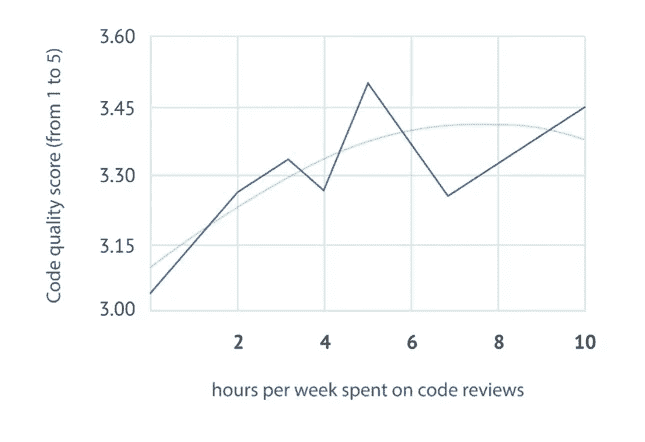
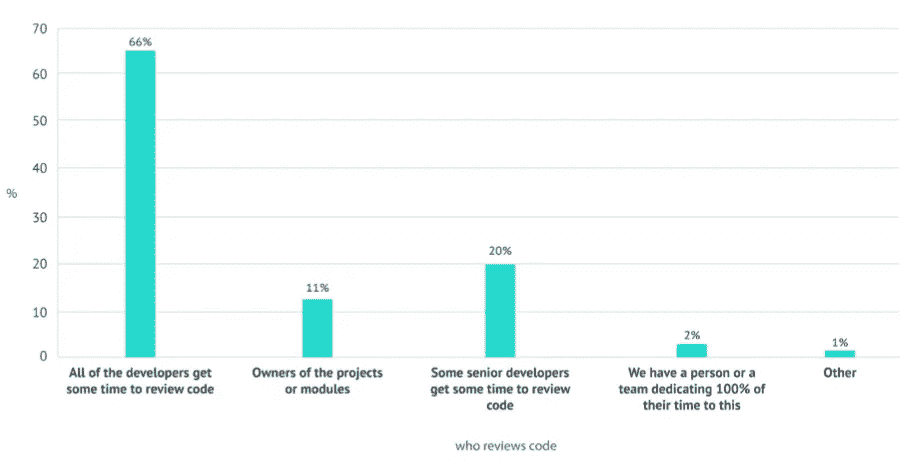
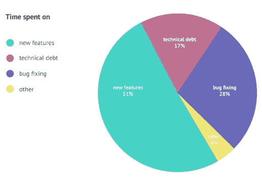
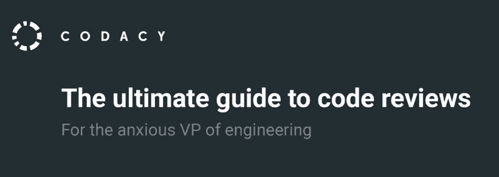

# 更快的代码评审和更好的代码质量的 10 大障碍

> 原文：<https://medium.com/hackernoon/top-10-obstacles-to-faster-code-reviews-and-better-code-quality-5b185df21577>

## 这是一个简短而甜蜜的故事，讲述了关于代码质量和代码评审的重要事实。你也可以在我们的 [*电子书*](https://goo.gl/9cCjDZ) *中读到更多这方面的内容。*

680 家公司被问及他们的代码质量和[代码评审](https://hackernoon.com/tagged/code-review)实践。以下是 10 条最令人信服的[经验。](https://hackernoon.com/tagged/compelling)

A Soviet inspector reviews a BGM-109G Tomahawk ground launched cruise missile.

> 披露: [**自动化代码评审平台 Codacy**](https://goo.gl/SvwMy7) 此前曾赞助过黑客 Noon。对于《黑客正午》的读者来说，他们使用这个代码 [**提供 15%的折扣:HACKERNOON**](https://goo.gl/SvwMy7) **。**

# 事实

我们花了大量时间审查代码。事实上，我们平均每周花 **5 个小时审查代码，或者说一周有** 12.5 **的时间在看代码**。

作为一名开发人员，每周花超过**天的时间**审查代码**与感知代码质量的提高或者花更多时间发布新功能**没有关系(与修复 bug 或者偿还技术债务相反)。

Diminished returns: spending more than a day per week reviewing code does not correlated with better perceived code quality

3 45%的开发人员说'**缺乏时间'是审查代码的真正障碍**，而 **34%的人说'出货压力'**。

4

5 **66%的开发人员要求 1 个人批准他们的拉取请求**。25%需要 2 个人。不到 5%需要 2 个以上。

6 **53%的人监控代码覆盖率，但 65%的人没有代码覆盖率的最低阈值**来批准拉取请求。

7 **29%的开发人员**说**他们项目中最大的问题是“工作量”**，而工程师和总监的副总裁们则说“**交付速度**”。开发者的第三大问题是“**管理**”

Who gets to review code? Two thirds of companies prefer the all hands on deck approach to code review.

8 关于由谁来评审代码，让团队中的每个人来评审**是最常见的做法。其他选择是让项目或模块的所有者或者让高级开发人员审查大部分代码。**

9 **更严格的代码审查**导致**更少的时间修复 bug**和**更多的时间交付新特性。**不太严格的代码评审员花 31%的时间修复 bug，而更严格的评审员花 24%。关于关注新功能的时间:43%和 54%对应。

开发人员花费 45%的时间来修复 bug 或解决技术债务，而不是开发新功能。

Time spent on average per activity during development

## 你也可以在我们关于代码评审的新电子书中读到更多关于这一点和其他伟大的知识:

Click to get the ebook