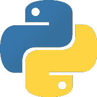
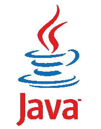
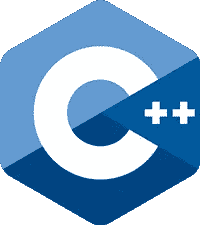
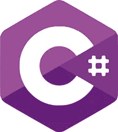
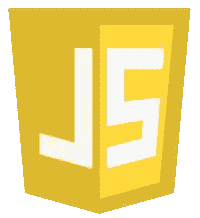
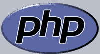
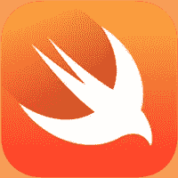
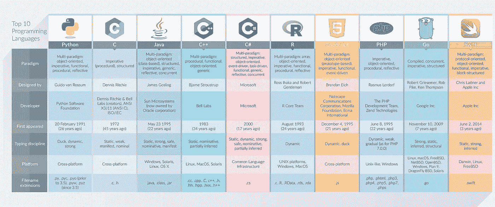

# 2017 年十大编程语言

> 原文：<https://medium.com/hackernoon/top-10-programming-languages-in-2017-2f22e918fbfd>

编程是一件庞大而又非常个性化的事情，因为每个开发人员都会选择对他们最方便的工具。然而，某些语言、平台和框架声称自己是最容易使用和最有效的。因此，我们为您收集了当今最受开发者喜爱的 10 种编程语言。你最喜欢哪一个？

# 1.计算机编程语言

Python 是一种动态的通用语言，强调代码可读性，使开发人员能够使用更少的代码行(与 Java 或 C++相比)。它支持多种编程范例，并拥有一个大型标准库。

开发人员喜欢这种语言，因为它有清晰的语法、良好的 OOP 支持和很棒的快捷方式。

# 2.C

c 是一种通用命令式语言，支持结构化编程、递归和词法变量作用域。它旨在鼓励跨平台编程，可用于许多平台。

这种语言的价值在于清晰，提供了对硬件的访问，并使得创建微小的二进制文件成为可能。

# 3.Java 语言(一种计算机语言，尤用于创建网站)

Java 是全世界开发者的首选之一。这种语言是面向对象和基于类的，遵循“WORA”原则:一次编写，随处运行。

人们喜欢 Java 是因为它的并发性(例如，比 Python 更好)，种类繁多的库和稳定良好的性能。社区也很大，这意味着 Java 爱好者总能得到很多支持。

# 4\. С++

这种语言是编译的、命令式的和面向程序的，允许低级内存操作。C++影响了许多其他语言，如 C#或 Java，并被用于各种目的。

使它脱颖而出的关键特性是强大的静态类型系统(可以在编译时捕捉更多的错误)，能够在一些编程风格中使用它，良好的性能和表达能力。

# 5.C#

c 夏普在过去的一年里越来越受欢迎。它是一种面向对象的多范例语言，包含许多学科。C#是由微软开发的，被指定用于公共语言基础设施。

尽管 C#不像 Java 或 Python 那样普及，但它也有支持者，他们欣赏 C #缺少头文件、宏和模板，以及 LINQ 和匿名类型的存在。

# 6.稀有

这是一种用于统计计算的开源语言，在数据挖掘者和统计学家中非常流行。这种语言是一个 GNU 包。

优点包括它的包装生态系统，它的广阔性和所有的图表优势。

# 7.Java Script 语言

JS 是基于对象的动态语言，是 WWW 内容制作的核心技术之一。尽管有些人倾向于认为 Java 和 JS 是相同的(或者至少是非常相似的)语言，但是 JavaScript 主要受 Self 和 Scheme 的影响。

JavaScript 越来越受欢迎，并被列入 2017 年最热门的网络发展趋势。

# 8.服务器端编程语言（Professional Hypertext Preprocessor 的缩写）

它是一种为 web 开发而设计的服务器端通用语言。PHP 被认为相当容易学习，经常被初级开发人员选择。

开发人员也喜欢它的可移植性，它为一系列网络问题提供了许多高质量的解决方案，并且有许多框架。

# 9.去

Go 由谷歌创建，是一种开源语言。它经过编译，具有垃圾收集、内存安全和有限的结构类型等特性。

如果您使用网络应用程序和 web 服务器，这确实是一个不错的选择。Go 在不同平台上的表现也是一致的，这也是一个很好的特性。

# 10.迅速发生的

Swift 是苹果开发的多范式语言，是 iOS 开发者的首选之一。它支持后期绑定、可扩展编程和动态调度等概念。

尽管 Swift 是一种相对较新的语言，但它在 2017 年也受到了欢迎，总体看起来很有前景。

在[dash bounk](https://dashbouquet.com/)我们个人更喜欢 JavaScript，因为我们从事的项目。然而，我们总是乐于学习新的东西，我们不会将我们的技能局限于某一种语言或框架。告诉我们你想要什么，我们会想出最好的方法来实现它。

[*安东·沙列尼科夫*写的](https://www.linkedin.com/in/anton-shaleynikov-45812a1/)

*想了解更多信息？* [*查看此处*](https://dashbouquet.com/blog)