# GitHub 上的十大反应库

> 原文：<https://medium.com/hackernoon/top-10-react-libraries-on-github-ebf730e7ac25>

由脸书创建的 React 已经成为一个非常强大的 JavaScript 框架，使得程序员更容易进行前端开发。如果您已经花了一些时间使用 React JS，您会同意其他一些库也需要与 reactor 一起使用，以获得最好的体验。

从经验来看，使用开源项目对开发人员来说是非常重要的事情，随着大量基于 React JS 的库在 Github 上可用，我们有很多选择。尽管有很大的选择，但最好缩小到几个框架和库。因此，本文讨论了 GitHub 上的十大反应库，所讨论的库按其各个存储库中的星形数排列。在不浪费时间的情况下，让我们进入事情的最深处。

# 材料用户界面

## **31，194{**

## **0 . 20 . 0 版**

## **依赖项 11**

材料用户界面是一个通过使用反应组件来实现谷歌材料设计的库。它使网页开发、创建优秀的用户界面和开发单页应用程序变得容易。

当使用服务器渲染的 Material-UI 时，开发人员必须对服务器和客户端使用相同的环境。

可以使用 npm 命令安装材料用户界面:

`npm install material-ui`

您可从 [GitHub 信息库](https://github.com/mui-org/material-ui)和[官网](http://www.material-ui.com/)了解更多信息。

# 蚂蚁-设计

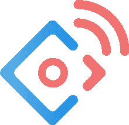

## 20,995 ★

## 3.0.1 版

## 依赖性 42

[Ant-Design](https://dashbouquet.com/blog/frontend-development/interesting-javascript-libraries-born-in-china) 是一个基于 react 的库，用于为您的 react 应用程序添加可爱的设计。专为设计桌面应用程序而创建，提供了令人愉快的开发体验，反过来也为用户带来了更好的体验。

这是一个中国图书馆。然而，它已经被志愿者正确地翻译了，使得说英语的开发者很容易使用。

您可以使用 npm 命令轻松安装 Ant-design:

`npm install antd`

Ant-Design 是一个非常受欢迎的库，所以您可以从 [GitHub 资源库](https://github.com/ant-design/ant-design)或[官网](https://ant.design/)找到很多信息。

# 故事书

## 16,559 ★

## 1.0.0 版

## 依赖性 12

在 Meteor 和 Firebase 等框架的帮助下，后端开发变得更加容易。反应故事书是一个为前端开发人员创建相同效果的库。

React Storybook 通过提供自己的 UI 开发环境，允许您在应用程序之外构建和设计 React 应用程序的 UI 组件，这使得开发团队中的其他人可以更容易地在他们自己的项目中使用 UI 组件。

您可以使用 npm 命令轻松安装 react storybook:

`npm i -g @storybook/cli`

`cd my-react-app`

`getstorybook`

安装完成后，您可以使用以下命令运行 React storybook:

`npm run storybook`

你可以从[官方网站](https://storybook.js.org/)以及官方 [GitHub 库](https://github.com/storybooks/storybook)找到更多关于这个伟大的库的信息。

# 盖茨比（姓）

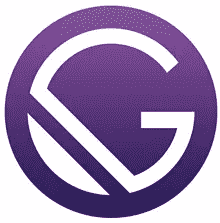

## 15,712 ★

## 版本 1.9.130

## 依赖性 51

Gatsby 是构建在 React JS 框架上的快速静态站点生成器。有了 Gatsby，您可以将纯文本转换成优秀的网站，而无需花费大量时间编写代码。

许多网站已经开始使用静态站点生成器来构建高质量的网站。有了 Gatsby，生成的网站以后可以很容易地维护，允许更容易地扩展 web 功能。

如果您作为一名开发人员已经花了足够的时间使用 React 框架，那么使用 Gatsby 会带来更好的开发体验。

您可以使用 npm 命令轻松安装:

`npm install gatsby`

它还附带了一个命令行工具，可以通过以下方式安装:

`npm install --global gatsby-cli`

关于这个库的更多信息可以在 [GitHub 库](https://github.com/gatsbyjs/gatsby)和[官方网站](https://www.gatsbyjs.org/)上查看。

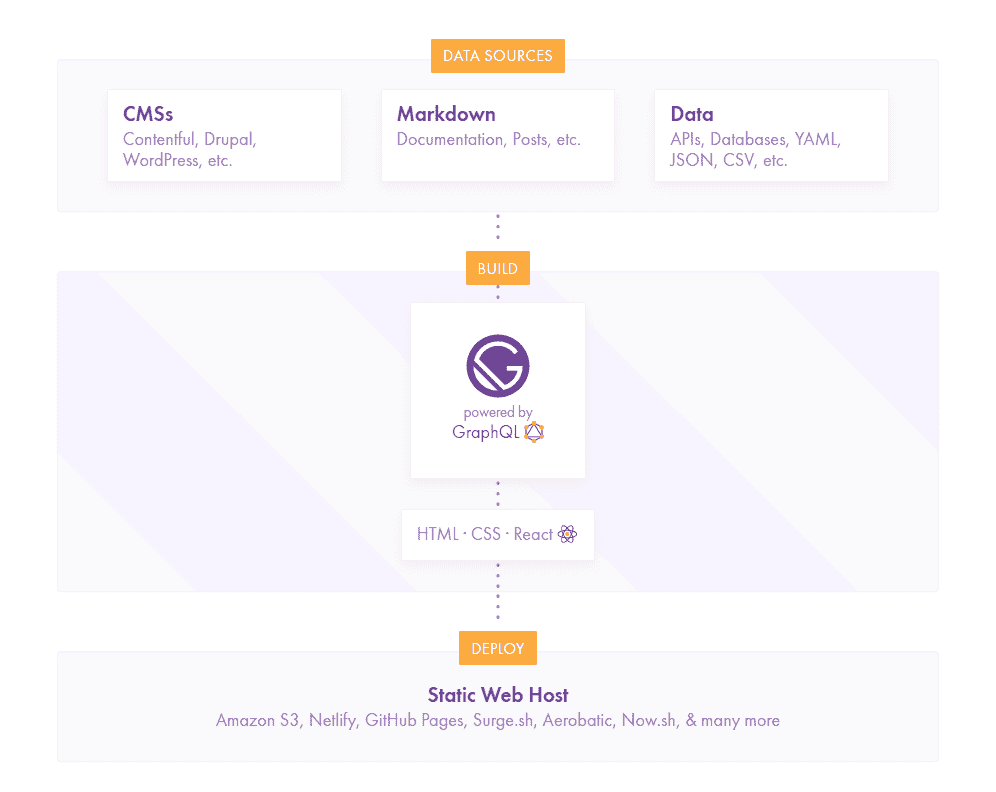

# 酶

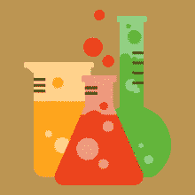

## 11,846 ★

## 版本 3.2.0

## 依赖性 11

Enzyme 是一个基于 React 的轻量级测试库，它是 React 的 JavaScript 测试工具。它还使得断言、操作和遍历 React 组件输出的任务变得更加容易。

 [## 酶:React 的 JavaScript 测试工具

### 作者利兰·理查森

medium.com](/airbnb-engineering/enzyme-javascript-testing-utilities-for-react-a417e5e5090f) 

它通过模仿 jQuery 的 DOM 操作和遍历 API(如 find、simulate 等)来实现这一点，并为不同类型的渲染(如 shallow、mount 和 static)提供了一个选项。

其他测试库如 Mocha，Expect，Chai，Jasmine 可以与酶一起使用，没有任何副作用。

Enzyme 非常易于使用和安装:

`npm install enzyme`

关于这个伟大图书馆的更多信息可以在 [GitHub 知识库](https://github.com/airbnb/enzyme)和[官方网站](http://airbnb.io/enzyme/)上查看。

# 蓝图

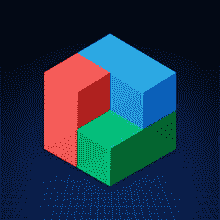

## 7,762 ★

## 版本 1.34.0

Blueprint 是一个基于 UI 的 react 工具包，对于使用大量代码为桌面应用程序构建复杂的 web 界面非常有效，并且鼓励重用。

这个库主要是为桌面应用程序而构建的，但是，也很有可能为移动应用程序添加一些特性。它也非常灵活，因为它可以与其他 JavaScript 框架一起使用，如 AngularJS、VueJS 等。

Blueprint 可以和 CSS、TypesScript 以及 JavaScript 一起使用。

可以使用 npm 命令轻松安装它:

`npm install blueprint`

更多信息来自 [GitHub 资源库](https://github.com/palantir/blueprint)和[官网](http://blueprintjs.com/)。

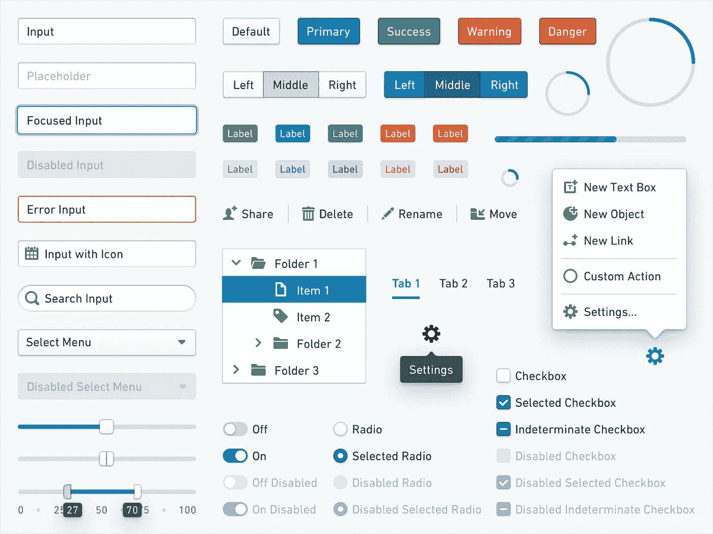

# 景象

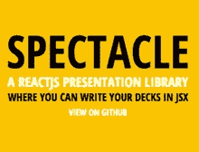

## 5,693 ★

## 版本 4.0.4

## 依赖性 16

telegraph 是一个基于 React 的库，用于为 web 演示创建高质量的动态幻灯片。您可以非常容易地使用 React 组件进行演示。

使用 specify 创建演示文稿要容易得多，因为它提供了开箱即用的组件，如<slide>和</slide>

> ，这使得使用大量 UI 实现构建演示文稿变得非常愉快。

可以使用 npm 安装眼镜:

`npm install spectacle`

这个库还具有一定的灵活性，因为您可以决定编写自己的构建配置或使用样板配置来使 web 演示看起来更好。

关于这个库的更多信息可以从 [GitHub 库](https://github.com/FormidableLabs/spectacle)和[官方网站](http://formidable.com/open-source/spectacle/)获得。

你写卡片组的`main.js`文件是`/presentation/index.js`。请看一个例子- [如何用眼镜制作演示文稿](https://hackernoon.com/presentations-with-spectacle-how-i-modularize-my-deck-775c082cef08)。

 [## 展示奇观——我如何模块化我的甲板

### 当我第一次接触到 specify 时，我喜欢它的易用性以及它是用 React 构建的。我写…

hackernoon.com](https://hackernoon.com/presentations-with-spectacle-how-i-modularize-my-deck-775c082cef08) 

# 元素用户界面

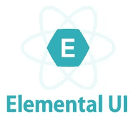

## 3,848 ★

## 版本 0.6.1

## 依赖性 2

Elemental UI 是一个非常灵活和高效的 UI 框架，用于构建具有优秀设计的 web 应用程序。

这个框架非常类似于 Material UI 框架，但是更加轻量级。对于 ReactJS 来说，这是一个灵活而漂亮的 CSS UI 框架。它被设计成从 npm 安装，并用 [Browserify 或 Webpack](https://dashbouquet.com/blog/frontend-development/javascript-build-tools-and-automation-systems) 构建到你的项目中。

使用 npm 可以轻松安装 Elemental UI:

`npm install elemental`

更多信息来自 [GitHub 资源库](https://github.com/elementalui/elemental)和[官网](http://elemental-ui.com/)。

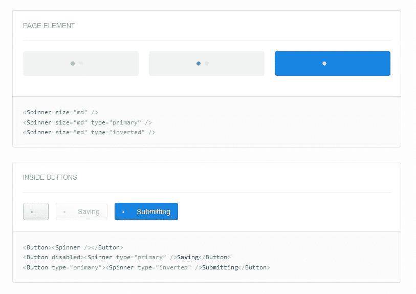

# 索环

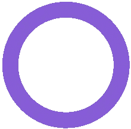

## 2,621 ★

## 版本 2 . 0 . 0-alpha 5

## 依赖性 8

Grommet 是一个基于 react 的库，用于改善 web 用户的体验。据他们称，这是“最先进的企业应用 UX 框架”。

这是一个非常灵活的库，它有用于仪表板、登录、搜索、仪表等的大规模组件，这种灵活性通过属性配置得到增强。

使用 Grommet 自带的开箱即用组件，您可以创建迷人的、可重用的用户界面元素，为用户提供使用 web 应用程序的良好体验。

索环组件是可访问的，跨浏览器兼容，也支持主题定制。

可以使用 npm 安装索环:

`npm install -g grommet`

更多信息来自 [GitHub 资源库](https://github.com/grommet/grommet)和[官网](http://grommet.io/)。

最快的开始方式是访问 Hello World 页面。

# 莫扎克

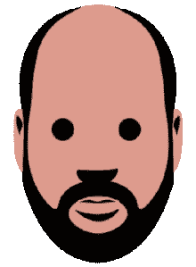

## 2,284 ★

## 版本 1.4.4

## 依赖性 31

Mozaik 是一个很棒的库，可以为 web 应用程序创建可爱的仪表板。

它提供了很好的定制选项，因为它提供了一个响应式的布局。这意味着它可以在所有平台上运行，无论是大屏幕还是智能手机。

有了 Mozaik，开发者也可以使用许多主题和选项来创建个性化的主题。它支持网格定位、优化的后端通信，并且在需要时可以选择使用多个仪表板。

更多信息来自 [GitHub 资源库](https://github.com/plouc/mozaik)和[官网](http://mozaik.rocks/)。

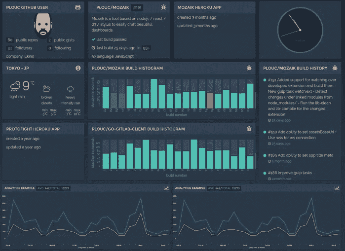

# 包装它

这就是了。

上面讨论的库在执行任务时非常有效。这些库可用于:

*   设计优秀的用户界面
*   创造迷人的用户体验
*   测试 JavaScript 和 React 代码
*   生成静态网站

这些库中的每一个都利用了 React JS 框架的特性和组件，在开发过程中提供了更简单的体验。

[*安东·沙列尼科夫*写的](https://www.linkedin.com/in/anton-shaleynikov-45812a1/)