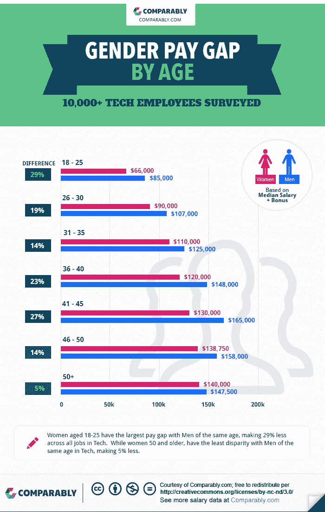
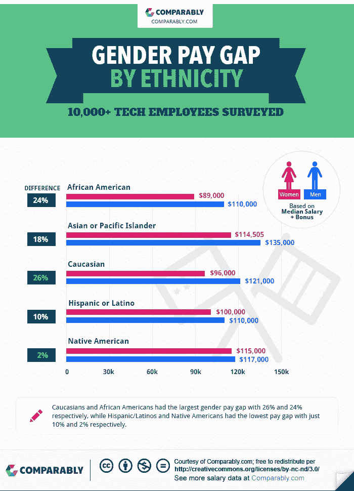
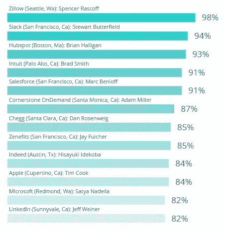

# 多元化十大科技公司

> 原文：<https://medium.com/hackernoon/top-10-tech-companies-for-diversity-2a371ac10af4>

## Salesforce、Linkedin 和 Intuit 在性别和种族方面都是前 5 名。

根据 TechCrunch 最近的一份报告，在现已离职的谷歌工程师詹姆斯·达莫尔(James Damore)对谷歌的多元化举措进行了长达 10 页的抨击之后，工作场所文化和公司评估平台[也发布了一份排名，列出了有色人种的 10 大科技公司以及女性的 10 大科技公司。](https://medium.com/u/84433c36a468?source=post_page-----2a371ac10af4--------------------------------)

反多样性文件的存在首先被[主板](https://motherboard.vice.com/en_us/article/kzbm4a/employees-anti-diversity-manifesto-goes-internally-viral-at-google)报道，后来被 [Gizmodo](http://gizmodo.com/exclusive-heres-the-full-10-page-anti-diversity-screed-1797564320) 全文公布。

“我重视多样性和包容性，不否认性别歧视的存在，也不赞同使用刻板印象，”备忘录中写道。“在解决人口代表性的差距时，我们需要研究人口水平分布的差异。如果我们不能对此进行诚实的讨论，那么我们就永远无法真正解决问题。心理安全建立在相互尊重和接受的基础上，但不幸的是，我们羞辱和歪曲的文化不尊重和不接受其回音室之外的任何人。”

以下是 Comparably 汇编的完整性别列表:

*   销售队伍(82)
*   Adobe (80)
*   直觉(80)
*   T-Mobile (79)
*   领英(79)
*   埃森哲(79)
*   贝宝(78)
*   工作日(78)
*   苹果公司(78)
*   脸书(77)

以下是比赛名单:

*   VMWare (81)
*   迪士尼(80)
*   领英(80)
*   销售队伍(79)
*   直觉(79)
*   谷歌(78)
*   T-Mobile (78)
*   戴尔(78)
*   脸书(78)
*   赛门铁克(77)

早在六月，Comparably 就发布了一份[薪酬差距报告](https://www.comparably.com/blog/the-gender-pay-gap-in-tech/)调查了科技行业的 10，000 多名员工。

该公司表示:“进入科技行业的女性与男性的差距最大。”。“而 50 岁以上的女性最少。”

为了给科技行业的性别薪酬差距提供一个积极的替代方案，Comparably 还挖掘了其数据，以揭示哪些公司、首席执行官和城市为女性提供了最佳的文化契合度和薪酬机会。

“十几名首席执行官获得了女性员工 80%以上的支持率，”[在他们的报告](https://www.comparably.com/blog/women-in-tech-study/)中写道。“苹果、Intuit、LinkedIn 和微软的首席执行官获得了女性员工的高支持率，尽管他们各自的公司都没有入选。”

Comparably 说，毫不奇怪，一半的公司位于硅谷和西雅图。

“排名前五的大型公共科技公司根本没有入选，”报告称。