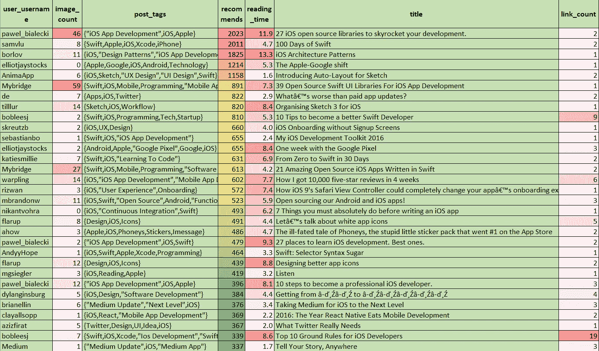
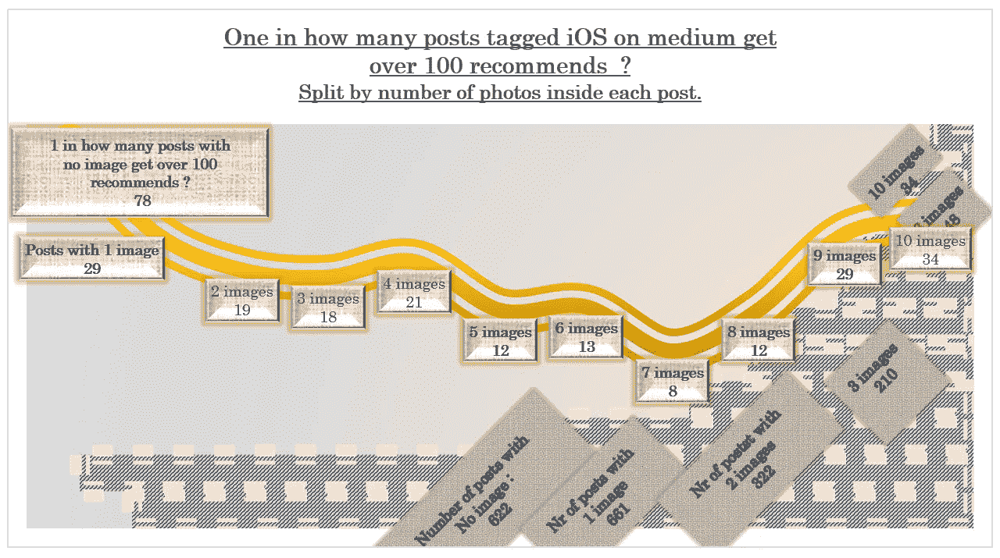

# 截至 2017 年 1 月，在媒体上撰写的前 100 篇 iOS 文章(只有 3 名女性作家名列前茅)

> 原文：<https://medium.com/hackernoon/top-100-ios-articles-written-on-medium-until-jan-2017-only-3-womans-in-the-top-aa101451246c>

> 2017 年 1 月，总共有 **2650 篇文章在媒体上标记为 iOS，**由 1500 人撰写。
> 
> 如果你想让**读完所有的**，你就需要**每天读 5 个小时，坚持 30 天。**
> 
> 阅读**前 100 篇文章需要的时间？九个小时。**

一篇文章的平均阅读时间？3.3 分钟。

前 100 篇文章的平均阅读时间？5.4 分钟。

# 在媒体上标记 iOS 的前 100 篇文章中，有 97 篇文章是由 man 撰写的。

# 只有 3 篇文章是由一个女人写的。你可以跟着走:

凯蒂·斯迈利排名第 13。

Agnes Vasarhelyi 排名第 46 位。

阿德林 60 级。

## 注意。数据比较老，我已经收集了 2016 年 12 月—2017 年 1 月的数据。

去年我去了美国三个月，在旧金山市，在德雷珀大学学习企业家精神。

我开始放弃 medium.com，目的是让自己作为一名数据科学家受到关注，这样我就可以作为一名数据科学家/增长黑客被雇佣/加入一家初创公司。我现在有一个 20Gb 的数据库，有来自 medium 的 600 万个帖子。

我 1 月份回到了罗马尼亚，计划寻找机会回到美国，直到 2017 年 12 月。然后，罗马尼亚政府搞砸了我的计划。

二月份，罗马尼亚政府想要将腐败和贿赂合法化。通过我 2 年前创建的 FB 页面“腐败害死人”,我花时间协助组织了罗马尼亚历史上最大的抗议活动(约 60 万人参与) (我们大量使用 Slack ),还做了一些公民项目，在过去的 6 个月里，我直到现在才有时间处理我从[媒体](https://medium.com/u/504c7870fdb6?source=post_page-----aa101451246c--------------------------------)获得的数据。

> 布加勒斯特，2 月 10 日(路透社)——2 月 1 日，在罗马尼亚政府发布了一项被视为逆转该国反腐败斗争的法令几个小时后，弗罗林·巴蒂塔(Florin Badita)从他在西部城市克卢日的工作中停薪休假，前往首都布加勒斯特帮助动员应对措施。
> 
> 这不是他的第一次。
> 
> 通过他在 2015 年创建的脸书页面 Coruptia Ucide(腐败致死)，巴蒂塔在那年 10 月布加勒斯特的 Colectiv 夜总会发生致命火灾后，帮助召集了抗议者。政府垮台了，人们对官员贪污和疏忽文化的愤怒爆发了，正是这种文化使俱乐部无视安全条例。
> 
> 一年多一点后，巴蒂塔蹲在布加勒斯特胜利广场附近一个潮湿的地下室公寓里，其他几名活动人士趴在笔记本电脑前发布链接、上传视频和咨询抗议时间。
> 
> “这些抗议没有领袖，”这位身材瘦长的 28 岁地图分析师说，“充其量他们有推动者。”

 [## “我们看见你”——罗马尼亚活动家成为强大的政治力量

### 布加勒斯特，2 月 10 日(路透社)-2 月 1 日，在罗马尼亚政府颁布了一项法令被视为扭转…

www.dailymail.co.uk](http://www.dailymail.co.uk/wires/reuters/article-4211874/We--Romanian-activists-potent-political-force.html) 

# 在 medium 上标记 iOS 的前 100 篇 medium 帖子(2017 年 1 月)

1.中级用户[pawebiaecki](https://medium.com/u/f21b55463ffa?source=post_page-----aa101451246c--------------------------------)总共得到了 2023 条推荐，标题是“27 个 iOS 开源库让你的开发突飞猛进。”。
帖子有以下标签:“iOS 应用开发”，iOS，苹果。
文章阅读时间 11.9 分钟。
帖子包含 2 个链接和 46 张图片。

 [## 27 个 iOS 开源库让您的开发突飞猛进。

### 你不想错过他们。真的。

medium.com](/app-coder-io/27-ios-open-source-libraries-to-skyrocket-your-development-301b67d3124c) 

2.媒体用户 [Sam Lu](https://medium.com/u/dbef7d3f1ce0?source=post_page-----aa101451246c--------------------------------) 共获得了 2011 年题为“Swift 100 天”的帖子的推荐。这篇文章有以下标签:Swift，苹果，iOS，Xcode，iPhone。
文章阅读时间 4.7 分钟。帖子包含 2 个链接和 8 张图片。

 [## Swift 天

### 学习苹果新的编程语言

medium.com](/@samvlu/100-days-of-swift-736d45a19b63) 

3.中型用户 [Bohdan Orlov](https://medium.com/u/632fc0b37c99?source=post_page-----aa101451246c--------------------------------) 总共得到了 1825 条关于“iOS 架构模式”的推荐。
帖子有以下标签:iOS，“设计模式”，“iOS 应用开发”，Swift，“移动应用开发”。
文章阅读时间 13.3 分钟。
帖子包含 1 个链接和 11 张图片。

 [## iOS 架构模式

### 揭秘 MVC，MVP，MVVM 和毒蛇

medium.com](/ios-os-x-development/ios-architecture-patterns-ecba4c38de52) 

4.媒体用户 Elliot Jay Stocks 得到了总共 1214 条关于“苹果-谷歌转变”的推荐。
帖子有以下标签:[苹果](https://hackernoon.com/tagged/apple)，[谷歌](https://hackernoon.com/tagged/google)，iOS，Android，科技。
文章阅读时间 5.3 分钟。
帖子包含 1 个链接和 0 张图片。

 [## 苹果-谷歌的转变

### 在过去的几年里，发生了两件截然不同的事情——或者更确切地说，正在发生——

medium.com](/@elliotjaystocks/the-apple-google-shift-bf5949c82d0f) 

5.中端用户 [Anima App](https://medium.com/u/a4dc7eadf5d5?source=post_page-----aa101451246c--------------------------------) 共获得 1158 条推荐，标题为“介绍草图自动布局”。
帖子有以下标签:iOS，Sketch，“UX 设计”，“UI 设计”，Swift。
文章阅读时间 1.6 分钟。
帖子包含 2 个链接和 6 张图片。

 [## 草图自动布局简介

### 草图中的响应性设计

medium.com](/sketch-app-sources/introducing-auto-layout-for-sketch-24e7b5d068f9) 

6.中型用户 [Mybridge](https://medium.com/u/68abb2e6c9bb?source=post_page-----aa101451246c--------------------------------) 共获得 891 条推荐，为题为“iOS 应用开发的 39 个开源 Swift UI 库”的帖子。
帖子有以下标签:Swift、iOS、移动、编程、“移动应用开发”。
文章阅读时间 7.3 分钟。
帖子包含 1 个链接和 59 张图片。

 [## 用于 iOS 应用开发的 39 个开源 Swift UI 库

### 这是开源项目的“惊人”系列。在本次观察中，我们比较了近 2，700 个 Swift 库。

medium.mybridge.co](https://medium.mybridge.co/39-open-source-swift-ui-libraries-for-ios-app-development-da1f8dc61a0f) 

7.中等用户 [@de](http://twitter.com/de) 共获得 822 条推荐，标题为“什么比付费应用更新更糟糕？”。
这篇文章有以下标签:应用、iOS、Twitter。
文章阅读时间 2.9 分钟。帖子包含 2 个链接和 7 张图片。

 [## 什么比付费应用更新更糟糕？

### 最近，Tweetbot 4 作为跨平台更新发布，将在 iPad 和 iPhone 上运行。现在(打五折)，是…

medium.com](/swlh/what-s-worse-than-paid-app-updates-1d4f8ae22fe6) 

8.媒体用户 [Timur Nurutdinov](https://medium.com/u/120fbfaa4443?source=post_page-----aa101451246c--------------------------------) 共获得了 820 条推荐，主题为“为 iOS 组织 Sketch 3”。帖子有以下标签:草图、iOS、工作流。
文章阅读时间 8.4 分钟。帖子包含 1 个链接和 14 张图片。

 [## 整理 iOS 草图 3

### 更新了用于 iOS 开发的 Sketch 3 工作流

medium.com](/sketch-app/organizing-sketch-3-for-ios-ebb97cae58b7) 

9.中级用户[đặng·泰·麦](https://medium.com/u/b938bce8acd1?source=post_page-----aa101451246c--------------------------------)共收到 810 条推荐，推荐的帖子名为“成为更好的 Swift 开发人员的 10 个技巧”。
这个帖子有以下标签:Swift、iOS、编程、技术、创业。
文章阅读时间 5.3 分钟。
帖子包含 9 个链接和 2 张图片。

 [## 成为更好的 Swift 开发人员的 10 个技巧

### 少打字，少阅读，多制作| 2017 年 5 月 14 日更新

blog.bobthedeveloper.io](https://blog.bobthedeveloper.io/10-tips-to-become-better-swift-developer-a7c2ab6fc0c2) 

10.中型用户 [Sebastian Kreutzberger](https://medium.com/u/cc111ad6c299?source=post_page-----aa101451246c--------------------------------) 总共得到了 660 条推荐，标题是“iOS Onboarding without Signup Screens”。这篇文章有以下标签:iOS、UX、设计。
文章阅读时间 4 分钟。这篇文章包含 1 个链接和 2 张图片。

 [## 没有注册屏幕的 iOS 入门

### iCloud 是一个安全、隐形的注册系统

medium.com](/@skreutzb/ios-onboarding-without-signup-screens-cb7a76d01d6e) 

11.媒体用户[塞巴斯蒂安·博尔特👨🏻‍💻](https://medium.com/u/4e9a8d7c57b1?source=post_page-----aa101451246c--------------------------------)对于标题为“我的 iOS 开发工具包 2016”的帖子，共获得 655 条推荐。
帖子有以下标签:Swift，iOS，“iOS 应用开发”。
文章阅读时间 2.4 分钟。
帖子包含 1 个链接和 1 张图片。

 [## 我的 iOS 开发工具包 2017

### 最后更新 27.02.2017

medium.com](/ios-os-x-development/my-ios-development-toolkit-2016-ba7601b68085) 

12.媒体用户 [Elliot Jay Stocks](https://medium.com/u/79c9656b85ab?source=post_page-----aa101451246c--------------------------------) 总共获得了 655 条推荐，标题是“谷歌像素一周”。
帖子有以下标签:安卓，苹果，“谷歌像素”，谷歌，iOS。
文章阅读时间 8.4 分钟。
帖子包含 3 个链接和 2 张图片。

 [## 谷歌像素一周

### 几个月前，我发表了一篇批评苹果、赞扬谷歌的文章。我把它命名为“苹果-谷歌…

medium.com](/@elliotjaystocks/one-week-with-the-google-pixel-f43e6647906f) 

13.媒体用户凯蒂·斯迈利总共得到了 631 条推荐，这篇文章的标题是“30 天内从零到迅速”。帖子有以下标签:Swift、iOS、“学习编码”。
文章阅读时间 6.9 分钟。帖子包含 2 个链接和 7 张图片。

 [## 30 天从零到迅捷

### 整整 30 天前，我开始学习 Swift。三天前，我的第一个应用程序通过了苹果的测试。的…

medium.com](/swlh/from-zero-to-swift-in-30-days-8ad97b630e00) 

14.中型用户 [Mybridge](https://medium.com/u/68abb2e6c9bb?source=post_page-----aa101451246c--------------------------------) 共获得 613 条推荐，标题为“用 Swift 编写的 21 款令人惊叹的开源 iOS 应用”。
帖子有以下标签:Swift、iOS、移动、编程、“软件开发”。
文章阅读时间 4.2 分钟。
帖子包含 2 个链接和 27 张图片。

 [## 用 Swift 编写的 21 款令人惊叹的开源 iOS 应用

### 这是开源项目的“惊人”系列。

medium.mybridge.co](https://medium.mybridge.co/21-amazing-open-source-ios-apps-written-in-swift-5e835afee98e) 

15.中型用户[瑞安·麦克劳德](https://medium.com/u/c25bf2f84d4?source=post_page-----aa101451246c--------------------------------)共获得 602 条推荐，为题为“我如何在 4 周内获得 1 万个五星评价”的帖子。该帖子有以下标签:iOS，“iOS 应用程序开发”，“移动应用程序开发”。
文章阅读时间 7.7 分钟。帖子包含 6 个链接和 14 张图片。

 [## 我是如何在 4 周内获得 10，000 个五星评价的

### Blackbox 是一个超过 50 个巧妙和简约的谜题的集合，通常无需触摸即可解决。这是一个…

medium.com](/mobile-growth/how-i-got-10-000-five-star-reviews-in-4-weeks-5246cc4c55c7) 

16.中等用户 [Riz](https://medium.com/u/67901aa18c39?source=post_page-----aa101451246c--------------------------------) 总共得到了 572 条推荐，这篇文章的标题是“iOS 9 的 Safari 视图控制器如何彻底改变你的应用程序的使用体验”。".
帖子有以下标签:iOS，“用户体验”，入职。
文章阅读时间 7.4 分钟。
帖子包含 1 个链接和 3 张图片。

 [## iOS 9 的 Safari 视图控制器如何彻底改变你的应用程序的使用体验。

### 让某人成功加入你的应用程序充满了陷阱和阻碍他们…

图书馆. launchkit.io](https://library.launchkit.io/how-ios-9-s-safari-view-controller-could-completely-change-your-app-s-onboarding-experience-2bcf2305137f) 

17.中等用户[布兰登·威廉姆斯](https://medium.com/u/6c5f26546203?source=post_page-----aa101451246c--------------------------------)总共得到了 523 条推荐，标题是“开源我们的 Android 和 iOS 应用！”。
帖子有以下标签:iOS、Swift、“开源”、Android、“函数式编程”。
文章阅读时间 5.9 分钟。
帖子包含 3 个链接和 11 张图片。

 [## 开源我们的 Android 和 iOS 应用！

### 今天，Kickstarter 工程团队正在开源我们的 Android 和 iOS 应用程序，我们对未来感到兴奋…

工程](https://kickstarter.engineering/open-sourcing-our-android-and-ios-apps-6891be909fcd) 

18.中型用户 NIkant Vohra 总共获得了 493 条推荐，标题是“写 iOS 应用之前你必须做的 7 件事”。
帖子有以下标签:iOS，“持续集成”，Swift。
文章阅读时间 6.2 分钟。
帖子包含 1 个链接和 0 张图片。

 [## 写 iOS 应用前必须做的 7 件事

### 两年来，我一直在编写生产质量的 iOS 应用程序。我知道我们大多数开发人员都有跳的倾向…

medium.com](/ios-os-x-development/7-things-you-must-absolutely-do-before-writing-an-ios-app-a8bacf710c57) 

19.中等用户[迈克尔·弗拉鲁普](https://medium.com/u/a13a8e7a26e6?source=post_page-----aa101451246c--------------------------------)在题为“让我们谈谈白色应用图标”的帖子中总共获得了 491 条推荐。这篇文章有以下标签:设计，iOS，图标。
文章阅读时间 4.4 分钟。帖子包含 5 个链接和 8 张图片。

 [## 我们来谈谈白色的应用程序图标

### 我打开手机，发现我的另一个常用应用程序在一夜之间更新了。然而，盯着我看的是…

medium.com](/swlh/let-s-talk-about-white-app-icons-ce2e83b9eb86) 

20.中型用户亚当·豪厄尔(Adam Howell)的帖子名为“Phoneys 的厄运故事，App Store 上排名第一的愚蠢的小贴纸包”，共获得 486 条推荐。
帖子有以下标签:苹果、iOS、Phoneys、贴纸、Imessage。
文章阅读时间 4.7 分钟。
帖子包含 2 个链接和 3 张图片。

 [## 命运多舛的 Phoneys 故事，在 App Store 上排名第一的愚蠢的小贴纸包

### 本周的周三晚上，约翰·格鲁伯写道，“这很聪明，我知道这有多好笑，但是我…

medium.com](/@ahow/the-ill-fated-tale-of-phoneys-the-stupid-little-sticker-pack-that-went-1-on-the-app-store-4934d4372352) 

21.媒体用户[pawebiaecki](https://medium.com/u/f21b55463ffa?source=post_page-----aa101451246c--------------------------------)总共得到了 479 条推荐，标题是“学习 iOS 开发的 27 个地方”。最好的。”。
帖子有以下标签:“iOS 应用开发”，iOS，Swift。
文章阅读时间 9.3 分钟。
帖子包含 2 个链接和 2 张图片。

 [## 学习 iOS 开发的 27 个地方。最好的。

### 而且不仅仅是新手。

medium.com](/app-coder-io/27-places-to-learn-ios-development-best-ones-b1bcfb48efab) 

22.媒体用户[和 yy Hope](https://medium.com/u/99c752aeaa48?source=post_page-----aa101451246c--------------------------------) 共获得了 464 条推荐，标题为“Swift:选择器语法糖”。帖子有以下标签:iOS、Swift、Apple、Xcode、Programming。
文章阅读时间 3.3 分钟。
帖子包含 1 个链接和 1 张图片。

 [## Swift:选择器语法糖

### Objective-C 开发人员是果冻

medium.com](/swift-programming/swift-selector-syntax-sugar-81c8a8b10df3) 

23.媒体用户迈克尔·弗拉鲁普(Michael Flarup)总共得到了 439 条推荐，这篇文章的标题是“设计更好的应用程序图标”。
帖子有以下标签:设计、iOS、图标。
文章阅读时间 8.8 分钟。
帖子包含 2 个链接和 12 张图片。

 [## 设计更好的应用图标

### 在上周的文章“让我们来谈谈白色应用程序图标”引起的所有骚动之后(不可否认，这确实有点…

medium.com](/@flarup/designing-better-app-icons-bac276f89ead) 

24.媒体用户 [M.G .西格勒](https://medium.com/u/5c6977d2a94f?source=post_page-----aa101451246c--------------------------------)总共得到了 419 条关于标题为“倾听”的帖子的推荐。这篇文章有以下标签:iOS，阅读，苹果。
文章阅读时间 3.2 分钟。帖子包含 1 个链接和 3 张图片。

 [## 听

### 让你的 iPhone 上的任何东西都读给你听

500ish.com](https://500ish.com/listen-2167a6bbd81e) 

25.中型用户[pawebiaecki](https://medium.com/u/f21b55463ffa?source=post_page-----aa101451246c--------------------------------)总共得到了 396 条推荐，这篇文章的标题是“成为专业 iOS 开发人员的 10 个步骤”。。
帖子有以下标签:“iOS 应用开发”，iOS，苹果。
文章阅读时间 8.1 分钟。
帖子包含 3 个链接和 12 张图片。

 [## 成为专业 iOS 开发者的 10 个步骤。

### 即使你目前不知道什么是 Swift。

medium.com](/app-coder-io/10-steps-to-become-a-professional-ios-developer-11b82b6aea4c) 

26.媒体用户迪伦·金斯伯格(Dylan Ginsburg)总共得到了 384 条推荐，标题是“从ďźâďź到ďźâďźâďźâďźâďź".”
帖子有以下标签:iOS，设计，“软件开发”。
文章阅读时间 4.4 分钟。
帖子包含 4 个链接和 5 张图片。

[https://medium.com/signal-v-noise/getting-from-](/signal-v-noise/getting-from-)ďź-ďź-to-ďź-ďź-ďź-ďź-ďź-c65cc3bb7cb1

27.媒体用户[布莱恩·艾林·☕️](https://medium.com/u/cadafd9ad2ac?source=post_page-----aa101451246c--------------------------------)总共得到了 376 条推荐，标题是“把 iOS 媒体推向下一个层次”。
帖子有以下标签:“中更新”、“更上一层楼”，iOS。
文章阅读时间 3.4 分钟。帖子包含 3 个链接和 6 张图片。

 [## 将 iOS 版媒体推向新的高度

### 2014 年 3 月，我们推出了 iOS 1.0 版的 Medium，这是一款面向 medium.com 的阅读伴侣。我们已经走过了漫长的道路…

blog.medium.com](https://blog.medium.com/taking-medium-for-ios-to-the-next-level-d318192a2a5c) 

28.媒体用户[克莱·奥尔索普](https://medium.com/u/d28ccbf19c49?source=post_page-----aa101451246c--------------------------------)总共获得了 369 条推荐，主题是“2016 年:土著吃移动开发的一年”。
帖子有以下标签:iOS，React，“移动应用开发”。
文章阅读时间 2.2 分钟。
帖子包含 2 个链接和 1 张图片。

 [## 2016 年:React Native Eats 移动开发年

### 在 React Conf 前夕，我想对 React Native 的状态及其发展方向发表一些看法。

medium.com](/@clayallsopp/2016-the-year-react-native-eats-mobile-development-83e8482f78a6) 

29.媒体用户 [Aziz Firat](https://medium.com/u/bd3411019202?source=post_page-----aa101451246c--------------------------------) 总共得到了 367 条推荐，标题是“Twitter 真正需要什么”。这篇文章有以下标签:Twitter，Design，UI，Idea，iOS。
文章阅读时间 2 分钟。帖子包含 1 个链接和 5 张图片。

 [## Twitter 真正需要的

### 🤔我不能是唯一一个错过这个的人…

medium.com](/@azizfirat/what-twitter-needs-da4ebe118421) 

30.中等用户[đặng·泰·麦](https://medium.com/u/b938bce8acd1?source=post_page-----aa101451246c--------------------------------)在题为“iOS 开发者十大基本规则”的帖子中总共获得了 339 条推荐。
帖子有以下标签:Swift、Ios、Xcode、“iOS 开发”、“Swift 编程”。
文章阅读时间 8.6 分钟。
帖子包含 19 个链接和 7 张图片。

 [## iOS 开发者的 10 大基本规则

### 目前所学| 2017 年 5 月 14 日更新

blog.bobthedeveloper.io](https://blog.bobthedeveloper.io/top-10-ground-rules-for-ios-developers-fb3f25eda3d3) 

31.媒体用户 [Medium](https://medium.com/u/504c7870fdb6?source=post_page-----aa101451246c--------------------------------) 总共得到了 337 条推荐，都是关于“在任何地方讲述你的故事”的帖子。
帖子有以下标签:“中更新”，iOS，“中 App”。
文章阅读时间 1.7 分钟。
帖子包含 3 个链接和 1 张图片。

 [## 随时随地讲述您的故事

### 从今天开始，你可以直接从你的 iPhone 和 iPad 上写作和发布。

blog.medium.com](https://blog.medium.com/tell-your-story-anywhere-ef28fedf347) 

32.中等用户乔纳斯·唐尼总共得到了 334 条推荐，标题是“我们如何在边上制作一个 iPhone 应用程序(以及一些帮助你做到这一点的技巧)”。这篇文章有以下标签:iOS，设计，生产力，“iPhone 应用”，企业家精神。
文章阅读时间 6.2 分钟。该帖子包含 1 个链接和 15 张图片。

 [## 我们如何在边上制作一个 iPhone 应用程序(以及一些帮助你做到这一点的技巧)

### 尝试新事物有很多原因，但对我来说，它总是归结为好奇、不安和…

medium.com](/hello-weather/how-we-made-an-iphone-app-on-the-side-and-a-few-tips-to-help-you-do-it-too-454b3c655bc4) 

33.媒体用户[和 yy Hope](https://medium.com/u/99c752aeaa48?source=post_page-----aa101451246c--------------------------------) 总共得到了 325 条推荐，标题是“Swift: Syntax Cheat Codes”。
帖子有以下标签:Swift、iOS、Apple、Xcode、Programming。
文章阅读时间 5.2 分钟。
帖子包含 1 个链接和 1 张图片。

 [## Swift:语法欺骗代码

### ↑↑↓↓↓↓→↓→B A

medium.com](/swift-programming/swift-syntax-cheat-codes-9ce4ab4bc82e) 

34.中级用户[克里斯·皮里洛](https://medium.com/u/789356c3b877?source=post_page-----aa101451246c--------------------------------)总共得到了 295 条推荐，这篇文章的标题是“科技评论者没有告诉你的关于 iPhone 的事情”。这篇文章有以下标签:苹果，iPhone，iOS。
文章阅读时间 5 分钟。帖子包含 1 个链接和 5 张图片。

 [## 关于 iPhone，科技评论家没有告诉你的是什么

medium.com](/swlh/what-the-tech-reviewers-aren-t-telling-you-about-the-iphone-5245b305d7ab) 

35.中型用户[理查德·金](https://medium.com/u/143798d191c4?source=post_page-----aa101451246c--------------------------------)总共得到了 291 条推荐，标题是“破碎的应用商店”。这篇文章有以下标签:科技、创业、iOS、应用、移动。
文章阅读时间 5.4 分钟。
帖子包含 5 个链接和 10 张图片。

 [## 破碎的应用商店

### 一只小小的鸟是如何获得成功的，它的开发者却不知道该拿它怎么办

blog.cwrichardkim.com](https://blog.cwrichardkim.com/the-broken-app-store-b93a63fda292) 

36.媒体用户[đặng·泰·麦](https://medium.com/u/b938bce8acd1?source=post_page-----aa101451246c--------------------------------)总共获得了 291 条推荐，标题是“与鲍勃一起介绍 Swift 3 中的大中央调度”。
帖子有以下标签:Swift，iOS，Gcd，“Swift 3”，Xcode。
文章阅读时间 5 分钟。
帖子包含 4 个链接和 2 张图片。

[https://medium . com/IOs-geek-community/intro-to-grand-central-dispatch-in-swift-3-with-bob-lee-1d4b 56 f 731 B3](/ios-geek-community/intro-to-grand-central-dispatch-in-swift-3-with-bob-lee-1d4b56f731b3)

37.中用户 [Pier Bover](https://medium.com/u/82ad2d03891d?source=post_page-----aa101451246c--------------------------------) 共获得 280 条推荐，为题为“作为开发者我为什么讨厌 iOS”的帖子。这篇文章有以下标签:iOS，Apple。
文章阅读时间 3 分钟。
帖子包含 1 个链接和 1 张图片。

 [## 作为开发人员，我为什么讨厌 iOS

### 作为用户，iOS 是一个很棒的平台。或许有些无聊和刻板，但却美丽而坚实(大多数时候)。

medium.com](/@Pier/why-i-hate-ios-as-a-developer-459c182e8a72) 

38.媒体用户迈克尔·弗拉鲁普(Michael Flarup)总共获得了 280 条推荐，这篇文章的标题是“关于新的苹果官方应用图标模板的想法”。
帖子有以下标签:设计、iOS、资源。
文章阅读时间 4 分钟。
帖子包含 2 个链接和 9 张图片。

 [## 关于新的苹果官方应用图标模板的想法

### 上周，苹果发布了一系列新模板，作为为 iOS 准备图像的起点。太好了！我们一直…

medium.com](/swlh/thoughts-on-the-new-official-apple-app-icon-template-3cc096206082) 

39.中等用户 [DHH](https://medium.com/u/54bcbf647830?source=post_page-----aa101451246c--------------------------------) 总共得到了 260 条推荐，主题是“不要把你的生意建立在付费应用上”。这篇文章有以下标签:应用程序、iOS。
文章阅读时间 1.2 分钟。这篇文章包含 1 个链接和 0 张图片。

 [## 不要把你的生意建立在付费应用上

### 对于大多数人来说，App 和 Play 商店都不是经营软件产品业务的好地方…

m.signalvnoise.com](https://m.signalvnoise.com/don-t-base-your-business-on-a-paid-app-a6440f33dd4c) 

40.媒体用户[đặng·泰·麦](https://medium.com/u/b938bce8acd1?source=post_page-----aa101451246c--------------------------------)共获得 256 条推荐，帖子标题为“成为更好的 swiftninjađźź的 10 个技巧”。
帖子有以下标签:Swift、iOS、Xcode、编程、忍者。
文章阅读时间 6.7 分钟。
帖子包含 7 个链接和 4 张图片。

 [## 成为更好的 Swift Ninja🏴的 10 个技巧

### 这不是第二部分。你现在在一个不同的联盟

blog.bobthedeveloper.io](https://blog.bobthedeveloper.io/10-tips-to-become-a-better-swift-ninja-65b52ad5c873) 

41.媒体用户[đặng·泰·麦](https://medium.com/u/b938bce8acd1?source=post_page-----aa101451246c--------------------------------)共获得 255 条推荐，文章标题为“Swift 面向协议编程简介”。
帖子有以下标签:Swift，iOS，“Swift 3”，Xcode，“Swift Protocol”。
文章阅读时间 6.2 分钟。
帖子包含 11 个链接和 3 张图片。

 [## Swift 中面向协议的编程介绍

### OOP 还可以，但还可以更好| 2017 . 5 . 14 更新

blog.bobthedeveloper.io](https://blog.bobthedeveloper.io/introduction-to-protocol-oriented-programming-in-swift-b358fe4974f) 

42.中级用户[比拉尔·布哈尼](https://medium.com/u/db35c342e9d7?source=post_page-----aa101451246c--------------------------------)总共得到了 251 条推荐，是关于题为“下一个 React 原生项目需要考虑的 9 个库”的帖子。
帖子有以下标签:React，“React Native”，“移动应用开发”，JavaScript，iOS。
文章阅读时间 3.6 分钟。
帖子包含 2 个链接和 1 张图片。

 [## 下一个 React 原生项目要考虑的 9 个库

### 毫无疑问，React Native 为开发人员带来了移动应用程序开发过程的福音。我一直…

blog.codeinfuse.com](https://blog.codeinfuse.com/9-libraries-to-consider-for-your-next-react-native-project-723f179d4764) 

43.中等用户[đặng·泰·麦](https://medium.com/u/b938bce8acd1?source=post_page-----aa101451246c--------------------------------)总共得到了 246 条推荐，标题是“我最喜欢的 Xcode 8 快捷键(第 1/3 部分)”。
帖子有以下标签:Swift，iOS，Xcode，“所有生命都重要”，“Xcode 8”。
文章阅读时间 2.8 分钟。
帖子包含 4 个链接和 7 张图片。

 [## 我最喜欢的 Xcode 8 快捷键(第 1/3 部分)

### 辅助编辑器、导航器、快速打开、行号

blog.bobthedeveloper.io](https://blog.bobthedeveloper.io/bobs-favorite-xcode-8-shortcuts-part-1-3-36381e07284d) 

44.媒体用户 [Jason Li](https://medium.com/u/5ec206c22b1c?source=post_page-----aa101451246c--------------------------------) 共获得 243 条推荐，标题为“设计新的 [@ThanxInc](http://twitter.com/ThanxInc) App”。帖子有以下标签:iOS，iPhone，Design。
文章阅读时间 12.7 分钟。
帖子包含 3 个链接和 15 张图片。

 [## 设计新的@ThanxInc 应用程序

medium.com](/design-thanx/designing-the-new-thanx-app-77d65d3e09a2) 

45.媒体用户 [Michael Mavris](https://medium.com/u/a5956c893acb?source=post_page-----aa101451246c--------------------------------) 总共得到了 240 条推荐，主题是“自学成才的软件开发人员:为什么开源对我们很重要”。
帖子有以下标签:“开源”，编程，“软件开发”，“手机 App 开发”，iOS。
文章阅读时间 7.7 分钟。
帖子包含 1 个链接和 6 张图片。

 [## 自学成才的软件开发者:为什么开源对我们很重要

### 这是一个关于我对开源的看法如何随着时间的推移而改变，以及它如何帮助我的职业生涯的故事。

medium.com](/rocknnull/self-taught-software-engineers-why-open-source-is-important-to-us-fe2a3473a576) 

46.媒体用户 [Agnes Vasarhelyi](https://medium.com/u/6d90ece179d2?source=post_page-----aa101451246c--------------------------------) 共获得 234 条推荐，职位名称为“反应迅速”。
帖子有以下标签:iOS、Swift、Mobile。
文章阅读时间 8.4 分钟。
帖子包含 1 个链接和 5 张图片。

 [## 反应迅速

### 我在 Swift 中的反应式编程之旅——以及由此而来的 iOS 应用。

medium.com](/swift-programming/reactive-swift-3b6050375534) 

47.媒体用户[和 yy Hope](https://medium.com/u/99c752aeaa48?source=post_page-----aa101451246c--------------------------------) 共获得 234 条推荐，针对标题为“Swift: CGRect，CGSize & CGPoint”的帖子。
帖子有以下标签:Swift、iOS、Apple、Xcode、Programming。
文章阅读时间 4.2 分钟。
帖子包含 1 个链接和 1 张图片。

 [## Swift: CGRect、CGSize 和 CGPoint

### 你(很可能)做错了

medium.com](/swift-programming/swift-cgrect-cgsize-cgpoint-5f4196da9cf8) 

48.中等用户[布莱恩·艾林·☕️](https://medium.com/u/cadafd9ad2ac?source=post_page-----aa101451246c--------------------------------)总共得到了 233 条推荐，标题是“分享你 iPhone 上的精彩片段”。
帖子有以下标签:iOS、中、亮点、“产品设计”。
文章阅读时间 1 分钟。这篇文章包含 1 个链接和 2 张图片。

 [## 分享 iPhone 上的精彩片段

### 喜欢在中型 iPhone 应用程序中阅读和突出显示故事？从今天开始，你可以轻松分享你的亮点…

blog.medium.com](https://blog.medium.com/share-a-highlight-from-your-iphone-fc1741baaea2) 

49.中型用户[pawebiaecki](https://medium.com/u/f21b55463ffa?source=post_page-----aa101451246c--------------------------------)总共获得了 230 条推荐，标题是“每个 iOS 开发者都应该在 Twitter 上关注的 52 个人”。。
帖子有以下标签:“iOS 应用开发”，Twitter，iOS。
文章阅读时间 7.2 分钟。
帖子包含 2 个链接和 2 张图片。

 [## 每个 iOS 开发者都应该在 Twitter 上关注的 52 个人。

### 他们不仅仅是程序员。

medium.com](/app-coder-io/52-people-every-ios-developer-should-follow-on-twitter-25ca8915369a) 

50.媒介用户 [Elvin Jin](https://medium.com/u/7513a08a9139?source=post_page-----aa101451246c--------------------------------) 共获得 229 条推荐，为标题为“iOS:制作令人敬畏的视频背景视图(Objective-C & Swift)”的帖子。
帖子有以下标签:Swift，编码，“Objective C”，iOS，“移动 App 开发”。
文章阅读时间 3.5 分钟。
帖子包含 1 个链接和 3 张图片。

 [## iOS:制作出色的视频背景视图(Objective-C & Swift)

### 如果你是 Spotify iOS 应用的用户，你可能会注意到，在这个应用的新版本中，登陆视图背景是…

medium.com](/swift-programming/ios-make-an-awesome-video-background-view-objective-c-swift-318e1d71d0a2) 

51.媒体用户让-路易·加西总共得到了 228 条推荐，标题是“操作系统青春之泉:iOS”。这篇文章有以下标签:苹果，科技，“OS X”，iOS。
文章阅读时间 5.6 分钟。帖子包含 3 个链接和 4 张图片。

 [## 操作系统青春之泉:iOS

### 让·路易·加西

mondaynote.com](https://mondaynote.com/the-operating-system-fountain-of-youth-ios-39bc1a3ce004) 

52.中型用户 [Tyler Howarth](https://medium.com/u/7b558d5ba086?source=post_page-----aa101451246c--------------------------------) 共获得了 227 条推荐，标题为“面向设计师的常规和紧凑型 iOS 显示器尺寸细分”。
帖子有以下标签:iOS，“设计资源”。
文章阅读时间 1.4 分钟。
帖子包含 1 个链接和 2 张图片。

 [## 面向设计师的常规和紧凑型 iOS 显示屏尺寸细分

### 我对新的多任务处理的疯狂感到超级兴奋，因为我一直在做风景支持和一个巨大的 iPad Pro

中等设计](https://medium.design/regular-and-compact-ios-display-size-breakdown-for-designers-d3ff3044e06e) 

53.中等用户[维斯瓦特贾·雷迪·](https://medium.com/u/38291e1976de?source=post_page-----aa101451246c--------------------------------)总共得到了 217 条推荐，标题是“iOS 开发者的 99 个绝佳资源”。这篇文章有以下标签:iOS，移动，苹果。
文章阅读时间 4.7 分钟。帖子包含 1 个链接和 11 张图片。

 [## iOS 开发者的 99 大资源

### 我建议把这些做上书签，当你有空的时候就跟着做。你一定会发现一些有用的…

medium.com](/@dvreddy/99-great-resources-for-ios-developers-82743b96f3c8) 

54.中等用户[阿吉特·库玛尔·R·纳亚克](https://medium.com/u/a1412f48bde7?source=post_page-----aa101451246c--------------------------------)总共得到了 216 条推荐，推荐的文章标题是“掌控你的游戏——iOS 时事通讯、博客/开发者、关注的公司”。
帖子有以下标签:Ios、Swift、“iOS 应用开发”、“iOS 开发者”、“移动应用开发”。
文章阅读时间 8 分钟。
帖子包含 4 个链接和 4 张图片。

 [## 掌控您的游戏——关注 iOS 时事通讯、博客/开发者、公司

### 作为一名全职的 iOS 开发人员，每天我都要顶着大风向项目的最后期限划去。而且，我…

medium.com](/@ajithrnayak/stayin-on-top-of-your-game-ios-newsletters-blogs-developers-companies-to-follow-527b859b3bb5) 

55.中等用户 [James Rochabrun](https://medium.com/u/2f3ce3ff3c73?source=post_page-----aa101451246c--------------------------------) 总共得到了 214 条推荐，标题是“面向初级开发人员的 25 个 IOS 面试问题和答案”。
帖子有以下标签:iOS，Swift，“Objective C”，Jobsearch，“iOS App Development”。
文章阅读时间 9.2 分钟。
帖子包含 1 个链接和 1 张图片。

 [## 25 个面向初级开发者的 IOS 面试问答。

### 你好，我的名字是詹姆斯·罗卡布伦，请让我加入免责声明，但是，现在说还为时过早…

medium.com](/cocoaacademymag/25-ios-interview-questions-and-answers-for-junior-developers-19bfe6e99b0) 

56.中型用户 [Sashko Stubailo](https://medium.com/u/803918030a60?source=post_page-----aa101451246c--------------------------------) 总共得到了 204 条推荐，标题是“静态 GraphQL 查询的 5 个好处”。
帖子有以下标签:Graphql、React、Swift、iOS、编程。
文章阅读时间 5 分钟。
帖子包含 2 个链接和 2 张图片。

 [## 静态 GraphQL 查询的 5 个好处

### 可预测的加载、惊人的开发工具和通用语言

dev-blog.apollodata.com](https://dev-blog.apollodata.com/5-benefits-of-static-graphql-queries-b7fa90b0b69a) 

57.媒体用户[斯潘塞·卡莉](https://medium.com/u/1ec17560bf99?source=post_page-----aa101451246c--------------------------------)总共得到了 204 条推荐，标题是“组织一个 React 本地项目”。
帖子有以下标签:“React Native”，React，iOS，Android，JavaScript。
文章阅读时间 6.9 分钟。帖子包含 2 个链接和 8 张图片。

 [## 组织 React 本地项目

### React Native 的一大优点是灵活性。你可以做任何事情，包括组织…

medium.com](/the-react-native-log/organizing-a-react-native-project-9514dfadaa0) 

58.中型用户 [NIkant Vohra](https://medium.com/u/59d88580297?source=post_page-----aa101451246c--------------------------------) 总共获得了 202 条推荐，文章标题为“我希望在开始 iOS 开发之前就知道的事情——第二部分”。
帖子有以下标签:“iOS 应用开发”，iOS，Tech。
文章阅读时间 6.3 分钟。
帖子包含 1 个链接和 2 张图片。

 [## 我希望在开始 iOS 开发之前就知道的事情—第 2 部分

### 如果你还没有阅读这篇文章的第一部分，请阅读它，然后回到第二部分。

medium.com](/ios-os-x-development/things-i-wish-i-had-known-before-starting-ios-development-part-2-d696eec65866) 

59.中型用户 [Ben Sandofsky](https://medium.com/u/ff810d20d08?source=post_page-----aa101451246c--------------------------------) 共收到 201 条推荐，标题为“为什么大型应用程序还没有迁移到 Swift”。
帖子有以下标签:Swift，iOS，“移动应用开发”。
文章阅读时间 4.4 分钟。
帖子包含 2 个链接和 0 张图片。

 [## 为什么大型应用程序还没有迁移到 Swift

### 我坚信 Swift 是 iOS 开发的未来。这只是时间问题，而阻挡者是致命的…

medium.com](/@sandofsky/why-big-apps-arent-moving-to-swift-yet-f8e9a89ef661) 

60.中等用户 [adelyn](https://medium.com/u/bdd40bdfae26?source=post_page-----aa101451246c--------------------------------) 总共收到了 199 条推荐，这篇文章题为“从草图到 iMessage 应用商店:我如何在 8 天内发布我的贴纸(第 1 部分，共 2 部分)”。
帖子有以下标签:iOS、设计、贴纸、教程、“Imessage 贴纸”。
文章阅读时间 3.9 分钟。
帖子包含 2 个链接和 5 张图片。

 [## 从草图到 iMessage 应用商店:我如何在 8 天内发布我的贴纸(第 1 部分，共 2 部分)

### 注意:这是一篇由两部分组成的文章，你可以在这里找到第二部分。

blog.prototypr.io](https://blog.prototypr.io/from-sketches-to-the-imessage-app-store-how-i-got-my-stickers-published-in-8-days-part-1-of-2-db1710ea6266) 

61.中级用户[和 yy Hope](https://medium.com/u/99c752aeaa48?source=post_page-----aa101451246c--------------------------------) 共获得了 195 条推荐，针对的帖子名为“Swift 函数式编程:基本概念”。这篇文章有以下标签:Swift，Apple，iOS，Programming，Xcode。
文章阅读时间 4.5 分钟。这篇文章包含 2 个链接和 1 张图片。

 [## Swift 函数式编程:基本概念

### 有点像开发者的反向搏击俱乐部

medium.com](/swift-programming/swift-functional-programming-basic-concepts-a6b0c3937d56) 

62.媒体用户[和 yy Hope](https://medium.com/u/99c752aeaa48?source=post_page-----aa101451246c--------------------------------) 共获得 192 条推荐，标题为“Swift:typecaseing”。
帖子有以下标签:Swift，iOS，Apple，Programming，Xcode。
文章阅读时间 5.9 分钟。
帖子包含 1 个链接和 1 张图片。

 [## Swift:字体大小写

### 枚举…作为数据模型？

medium.com](/swift-programming/swift-typecasing-3cd156c323e) 

63.中型用户 [Mybridge](https://medium.com/u/68abb2e6c9bb?source=post_page-----aa101451246c--------------------------------) 共获得 187 条推荐，标题为“Swift 过去一个月的前 10 篇文章”。
帖子有以下标签:Swift，iOS，“iOS 应用开发”，编程，“移动应用开发”。
文章阅读时间 3 分钟。
帖子包含 6 个链接和 16 张图片。

 [## 过去一个月 Swift 前 10 篇文章

medium.mybridge.co](https://medium.mybridge.co/swift-top-10-articles-for-the-past-month-634ee201a410) 

64.媒体用户斯坦·奥斯特罗夫斯基(Stan Ostrovskiy)总共得到了 186 条推荐，标题是“iOS Tableview with MVC”。帖子有以下标签:iOS，Swift，Tableviews，Tutorial，Mvc。
文章阅读时间 10.4 分钟。帖子包含 3 个链接和 5 张图片。

 [## 使用 MVC 的 iOS 表格视图

### 如何让它变得清晰并享受你的代码

medium.com](/ios-os-x-development/ios-tableview-with-mvc-a05103c01110) 

65.媒体用户[đặng·泰·麦](https://medium.com/u/b938bce8acd1?source=post_page-----aa101451246c--------------------------------)总共得到了 183 条推荐，标题是“鲍勃在 Swift 3 中没有恐惧关闭”。
帖子有以下标签:Swift，iOS，“Swift 编程”，“iOS 应用开发”，Closure。
文章阅读时间 4.2 分钟。
帖子包含 4 个链接和 1 张图片。

 [## Bob 在 Swift 4 中无所畏惧

### 那么，你想成为一名函数式程序员？

blog.bobthedeveloper.io](https://blog.bobthedeveloper.io/no-fear-closure-in-swift-3-with-bob-72a10577c564) 

66.中等用户[斯图尔特·霍尔](https://medium.com/u/1bcc47cae196?source=post_page-----aa101451246c--------------------------------)总共得到了 178 条推荐，标题是“我的应用如何在一夜之间变得无关紧要”。
帖子有以下标签:应用、iOS、“应用商店”。
文章阅读时间 1.9 分钟。这篇文章包含 2 个链接和 5 张图片。

 [## 我的应用程序如何一夜之间变得无关紧要

### 在以前的帖子中，我分享了一个成功的故事，以及市场对应用增长的重要性。

medium.com](/swlh/how-my-app-became-irrelevant-overnight-7d29a950c05) 

67.媒体用户[đặng·泰麦](https://medium.com/u/b938bce8acd1?source=post_page-----aa101451246c--------------------------------)共获得了 177 条推荐，标题为“UI &像 Swift 3 中的老板一样联网”。
帖子有以下标签:Swift、iOS、“热门教程”、“Xcode 8”、“Swift 3”。
文章阅读时间 4 分钟。
帖子包含 5 个链接和 5 张图片。

 [## 在 Swift 4 中像老板一样的用户界面和网络

### 大中央调度课| 5 月 14 日更新

blog.bobthedeveloper.io](https://blog.bobthedeveloper.io/ui-networking-like-a-boss-in-swift-3-b4607dadfcea) 

68.中型用户 [Gilad Lotan](https://medium.com/u/90b8a357f856?source=post_page-----aa101451246c--------------------------------) 共获得 177 条推荐，标题为“苹果应用排行榜:2015 年数据和趋势”。
帖子有以下标签:数据、应用、iOS。
文章阅读时间 9.3 分钟。
帖子包含 3 个链接和 19 张图片。

 [## 苹果应用排行榜:2015 年数据和趋势

### …或者进入排行榜有多难

medium.com](/i-data/apple-s-app-charts-2015-data-and-trends-abb95300df57) 

69.媒体用户[维克多·巴罗](https://medium.com/u/11fcfb2d5448?source=post_page-----aa101451246c--------------------------------)总共得到了 173 条推荐，标题是“3D 力量触摸:超越窥视&流行”。帖子有以下标签:iOS，“强制触摸”，Xcode，Interaction，UX。
文章阅读时间 2.4 分钟。
帖子包含 1 个链接和 1 张图片。

 [## 3D Force Touch:超越 peek & pop

### 前几天买了一部 iPhone 6S。我对其新的 3D 触摸留下了深刻的印象，我迫不及待地开始…

medium.com](/produkt-blog/3d-force-touch-beyond-peek-pop-c448edc2b1f5) 

70\. The medium user [Taylor Hu](https://medium.com/u/7bbc28447f23?source=post_page-----aa101451246c--------------------------------) got a total of 168 recommends, for the post titled “[**徹底理解 UI 及 Web 的尺寸單位：基本觀念**](/uxabc/understanding-ui-units-8acdc0575388)”.
The post has the the following tags: UI,Design,iOS,Android,”Web Development”.
The reading time of the article is 2.9 minutes.
The post contains 1 link and 13 images.

 [## 徹底理解 UI 及 Web 的尺寸單位：基本觀念

### iOS 的 pt、CSS 的 pt、Android 的 dp、ppi、px⋯⋯這些單位和名詞到底是什麼？該如何使用？

medium.com](/uxabc/understanding-ui-units-8acdc0575388) 

71.中型用户[马克西姆·扎克斯](https://medium.com/u/3c5928934a5e?source=post_page-----aa101451246c--------------------------------)总共得到了 168 条推荐，标题是“快一万倍的雨燕”。
帖子有以下标签:iOS、Swift、Flatbuffers。
文章阅读时间 5.3 分钟。
帖子包含 1 个链接和 0 张图片。

 [## 比雨燕快一万倍

### 我想这篇博文对大多数应用开发者来说是无关紧要的，因为性能优化，或者更确切地说是陷阱…

medium.com](/@icex33/10-thousand-times-faster-swift-737b1accd973) 

72.中端用户 [Tal Kol](https://medium.com/u/83a4f96844d0?source=post_page-----aa101451246c--------------------------------) 共获得 167 条推荐，为题为“React Native 的性能限制及如何克服”的帖子。
帖子有以下标签:React，“React Native”，“移动应用开发”，Performance，iOS。
文章阅读时间 7.1 分钟。帖子包含 1 个链接和 3 张图片。

 [## React Native 的性能限制及其克服方法

### React Native 在 Javascript 和代码重用方面给开发者带来了巨大的希望…

medium.com](/@talkol/performance-limitations-of-react-native-and-how-to-overcome-them-947630d7f440) 

73.媒体用户[和 yy Hope](https://medium.com/u/99c752aeaa48?source=post_page-----aa101451246c--------------------------------) 共获得 166 条推荐，为名为“Swift: UIStoryboard 协议”的帖子。
帖子有以下标签:Swift，iOS，Apple，Xcode，Programming。
文章阅读时间 8.1 分钟。
帖子包含 2 个链接和 3 张图片。

 [## UIStoryboard 协议

### 因为字符串文字太讨厌了。

medium.com](/swift-programming/uistoryboard-safer-with-enums-protocol-extensions-and-generics-7aad3883b44d) 

74.对于标题为“Swift: UserDefaults Protocol”的帖子，媒体用户[和 yy Hope](https://medium.com/u/99c752aeaa48?source=post_page-----aa101451246c--------------------------------) 共获得 165 条推荐。
帖子有以下标签:Swift，iOS，Apple，Xcode，“计算机科学”。
文章阅读时间 8.2 分钟。
帖子包含 1 个链接和 2 张图片。

 [## Swift:用户默认协议

### 对字符串类型 API 的敏锐观察

medium.com](/swift-programming/swift-userdefaults-protocol-4cae08abbf92) 

75.中型用户[萨姆·卢](https://medium.com/u/dbef7d3f1ce0?source=post_page-----aa101451246c--------------------------------)总共得到了 163 条关于“Swift 100 天:教程”的推荐。这篇文章有以下标签:iOS，Swift，Apple，Xcode，iPhone。
文章阅读时间 3.8 分钟。该帖子包含 2 个链接和 5 张图片。

 [## Swift 100 天:教程

### 在完成我之前的媒体文章后，我收到了很多人的电子邮件，他们受到了启发并有问题…

medium.com](/@samvlu/100-days-of-swift-the-tutorials-ddd8c17c1594) 

76.媒体用户[布莱恩·艾林·☕️](https://medium.com/u/cadafd9ad2ac?source=post_page-----aa101451246c--------------------------------)总共得到了 161 条关于标题为“点击选择句子”的帖子的推荐。
这篇文章有以下标签:亮点、iOS、中等。
文章阅读时间 0.9 分钟。
帖子包含 1 个链接和 1 张图片。

 [## 点击以选择句子

### 我们想让它在手机上的媒体报道中更容易突出，但我们都知道在手机上选择文本是…

medium.com](/@brianellin/tap-to-select-sentence-c934f22d35aa) 

77.媒体用户 [Craig Mod](https://medium.com/u/208812a900e6?source=post_page-----aa101451246c--------------------------------) 总共得到了 159 条推荐，标题是“回家:现在的 NYT”。这篇文章有以下标签:出版，报纸，iOS。
文章阅读时间 7.6 分钟。帖子包含 2 个链接和 7 张图片。

 [## 回家:现在的 NYT

### 把新闻放回我们的首页

medium.com](/message/coming-home-nyt-now-e3fc26f60a59) 

78.中级用户 [Robert Gummesson](https://medium.com/u/2cebe059ed20?source=post_page-----aa101451246c--------------------------------) 共收到 158 条推荐，文章标题为“Swift 构建时优化—第二部分”。
帖子有以下标签:Swift，iOS，“iOS 应用开发”。
文章阅读时间 2.6 分钟。
帖子包含 1 个链接和 3 张图片。

 [## 快速构建时优化—第 2 部分

### 自从我写了关于这个话题的第一篇文章，已经过去了两个月。那篇文章介绍了构建时间分析器…

medium.com](/swift-programming/swift-build-time-optimizations-part-2-37b0a7514cbe) 

79.中型用户 [@nick](http://twitter.com/nick) 总共得到了 156 条推荐，标题是“这就是你应该使用中型 iOS 应用的原因”。
帖子有以下标签:中、iOS、“中更新”。
文章阅读时间 1.4 分钟。
帖子包含 2 个链接和 0 张图片。

 [## 这就是为什么你应该使用中型应用程序

### 写

blog.medium.com](https://blog.medium.com/this-is-why-you-should-be-using-the-medium-ios-app-5b2fd25a606f) 

80.中等用户[乔丹·摩根](https://medium.com/u/b9036394c33d?source=post_page-----aa101451246c--------------------------------)总共得到了 156 条推荐，标题是“Swift 3 特色亮点”。帖子有以下标签:Swift、iOS、编程。
文章阅读时间 5 分钟。
帖子包含 1 个链接和 1 张图片。

 [## Swift 3 功能亮点

### 苹果+社区=改变

medium.com](/the-traveled-ios-developers-guide/swift-3-feature-highlight-c38f94359731) 

81.中等用户 [Jason Zimdars](https://medium.com/u/46f20fce5f22?source=post_page-----aa101451246c--------------------------------) 总共得到了 156 条推荐，标题是“Basecamp 3 只是简单了很多”。
帖子有以下标签:Basecamp，Design，iOS，“产品设计”，“iOS 应用开发”。
文章阅读时间 8.2 分钟。
帖子包含 1 个链接和 7 张图片。

 [## Basecamp 3 变得简单多了

### 自我们发布 iOS 版 Basecamp 3 以来的一年中，我们已经发布了 16 个版本，包含了全部的功能、改进和修复…

m.signalvnoise.com](https://m.signalvnoise.com/basecamp-3-just-got-a-whole-lot-simpler-633e014f9b4e) 

82.中型用户 [Yvette](https://medium.com/u/2210fb0f4c91?source=post_page-----aa101451246c--------------------------------) 总共得到了 156 条推荐，标题是“在 Swift 中开始使用 TDD”。这篇文章有以下标签:编程、iOS、Swift。
文章阅读时间 2.5 分钟。帖子包含 7 个链接和 1 张图片。

 [## Swift 3 中的 TDD 入门

### 针对 SWIFT 3 和 XCODE 8 更新

medium.com](/@ynzc/getting-started-with-tdd-in-swift-2fab3e07204b) 

83.中级用户 [Robert Gummesson](https://medium.com/u/2cebe059ed20?source=post_page-----aa101451246c--------------------------------) 总共得到了 154 条推荐，标题是“关于 Swift 构建时优化”。
帖子有以下标签:Swift，iOS，“iOS 应用开发”。
文章阅读时间 2.6 分钟。
帖子包含 3 个链接和 2 张图片。

 [## 关于快速构建时优化

### 在我上周看了@nickoneill 的精彩帖子加快缓慢的 Swift 构建时间后，很难不看 Swift…

medium.com](/@RobertGummesson/regarding-swift-build-time-optimizations-fc92cdd91e31) 

84.媒介用户[和 yy Hope](https://medium.com/u/99c752aeaa48?source=post_page-----aa101451246c--------------------------------) 共获得 151 条推荐，为名为“Swift: Tuple”的帖子。
帖子有以下标签:iOS，Swift，Apple，Xcode，Programming。
文章阅读时间 4.4 分钟。
帖子包含 1 个链接和 1 张图片。

 [## Swift:元组

### 也称为 Struct Lite(但实际上不是)

medium.com](/swift-programming/swift-tuple-328aecff50e7) 

85.中型用户索维克·多瑞总共收到了 150 条推荐，主题是“管理 iOS 应用程序开发配色方案的聪明方法”。
帖子有以下标签:Xcode、Swift、“Swift 编程”、iOS、“iOS 应用开发”。
文章阅读时间 4.1 分钟。该帖子包含 2 个链接和 4 张图片。

 [## 为 iOS 应用程序开发管理配色方案的智能方法

### 到目前为止通常的故事是:

medium.com](/@sauvik_dolui/a-smart-way-to-manage-colours-schemes-for-ios-applications-development-923ef976be55) 

86.媒体用户阿基诺里·麦金诺(Akinori Machino )总共得到了 150 条关于“苹果——三藩市——忆".”的推荐
帖子有以下标签:排版，苹果，iOS。
文章阅读时间 6.6 分钟。
帖子包含 1 个链接和 18 张图片。

 [## Apple の新フォント San Francisco の秘密

### iOS 9 が一般公開されました。気づきにくいところですが、実はこの iOS 9 から、システムフォントが Helvetica Neue から、Apple が新たに開発した San Francisco フォントに変更されています。

medium.com](/japan/apple-の新フォント-san-francisco-の秘密-45becaae035a) 

87.媒体用户 [Robleh Jama](https://medium.com/u/95422752a843?source=post_page-----aa101451246c--------------------------------) 总共得到了 142 条推荐，标题是“这是官方的:我们开业了”。这篇文章有以下标签:iOS、技术、营销。
文章阅读时间 6.4 分钟。帖子包含 3 个链接和 18 张图片。

 [## 这是官方消息:我们开始营业了

### 是的，我们做客户工作

blog.tinyhearts.com](https://blog.tinyhearts.com/it-s-official-we-re-open-for-business-5db9bffdfa88) 

88.媒体用户 [Matt Sayward](https://medium.com/u/e3ffba503f7d?source=post_page-----aa101451246c--------------------------------) 总共得到了 141 条推荐，标题是“想象图标套件”。这篇文章有以下标签:苹果，iOS，UX。
文章阅读时间 5.2 分钟。
帖子包含 1 个链接和 6 张图片。

 [## 想象图标套件

### 创新经常出现在狭窄的空间；限制激励那些被限制的人去充分利用他们…

medium.com](/matt-sayward/imagining-iconkit-93653bed36c) 

89.中型用户 [Jason Zimdars](https://medium.com/u/46f20fce5f22?source=post_page-----aa101451246c--------------------------------) 共获得 140 条推荐，标题为“iOS 版 Basecamp 3.2 的新功能”。该帖子有以下标签:“Basecamp 更新”，Basecamp，iOS，“小企业”，SaaS。
文章阅读时间 0.6 分钟。
帖子包含 1 个链接和 1 张图片。

 [## iOS 版 Basecamp 3.2 的新增功能

### Basecamp 3 的最新版本今天在 App Store 上市了！如果你在 iPad 上露营，我们认为你会…

m.signalvnoise.com](https://m.signalvnoise.com/whats-new-in-basecamp-3-2-for-ios-44724495c882) 

90.媒体用户 [Ales Nesetril](https://medium.com/u/f65558199e59?source=post_page-----aa101451246c--------------------------------) 总共得到了 140 条关于“重新设计 iTunes 网络预览”的推荐。这篇文章有以下标签:设计、苹果、重新设计、iTunes、iOS。
文章阅读时间 4.3 分钟。
帖子包含 1 个链接和 4 张图片。

 [## 重新设计 iTunes Web 预览

### iTunes 网络预览已经伴随我们很长时间了。它值得重新设计，这里是一个概念，它可以…

blog.prototypr.io](https://blog.prototypr.io/redesigning-the-itunes-web-preview-8979d5a520e) 

91.媒体用户[đặng·泰·麦](https://medium.com/u/b938bce8acd1?source=post_page-----aa101451246c--------------------------------)共收到 138 条推荐，推荐的职位名为“Swift 代表介绍”。
帖子有以下标签:Swift，iOS，“Swift Delegate”，Xcode，Programming。
文章阅读时间 3.2 分钟。
帖子包含 7 个链接和 2 张图片。

 [## Swift 委托简介

### 不要死记硬背，懂| 2017 年 5 月 14 日更新

blog.bobthedeveloper.io](https://blog.bobthedeveloper.io/the-meaning-of-delegate-in-swift-347eaa9674d) 

92.媒体用户[和 yy Hope](https://medium.com/u/99c752aeaa48?source=post_page-----aa101451246c--------------------------------) 共获得 138 条推荐，标题为“Swift:NSNotificationCenter Protocol”。帖子有以下标签:Swift、iOS、Apple、Xcode、Programming。
文章阅读时间 5.9 分钟。这篇文章包含 2 个链接和 1 张图片。

 [## Swift:通知中心协议

### 观察者模式变得更好

medium.com](/swift-programming/swift-nsnotificationcenter-protocol-c527e67d93a1) 

93.中等用户[@ cesarmferreira](http://twitter.com/cesarmcferreira)总共得到了 137 条推荐，都是关于题为“如何通过构建移动应用赚钱”的帖子。这篇文章有以下标签:应用、创业、安卓、iOS、货币化。
文章阅读时间 1.6 分钟。
帖子包含 1 个链接和 2 张图片。

 [## 如何通过开发移动应用赚钱

### 创建一个有利可图的应用程序没有什么神奇的公式，但你肯定可以通过以下方式提高成功的几率…

medium.com](/@cesarmcferreira/building-mobile-apps-bringing-home-the-bacon-f23e35be4a74) 

94.媒体用户迪伦·金斯伯格(Dylan Ginsburg)总共得到了 134 条推荐，文章标题是“Basecamp 如何从想法到完成一个功能”。
帖子有以下标签:Basecamp，iOS。
文章阅读时间 2.3 分钟。
帖子包含 3 个链接和 6 张图片。

 [## Basecamp 如何将一个功能从构思到完成

### 这是我们在大本营工作的幕后场景。这是我文章的第二部分，从⭐️⭐️到⭐️⭐️⭐️⭐…

m.signalvnoise.com](https://m.signalvnoise.com/how-basecamp-takes-a-feature-from-idea-to-completion-f673d2e60717) 

95.媒体用户史蒂夫·凯洛克总共得到了 134 条推荐，标题是“怀疑论者的本土反应指南”。帖子有以下标签:“React Native”，iOS，Android。
文章阅读时间 4.2 分钟。这篇文章包含 4 个链接和 3 张图片。

 [## 怀疑论者的本土反应指南

### 我最近一直在回答朋友、同事和客户的一些问题。人们有理由怀疑…

红色](https://shift.infinite.red/the-skeptic-s-guide-to-react-native-41677361dc23) 

96.媒体用户[尼克·凯普波尔](https://medium.com/u/b147c9598a66?source=post_page-----aa101451246c--------------------------------)总共得到了 133 条推荐，标题是“抵达旧金山”。
帖子有以下标签:排版，设计，iOS。
文章阅读时间 16.6 分钟。
帖子包含 1 个链接和 43 张图片。

 [## 抵达旧金山

### 如果你不熟悉用来讨论排版的术语，或者想了解更多关于易读性和屏幕的知识…

medium.com](/martiancraft-s-syndicate/arriving-at-san-francisco-c66709e848c1) 

97.中等用户[昆西·拉森](https://medium.com/u/17756313f41a?source=post_page-----aa101451246c--------------------------------)总共得到了 130 条推荐，标题是“iPhone 7——我们目前所知的”。这篇文章有以下标签:苹果、iPhone、科技、移动、iOS。
文章阅读时间 1.9 分钟。帖子包含 1 个链接和 5 张图片。

 [## iPhone 7——我们目前所知的

### 苹果今天早上刚刚公布了新款 iPhone 7。

medium.com](/@quincylarson/iphone-7-what-we-know-so-far-b62247565a9b) 

98.中级用户 [@t](http://twitter.com/t) 总共得到了 125 条推荐，这篇文章的标题是“好的调试是设身处地为用户着想”。
帖子有以下标签:iOS，“大城市”，手机。
文章阅读时间 4.8 分钟。
帖子包含 2 个链接和 4 张图片。

 [## 好的调试是站在用户的角度考虑问题

### 错别字，易变，和世界上最糟糕的外套检查

中等工程](https://medium.engineering/good-debugging-is-putting-yourself-in-your-user-s-shoes-d638f0745a78) 

99.媒介用户[和 yy Hope](https://medium.com/u/99c752aeaa48?source=post_page-----aa101451246c--------------------------------) 共获得 125 条推荐，为名为“Swift: UIView 动画语法糖”的帖子。
帖子有以下标签:iOS，Swift，Apple，Xcode，Programming。
文章阅读时间 5.7 分钟。
帖子包含 2 个链接和 1 张图片。

 [## Swift: UIView 动画语法糖

### 因为封闭造就丑陋的夫妻

medium.com](/swift-programming/swift-uiview-animation-syntax-sugar-d40448fe1fed) 

100.中等用户[弗雷德里克·雅各布斯](https://medium.com/u/40f7912022f9?source=post_page-----aa101451246c--------------------------------)总共得到了 125 条推荐，标题是“为什么我不启用比特编码”。帖子有以下标签:Bitcode，Apple，iOS。
文章阅读时间 13.3 分钟。
帖子包含 1 个链接和 6 张图片。

 [## 为什么我不启用位代码

### 关于应用程序二进制打包和软件分发的思考

medium.com](/@FredericJacobs/why-i-m-not-enabling-bitcode-f35cd8fbfcc5) 

# 标记为 iOS 的前 100 篇中型帖子的结尾

# 如果你发现我创造的东西有价值，你可以成为赞助人，只需一瓶啤酒，支持这个系列的创作:

 [## 有趣的统计数据——Florin badi ta 正在创建统计数据、数据可视化| Patreon

### 成为有趣的统计数字的赞助人——弗罗林·巴迪塔今天:阅读有趣的统计数字的帖子——弗罗林·巴迪塔…

www.patreon.com](https://www.patreon.com/florinbadita) 

## 我玩 Medium.com 数据库的相关帖子:

 [## 走进 Medium.com 1000 大标签——第一部分

### 在我呆在美国的 3 个月里，我最喜欢的一个项目就是下载所有关于 medium.com 的帖子。它花了大约…

medium.com](/@baditaflorin/inside-the-top-1000-tags-on-medium-com-part-1-a1ff96356639)  [## 分析 150K 中型标签—第 1 部分。

### 为什么要这样做？

medium.com](/@baditaflorin/analyzing-150k-medium-tags-part-1-b63445563eb6)  [## medium.com 内部 30000 篇文章链接。

### 有些人喜欢链接，有些人喜欢图片，还有一些人，他们把一半和一半。

medium.com](/@baditaflorin/inside-medium-com-top-30000-articles-with-links-b1268abc1d6e) 

写 AI/ML/DL 的前 100 名**作家**

 [## 写人工智能/机器学习/深度学习的媒体作家前 100 名

### 有超过 6500 篇关于 AI/ML/DL 的文章写在介质上，如果你想读完它们，你需要…

hackernoon.com](https://hackernoon.com/top-100-medium-writers-that-wrote-about-artificial-intelligence-machine-learning-deep-learning-c485dd5b8c6c) 

**AI/ML/DL 前 100 篇文章列表可以在这里找到:**

 [## medium.com 100 强

### 我们已经看到了获得最多推荐的前 100 名中等用户，但这对我们的探索毫无帮助…

medium.com](/@baditaflorin/top-100-medium-com-c2695ab3270c) 

关于 JavaScript 的前 200 篇文章

 [## 媒体上的前 200 篇 JavaScript 文章(截至 2017 年 1 月)

### 我目前的重点是编程，而我在冬天处理了 medium 的 600 万篇文章

hackernoon.com](https://hackernoon.com/top-200-javascript-articles-on-medium-until-jan-2017-a0c6a1bfe094) 

关于 Python 的前 100 篇文章

 [## 媒体上的 100 篇 Python 文章(截至 2017 年 1 月)

### 截至 2017 年 1 月，medium.com 上有 553 篇标记为 Python 的文章，由 367 名中等用户撰写。总阅读时间…

medium.com](/@baditaflorin/top-100-python-articles-on-medium-until-jan-2017-23ca8bc5ee87) 

**标签为人工智能/机器学习/深度学习的中型岗位的关键区别**

 [## 标签为人工智能/机器学习/深度的中型帖子之间的主要区别…

### 有超过 6500 篇关于 AI/ML/DL 的文章写在介质上。

medium.com](/@baditaflorin/key-differences-between-medium-posts-tagged-artificial-intelligence-machine-learning-deep-f9b3826a3f27) 

我很想听听你对我废弃的中型数据库有什么其他想法:)

## 关于我

在过去的 3 年里，我与 Rise 项目合作，进行数据分析和模式识别，以发现非结构化数据集中的腐败模式。

我是世界银行的顾问。

目前，作为一份工作，我是一名高级地图分析师，处理 OpenStreetMap 数据。

2016 年 9 月，我搬到旧金山住了 3 个月，[开始新生活](/@baditaflorin/why-i-maxed-out-my-credit-card-moved-to-silicon-valley-to-become-a-entrepreneur-a6aaced118f3)。

 [## 为什么我刷爆了信用卡&搬到硅谷成为一名企业家。

### 为什么我刷爆了信用卡&搬到硅谷成为一名企业家。

为什么我刷爆了信用卡&搬到硅谷成为 Entrepreneur.medium.com](/@baditaflorin/why-i-maxed-out-my-credit-card-moved-to-silicon-valley-to-become-a-entrepreneur-a6aaced118f3) 

现在我回到了罗马尼亚，在这里/另一个国家寻找一份远程/兼职/全职工作，在那里我可以应用我与数据科学相关的专业知识。

## 目前:

*   开发一个工具，在虚假的病毒式新闻传播之前检测出它们。

 [## 爆发——自动检测虚假病毒新闻。

### 两周前，我在 medium 上发表了这篇文章，内容是关于我们如何使用病毒爆发这一工具来检测虚假的病毒新闻…

hackernoon.com](https://hackernoon.com/the-outbreak-detecting-fake-viral-news-automatically-3acded3a97cb) 

*   将脸书反应与情感分析相结合，创建帖子、页面

 [## 使用谷歌情感分析了解脸书的反应

### 如果你不知道什么是情绪分析，你可以在这里阅读 Matt Kiser 写的一篇文章:

medium.com](/google-cloud/understanding-facebook-reactions-using-sentiment-analysis-f17b6e561ff3) 

*   从罗马尼亚排名前 12.000 的 FB 页面下载**的所有公开帖子。**至今已有 1900 万帖子**下载。请看这里的一个用例，[分析抗议趋势。](https://www.slideshare.net/baditaflorin/point-conference-2017-romanian-protests-florin-badita) *需要$10K 种子投资才能获得存储/数据库空间，这样我就可以刮全球前 200 万 facebook 页面。***

*   学习 ML，全文搜索，玩大数据等。

 [## Python 导入语句中的命名约定。使用 Github 数据库转储的 BigQuery 冒险。

### 6 月，费利佩·霍法发表了一篇描述谷歌和 GitHub 合作关系的文章，允许你查询…

medium.com](/google-cloud/naming-conventions-in-python-import-statements-a-bigquery-adventure-using-the-github-db-dump-d900159ab680) 

创建开放的图形发布标准

 [## 改变出版世界——创建开放的图表标准

### 通过将这种上下文信息作为元数据添加到一篇文章中，我们将创建一个全球图表…

medium.com](/@baditaflorin/changing-the-world-of-publishing-creating-a-open-graph-standard-7fd3191038c6) 

你可以在 media[**Florin badit、**](https://medium.com/u/3b723c70c152?source=post_page-----aa101451246c--------------------------------)**[**AngelList**](https://angel.co/florin-badita)**[**Twitter**](https://twitter.com/baditaflorin)**，L**[T21【墨鼎】](http://linkedin.com/in/baditaflorin)O[**penstraet tmap**](https://www.openstreetmap.org/user/baditaflorin/diary)**，G** 上找到我****

******有时我会在博客上写**[**http://florinbadita.com/**](http://florinbadita.com/)****