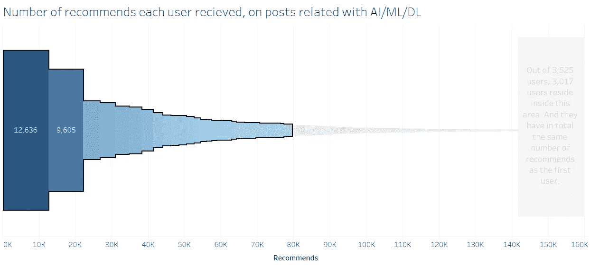

# 撰写关于人工智能/机器学习/深度学习的 tTOP 100 媒体作家

> 原文：<https://medium.com/hackernoon/top-100-medium-writers-that-wrote-about-artificial-intelligence-machine-learning-deep-learning-c485dd5b8c6c>

有超过 6500 篇关于 AI/ML/DL 的文章写在介质上，如果你想读完它们，你需要花整整一个月的时间每天读 14 个小时。

所以…这就是为什么我们有数据和机器可以为我们做这些。

**更新:AI/ML/DL 前 100 篇文章的列表可以在这里找到:**

 [## medium.com 100 强

### 我们已经看到了获得最多推荐的前 100 名中等用户，但这对我们的探索毫无帮助…

medium.com](/@baditaflorin/top-100-medium-com-c2695ab3270c) 

**系列最新帖子:**

 [## 标签为人工智能/机器学习/深度的中型帖子之间的主要区别…

### 有超过 6500 篇关于 AI/ML/DL 的文章写在介质上。

medium.com](/@baditaflorin/key-differences-between-medium-posts-tagged-artificial-intelligence-machine-learning-deep-f9b3826a3f27) 

**与大数据/数据科学/数据可视化相关的前 150 篇文章**

 [## 与大数据、数据科学和数据可视化相关的前 150 篇媒体文章。

### 媒体上有超过 3，700 篇文章标记了大数据、数据科学和数据可视化，如果您想…

medium.com](/@baditaflorin/top-150-medium-articles-related-with-big-data-data-science-and-data-visualization-803773728ff7) 

在 2016 年冬天从 medium.com 下载了 600 万个帖子后，我能够只过滤那些标有 AI/ML 或 Deep [Learning](https://hackernoon.com/tagged/learning) 的帖子，并根据推荐数量对它们进行排序。

我总共收到了 6546 篇文章，由 3528 位用户撰写。

所有这些文章总共有 153，567 条推荐。

## 数据比较老，我已经收集了 2016 年 12 月—2017 年 1 月的数据。

今年 2 月，罗马尼亚政府希望将腐败和贿赂合法化。通过一个我两年前创建的名为“腐败杀人”的脸书社区，我花时间协助组织了罗马尼亚历史上最大规模的抗议活动(大约有 60 万人参与) (我们大量使用 Slack)，还做了一些公民项目，在过去的 6 个月里，我直到现在才有时间处理我从[https://gist . github . com/badi taflorin/b8d 5981 a 7 C5 cf 4d 1807964 BC 6a 028 CD 4 # file-all _ ai _ ml _ dl _ articles _ medium _ Jan _ 2017-CSV](https://medium.com/u/504c7870fdb6#file-all_ai_ml_dl_articles_medium_jan_2017-csv)

事实上，在 3528 个用户中，有 36 个用户获得了一半的推荐

36 Users got half of all recommends

# 撰写 AI/ML/DL 相关文章的用户获得的推荐总数—2017 年 1 月

## 从这个饼图中我们可以看到两件事。

1.  27 % (959 名用户)的文章获得 0 次推荐。当写一篇关于 AI/ML/DL 的文章时，你有 1/4 的机会得不到推荐。
2.  75 %(约 2500 名用户)总共得到 11 条或更少的推荐。

# Medium.com 作家 100 强(2017 年 1 月)

1.  媒介用户 [Steven Levy](https://medium.com/u/2fff2fb3e70a?source=post_page-----c485dd5b8c6c--------------------------------) 从 15 篇与 AI/ML/DL 相关的文章中，总共获得了 12636 条推荐。
    一篇文章的平均阅读时间为 11.9 分钟。
    平均每个帖子包含 7 个链接和 10 张图片。
2.  媒体用户 [Adam Geitgey](https://medium.com/u/ba4c55e4aa3d?source=post_page-----c485dd5b8c6c--------------------------------) 从 6 篇与 AI/ML/DL 相关的文章中获得了总共 9605 条推荐。
    一篇文章的平均阅读时间为 13.4 分钟。平均来说，每个帖子包含 16 个链接和 21 张图片。
3.  媒介用户 [Chris Dixon](https://medium.com/u/a8e3741de9e2?source=post_page-----c485dd5b8c6c--------------------------------) 共获得 4519 条推荐，来自 2 篇与 AI/ML/DL 相关的文章。
    一篇文章的平均阅读时间为 6.5 分钟。
    平均每个帖子包含 11 个链接和 18 张图片。
4.  媒体用户 [Per Harald Borgen](https://medium.com/u/30d952e8c7e6?source=post_page-----c485dd5b8c6c--------------------------------) 从 4 篇与 AI/ML/DL 相关的文章中总共获得了 4215 条推荐。
    一篇文章的平均阅读时间为 6 分钟。
    平均每篇帖子包含 6 个链接和 7 张图片。
5.  媒介用户 [Tony Aubé](https://medium.com/u/1b169a4b84ea?source=post_page-----c485dd5b8c6c--------------------------------) 共获得 3666 条推荐，来自 1 篇与 AI/ML/DL 相关的文章。
    一篇文章的阅读时间是 7.8 分钟。
    帖子包含 9 个链接和 12 张图片。
6.  媒体用户 [Oliver Cameron](https://medium.com/u/fd8bc37755d8?source=post_page-----c485dd5b8c6c--------------------------------) 从 20 篇与 AI/ML/DL 相关的文章中总共获得了 3552 条推荐。
    一篇文章的平均阅读时间为 3.4 分钟。平均来说，每个帖子包含 8 个链接和 6 张图片。
7.  媒介用户 [Scott Santens](https://medium.com/u/751d1915b9fb?source=post_page-----c485dd5b8c6c--------------------------------) 共获得 3151 条推荐，来自 2 篇与 AI/ML/DL 相关的文章。
    一篇文章的平均阅读时间为 7.1 分钟。平均来说，每个帖子包含 33 个链接和 3 张图片。
8.  媒体用户 [Gil Fewster](https://medium.com/u/36020d726097?source=post_page-----c485dd5b8c6c--------------------------------) 共获得 2608 条推荐，来自 1 篇与 AI/ML/DL 相关的文章。
    文章的阅读时间是 4.6 分钟。
    每个帖子包含 4 个链接和 1 张图片。
9.  媒介用户[对讲机](https://medium.com/u/7ca8972daf76?source=post_page-----c485dd5b8c6c--------------------------------)共获得 2270 条推荐，来自 1 篇与 AI/ML/DL 相关的文章。
    文章阅读时间 7.3 分钟。每个帖子包含 1 个链接和 13 张图片。
10.  媒介用户 [Sam DeBrule](https://medium.com/u/f3a886c9aaff?source=post_page-----c485dd5b8c6c--------------------------------) 从 19 篇与 AI/ML/DL 相关的文章中，总共得到了 2173 条推荐。
    一篇文章的平均阅读时间为 2.5 分钟。
    平均每个帖子包含 20 个链接和 2 张图片。
11.  媒介用户 [Shivon Zilis](https://medium.com/u/509cf8b26804?source=post_page-----c485dd5b8c6c--------------------------------) 共获得 2142 条推荐，来自 AI/ML/DL 相关的 3 篇文章。
    一篇文章的平均阅读时间为 8.7 分钟。
    平均每篇帖子包含 14 个链接和 1 张图片。
12.  媒体用户 [Ted Livingston](https://medium.com/u/2d041e2f8c3?source=post_page-----c485dd5b8c6c--------------------------------) 从 1 篇与 AI/ML/DL 相关的文章中获得了总共 2009 条推荐。
    文章阅读时间 5.6 分钟。
    平均来说，每个帖子包含 4 个链接和 3 张图片。
13.  媒介用户 [Mybridge](https://medium.com/u/68abb2e6c9bb?source=post_page-----c485dd5b8c6c--------------------------------) 共获得 1821 条推荐，来自与 AI/ML/DL 相关的 8 篇文章。
    一篇文章的平均阅读时间为 3 分钟。平均来说，每个帖子包含 9 个链接和 17 张图片。
14.  媒体用户 [Pawel Sysiak](https://medium.com/u/5f2c6d33a08?source=post_page-----c485dd5b8c6c--------------------------------) 从 10 篇与 AI/ML/DL 相关的文章中总共获得了 1578 条推荐。
    一篇文章的平均阅读时间为 7.6 分钟。平均来说，每个帖子包含 11 个链接和 6 张图片。
15.  媒体用户[乔·toscano⚡️](https://medium.com/u/999fc7f88fff?source=post_page-----c485dd5b8c6c--------------------------------)总共得到了 1487 条推荐，来自 1 篇与 AI/ML/DL 相关的文章。
    一篇文章的阅读时间是 11.7 分钟。
    帖子包含 10 个链接和 14 张图片。
16.  媒介用户 [Carlos E. Perez](https://medium.com/u/1928cbd0e69c?source=post_page-----c485dd5b8c6c--------------------------------) 从 34 篇与 AI/ML/DL 相关的文章中，总共得到了 1424 条推荐。
    一篇文章的平均阅读时间为 4.4 分钟。
    平均每个帖子包含 10 个链接和 3 张图片。
17.  媒体用户[对创业公司](https://medium.com/u/c2ff4585803c?source=post_page-----c485dd5b8c6c--------------------------------)的请求总共得到了 1374 条推荐，来自 9 篇与 AI/ML/DL 相关的文章。一篇文章的平均阅读时间为 3.5 分钟。平均来说，每个帖子包含 18 个链接和 8 张图片。
18.  媒体用户 [Andrew Coyle](https://medium.com/u/7012bf7f682b?source=post_page-----c485dd5b8c6c--------------------------------) 共获得 1349 条推荐，来自 1 篇与 AI/ML/DL 相关的文章。
    一篇文章的阅读时间为 5.1 分钟。
    帖子包含 5 个链接和 14 张图片。
19.  媒体用户[施巧灵·亨佩尔](https://medium.com/u/9eda8914b544?source=post_page-----c485dd5b8c6c--------------------------------)从两篇与 AI/ML/DL 相关的文章中获得了总共 1346 条推荐。
    一篇文章的平均阅读时间为 5.3 分钟。
    平均每篇帖子包含 20 个链接和 4 张图片。
20.  媒介用户 [Ben Brown](https://medium.com/u/99b3608226b0?source=post_page-----c485dd5b8c6c--------------------------------) 共获得 1247 条推荐，来自 7 篇与 AI/ML/DL 相关的文章。
    一篇文章的平均阅读时间为 3.6 分钟。平均而言，每篇文章包含 3 个链接和 2 张图片。
21.  媒体用户[托马斯托尔法](https://medium.com/u/501ce0addce1?source=post_page-----c485dd5b8c6c--------------------------------)共获得 1117 条推荐，来自 1 篇与 AI/ML/DL 相关的文章。
    一篇文章的平均阅读时间为 10.1 分钟。平均来说，每个帖子包含 7 个链接和 9 张图片。
22.  媒体用户 [Nathan Benaich](https://medium.com/u/7c25066d2234?source=post_page-----c485dd5b8c6c--------------------------------) 从 32 篇与 AI/ML/DL 相关的文章中，总共得到了 1095 条推荐。
    一篇文章的平均阅读时间为 4.5 分钟。平均来说，每个帖子包含 22 个链接和 1 张图片。
23.  媒介用户 [Daniel Eckler](https://medium.com/u/e908c3f44253?source=post_page-----c485dd5b8c6c--------------------------------) 共获得 1060 条推荐，来自 5 篇与 AI/ML/DL 相关的文章。
    一篇文章的平均阅读时间为 8.1 分钟。平均来说，每个帖子包含 7 个链接和 7 张图片。
24.  媒介用户 [SPACE10](https://medium.com/u/41eb963ccf54?source=post_page-----c485dd5b8c6c--------------------------------) 共获得 1049 条推荐，来自 AI/ML/DL 相关的 4 篇文章。
    一篇文章的平均阅读时间为 5.4 分钟。
    平均每个帖子包含 2 个链接和 8 张图片。
25.  媒体用户[丽娃-梅丽莎·泰兹](https://medium.com/u/35683f9daffe?source=post_page-----c485dd5b8c6c--------------------------------)共获得 1041 条推荐，来自 1 篇与 AI/ML/DL 相关的文章。
    一篇文章的阅读时间为 5.9 分钟。这篇文章包含 2 个链接和 17 张图片。
26.  媒体用户[约翰·巴特利](https://medium.com/u/dac511047268?source=post_page-----c485dd5b8c6c--------------------------------)总共得到了 1029 条推荐，来自与 AI/ML/DL 相关的 3 篇文章。
    一篇文章的平均阅读时间为 7.4 分钟。
    平均每个帖子包含 6 个链接和 3 张图片。
27.  媒体用户 [Tanay Jaipuria](https://medium.com/u/e6743095a27b?source=post_page-----c485dd5b8c6c--------------------------------) 共获得 978 条推荐，来自 1 篇与 AI/ML/DL 相关的文章。
    一篇文章的阅读时间为 4.7 分钟。
    帖子包含 2 个链接和 2 张图片。
28.  媒体用户 [Max Deutsch](https://medium.com/u/86ff34e637cf?source=post_page-----c485dd5b8c6c--------------------------------) 从 5 篇与 AI/ML/DL 相关的文章中总共获得了 974 条推荐。
    一篇文章的平均阅读时间为 5 分钟。
    平均来说，每个帖子包含 8 个链接和 1 张图片。
29.  媒体用户 [Andrej Karpathy](https://medium.com/u/ac9d9a35533e?source=post_page-----c485dd5b8c6c--------------------------------) 共获得 967 条推荐，来自 1 篇与 AI/ML/DL 相关的文章。
    一篇文章的阅读时间是 6.6 分钟。该帖子包含 12 个链接和 5 张图片。
30.  媒介用户 [Matt Fogel](https://medium.com/u/485f5a6213b1?source=post_page-----c485dd5b8c6c--------------------------------) 共获得 955 条推荐，来自 AI/ML/DL 相关的 3 篇文章。
    一篇文章的平均阅读时间为 3.2 分钟。平均来说，每个帖子包含 3 个链接和 9 张图片。
31.  媒体用户 [David Kelnar](https://medium.com/u/4934916676ca?source=post_page-----c485dd5b8c6c--------------------------------) 从 2 篇与 AI/ML/DL 相关的文章中总共获得了 947 条推荐。
    一篇文章的平均阅读时间为 13.9 分钟。平均来说，每个帖子包含 5 个链接和 12 张图片。
32.  媒体用户 [Rand Hindi](https://medium.com/u/5f00c193f7d7?source=post_page-----c485dd5b8c6c--------------------------------) 从 4 篇与 AI/ML/DL 相关的文章中总共获得了 921 条推荐。
    一篇文章的平均阅读时间为 7.8 分钟。
    平均每个帖子包含 5 个链接和 8 张图片。
33.  媒体用户 [Christopher Nguyen](https://medium.com/u/b0cd2903e078?source=post_page-----c485dd5b8c6c--------------------------------) 从 5 篇与 AI/ML/DL 相关的文章中获得了总共 880 条推荐。
    一篇文章的平均阅读时间为 6.7 分钟。平均来说，每个帖子包含 3 个链接和 2 张图片。
34.  媒体用户 [John Borthwick](https://medium.com/u/230bb844b2ac?source=post_page-----c485dd5b8c6c--------------------------------) 从 2 篇与 AI/ML/DL 相关的文章中总共获得了 820 条推荐。
    一篇文章的平均阅读时间为 9.5 分钟。
    平均每个帖子包含 11 个链接和 12 张图片。
35.  媒体用户 [Greg Borenstein](https://medium.com/u/fc73a449a9d5?source=post_page-----c485dd5b8c6c--------------------------------) 从 1 篇与 AI/ML/DL 相关的文章中总共获得了 789 条推荐。
    一篇文章的阅读时间为 12.1 分钟。
    帖子包含 8 个链接和 4 张图片。
36.  媒介用户 [Daniel Jeffries](https://medium.com/u/618a7c78c957?source=post_page-----c485dd5b8c6c--------------------------------) 共获得 788 条推荐，来自 4 篇与 AI/ML/DL 相关的文章。
    一篇文章的平均阅读时间为 6.8 分钟。平均而言，每篇文章包含 9 个链接和 3 张图片。
37.  中级用户 [Kickstarter](https://medium.com/u/f96369d3473d?source=post_page-----c485dd5b8c6c--------------------------------) 共获得 779 条推荐，来自 1 篇与 AI/ML/DL 相关的文章。
    一篇文章的阅读时间为 5 分钟。这篇文章包含 27 个链接和 8 张图片。
38.  媒介用户 [Sarah Guo](https://medium.com/u/4796b3770d3d?source=post_page-----c485dd5b8c6c--------------------------------) 共获得 737 条推荐，来自 3 篇与 AI/ML/DL 相关的文章。
    一篇文章的平均阅读时间为 11.6 分钟。平均来说，每个帖子包含 17 个链接和 13 张图片。
39.  媒体用户[卡姆隆戈德布](https://medium.com/u/ffc675bc4563?source=post_page-----c485dd5b8c6c--------------------------------)总共得到 727 条推荐，来自 2 篇与 AI/ML/DL 相关的文章。
    一篇文章的平均阅读时间为 6.3 分钟。
    平均每个帖子包含 2 个链接和 10 张图片。
40.  媒体用户[米洛·斯潘塞-哈珀](https://medium.com/u/dbe41548e496?source=post_page-----c485dd5b8c6c--------------------------------)从 7 篇与 AI/ML/DL 相关的文章中总共获得了 706 条推荐。
    一篇文章的平均阅读时间是 3 分钟。
    平均来说，每个帖子包含 2 个链接和 4 张图片。
41.  媒体用户[桑德拉·厄普森](https://medium.com/u/bc1e3e60af88?source=post_page-----c485dd5b8c6c--------------------------------)从 1 篇与 AI/ML/DL 相关的文章中获得了总共 699 条推荐。
    一篇文章的阅读时间是 9.9 分钟。该帖子包含 33 个链接和 6 张图片。
42.  媒体用户[欧文·威廉姆斯](https://medium.com/u/9cca1cc5944f?source=post_page-----c485dd5b8c6c--------------------------------)共获得 686 条推荐，来自与 AI/ML/DL 相关的 5 篇文章。
    一篇文章的平均阅读时间为 7.9 分钟。
    平均每个帖子包含 7 个链接和 6 张图片。
43.  媒体用户 [Matt West](https://medium.com/u/beb5fd64878a?source=post_page-----c485dd5b8c6c--------------------------------) 共获得 684 条推荐，来自 1 篇与 AI/ML/DL 相关的文章。
    一篇文章的阅读时间为 4.2 分钟。
    帖子包含 1 个链接和 6 张图片。
44.  媒体用户 [Kate Crawford](https://medium.com/u/efbec1a070e4?source=post_page-----c485dd5b8c6c--------------------------------) 共获得 679 条推荐，来自 1 篇与 AI/ML/DL 相关的文章。
    一篇文章的阅读时间为 4.6 分钟。
    帖子包含 10 个链接和 1 张图片。
45.  媒体用户 [Artur Kiulian](https://medium.com/u/5d113e4e785e?source=post_page-----c485dd5b8c6c--------------------------------) 从 9 篇与 AI/ML/DL 相关的文章中获得了总共 639 条推荐。
    一篇文章的平均阅读时间为 5.1 分钟。平均来说，每个帖子包含 4 个链接和 8 张图片。
46.  使用 anymate 的媒体共获得 637 条推荐，来自 1 篇与 AI/ML/DL 相关的文章。
    一篇文章的阅读时间是 6.1 分钟。这篇文章包含 14 个链接和 4 张图片。
47.  媒介用户 [Arthur Juliani](https://medium.com/u/18dfe63fa7f0?source=post_page-----c485dd5b8c6c--------------------------------) 从 21 篇与 AI/ML/DL 相关的文章中，总共得到了 603 条推荐。一篇文章的平均阅读时间为 4.5 分钟。平均来说，每个帖子包含 17 个链接和 4 张图片。
48.  媒介用户 [Drew Breunig](https://medium.com/u/bd4656ebbe55?source=post_page-----c485dd5b8c6c--------------------------------) 共获得 587 条推荐，来自与 AI/ML/DL 相关的 3 篇文章。
    一篇文章的平均阅读时间为 6.7 分钟。
    平均每个帖子包含 7 个链接和 4 张图片。
49.  媒体用户 [Josh](https://medium.com/u/66b5ae01967f?source=post_page-----c485dd5b8c6c--------------------------------) 从 24 篇与 AI/ML/DL 相关的文章中总共获得了 577 条推荐。
    一篇文章的平均阅读时间为 4.5 分钟。平均来说，每个帖子包含 5 个链接和 7 张图片。
50.  媒介用户 [Frank Diana](https://medium.com/u/b00ed1912d6a?source=post_page-----c485dd5b8c6c--------------------------------) 从 21 篇与 AI/ML/DL 相关的文章中，总共得到了 525 条推荐。
    一篇文章的平均阅读时间为 2.6 分钟。
    平均每个帖子包含 8 个链接和 2 张图片。
51.  媒体用户[华盛顿邮报](https://medium.com/u/f0c3167dc11d?source=post_page-----c485dd5b8c6c--------------------------------)共获得 523 条推荐，来自 1 篇与 AI/ML/DL 相关的文章。
    一篇文章的平均阅读时间为 2.9 分钟。平均而言，每篇文章包含 3 个链接和 2 张图片。
52.  媒体用户[比兹·斯通](https://medium.com/u/b258af3c1e92?source=post_page-----c485dd5b8c6c--------------------------------)共获得 518 条推荐，来自 1 篇与 AI/ML/DL 相关的文章。
    文章阅读时间 2.6 分钟。
    帖子包含 1 个链接和 1 张图片。
53.  媒体用户[加里·马库斯](https://medium.com/u/d7e74ac84d28?source=post_page-----c485dd5b8c6c--------------------------------)总共得到了 514 条推荐，来自 1 篇与 AI/ML/DL 相关的文章。
    一篇文章的阅读时间是 5.6 分钟。该帖子包含 12 个链接和 3 张图片。
54.  媒体用户 [Yitaek Hwang](https://medium.com/u/a9626034cb21?source=post_page-----c485dd5b8c6c--------------------------------) 从 16 篇与 AI/ML/DL 相关的文章中总共获得了 513 条推荐。
    一篇文章的平均阅读时间为 5.2 分钟。平均来说，每个帖子包含 16 个链接和 4 张图片。
55.  媒介用户 [Amir Shevat](https://medium.com/u/d6c12c2b751a?source=post_page-----c485dd5b8c6c--------------------------------) 总共得到了 499 条推荐，来自与 AI/ML/DL 相关的 3 篇文章。
    一篇文章的平均阅读时间为 2.9 分钟。
    平均每个帖子包含 2 个链接和 4 张图片。
56.  媒介用户 [azeem](https://medium.com/u/83723c0aa9f9?source=post_page-----c485dd5b8c6c--------------------------------) 共获得 469 条推荐，来自 16 篇 AI/ML/DL 相关的文章。
    一篇文章的平均阅读时间为 5.4 分钟。
    平均来说，每个帖子包含 18 个链接和 4 张图片。
57.  媒体用户 [Christian Hernandez](https://medium.com/u/2348b65358db?source=post_page-----c485dd5b8c6c--------------------------------) 从与 AI/ML/DL 相关的 6 篇文章中总共获得了 451 条推荐。
    一篇文章的平均阅读时间为 3.2 分钟。平均来说，每个帖子包含 4 个链接和 4 张图片。
58.  媒介用户 [Tal Perry](https://medium.com/u/18fc2c8cf5cd?source=post_page-----c485dd5b8c6c--------------------------------) 共获得 447 条推荐，来自 1 篇与 AI/ML/DL 相关的文章。
    一篇文章的阅读时间为 16.8 分钟。
    帖子包含 6 个链接和 7 张图片。
59.  中端用户 [Axiom Zen](https://medium.com/u/de3b1052e8e3?source=post_page-----c485dd5b8c6c--------------------------------) 从 15 篇 AI/ML/DL 相关的文章中，共获得 429 条推荐。
    一篇文章的平均阅读时间为 5.2 分钟。
    平均每篇帖子包含 4 个链接和 8 张图片。
60.  媒体用户[基因科岗](https://medium.com/u/a49a57d88a85?source=post_page-----c485dd5b8c6c--------------------------------)共获得 426 条推荐，来自 2 篇与 AI/ML/DL 相关的文章。
    一篇文章的平均阅读时间为 4.4 分钟。
    平均每篇帖子包含 12 个链接和 3 张图片。
61.  媒体用户[萨米姆](https://medium.com/u/f3c8148878e1?source=post_page-----c485dd5b8c6c--------------------------------)从 10 篇与 AI/ML/DL 相关的文章中总共获得了 422 条推荐。
    一篇文章的平均阅读时间为 4.9 分钟。平均来说，每个帖子包含 6 个链接和 18 张图片。
62.  媒介用户 [Stefan Kojouharov](https://medium.com/u/67c8653ca7e2?source=post_page-----c485dd5b8c6c--------------------------------) 共获得 422 条推荐，来自 7 篇与 AI/ML/DL 相关的文章。
    一篇文章的平均阅读时间为 5.8 分钟。平均来说，每个帖子包含 4 个链接和 12 张图片。
63.  媒介用户 [Alan](https://medium.com/u/1d2f805e8419?source=post_page-----c485dd5b8c6c--------------------------------) 共获得 422 条推荐，来自 2 篇与 AI/ML/DL 相关的文章。
    一篇文章的平均阅读时间为 5.7 分钟。
    平均每个帖子包含 2 个链接和 1 张图片。
64.  媒体用户[李依琳](https://medium.com/u/335a489265c8?source=post_page-----c485dd5b8c6c--------------------------------)共获得 421 条推荐，来自 4 篇与 AI/ML/DL 相关的文章。
    一篇文章的平均阅读时间为 4.1 分钟。
    平均每个帖子包含 2 个链接和 4 张图片。
65.  媒体用户 [Bryan Johnson](https://medium.com/u/35c4d6050746?source=post_page-----c485dd5b8c6c--------------------------------) 从 1 篇与 AI/ML/DL 相关的文章中获得了总共 407 条推荐。
    一篇文章的阅读时间是 8.1 分钟。该帖子包含 2 个链接和 2 张图片。
66.  媒介用户 [Andreas Stuhlmüller](https://medium.com/u/aa37d651221d?source=post_page-----c485dd5b8c6c--------------------------------) 共获得 389 条推荐，来自 1 篇与 AI/ML/DL 相关的文章。
    一篇文章的阅读时间为 13 分钟。
    帖子包含 2 个链接和 10 张图片。
67.  媒体用户 [Kyle McDonald](https://medium.com/u/ecf50d0b8c5?source=post_page-----c485dd5b8c6c--------------------------------) 共获得 385 条推荐，来自 2 篇与 AI/ML/DL 相关的文章。
    一篇文章的平均阅读时间为 20.3 分钟。平均来说，每篇文章包含 23 个链接和 27 张图片。
68.  媒介用户 [EyeEm](https://medium.com/u/74f619bf652e?source=post_page-----c485dd5b8c6c--------------------------------) 共获得 382 条推荐，来自 2 篇与 AI/ML/DL 相关的文章。
    一篇文章的平均阅读时间为 4.8 分钟。
    平均每篇帖子包含 10 个链接和 5 张图片。
69.  媒介用户 [IBM 认知业务](https://medium.com/u/1fdfd3496c89?source=post_page-----c485dd5b8c6c--------------------------------)从 34 篇与 AI/ML/DL 相关的文章中，总共得到了 379 条推荐。
    一篇文章的平均阅读时间为 3.1 分钟。平均来说，每个帖子包含 3 个链接和 3 张图片。
70.  媒介用户 [Illia Polosukhin](https://medium.com/u/fad09a381b52?source=post_page-----c485dd5b8c6c--------------------------------) 共获得 366 条推荐，来自与 AI/ML/DL 相关的 5 篇文章。
    一篇文章的平均阅读时间为 2.8 分钟。平均来说，每个帖子包含 4 个链接和 0 张图片。
71.  媒介用户 [Thomas Oppong](https://medium.com/u/9bb9d25bfad2?source=post_page-----c485dd5b8c6c--------------------------------) 共获得 363 条推荐，来自 AI/ML/DL 相关的 2 篇文章。
    一篇文章的平均阅读时间为 5.9 分钟。平均来说，每个帖子包含 5 个链接和 4 张图片。
72.  媒介用户 [ArtificialExperience](https://medium.com/u/62d5e068b59a?source=post_page-----c485dd5b8c6c--------------------------------) 共获得 360 条推荐，来自 2 篇与 AI/ML/DL 相关的文章。
    一篇文章的平均阅读时间为 23.6 分钟。
    平均来说，每个帖子包含 31 个链接和 78 张图片。
73.  媒体用户[西蒙·帕金](https://medium.com/u/58e5dc72e696?source=post_page-----c485dd5b8c6c--------------------------------)共获得 359 条推荐，来自 1 篇与 AI/ML/DL 相关的文章。
    一篇文章的阅读时间是 10.7 分钟。平均来说，每个帖子包含 4 个链接和 5 张图片。
74.  媒体用户 [Sartaj Anand](https://medium.com/u/3a3fabd24d1c?source=post_page-----c485dd5b8c6c--------------------------------) 共获得 352 条推荐，来自 1 篇与 AI/ML/DL 相关的文章。
    一篇文章的阅读时间是 9.2 分钟。
    帖子包含 2 个链接和 20 张图片。
75.  媒体用户 [David Pakman](https://medium.com/u/eaa782328eda?source=post_page-----c485dd5b8c6c--------------------------------) 总共得到 345 条推荐，来自 3 篇与 AI/ML/DL 相关的文章。
    一篇文章的平均阅读时间为 5.1 分钟。平均而言，每篇文章包含 2 个链接和 4 张图片。
76.  媒介用户 [Auren Hoffman](https://medium.com/u/49600bc77127?source=post_page-----c485dd5b8c6c--------------------------------) 共获得 336 条推荐，来自 1 篇与 AI/ML/DL 相关的文章。
    一篇文章的阅读时间是 6.3 分钟。
    帖子包含 6 个链接和 4 张图片。
77.  媒体用户[迈克·赫恩](https://medium.com/u/3748c5d6e52c?source=post_page-----c485dd5b8c6c--------------------------------)总共得到 330 条推荐，来自 1 篇与 AI/ML/DL 相关的文章。
    一篇文章的阅读时间是 12.1 分钟。帖子包含 2 个链接和 6 张图片。
78.  媒体用户 [Terence Broad](https://medium.com/u/88fdcc9ff7e2?source=post_page-----c485dd5b8c6c--------------------------------) 共获得 327 条推荐，来自 1 篇与 AI/ML/DL 相关的文章。
    一篇文章的阅读时间是 10.1 分钟。帖子包含 2 个链接和 17 张图片。
79.  媒体用户 [Matt Galligan](https://medium.com/u/9e1633b0e7ad?source=post_page-----c485dd5b8c6c--------------------------------) 共获得 326 条推荐，来自 1 篇与 AI/ML/DL 相关的文章。
    一篇文章的阅读时间为 6 分钟。
    帖子包含 4 个链接和 0 张图片。
80.  媒体用户 [Victor Luckerson](https://medium.com/u/122b2dd4bf0e?source=post_page-----c485dd5b8c6c--------------------------------) 从 3 篇与 AI/ML/DL 相关的文章中总共获得了 324 条推荐。
    一篇文章的平均阅读时间为 7.2 分钟。
    平均每个帖子包含 11 个链接和 5 张图片。
81.  媒体用户 [Brian Roemmele](https://medium.com/u/7236cb540a10?source=post_page-----c485dd5b8c6c--------------------------------) 从 3 篇与 AI/ML/DL 相关的文章中获得了总共 321 条推荐。
    一篇文章的平均阅读时间为 9.3 分钟。平均来说，每个帖子包含 2 个链接和 7 张图片。
82.  medium 用户 [Memo Akten](https://medium.com/u/d00ac9528de3?source=post_page-----c485dd5b8c6c--------------------------------) 共获得 320 条推荐，来自 10 篇 AI/ML/DL 相关的文章。
    一篇文章的平均阅读时间为 19.2 分钟。
    平均每个帖子包含 18 个链接和 14 张图片。
83.  媒介用户 [Henry Innis](https://medium.com/u/d615a4fb580f?source=post_page-----c485dd5b8c6c--------------------------------) 共获得 316 条推荐，来自 1 篇与 AI/ML/DL 相关的文章。
    一篇文章的平均阅读时间为 7.4 分钟。
    平均每篇帖子包含 4 个链接和 10 张图片。
84.  媒体用户[陈坤](https://medium.com/u/18f218f62085?source=post_page-----c485dd5b8c6c--------------------------------)共获得 307 条推荐，来自 3 篇与 AI/ML/DL 相关的文章。
    一篇文章的平均阅读时间为 5.5 分钟。
    平均来说，每个帖子包含 4 个链接和 4 张图片。
85.  媒体用户[凯文·斯科特](https://medium.com/u/f31f03e60056?source=post_page-----c485dd5b8c6c--------------------------------)总共得到了 300 条推荐，来自 1 篇与 AI/ML/DL 相关的文章。
    一篇文章的平均阅读时间为 13.4 分钟。平均来说，每个帖子包含 3 个链接和 31 张图片。
86.  媒介用户 [Seyi Fabode](https://medium.com/u/e502edf967bf?source=post_page-----c485dd5b8c6c--------------------------------) 共获得 300 条推荐，来自 AI/ML/DL 相关的 3 篇文章。
    一篇文章的平均阅读时间为 2.8 分钟。平均来说，每个帖子包含 5 个链接和 3 张图片。
87.  媒介用户 [Rick Klau](https://medium.com/u/dfe79d97e6ea?source=post_page-----c485dd5b8c6c--------------------------------) 总共得到 299 条推荐，来自 1 篇与 AI/ML/DL 相关的文章。
    一篇文章的阅读时间是 2.3 分钟。
    帖子包含 4 个链接和 1 张图片。
88.  媒体用户 [Matty Mariansky](https://medium.com/u/770214e496bd?source=post_page-----c485dd5b8c6c--------------------------------) 总共得到 299 条推荐，来自 4 篇与 AI/ML/DL 相关的文章。
    一篇文章的平均阅读时间是 6 分钟。
    平均每个帖子包含 2 个链接和 7 张图片。
89.  媒体用户[亚当·凯勒赫](https://medium.com/u/1cdc1cca2f85?source=post_page-----c485dd5b8c6c--------------------------------)从 4 篇与 AI/ML/DL 相关的文章中获得了总共 296 条推荐。
    一篇文章的平均阅读时间为 10.2 分钟。平均来说，每个帖子包含 3 个链接和 8 张图片。
90.  媒体用户 [DanSung](https://medium.com/u/35454c1383f2?source=post_page-----c485dd5b8c6c--------------------------------) 共获得 286 条推荐，来自 1 篇与 AI/ML/DL 相关的文章。
    一篇文章的阅读时间为 12 分钟。
    帖子包含 2 个链接和 3 张图片。
91.  媒体用户 [Joe Brewer](https://medium.com/u/31d574491247?source=post_page-----c485dd5b8c6c--------------------------------) 从 1 篇与 AI/ML/DL 相关的文章中总共获得了 285 条推荐。
    一篇文章的阅读时间为 3.8 分钟。
    帖子包含 2 个链接和 1 张图片。
92.  媒体用户 [Alex Bunardzic](https://medium.com/u/16ec868611bd?source=post_page-----c485dd5b8c6c--------------------------------) 从 11 篇与 AI/ML/DL 相关的文章中总共获得了 283 条推荐。
    一篇文章的平均阅读时间为 6 分钟。
    平均每篇帖子包含 12 个链接和 5 张图片。
93.  媒体用户[姚](https://medium.com/u/35785607b208?source=post_page-----c485dd5b8c6c--------------------------------)共得到 274 条推荐，来自与 AI/ML/DL 相关的 3 篇文章。
    一篇文章的平均阅读时间为 8 分钟。平均来说，每个帖子包含 2 个链接和 5 张图片。
94.  媒体用户 [Veronica Belmont](https://medium.com/u/2487cb5471f5?source=post_page-----c485dd5b8c6c--------------------------------) 共获得 272 条推荐，来自 1 篇与 AI/ML/DL 相关的文章。
    一篇文章的阅读时间是 2 分钟。帖子包含 3 个链接和 5 张图片。
95.  媒体用户 [Moritz Mueller-Freitag](https://medium.com/u/94f206878e5d?source=post_page-----c485dd5b8c6c--------------------------------) 共获得 271 条推荐，来自 1 篇与 AI/ML/DL 相关的文章。
    文章阅读时间 10.1 分钟。
    帖子包含 8 个链接和 12 张图片。
96.  媒体用户 [Steve Bryant](https://medium.com/u/251b58260c76?source=post_page-----c485dd5b8c6c--------------------------------) 从 7 篇与 AI/ML/DL 相关的文章中总共获得了 270 条推荐。
    一篇文章的平均阅读时间为 6.8 分钟。
    平均每个帖子包含 7 个链接和 9 张图片。
97.  媒体用户 [Louis Dorard](https://medium.com/u/21b9cb0aa377?source=post_page-----c485dd5b8c6c--------------------------------) 从 12 篇与 AI/ML/DL 相关的文章中得到了总共 264 条推荐。
    一篇文章的平均阅读时间为 5.3 分钟。平均来说，每个帖子包含 4 个链接和 4 张图片。
98.  媒体用户 [Josh Bocanegra](https://medium.com/u/6faf4de50a4?source=post_page-----c485dd5b8c6c--------------------------------) 从 4 篇与 AI/ML/DL 相关的文章中总共获得了 259 条推荐。
    一篇文章的平均阅读时间为 2.5 分钟。
    平均每个帖子包含 2 个链接和 5 张图片。
99.  媒体用户 [Peter Rojas](https://medium.com/u/c2e9d851a0c5?source=post_page-----c485dd5b8c6c--------------------------------) 从 1 篇与 AI/ML/DL 相关的文章中总共获得了 255 条推荐。
    一篇文章的阅读时间为 4.8 分钟。
    帖子包含 3 个链接和 4 张图片。
100.  媒体用户 [Pavel Surmenok](https://medium.com/u/d002f056f8c?source=post_page-----c485dd5b8c6c--------------------------------) 从 10 篇与 AI/ML/DL 相关的文章中，总共获得了 254 条推荐。
    一篇文章的平均阅读时间为 3.1 分钟。
    平均每篇帖子包含 12 个链接和 2 张图片。

## 我玩 Medium.com 数据库的相关帖子:

 [## 走进 Medium.com 1000 大标签——第一部分

### 在我呆在美国的 3 个月里，我最喜欢的一个项目就是下载所有关于 medium.com 的帖子。它花了大约…

medium.com](/@baditaflorin/inside-the-top-1000-tags-on-medium-com-part-1-a1ff96356639)  [## 分析 150K 中型标签—第 1 部分。

### 为什么要这样做？

medium.com](/@baditaflorin/analyzing-150k-medium-tags-part-1-b63445563eb6)  [## medium.com 内部 30000 篇文章链接。

### 有些人喜欢链接，有些人喜欢图片，还有一些人，他们把一半和一半。

medium.com](/@baditaflorin/inside-medium-com-top-30000-articles-with-links-b1268abc1d6e) 

## 关于我

在过去的 3 年里，我与 Rise 项目合作，进行数据分析和模式识别，以发现非结构化数据集中的腐败模式。

我是一名高级地图分析师，从事 OSM 数据的工作。

2016 年 9 月，我搬到旧金山住了 3 个月，[开始新的生活](/@baditaflorin/why-i-maxed-out-my-credit-card-moved-to-silicon-valley-to-become-a-entrepreneur-a6aaced118f3)。

现在我回到了罗马尼亚，寻找一份远程/兼职/全职工作，在那里我可以应用我的数据科学相关的专业知识。

目前:

*   构建一个工具，在 **传播之前，检测 [**可能的假病毒消息。**](https://hackernoon.com/the-outbreak-detecting-fake-viral-news-automatically-3acded3a97cb)**
*   结合[脸书](https://hackernoon.com/tagged/facebook)的反应和[的情感分析，创建一个帖子、一个页面](/@baditaflorin/understanding-facebook-reactions-using-sentiment-analysis-f17b6e561ff3)的情感指纹。
*   从罗马尼亚排名前 12.000 的 FB 页面下载所有公共帖子。到目前为止已经下载了 1900 万个帖子。参见这里的一个用例，[分析抗议趋势。](https://www.slideshare.net/baditaflorin/point-conference-2017-romanian-protests-florin-badita)
*   学习 ML，全文搜索。

你可以在网上找我**在媒体上** [**弗罗林【巴迪塔】**](https://medium.com/u/3b723c70c152?source=post_page-----c485dd5b8c6c--------------------------------)**[**AngelList**](https://angel.co/florin-badita)**[**Twitter**](https://twitter.com/baditaflorin)**，L** [**inkedin，**](http://linkedin.com/in/baditaflorin)**O**[**penstreetmap**](https://www.openstreetmap.org/user/baditaflorin/diary)T46****

******有时候我会在博客上写**[**http://florinbadita.com/**](http://florinbadita.com/)****