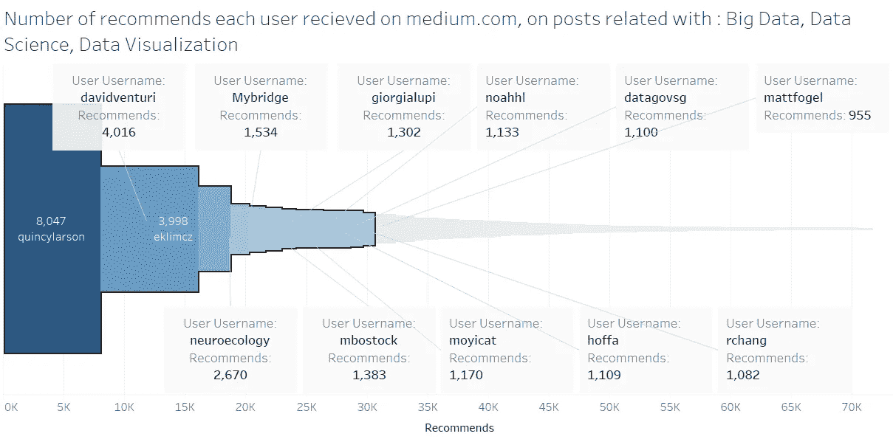

# 撰写大数据、数据科学和数据可视化文章的媒体作家前 100 名

> 原文：<https://medium.com/hackernoon/top-100-medium-writers-that-wrote-about-big-data-data-science-data-visualization-a8486ec12b35>

> 媒体上有超过 3，700 篇标记为大数据、数据科学、数据可视化的文章，如果你想全部阅读，你需要花整整一个月的时间每天阅读 9 个小时。

> 如果你发现我在这里创造的东西有价值，你可以成为赞助人，支持在这里创建这种帖子:

 [## 有趣的统计数据- Florin Badita 正在创建统计数据、数据可视化| Patreon

### 成为有趣统计的赞助人-弗罗林·巴蒂塔今天:阅读有趣统计的帖子-弗罗林·巴蒂塔…

www.patreon.com](https://www.patreon.com/florinbadita) 

最新文章:**大数据/数据科学/数据可视化相关的 150 篇中型文章**

 [## 与大数据、数据科学和数据可视化相关的前 150 篇媒体文章。

### 媒体上有超过 3，700 篇文章标记了大数据、数据科学和数据可视化，如果您想…

medium.com](/@baditaflorin/top-150-medium-articles-related-with-big-data-data-science-and-data-visualization-803773728ff7) 

我最好是搜索整个 medium.com 网站，获得整个数据集(600 万个帖子)，然后找出最有趣的文章和用户，这样你就不必花那么多时间去发现这个主题上可能有趣的文章。

**我总共收到了 4069 篇文章，由 2464 位用户撰写。***(300 条左右是带标签的评论，所以更真实的数字是 3700 篇左右，2300 个用户)*

> 总的来说，所有标签为大数据、数据科学或数据可视化的文章收集了 71，683 条建议。(2016 年 12 月)

## 注意。数据比较老，我已经收集了 2016 年 12 月—2017 年 1 月的数据。

去年我去了美国三个月，在旧金山的城市学习企业家精神。

我开始放弃 medium.com，目的是让自己作为一名数据科学家受到关注，这样我就可以作为一名数据科学家/增长黑客被雇佣/加入一家初创公司。

我 1 月份回到了罗马尼亚，计划寻找机会回到美国，直到 2017 年 12 月。然后，罗马尼亚政府搞砸了我的计划。

今年 2 月，罗马尼亚政府希望将腐败和贿赂合法化。通过我 2 年前创建的 FB 页面“腐败害死人”，我花时间协助组织了罗马尼亚历史上最大的抗议活动(约 60 万人参与) (我们大量使用 Slack)，还做了一些公民项目，在过去的 6 个月里，我直到现在才有时间处理我从[媒体](https://medium.com/u/504c7870fdb6?source=post_page-----a8486ec12b35--------------------------------)获得的数据。

 [## 愤怒和不信任加剧了罗马尼亚的抗议活动

### “我们不信任这个政府。他们骗了我们。我们希望这个政府辞职，”38 岁的玛丽亚·斯托伊察说

www.nytimes.com](https://www.nytimes.com/2017/02/12/world/europe/romania-bucharest-protests-corruption.html) 

# 无论如何，很抱歉这么长的介绍，让我们回到数据上来。

说到数据，[这是 4000 篇文章的完整转储。](https://drive.google.com/open?id=1qBYpAd_PFo2ozypkctZSwukG8UBfeHeycf-VfAU3c0I) (1 MB)

和[这是转储与文本](https://drive.google.com/open?id=1sJ0--ROy_fzhMbMix3vqeOjAvf-g9VAeJgo3prE5TSc)也(18 MB CSV)

> 前 14 个用户获得了超过 40%的推荐(71，683 个推荐中的 30，636 个)

# 标签为“大数据”、“数据科学”、“数据可视化”的帖子的前 100 名作者(2017 年 1 月)

1.  媒体用户 [Quincy Larson](https://medium.com/u/17756313f41a?source=post_page-----a8486ec12b35--------------------------------) 从 12 篇与大数据、数据科学、数据可视化相关的文章中获得了总共 8047 条推荐。
    一篇文章的平均阅读时间为 2.4 分钟。平均来说，每个帖子包含 3 个链接和 6 张图片。

2.媒体用户 [David Venturi](https://medium.com/u/b3eb78490b02?source=post_page-----a8486ec12b35--------------------------------) 从 10 篇与大数据、数据科学、数据可视化相关的文章中共获得了 4016 条推荐。
一篇文章的平均阅读时间为 6.3 分钟。
平均每个帖子包含 5 个链接和 10 张图片。

3.中型用户 [Erik K](https://medium.com/u/ed90fc001261?source=post_page-----a8486ec12b35--------------------------------) 共获得 3998 条推荐，来自与大数据、数据科学、数据可视化相关的 4 篇文章。
一篇文章的平均阅读时间为 7.4 分钟。
平均每篇帖子包含 2 个链接和 12 张图片。

4.媒体用户 [Adam J Calhoun](https://medium.com/u/f96422ab6f6b?source=post_page-----a8486ec12b35--------------------------------) 从一篇关于大数据、数据科学、数据可视化的文章中获得了总共 2670 条推荐。
文章的阅读时间是 3.7 分钟。
帖子包含 1 个链接和 22 张图片。

5.媒体用户 [Mybridge](https://medium.com/u/68abb2e6c9bb?source=post_page-----a8486ec12b35--------------------------------) 共获得 1534 条推荐，来自与大数据、数据科学、数据可视化相关的 8 篇文章。一篇文章的平均阅读时间为 3 分钟。平均来说，每个帖子包含 7 个链接和 18 张图片。

6.媒体用户 [Mike Bostock](https://medium.com/u/c918c478bb49?source=post_page-----a8486ec12b35--------------------------------) 共获得 1383 条推荐，来自与大数据、数据科学、数据可视化相关的 5 篇文章。
一篇文章的平均阅读时间为 4.4 分钟。
平均每个帖子包含 2 个链接和 8 张图片。

7.媒体用户 [giorgia lupi](https://medium.com/u/2b468a91df0f?source=post_page-----a8486ec12b35--------------------------------) 共获得 1302 条推荐，来自 4 篇与大数据、数据科学、数据可视化相关的文章。
一篇文章的平均阅读时间为 8.8 分钟。
平均每篇帖子包含 3 个链接和 19 张图片。

8.媒体用户 [Samantha Zhang](https://medium.com/u/293d116c67fd?source=post_page-----a8486ec12b35--------------------------------) 从 1 篇与大数据、数据科学、数据可视化相关的文章中获得了总共 1170 条推荐。
文章阅读时间 7.1 分钟。该帖子包含 6 个链接和 22 张图片。

9.媒体用户[airbneng](https://medium.com/u/ebe93072cafd?source=post_page-----a8486ec12b35--------------------------------)共获得 1137 条推荐，来自 11 篇与大数据、数据科学、数据可视化相关的文章。
一篇文章的平均阅读时间为 6.4 分钟。平均来说，每个帖子包含 2 个链接和 5 张图片。

10.媒介用户 [Noah Lorang](https://medium.com/u/bbaa6d9a6a27?source=post_page-----a8486ec12b35--------------------------------) 共获得 1133 条推荐，来自大数据、数据科学、数据可视化相关的 5 篇文章。
一篇文章的平均阅读时间为 3.9 分钟。平均来说，每个帖子包含 4 个链接和 4 张图片。

11.媒体用户 [Felipe Hoffa](https://medium.com/u/279fe54c149a?source=post_page-----a8486ec12b35--------------------------------) 从 15 篇与大数据、数据科学、数据可视化相关的文章中获得了总共 1109 条推荐。
一篇文章的平均阅读时间为 3.2 分钟。
平均每个帖子包含 6 个链接和 4 张图片。

12.媒体用户 [datagovsg](https://medium.com/u/37b12820ee51?source=post_page-----a8486ec12b35--------------------------------) 共收到 1100 条推荐，来自 1 篇与大数据、数据科学、数据可视化相关的文章。
文章阅读时间 7.6 分钟。这篇文章包含 2 个链接和 15 张图片。

13.媒体用户 [Robert Chang](https://medium.com/u/c00b242128fe?source=post_page-----a8486ec12b35--------------------------------) 共收到 1082 条推荐，来自与大数据、数据科学、数据可视化相关的 2 篇文章。
一篇文章的平均阅读时间为 14 分钟。
平均每个帖子包含 2 个链接和 6 张图片。

14.媒体用户 [Matt Fogel](https://medium.com/u/485f5a6213b1?source=post_page-----a8486ec12b35--------------------------------) 共获得 955 条推荐，分别来自与大数据、数据科学、数据可视化相关的 3 篇文章。
一篇文章的平均阅读时间为 3.2 分钟。平均而言，每篇文章包含 2 个链接和 9 张图片。

15.中型用户 [Cesar A. Hidalgo](https://medium.com/u/512ae3d471ad?source=post_page-----a8486ec12b35--------------------------------) 从一篇与大数据、数据科学、数据可视化相关的文章中获得了总共 886 条建议。
文章阅读时间 10.2 分钟。
帖子包含 1 个链接和 2 张图片。

16.媒体用户 [Christopher Nguyen](https://medium.com/u/b0cd2903e078?source=post_page-----a8486ec12b35--------------------------------) 共获得 875 条推荐，来自与大数据、数据科学、数据可视化相关的 5 篇文章。
一篇文章的平均阅读时间为 7.3 分钟。平均来说，每个帖子包含 3 个链接和 2 张图片。

17.媒体用户 [Mark Humphries](https://medium.com/u/6bce9fc81f1f?source=post_page-----a8486ec12b35--------------------------------) 共收到 790 条推荐，分别来自与大数据、数据科学、数据可视化相关的 3 篇文章。
一篇文章的平均阅读时间为 4.2 分钟。平均来说，每个帖子包含 2 个链接和 2 张图片。

18.中型用户 [Foursquare](https://medium.com/u/70456b814f2?source=post_page-----a8486ec12b35--------------------------------) 从 1 篇与大数据、数据科学、数据可视化相关的文章中获得了总共 769 条推荐。
文章的阅读时间是 5.9 分钟。
帖子包含 4 个链接和 4 张图片。

19.媒体用户[本·雅各布森](https://medium.com/u/5a288c8119f3?source=post_page-----a8486ec12b35--------------------------------)从一篇关于大数据、数据科学、数据可视化的文章中获得了总共 666 条推荐。
文章阅读时间 5.9 分钟。该帖子包含 2 个链接和 10 张图片。

20.媒体用户[孙铁麟·梅斯特](https://medium.com/u/bc17bd299bf1?source=post_page-----a8486ec12b35--------------------------------)共获得 642 条推荐，来自 8 篇与大数据、数据科学、数据可视化相关的文章。
一篇文章的平均阅读时间为 3 分钟。
平均每个帖子包含 4 个链接和 2 张图片。

21.媒体用户 [Kan Nishida](https://medium.com/u/1bfa80768afa?source=post_page-----a8486ec12b35--------------------------------) 从 62 篇与大数据、数据科学、数据可视化相关的文章中共获得 637 条推荐。
一篇文章的平均阅读时间为 6.8 分钟。
平均每篇帖子包含 5 个链接和 16 张图片。

22.媒体用户 [Oliver Cameron](https://medium.com/u/fd8bc37755d8?source=post_page-----a8486ec12b35--------------------------------) 从两篇与大数据、数据科学、数据可视化相关的文章中共获得 593 条推荐。
一篇文章的平均阅读时间为 1.1 分钟。
平均来说，每个帖子包含 2 个链接和 2 张图片。

23.媒体用户[亚当·凯勒赫](https://medium.com/u/1cdc1cca2f85?source=post_page-----a8486ec12b35--------------------------------)从 6 篇与大数据、数据科学、数据可视化相关的文章中获得了总共 578 条推荐。
一篇文章的平均阅读时间为 8.5 分钟。平均来说，每个帖子包含 4 个链接和 6 张图片。

24.媒体用户 [Aline Lerner](https://medium.com/u/722bf1348ae3?source=post_page-----a8486ec12b35--------------------------------) 共获得 546 条推荐，来自与大数据、数据科学、数据可视化相关的 2 篇文章。
一篇文章的平均阅读时间为 7.6 分钟。平均来说，每个帖子包含 1 个链接和 7 张图片。

25.媒体用户 [Larry Kim](https://medium.com/u/81b376bf1c56?source=post_page-----a8486ec12b35--------------------------------) 从两篇与大数据、数据科学、数据可视化相关的文章中获得了总共 531 条推荐。
一篇文章的平均阅读时间为 2.2 分钟。
平均每个帖子包含 4 个链接和 3 张图片。

26.媒体用户 [Per Harald Borgen](https://medium.com/u/30d952e8c7e6?source=post_page-----a8486ec12b35--------------------------------) 从一篇关于大数据、数据科学、数据可视化的文章中获得了总共 515 条推荐。
文章阅读时间 6.8 分钟。
帖子包含 1 个链接和 11 张图片。

27.媒体用户 [Matt Hackett](https://medium.com/u/8b081f07fa77?source=post_page-----a8486ec12b35--------------------------------) 从一篇与大数据、数据科学、数据可视化相关的文章中获得了总共 505 条建议。
文章阅读时间 5.8 分钟。
帖子包含 1 个链接和 2 张图片。

28.媒体用户 [Evan Sinar](https://medium.com/u/7d042e96e8bd?source=post_page-----a8486ec12b35--------------------------------) 共获得 498 条推荐，分别来自与大数据、数据科学、数据可视化相关的 3 篇文章。
一篇文章的平均阅读时间为 5.9 分钟。
平均每篇帖子包含 8 个链接和 5 张图片。

29.中型用户 [matthew_daniels](https://medium.com/u/64adcca83f67?source=post_page-----a8486ec12b35--------------------------------) 从 1 篇与大数据、数据科学、数据可视化相关的文章中总共获得了 470 条推荐。
文章阅读时间 5.4 分钟。
帖子包含 3 个链接和 11 张图片。

30.媒体用户 [Sacha Greif](https://medium.com/u/156e844b0e31?source=post_page-----a8486ec12b35--------------------------------) 从一篇关于大数据、数据科学、数据可视化的文章中获得了总共 465 条推荐。
文章阅读时间 4.4 分钟。
帖子包含 1 个链接和 4 张图片。

31.媒体用户[Felix ge sert](https://medium.com/u/233cc61c4b11?source=post_page-----a8486ec12b35--------------------------------)从一篇与大数据、数据科学、数据可视化相关的文章中总共获得了 447 条推荐。
文章阅读时间 25.1 分钟。帖子包含 1 个链接和 10 张图片。

32.媒体用户 [Gilad Lotan](https://medium.com/u/90b8a357f856?source=post_page-----a8486ec12b35--------------------------------) 从两篇与大数据、数据科学、数据可视化相关的文章中总共获得了 413 条推荐。
一篇文章的平均阅读时间为 5.3 分钟。
平均每个帖子包含 5 个链接和 9 张图片。

33.媒体用户[鲍勃·泰勒](https://medium.com/u/637878e3c005?source=post_page-----a8486ec12b35--------------------------------)共收到 410 条推荐，来自 1 篇与大数据、数据科学、数据可视化相关的文章。
文章阅读时间 6.8 分钟。这篇文章包含 2 个链接和 9 张图片。

34.媒体用户 [Simon Rogers](https://medium.com/u/e093dae6814e?source=post_page-----a8486ec12b35--------------------------------) 共获得 360 条推荐，来自 5 篇与大数据、数据科学、数据可视化相关的文章。
一篇文章的平均阅读时间为 3.5 分钟。
平均每个帖子包含 3 个链接和 5 张图片。

35.媒体用户 [Silvia Li Sam](https://medium.com/u/4890d480c6c5?source=post_page-----a8486ec12b35--------------------------------) 从 1 篇与大数据、数据科学、数据可视化相关的文章中共获得 354 条推荐。
文章阅读时间 5 分钟。
帖子包含 2 个链接和 5 张图片。

36.媒体用户 [Luca Hammer](https://medium.com/u/f41b88c25359?source=post_page-----a8486ec12b35--------------------------------) 共获得 352 条推荐，来自 4 篇与大数据、数据科学、数据可视化相关的文章。
一篇文章的平均阅读时间为 8.5 分钟。
平均每篇帖子包含 6 个链接和 17 张图片。

37.媒体用户[杰夫·格鲁克](https://medium.com/u/88923ec9a071?source=post_page-----a8486ec12b35--------------------------------)从 4 篇关于大数据、数据科学、数据可视化的文章中总共获得了 345 条推荐。
一篇文章的平均阅读时间为 5.1 分钟。平均来说，每个帖子包含 2 个链接和 3 张图片。

38.媒体用户 [Auren Hoffman](https://medium.com/u/49600bc77127?source=post_page-----a8486ec12b35--------------------------------) 从 1 篇与大数据、数据科学、数据可视化相关的文章中共获得 336 条推荐。
文章阅读时间 6.3 分钟。帖子包含 3 个链接和 4 张图片。

39.媒体用户 [Karl Sluis](https://medium.com/u/ab4004eb84c9?source=post_page-----a8486ec12b35--------------------------------) 共获得 332 条推荐，分别来自与大数据、数据科学、数据可视化相关的 3 篇文章。
一篇文章的平均阅读时间为 4.4 分钟。
平均每个帖子包含 1 个链接和 5 张图片。

40.媒体用户[克里斯·莫兰](https://medium.com/u/3ae525518399?source=post_page-----a8486ec12b35--------------------------------)从一篇关于大数据、数据科学、数据可视化的文章中获得了总共 329 条推荐。
文章阅读时间 4.5 分钟。
帖子包含 2 个链接和 0 张图片。

41.媒体用户 [Tricia Wang](https://medium.com/u/3b91a7c1281f?source=post_page-----a8486ec12b35--------------------------------) 共获得 321 条推荐，来自与大数据、数据科学、数据可视化相关的 2 篇文章。
一篇文章的平均阅读时间为 13.8 分钟。
平均每个帖子包含 12 个链接和 9 张图片。

42.中型用户[Matthew strm](https://medium.com/u/e0e5c279b20?source=post_page-----a8486ec12b35--------------------------------)从与大数据、数据科学、数据可视化相关的 2 篇文章中总共获得了 306 条推荐。
一篇文章的平均阅读时间为 6.3 分钟。
平均每篇帖子包含 2 个链接和 8 张图片。

43.媒介用户 [Daniel Tunkelang](https://medium.com/u/5f6b5aba680?source=post_page-----a8486ec12b35--------------------------------) 共获得 306 条推荐，来自 7 篇与大数据、数据科学、数据可视化相关的文章。
一篇文章的平均阅读时间为 1.3 分钟。
平均每篇帖子包含 2 个链接和 0 张图片。

44.媒体用户 [Colt McAnlis](https://medium.com/u/6e1a63c4fcd1?source=post_page-----a8486ec12b35--------------------------------) 共获得 285 条推荐，来自与大数据、数据科学、数据可视化相关的 4 篇文章。
一篇文章的平均阅读时间为 5 分钟。平均来说，每个帖子包含 4 个链接和 5 张图片。

45.媒体用户 [Moritz Mueller-Freitag](https://medium.com/u/94f206878e5d?source=post_page-----a8486ec12b35--------------------------------) 从一篇关于大数据、数据科学、数据可视化的文章中获得了总共 271 条推荐。
文章阅读时间 10.1 分钟。帖子包含 8 个链接和 12 张图片。

46.媒体用户 [Olli Savolai](https://medium.com/u/5db46967bd72?source=post_page-----a8486ec12b35--------------------------------) 从 4 篇与大数据、数据科学、数据可视化相关的文章中获得了总共 265 条推荐。
一篇文章的平均阅读时间是 4 分钟。
平均来说，每个帖子包含 4 个链接和 4 张图片。

47.媒体用户 [Luke Thompson](https://medium.com/u/4a0a3b4c4f71?source=post_page-----a8486ec12b35--------------------------------) 从一篇关于大数据、数据科学、数据可视化的文章中获得了总共 254 条推荐。
文章阅读时间 3.2 分钟。
帖子包含 1 个链接和 8 张图片。

48.媒体用户[查兹·赫顿。](https://medium.com/u/97ff9471a480?source=post_page-----a8486ec12b35--------------------------------)共收到 247 条推荐，来自 1 篇与大数据、数据科学、数据可视化相关的文章。
文章阅读时间 1.4 分钟。
帖子包含 2 个链接和 9 张图片。

49.媒体用户 [Illia Polosukhin](https://medium.com/u/fad09a381b52?source=post_page-----a8486ec12b35--------------------------------) 共获得 232 条推荐，分别来自与大数据、数据科学、数据可视化相关的 2 篇文章。
一篇文章的平均阅读时间为 3.7 分钟。
平均每篇帖子包含 1 个链接和 0 张图片。

50.媒体用户 [Ahmed El Deeb](https://medium.com/u/55388a733bf9?source=post_page-----a8486ec12b35--------------------------------) 从 4 篇与大数据、数据科学、数据可视化相关的文章中获得了总共 224 条推荐。
一篇文章的平均阅读时间为 3.7 分钟。平均而言，每篇文章包含 2 个链接和 3 张图片。

51.媒体用户[气候服务台](https://medium.com/u/9be5187594b5?source=post_page-----a8486ec12b35--------------------------------)共收到 212 条建议，来自 1 篇与大数据、数据科学、数据可视化相关的文章。
文章阅读时间 1.9 分钟。帖子包含 4 个链接和 6 张图片。

52.媒体用户 [Jonathan Albright](https://medium.com/u/65e54a0965d5?source=post_page-----a8486ec12b35--------------------------------) 总共获得了 210 条推荐，来自与大数据、数据科学、数据可视化相关的 4 篇文章。
一篇文章平均阅读时间 7.7 分钟。平均来说，每个帖子包含 5 个链接和 15 张图片。

53.媒体用户 [Sara Robinson](https://medium.com/u/7f2ab73b39f8?source=post_page-----a8486ec12b35--------------------------------) 共获得 207 条推荐，来自 5 篇与大数据、数据科学、数据可视化相关的文章。
一篇文章的平均阅读时间为 3.8 分钟。
平均每个帖子包含 2 个链接和 5 张图片。

54.媒体用户 [Ronnie](https://medium.com/u/22c90b932d47?source=post_page-----a8486ec12b35--------------------------------) 共收到 204 条推荐，来自两篇与大数据、数据科学、数据可视化相关的文章。
一篇文章的平均阅读时间为 5.5 分钟。平均来说，每个帖子包含 6 个链接和 3 张图片。

55.媒体用户 WhiteHOuse 总共收到了 202 条建议，来自与大数据、数据科学和数据可视化相关的 2 篇文章。
一篇文章的平均阅读时间为 5.5 分钟。平均来说，每个帖子包含 6 个链接和 5 张图片。

56.媒体用户 [Jake Stein](https://medium.com/u/312cd696706c?source=post_page-----a8486ec12b35--------------------------------) 从 5 篇与大数据、数据科学、数据可视化相关的文章中获得了总共 195 条推荐。
一篇文章的平均阅读时间为 3.2 分钟。
平均每个帖子包含 3 个链接和 4 张图片。

57.媒体用户 [Drew Harry](https://medium.com/u/5482bb7a0f64?source=post_page-----a8486ec12b35--------------------------------) 共获得 189 条推荐，分别来自与大数据、数据科学、数据可视化相关的 2 篇文章。
一篇文章的平均阅读时间为 2.7 分钟。
平均每个帖子包含 1 个链接和 1 张图片。

58.媒体用户 [UW 互动数据实验室](https://medium.com/u/7b2598c98199?source=post_page-----a8486ec12b35--------------------------------)共收到 188 条推荐，来自与大数据、数据科学、数据可视化相关的 4 篇文章。
一篇文章平均阅读时间 7.8 分钟。
平均每个帖子包含 3 个链接和 6 张图片。

59.媒体用户 [Benjamin Libor](https://medium.com/u/7f9c741ce060?source=post_page-----a8486ec12b35--------------------------------) 共获得 185 条推荐，来自 7 篇与大数据、数据科学、数据可视化相关的文章。
一篇文章的平均阅读时间为 1.5 分钟。平均来说，每个帖子包含 32 个链接和 2 张图片。

60.媒体用户 [Francesc Campoy](https://medium.com/u/d32302f8a956?source=post_page-----a8486ec12b35--------------------------------) 共收到 184 条推荐，来自两篇与大数据、数据科学、数据可视化相关的文章。
一篇文章的平均阅读时间为 5.3 分钟。
平均每个帖子包含 3 个链接和 9 张图片。

61.媒体用户 [swardley](https://medium.com/u/280dd9543ba9?source=post_page-----a8486ec12b35--------------------------------) 从一篇关于大数据、数据科学、数据可视化的文章中总共获得了 183 条推荐。
文章阅读时间 10.2 分钟。
帖子包含 1 个链接和 10 张图片。

62.媒体用户 [Paul Stollery](https://medium.com/u/d7fef35157f8?source=post_page-----a8486ec12b35--------------------------------) 从一篇与大数据、数据科学、数据可视化相关的文章中总共获得了 183 条建议。
文章阅读时间 3.4 分钟。
帖子包含 7 个链接和 6 张图片。

63.媒体用户 [Simon Parkin](https://medium.com/u/58e5dc72e696?source=post_page-----a8486ec12b35--------------------------------) 从 1 篇与大数据、数据科学、数据可视化相关的文章中总共获得了 178 条推荐。
文章阅读时间 10.1 分钟。
帖子包含 1 个链接和 11 张图片。

64.媒体用户 [Ry Walker](https://medium.com/u/ee1ed6658c54?source=post_page-----a8486ec12b35--------------------------------) 从 13 篇与大数据、数据科学、数据可视化相关的文章中共获得了 175 条推荐。
一篇文章的平均阅读时间为 3 分钟。
平均来说，每个帖子包含 3 个链接和 4 张图片。

65.媒体用户[德鲁·布鲁尼格](https://medium.com/u/bd4656ebbe55?source=post_page-----a8486ec12b35--------------------------------)从一篇关于大数据、数据科学、数据可视化的文章中获得了总共 157 条推荐。
文章阅读时间 3.4 分钟。帖子包含 6 个链接和 2 张图片。

66 .媒体用户[锡耶纳·杜普兰](https://medium.com/u/da2b12dafd38?source=post_page-----a8486ec12b35--------------------------------)从 1 篇与大数据、数据科学、数据可视化相关的文章中获得了总共 154 条推荐。
文章阅读时间 7.3 分钟。这篇文章包含 6 个链接和 35 张图片。

67.媒体用户 [Eric Rodenbeck](https://medium.com/u/5361ddb43dac?source=post_page-----a8486ec12b35--------------------------------) 共获得 149 条推荐，来自 8 篇与大数据、数据科学、数据可视化相关的文章。
一篇文章的平均阅读时间为 4.7 分钟。
平均每个帖子包含 3 个链接和 8 张图片。

68.媒体用户 [Nwokedi C. Idika](https://medium.com/u/97f833767988?source=post_page-----a8486ec12b35--------------------------------) 从一篇关于大数据、数据科学、数据可视化的文章中获得了总共 147 条推荐。
文章阅读时间 7.2 分钟。
帖子包含 1 个链接和 3 张图片。

69.媒体用户 [Nicolas A Perez](https://medium.com/u/4d3a2d851128?source=post_page-----a8486ec12b35--------------------------------) 从与大数据、数据科学、数据可视化相关的 8 篇文章中总共获得了 144 条推荐。
一篇文章的平均阅读时间为 4.1 分钟。
平均每个帖子包含 2 个链接和 0 张图片。

70.媒体用户 [Ian Johnson](https://medium.com/u/f682ddbdedde?source=post_page-----a8486ec12b35--------------------------------) 总共获得了 143 条推荐，来自与大数据、数据科学、数据可视化相关的 4 篇文章。
一篇文章的平均阅读时间为 6.1 分钟。
平均每篇帖子包含 4 个链接和 19 张图片。

71.媒体用户 [Louis Dorard](https://medium.com/u/21b9cb0aa377?source=post_page-----a8486ec12b35--------------------------------) 共获得 140 条推荐，来自 9 篇与大数据、数据科学、数据可视化相关的文章。
一篇文章的平均阅读时间为 4.1 分钟。
平均每篇帖子包含 3 个链接和 3 张图片。

72.媒体用户[马特·基瑟](https://medium.com/u/dada28c46df7?source=post_page-----a8486ec12b35--------------------------------)共获得 137 条推荐，来自 10 篇与大数据、数据科学、数据可视化相关的文章。
一篇文章的平均阅读时间为 3.1 分钟。平均来说，每个帖子包含 11 个链接和 2 张图片。

73.媒体用户 [Shawn Sprockett](https://medium.com/u/29c311057f0f?source=post_page-----a8486ec12b35--------------------------------) 总共获得了 133 条推荐，来自与大数据、数据科学、数据可视化相关的 2 篇文章。
一篇文章的平均阅读时间为 2.4 分钟。平均来说，每个帖子包含 3 个链接和 2 张图片。

74.媒体用户 [K McGowan](https://medium.com/u/659cea54ab5e?source=post_page-----a8486ec12b35--------------------------------) 从 1 篇与大数据、数据科学、数据可视化相关的文章中总共获得了 131 条推荐。
文章的阅读时间是 3.8 分钟。
帖子包含 1 个链接和 7 张图片。

75.媒体用户[Dimitris spath](https://medium.com/u/ebec95d897b7?source=post_page-----a8486ec12b35--------------------------------)从一篇与大数据、数据科学、数据可视化相关的文章中总共获得了 131 条推荐。
文章阅读时间 7.7 分钟。这篇文章包含 20 个链接和 12 张图片。

76.媒体用户 [abhi nemani](https://medium.com/u/fbcba5f0dc79?source=post_page-----a8486ec12b35--------------------------------) 从 1 篇与大数据、数据科学、数据可视化相关的文章中总共获得了 129 条推荐。
文章阅读时间 3.4 分钟。
帖子包含 1 个链接和 2 张图片。

77.媒体用户 [Nishant Shukla](https://medium.com/u/f2ba32aa75db?source=post_page-----a8486ec12b35--------------------------------) 从一篇与大数据、数据科学、数据可视化相关的文章中总共获得了 129 条推荐。
文章阅读时间 10.4 分钟。
帖子包含 1 个链接和 5 张图片。

78.媒体用户 [Trent McConaghy](https://medium.com/u/f1cb98e196bc?source=post_page-----a8486ec12b35--------------------------------) 从与大数据、数据科学、数据可视化相关的 4 篇文章中总共获得了 127 条推荐。
一篇文章的平均阅读时间为 8.5 分钟。
平均每篇帖子包含 6 个链接和 5 张图片。

79.媒体用户[尼克·布朗](https://medium.com/u/3a32e1871b25?source=post_page-----a8486ec12b35--------------------------------)总共得到了 127 条推荐，分别来自与大数据、数据科学、数据可视化相关的 3 篇文章。
一篇文章的平均阅读时间为 5.8 分钟。平均来说，每个帖子包含 3 个链接和 5 张图片。

80.媒体用户 [fred benenson](https://medium.com/u/2444476ecdd1?source=post_page-----a8486ec12b35--------------------------------) 从一篇与大数据、数据科学、数据可视化相关的文章中总共获得了 127 条推荐。
文章阅读时间 6.6 分钟。帖子包含 4 个链接和 6 张图片。

81.媒体用户 [Chantal Jandard](https://medium.com/u/80d07aa1313?source=post_page-----a8486ec12b35--------------------------------) 从一篇关于大数据、数据科学和数据可视化的文章中获得了总共 127 条建议。
文章的阅读时间是 4.7 分钟。
帖子包含 3 个链接和 6 张图片。

82.媒体用户 [Privacy International](https://medium.com/u/64fdc8de1dd7?source=post_page-----a8486ec12b35--------------------------------) 共收到 126 条推荐，来自 5 篇与大数据、数据科学、数据可视化相关的文章。
一篇文章的平均阅读时间为 5.2 分钟。平均来说，每个帖子包含 3 个链接和 1 张图片。

83.媒体用户 [Richard D. Morey](https://medium.com/u/5e43e4c9e217?source=post_page-----a8486ec12b35--------------------------------) 从两篇与大数据、数据科学、数据可视化相关的文章中总共获得了 125 条推荐。
一篇文章的平均阅读时间为 3.7 分钟。
平均每个帖子包含 3 个链接和 4 张图片。

84.媒体用户 [Flavia Dzodan](https://medium.com/u/5159f225de31?source=post_page-----a8486ec12b35--------------------------------) 总共获得了 122 条推荐，来自与大数据、数据科学、数据可视化相关的 3 篇文章。
一篇文章的平均阅读时间为 4.3 分钟。
平均每篇帖子包含 5 个链接和 3 张图片。

85.媒体用户 [Jennifer Pahlka](https://medium.com/u/bae14af47917?source=post_page-----a8486ec12b35--------------------------------) 从一篇关于大数据、数据科学和数据可视化的文章中获得了总共 121 条推荐。
文章阅读时间 3.4 分钟。
帖子包含 2 个链接和 1 张图片。

86.媒体用户[塞巴斯蒂安·萨多夫斯基](https://medium.com/u/e522b06369f1?source=post_page-----a8486ec12b35--------------------------------)从一篇关于大数据、数据科学、数据可视化的文章中总共获得了 121 条推荐。
文章阅读时间 16.7 分钟。帖子包含 3 个链接和 27 张图片。

87.媒体用户 [Faris](https://medium.com/u/1928301654aa?source=post_page-----a8486ec12b35--------------------------------) 共收到 120 条推荐，来自 1 篇与大数据、数据科学、数据可视化相关的文章。
文章阅读时间 12.4 分钟。这篇文章包含 12 个链接和 16 张图片。

88.中等用户[凯文·比彻姆](https://medium.com/u/bad88b23dcc4?source=post_page-----a8486ec12b35--------------------------------)从 1 篇与大数据、数据科学、数据可视化相关的文章中获得了总共 118 条建议。
文章阅读时间为 35.2 分钟。
帖子包含 1 个链接，15 张图片。

89.中等用户[詹姆斯·希思尔斯](https://medium.com/u/b81060e19118?source=post_page-----a8486ec12b35--------------------------------)从两篇与大数据、数据科学、数据可视化相关的文章中获得了总共 118 条推荐。
一篇文章的平均阅读时间为 8.6 分钟。
平均每个帖子包含 2 个链接和 2 个图片。

90.中等用户 [x.ai](https://medium.com/u/2795062a44df?source=post_page-----a8486ec12b35--------------------------------) 从 4 篇与大数据、数据科学、数据可视化相关的文章中获得了总共 114 条推荐。
物品的平均阅读时间为 4.4 分钟。
平均每个帖子包含 3 个链接和 4 幅图像。

91.中型用户 [Morgan](https://medium.com/u/17b66605e1fa?source=post_page-----a8486ec12b35--------------------------------) 从 4 篇与大数据、数据科学、数据可视化相关的文章中共得到 114 条推荐。
一篇文章的平均阅读时间为 4 分钟。
平均每个帖子包含 4 个链接和 2 个图像。

92.中等用户[克里·本杰明](https://medium.com/u/78ff5a2855cb?source=post_page-----a8486ec12b35--------------------------------)从 10 篇与大数据、数据科学、数据可视化相关的文章中共得到 113 条推荐。
物品的平均阅读时间为 3.1 分钟。
平均每个帖子包含 3 个链接和 2 个图像。

93.中等用户[约翰·巴特利](https://medium.com/u/dac511047268?source=post_page-----a8486ec12b35--------------------------------)从 1 篇与大数据、数据科学、数据可视化相关的文章中得到总共 113 条建议。
文章阅读时间 4.9 分钟。
帖子包含 4 个链接，1 个图片。

94.中型用户 [danah boyd](https://medium.com/u/ce5e55092c08?source=post_page-----a8486ec12b35--------------------------------) 从 1 篇与大数据、数据科学、数据可视化相关的文章中获得了总共 111 条建议。
冠词的阅读时间为 3.5 分钟。
帖子包含 2 个链接，1 个图片。

95.媒体用户 [Infogram](https://medium.com/u/bc2e5f25a01b?source=post_page-----a8486ec12b35--------------------------------) 从 22 篇与大数据、数据科学、数据可视化相关的文章中共获得 111 条推荐。
一篇文章的平均阅读时间为 2.8 分钟。
平均每个帖子包含 3 个链接和 6 张图片。

96.媒体用户[布拉克·阿里坎](https://medium.com/u/8a4bc2c0841e?source=post_page-----a8486ec12b35--------------------------------)共收到 111 条推荐，来自 7 篇与大数据、数据科学、数据可视化相关的文章。
一篇文章的平均阅读时间为 4.5 分钟。平均来说，每个帖子包含 4 个链接和 6 张图片。

97.媒体用户 [Tala(前 InVenture)](https://medium.com/u/cd6d9cb7c721?source=post_page-----a8486ec12b35--------------------------------) 共获得 108 条推荐，来自 2 篇与大数据、数据科学、数据可视化相关的文章。
一篇文章的平均阅读时间为 5.2 分钟。
平均每个帖子包含 2 个链接和 4 张图片。

98.中型用户 [Steve Grove](https://medium.com/u/2bb9d414e9da?source=post_page-----a8486ec12b35--------------------------------) 从一篇与大数据、数据科学、数据可视化相关的文章中总共获得了 107 条推荐。
文章阅读时间 5.5 分钟。
帖子包含 6 个链接和 4 张图片。

99.中型用户 [Robert Simmon](https://medium.com/u/bf3cb9914a6f?source=post_page-----a8486ec12b35--------------------------------) 共获得 103 条推荐，分别来自与大数据、数据科学、数据可视化相关的 3 篇文章。
一篇文章的平均阅读时间为 5.8 分钟。平均来说，每篇文章包含 5 个链接和 15 张图片。

100.媒体用户[杨奇煜·吉拉尔丁](https://medium.com/u/f2dadcd2686c?source=post_page-----a8486ec12b35--------------------------------)共收到 103 条推荐，来自两篇与大数据、数据科学、数据可视化相关的文章。
一篇文章的平均阅读时间为 12.4 分钟。平均来说，每个帖子包含 12 个链接和 18 张图片。

> 如果你发现我在这里创造的东西有价值，你可以成为赞助人，支持在这里创建这种帖子:

 [## 有趣的统计数据——Florin badi ta 正在创建统计数据、数据可视化| Patreon

### 成为有趣的统计数字的赞助人——弗罗林·巴迪塔今天:阅读有趣的统计数字的帖子——弗罗林·巴迪塔…

www.patreon.com](https://www.patreon.com/florinbadita) 

## 我玩 Medium.com 数据库的相关帖子:

 [## 走进 Medium.com 1000 大标签——第一部分

### 在我呆在美国的 3 个月里，我最喜欢的一个项目就是下载所有关于 medium.com 的帖子。它花了大约…

medium.com](/@baditaflorin/inside-the-top-1000-tags-on-medium-com-part-1-a1ff96356639)  [## 分析 150K 中型标签—第 1 部分。

### 为什么要这样做？

medium.com](/@baditaflorin/analyzing-150k-medium-tags-part-1-b63445563eb6)  [## medium.com 内部 30000 篇文章链接。

### 有些人喜欢链接，有些人喜欢图片，还有一些人，他们把一半和一半。

medium.com](/@baditaflorin/inside-medium-com-top-30000-articles-with-links-b1268abc1d6e) 

写 AI/ML/DL 的前 100 名**作家**

 [## 写人工智能/机器学习/深度学习的媒体作家前 100 名

### 有超过 6500 篇关于 AI/ML/DL 的文章写在介质上，如果你想读完它们，你需要…

hackernoon.com](https://hackernoon.com/top-100-medium-writers-that-wrote-about-artificial-intelligence-machine-learning-deep-learning-c485dd5b8c6c) 

**AI/ML/DL 前 100 篇文章列表可以在这里找到:**

 [## medium.com 100 强

### 我们已经看到了获得最多推荐的前 100 名中等用户，但这对我们的探索毫无帮助…

medium.com](/@baditaflorin/top-100-medium-com-c2695ab3270c) 

**标签为人工智能/机器学习/深度学习的中型岗位的关键区别**

 [## 标签为人工智能/机器学习/深度的中型帖子之间的主要区别…

### 有超过 6500 篇关于 AI/ML/DL 的文章写在介质上。

medium.com](/@baditaflorin/key-differences-between-medium-posts-tagged-artificial-intelligence-machine-learning-deep-f9b3826a3f27) 

我很想听听你对我废弃的中型数据库有什么其他想法:)

## 关于我

在过去的 3 年里，我与 Rise 项目合作，进行数据分析和模式识别，以发现非结构化数据集中的腐败模式。

作为一份工作，我是一名高级地图分析师，处理 OpenStreetMap 数据。

2016 年 9 月，我搬到旧金山住了 3 个月，[开始新生活](/@baditaflorin/why-i-maxed-out-my-credit-card-moved-to-silicon-valley-to-become-a-entrepreneur-a6aaced118f3)。

现在我回到了罗马尼亚，在这里/另一个国家寻找一份远程/兼职/全职工作，在那里我可以应用我与数据科学相关的专业知识。

## 目前:

*   建立一个工具，在可能的假消息传播之前检测它们。
*   将脸书的反应与[情感分析结合起来，创建一个帖子、一个页面](/@baditaflorin/understanding-facebook-reactions-using-sentiment-analysis-f17b6e561ff3)的情感指纹。
*   从罗马尼亚**排名前 12.000 的 FB 页面下载所有公开帖子**。到目前为止已经下载了 1900 万个帖子。请看这里的一个用例，[分析抗议趋势。](https://www.slideshare.net/baditaflorin/point-conference-2017-romanian-protests-florin-badita)
*   学习 ML，全文搜索。

你可以在网上找我**上媒** [**弗罗林【巴迪塔】**](https://medium.com/u/3b723c70c152?source=post_page-----a8486ec12b35--------------------------------)**[**AngelList**](https://angel.co/florin-badita)**[**Twitter**](https://twitter.com/baditaflorin)**，L** [**inkedin，**](http://linkedin.com/in/baditaflorin)**O**[**penstreetmap**](https://www.openstreetmap.org/user/baditaflorin/diary)**，G******

******有时候我会在博客上写**[**http://florinbadita.com/**](http://florinbadita.com/)****