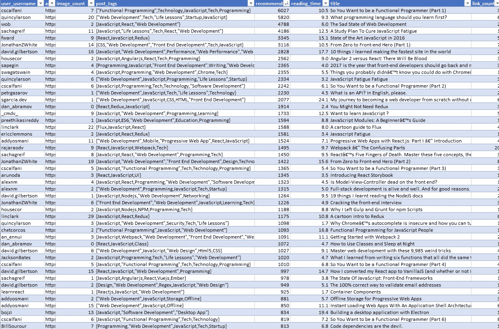
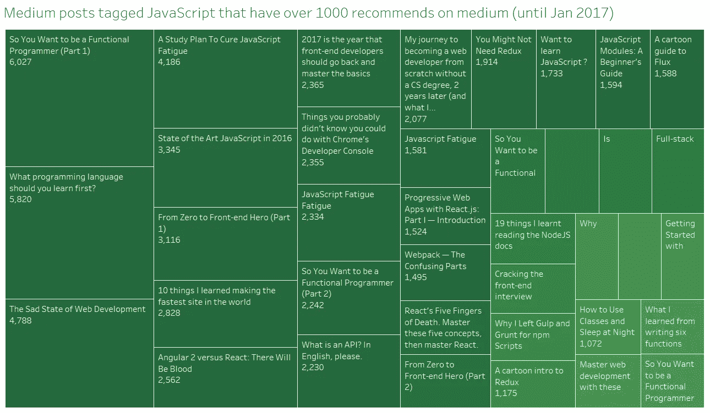
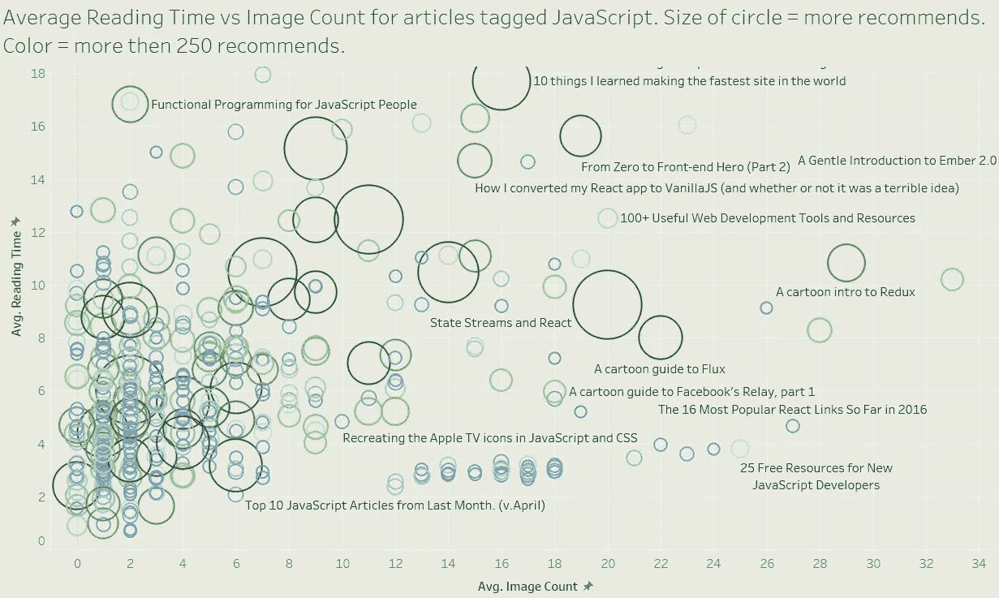
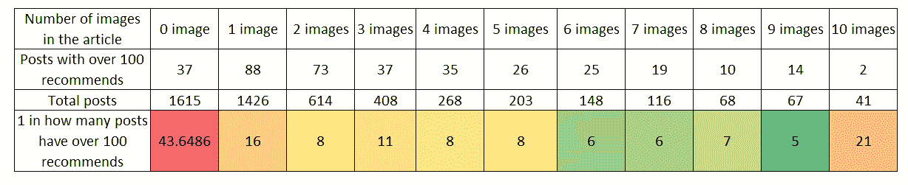

# 媒体上的前 200 篇 JavaScript 文章(截至 2017 年 1 月)

> 原文：<https://medium.com/hackernoon/top-200-javascript-articles-on-medium-until-jan-2017-a0c6a1bfe094>

我目前的重点是用编程语言来处理我在冬天丢弃的来自 medium 的 600 万篇文章。

上次我发布了标记 Python 的前 100 篇文章。

 [## 媒体上的 100 篇 Python 文章(截至 2017 年 1 月)

### 截至 2017 年 1 月，medium.com 上有 553 篇标记为 Python 的文章，由 367 名中等用户撰写。总阅读时间…

medium.com](/@baditaflorin/top-100-python-articles-on-medium-until-jan-2017-23ca8bc5ee87) 

在本帖中，我们将看看与 [JavaScript](https://hackernoon.com/tagged/javascript) 相关的前 200 篇文章。

> 阅读全部 5200 多篇文章需要多少时间？超过 15 天，不间断。
> 
> 是时候阅读排名前 200 的文章了吗？1 天

> 一篇文章在 medium 上标记 JavaScript 的阅读时间中位数是 3.2 分钟，上铰链 5 分钟，上须 10 分钟，下铰链 2 分钟。推荐数的中位数是 4，上铰链 20，上须 49 推荐。

## 让我们看看有多少文章获得了超过 1000 的推荐。

> 答案。
> 
> 38 篇帖子在媒体上获得了超过 1000 次的推荐。

# 让我们用数据来回答一个问题。

# 在帖子中插入图片有帮助吗？

让我们以另一种方式来看数据，并找出每个类别的总帖子中有多少得到了超过 100 条的推荐。，基于每个帖子有多少图片。

我们可以看到，如果你不放任何图片，你有一个频率是每 44 篇文章中有 1 篇得到超过 100 个推荐。

1 张图片，并且你已经有了每 16 篇文章中有 1 篇的频率来获得超过 100 个推荐。

2 张图片进入帖子，频率下降到 1/8，所以每第 8 个帖子有超过 100 个推荐。

> 对于包含 6 到 9 个图片的帖子，每 5 到 7 个帖子中就有一个会有超过 100 个推荐。

# 标签为 JavaScript 的前 200 个中型帖子中有多少女性？

# 六个。以下是清单:

### [本周我们为你策划了 16 篇文章。享受阅读的乐趣:](https://medium.com/u/d3391efe481a#6</h2>
<div class=)

28 个链接。凯文·奥肖内西写的文章

 [## 2017 年选择 JavaScript 框架

### 选择 JavaScript 框架:看看 6 个流行选项

medium.com](/@ZombieCodeKill/choosing-a-javascript-framework-535745d0ab90) 

23 个链接。Benjamin Libor 撰写的文章

 [## 🖥代码与开发的 5 个必读书目

### 第 7 版

medium.com](/@benjamin_libor/5-must-reads-in-code-development-3a9b60bec529) 

22 个链接。埃里克·鲁伊斯写的文章

 [## 冒险的开始:13 周的 JavaScript (╯ □)

### 一直想参加训练营，但高昂的费用让你望而却步？冷静，你有很多选择…

medium.com](/@___aerox___/the-beginning-of-an-adventure-13-weeks-of-javascript-78107605d533) 

# 标签为 JavaScripts 的前 200 篇中型文章(截至 2017 年 1 月)

1.  中级用户帖子有以下标签:JavaScript、Nodejs、Containers、Docker、UI。
    文章阅读时间 9.8 分钟。这篇文章包含 4 个链接和 0 张图片。 [## #NetflixAndChill:网飞如何利用 Node.js 和容器进行扩展

    ### 不久前，网飞还只是一家 DVD 公司。当金 Trott，UI 平台工程主任在…

    medium.com](/the-node-js-collection/netflixandchill-how-netflix-scales-with-node-js-and-containers-cf63c0b92e57) 

    165.中型用户 [Sonny Lazuardi](https://medium.com/u/ab530b775a3e?source=post_page-----a0c6a1bfe094--------------------------------) 总共得到了 254 条推荐，标题是“Ionic Framework vs React Native”。
    帖子有以下标签:JavaScript，“React Native”，Ionic。
    文章阅读时间 4.4 分钟。
    帖子包含 1 个链接和 7 张图片。

     [## 离子骨架 vs 反应原生

    ### 背景

    medium.com](/react-id/ionic-framework-hybrid-app-vs-react-native-4facdd93f690) 

    "166.中级用户 [freeCodeCamp](https://medium.com/u/8b318225c16a?source=post_page-----a0c6a1bfe094--------------------------------) 总共得到了 254 条推荐，标题是“JavaScript 新开发者的 25 个免费资源”。
    帖子有以下标签:JavaScript，创业，技术，设计，“社交媒体”。
    文章阅读时间 3.8 分钟。这篇文章包含 2 个链接和 25 张图片。

    [https://medium . com/free-code-camp/25-free-resources-for-new-JavaScript-developers-11342 cf 1 F4 df](/free-code-camp/25-free-resources-for-new-javascript-developers-11342cf1f4df)

    167。中级用户 [Bilal Budhani](https://medium.com/u/db35c342e9d7?source=post_page-----a0c6a1bfe094--------------------------------) 总共得到了 251 条推荐，标题是“你的下一个 React 原生项目需要考虑的 9 个库”。
    帖子有以下标签:React，“React Native”，“移动应用开发”，JavaScript，iOS。
    文章阅读时间 3.6 分钟。
    帖子包含 2 个链接和 1 张图片。

     [## 下一个 React 原生项目要考虑的 9 个库

    ### 毫无疑问，React Native 为开发人员带来了移动应用程序开发过程的福音。我一直…

    blog.codeinfuse.com](https://blog.codeinfuse.com/9-libraries-to-consider-for-your-next-react-native-project-723f179d4764) 

    168.中型用户 [Mikey Murphy](https://medium.com/u/e0f2e67bba64?source=post_page-----a0c6a1bfe094--------------------------------) 总共得到了 251 条推荐，这篇文章的标题是“用 React、ITCSS 和 CSS-in-JS 实现愉快、可维护的风格之旅”。
    帖子有以下标签:CSS，“Web 开发”，React，Aphrodite，JavaScript。
    文章阅读时间 16 分钟。
    帖子包含 5 个链接和 23 张图片。

     [## 通过 React、ITCSS 和 CSS-in-JS 实现愉快、可维护的风格

    ### 知道人类为什么做他们所做的事情让我着迷，很多时候我从通往成功的道路中学到了更多…

    medium.com](/maintainable-react-apps/journey-to-enjoyable-maintainable-styling-with-react-itcss-and-css-in-js-632cfa9c70d6) 

    169.媒体用户 [BASARAT](https://medium.com/u/a8204d2ae07b?source=post_page-----a0c6a1bfe094--------------------------------) 总共得到了 250 条推荐，标题是“打字稿赢了”。
    帖子有以下标签:JavaScript、Typescript、Reactjs、Angularjs、“开源”。
    文章阅读时间 2.8 分钟。
    帖子包含 1 个链接和 3 张图片。

     [## 打字稿赢了

    ### 我爱所有的人(伟大的开发者！)和技术(伟大的想法！)在这篇帖子中提到🌹。那表示我…

    medium.com](/@basarat/typescript-won-a4e0dfde4b08) 

    170.中型用户 [Mybridge](https://medium.com/u/68abb2e6c9bb?source=post_page-----a0c6a1bfe094--------------------------------) 总共获得了 249 条推荐，标题是“JavaScript 年度十大文章”。(v.2017)”。
    帖子有以下标签:JavaScript，“Web 开发”，编程，“软件开发”，“移动应用开发”。
    文章阅读时间 2.9 分钟。帖子包含 3 个链接和 16 张图片。

     [## JavaScript 年度十大文章。(五. 2017 年)

    medium.mybridge.co](https://medium.mybridge.co/javascript-top-10-articles-of-the-year-v-2017-6f416a925b88) 

    171.中型用户 [Node.js Foundation](https://medium.com/u/96cd9a1fb56?source=post_page-----a0c6a1bfe094--------------------------------) 共获得 249 条推荐，为题为“Node.js 一年来的进步 Node.js 与 io.js 合并后，技术何去何从”的帖子。
    帖子有以下标签:Nodejs，JavaScript，Developer。
    文章阅读时间 4.2 分钟。
    帖子包含 1 个链接和 2 张图片。

     [## Node.js 和 io.js 合并一年后 Node.js 的进展以及技术的发展方向

    ### 在 Node.js Interactive Europe 昨天的主题演讲中，核心社区成员分享了社区的…

    medium.com](/@nodejs/the-progress-of-node-js-a-year-post-node-js-and-io-js-merge-and-where-the-technology-is-going-f168ce9ec8ee) 

    172.中级用户 [Nader Dabit](https://medium.com/u/695782484bda?source=post_page-----a0c6a1bfe094--------------------------------) 总共获得了 245 条推荐，标题为“React Native Navigator 在 React Native 中像专业人士一样导航”。
    帖子有以下标签:JavaScript，React，“React Native”。
    文章阅读时间 7 分钟。这篇文章包含 1 个链接和 2 张图片。

     [## React Native 导航器—在 React Native 中像专业人员一样导航

    ### 想学母语吗？查看 React 本地培训。

    medium.com](/react-native-training/react-native-navigator-navigating-like-a-pro-in-react-native-3cb1b6dc1e30) 

    173.媒体用户 [DailyDrip](https://medium.com/u/d74e4d4dc061?source=post_page-----a0c6a1bfe094--------------------------------) 共获得 243 条推荐，主题为“为什么榆树要改变世界”。
    帖子有以下标签:Elm，JavaScript，编程，“函数式编程”，Ruby。
    文章阅读时间 4.8 分钟。
    帖子包含 14 个链接和 4 张图片。

     [## 为什么榆树会改变世界

    ### 2016 年 1 月 1 日左右开始玩 Elm。这在很大程度上是由杰西卡·克尔在…

    hackernoon.com](https://hackernoon.com/why-elm-is-going-to-change-the-world-f5a6c693b2ca) 

    174.中型用户 Sashko Stubailo 共获得 243 条推荐，文章标题为“Apollo，现代应用的数据堆栈”。
    帖子有以下标签:React、JavaScript、Graphql。
    文章阅读时间 7.7 分钟。
    帖子包含 5 个链接和 15 张图片。

     [## 阿波罗，现代应用的数据堆栈

    ### 我们正在为每个人开发一个基于 GraphQL 的新平台

    dev-blog.apollodata.com](https://dev-blog.apollodata.com/apollo-8b7215bcab1c) 

    175.中级用户 [rajaraodv](https://medium.com/u/2af670e1ee6f?source=post_page-----a0c6a1bfe094--------------------------------) 总共得到了 242 条推荐，标题是“用 JWT 令牌保护 React Redux 应用”。
    帖子有以下标签:Nodejs，React，JavaScript。
    文章阅读时间 6.5 分钟。
    帖子包含 15 个链接和 2 张图片。

     [## 使用 JWT 令牌保护 React Redux 应用

    ### JSON Web 令牌(JWT)是一种生成身份验证令牌的方法。这是一个开放标准(RFC 7519 ),它定义了一种简单的方法…

    medium.com](/@rajaraodv/securing-react-redux-apps-with-jwt-tokens-fcfe81356ea0) 

    176.媒体用户 [rajaraodv](https://medium.com/u/2af670e1ee6f?source=post_page-----a0c6a1bfe094--------------------------------) 总共获得了 242 条推荐，标题是“React Redux 应用的剖析”。
    帖子有以下标签:React、JavaScript、Angularjs。
    文章阅读时间 4.8 分钟。这篇文章包含 14 个链接和 7 张图片。

     [## React Redux 应用程序的剖析

    ### 如果您检查 React Redux 应用程序的源代码，它可能会令人不知所措。但是疯狂是有方法的，它…

    medium.com](/@rajaraodv/the-anatomy-of-a-react-redux-app-759282368c5a) 

    177.中型用户 [Mybridge](https://medium.com/u/68abb2e6c9bb?source=post_page-----a0c6a1bfe094--------------------------------) 总共获得了 242 条推荐，是关于标题为“10 月 JavaScript 十大文章”的帖子。
    帖子有以下标签:JavaScript，“Web 开发”，编程，“软件开发”，React。
    文章阅读时间 3.2 分钟。
    帖子包含 5 个链接和 17 张图片。

    [https://medium . com/my bridge-for-professionals/JavaScript-top-10-10 月 10 篇文章-5e59c018379](/mybridge-for-professionals/javascript-top-10-articles-in-october-5e59c018379f)

    178.中型用户 [Alex Reardon](https://medium.com/u/ea5e41121e55?source=post_page-----a0c6a1bfe094--------------------------------) 总共得到了 241 条推荐，标题是“React 应用的性能优化”。
    帖子有以下标签:React，JavaScript，“前端开发”。
    文章阅读时间 5.6 分钟。
    帖子包含 1 个链接和 5 张图片。

     [## React 应用的性能优化

    ### TLDR；

    medium.com](/@alexandereardon/performance-optimisations-for-react-applications-b453c597b191) 

    179.中型用户 [Slack Engineering](https://medium.com/u/28279a71b4f2?source=post_page-----a0c6a1bfe094--------------------------------) 共获得 240 条推荐，标题为“更快、更智能的快速切换器”。这篇文章有以下标签:JavaScript，Slack，算法。
    文章阅读时间 7.3 分钟。帖子包含 3 个链接和 4 张图片。

     [## 更快、更智能的快速切换器

    ### 我们重写了快速切换器，以显著提高性能，并使其更易于使用。这是我们…

    松弛工程](https://slack.engineering/a-faster-smarter-quick-switcher-77cbc193cb60) 

    180.媒体用户 [A. Sharif](https://medium.com/u/52e7bcc5db67?source=post_page-----a0c6a1bfe094--------------------------------) 总共得到了 240 条关于“反应的优雅”的推荐。
    帖子有以下标签:JavaScript、React、编程、“软件开发”、Redux。
    文章阅读时间 7.8 分钟。
    帖子包含 1 个链接和 0 张图片。

     [## React 的优雅

    ### 用 React、Redux 和 Ramda 编写优雅的代码

    medium.com](/javascript-inside/the-elegance-of-react-ebc21a2dcd19) 

    181.媒体用户 [Richard Herrera](https://medium.com/u/c08440967187?source=post_page-----a0c6a1bfe094--------------------------------) 总共获得了 239 条推荐，标题为“NFL + React”。这篇文章有以下标签:JavaScript，React，Reactjs。
    文章阅读时间 5.9 分钟。帖子包含 1 个链接和 8 张图片。

     [## NFL + React

    ### 美国国家足球联盟于 2014 年 12 月采用 React。在过去的一年里，我们一直在迭代和构建 React 的…

    medium.com](/nfl-engineers/nfl-react-84e9cd11d384) 

    182.中型用户 [Rob Dodson](https://medium.com/u/d712d6fb229b?source=post_page-----a0c6a1bfe094--------------------------------) 总共得到了 238 条关于“定制元素案例:第 1 部分”的推荐。
    帖子有以下标签:“Web 开发”，“Web 组件”，JavaScript。
    文章阅读时间 4.8 分钟。
    帖子包含 1 个链接和 4 张图片。

     [## 定制元素的案例:第 1 部分

    ### 在这篇文章中，我想解释为什么我认为定制元素是有意义的，尤其是对于大型组织。在…

    medium.com](/dev-channel/the-case-for-custom-elements-part-1-65d807b4b439) 

    183.中型用户 [Addy Osmani](https://medium.com/u/2508e4c7a8ec?source=post_page-----a0c6a1bfe094--------------------------------) 总共获得了 237 条推荐，标题为“问题 1:服务人员调试，3G 上的 RAIL，离线分析，渐进式网络应用，Rollupify”。
    帖子有以下标签:“Web 开发”，JavaScript，工具。
    文章阅读时间 6.8 分钟。
    帖子包含 4 个链接和 8 张图片。

     [## 问题 1:服务人员调试、3G 上的 RAIL、离线分析、渐进式 Web 应用程序、Rollupify …

    ### 《完全工具化的眼泪》是马特和艾迪的 YouTube 视频节目《完全工具化的技巧》的新伙伴。这是一个原始的每周大脑…

    medium.com](/totally-tooling-tears/issue-1-service-worker-debugging-rail-on-3g-offline-analytics-progressive-web-apps-rollupify-a08f410f3fe6) 

    184.媒体用户 [Malte Ubl](https://medium.com/u/7813e6de99d2?source=post_page-----a0c6a1bfe094--------------------------------) 总共获得了 237 条推荐，标题是“2016 年将是网络并发年”。
    帖子有以下标签:JavaScript，“Web 开发”。
    文章阅读时间 7.3 分钟。
    帖子包含 1 个链接和 7 张图片。

     [## 2016 年将是网络并发年

    ### 自 2009 年以来，web 上的 JavaScript 编程有了一种使用无共享线程编写并发程序的方法:Web…

    medium.com](/@cramforce/2016-will-be-the-year-of-concurrency-on-the-web-c39b1e99b30f) 

    185.媒体用户 Evan Wallace 总共得到了 235 条推荐，文章标题是“在网络上建立一个专业的设计工具”。这篇文章有以下标签:JavaScript，“Web 开发”，Tech。
    文章阅读时间 6.4 分钟。帖子包含 3 个链接和 1 张图片。

     [## 在网络上构建专业的设计工具

    ### 我们对未来设计工具的愿景是，任何人都可以轻松获得工具和内容…

    blog.figma.com](https://blog.figma.com/building-a-professional-design-tool-on-the-web-6332ed4f1fcc) 

    186.媒体用户 [Artem Sapegin](https://medium.com/u/b031a508ddaf?source=post_page-----a0c6a1bfe094--------------------------------) 共获得了 234 条推荐，标题为“用 Jest 和酶测试 React 组件”。
    帖子有以下标签:JavaScript、React、Jest、Enzyme、Testing。
    文章阅读时间 4.4 分钟。
    帖子包含 2 个链接和 1 张图片。

     [## 用 Jest 和酶测试反应组分

    ### 浅层渲染，快照测试和许多例子。

    hackernoon.com](https://hackernoon.com/testing-react-components-with-jest-and-enzyme-41d592c174f) 

    187.媒体用户 [Calvin Froedge](https://medium.com/u/62603ddf1166?source=post_page-----a0c6a1bfe094--------------------------------) 总共得到了 234 条推荐，标题是“为什么我不把我的未来押在 MeteorJS 上”。
    帖子有以下标签:流星、JavaScript、编程。
    文章阅读时间 8.6 分钟。
    帖子包含 1 个链接和 0 张图片。

     [## 为什么我不把我的未来押在流星上。

    ### TLDR:在认真使用“流星”大约 3 周(每天 8 小时)后，我决定，尽管它有好处，它还是…

    medium.com](/@calvinfroedge/why-i-m-not-staking-my-future-on-meteorjs-52e55fbf5332) 

    188.媒体用户迈克·格罗塞斯总共得到了 231 条推荐，标题是“为超模块化 JavaScript 辩护”。
    帖子有以下标签:Nodejs，JavaScript，“开源”，设计，技术。
    文章阅读时间 5.1 分钟。帖子包含 3 个链接和 3 张图片。

     [## 为超模块化 JavaScript 辩护

    ### 上周，npmgate 是 JavaScript 社区的一个大话题。对于那些不了解……

    medium.freecodecamp.org](https://medium.freecodecamp.org/in-defense-of-hyper-modular-javascript-33934c79e113) 

    189.媒体用户 [Anthony Gore](https://medium.com/u/c01404998660?source=post_page-----a0c6a1bfe094--------------------------------) 共获得 229 条推荐，标题为“Vue.js 做对的 4 件事”。
    帖子有以下标签:JavaScript，Vuejs，React，Angularjs，“Web 开发”。
    文章阅读时间 3.2 分钟。
    帖子包含 2 个链接和 1 张图片。

     [## Vue.js 做对的 4 件事

    ### 无论你正遭受 Javascript 疲劳症、ES 焦虑症、后网络包压力症或任何其他类型的网络…

    medium.com](/js-dojo/4-things-vue-js-got-right-10820cc84004) 

    190.中型用户 [Joselito](https://medium.com/u/ba5943fea8f?source=post_page-----a0c6a1bfe094--------------------------------) 共获得 228 条推荐，标题为“Como programar em JavaScript em 2016”。这篇文章有以下标签:幽默，JavaScript，社区。
    文章阅读时间 13.7 分钟。帖子包含 1 个链接和 9 张图片。

     [## comoéprogramar em JavaScript em 2016

    ### esse artigoéuma traduo total mente livre e adapteda de《2016 年学习 Javascript 的感受》，publicada na…

    约瑟里.托](https://joseli.to/como-e-programar-em-javascript-em-2016/) 

    191.中等用户[戴维·福克斯·鲍威尔](https://medium.com/u/1f3666c16f4f?source=post_page-----a0c6a1bfe094--------------------------------)总共得到了 225 条推荐，这篇文章的标题是“为什么没有人能写一个简单的网络包教程？”。
    帖子有以下标签:JavaScript，Webpack，Nodejs，Babeljs，ES6。
    文章阅读时间 11.3 分钟。
    帖子包含 1 个链接和 4 张图片。

     [## 为什么没有人能写一个简单的 Webpack 教程？

    ### 好吧…所以我们都是潮人，或者自大的书呆子，笨蛋，只知道 JavaScript 而不是真正的编程的失败者…

    medium.com](/@dtothefp/why-can-t-anyone-write-a-simple-webpack-tutorial-d0b075db35ed) 

    192.中级用户 Jonas hel fer 总共得到了 225 条推荐，这篇文章的标题是“我如何绘制 SQL？”。
    帖子有以下标签:Graphql，React，JavaScript。
    文章阅读时间 4 分钟。
    帖子包含 3 个链接和 1 张图片。

     [## 我如何绘制图表？

    ### 休息时要知道的 3 件事

    dev-blog.apollodata.com](https://dev-blog.apollodata.com/how-do-i-graphql-2fcabfc94a01) 

    193.媒体用户迈克·赫恩得到了 224 条推荐，标题是“Graal & Truffle”。
    帖子有以下标签:编程，JavaScript，JVM。
    文章阅读时间 12.5 分钟。
    帖子包含 1 个链接和 2 张图片。

     [## Graal &块菌

    ### 一个不起眼的研究项目可以从根本上加速编程语言设计的创新

    blog.plan99.net](https://blog.plan99.net/graal-truffle-134d8f28fb69) 

    194.中级用户 [Joanne](https://medium.com/u/90a662a100da?source=post_page-----a0c6a1bfe094--------------------------------) 总共得到了 222 条推荐，文章标题为“如何创建和发布你的第一个 Node.js 模块”。
    帖子有以下标签:JavaScript，Nodejs，NPM。
    文章阅读时间 9.3 分钟。
    帖子包含 2 个链接和 12 张图片。

     [## 如何创建和发布您的第一个 Node.js 模块

    ### 什么是 npm？

    medium.com](/@jdaudier/how-to-create-and-publish-your-first-node-js-module-444e7585b738) 

    195.媒体用户 [Matheus Lima](https://medium.com/u/fb33cb80b669?source=post_page-----a0c6a1bfe094--------------------------------) 总共得到了 222 条推荐，标题是“Entendendo Programa o Funcional em JavaScript de uma vez”。
    帖子有以下标签:ES6，JavaScript，“函数式编程”。
    文章阅读时间 5.5 分钟。这篇文章包含 2 个链接和 3 张图片。

     [## uma vez 功能和 JavaScript entendendo 程序

    ### 您认为我们可以向社区提供什么功能的程序？

    medium.com](/tableless/entendendo-programação-funcional-em-javascript-de-uma-vez-c676489be08b) 

    196.中级用户 [rajaraodv](https://medium.com/u/2af670e1ee6f?source=post_page-----a0c6a1bfe094--------------------------------) 总共得到了 221 条推荐，主题是“网络包的 HMR &反应热加载器——缺失的手册”。
    帖子有以下标签:JavaScript、Webpack、React。
    文章阅读时间 7.6 分钟。
    帖子包含 15 个链接和 15 张图片。

     [## Webpack 的 HMR & React-Hot-Loader——缺失的手册

    ### Webpack 的 HMR 和 React-Hot-Loader 使得 React 应用程序的开发非常高效。但是这取决于…

    medium.com](/@rajaraodv/webpacks-hmr-react-hot-loader-the-missing-manual-232336dc0d96) 

    197.中型用户 [Mybridge](https://medium.com/u/68abb2e6c9bb?source=post_page-----a0c6a1bfe094--------------------------------) 总共获得了 221 条推荐，推荐的文章名为“上个月前 10 篇 JavaScript 文章”。(五月)”。
    帖子有以下标签:“Web 开发”，JavaScript，编程，Tech，“软件开发”。
    文章阅读时间 3.2 分钟。
    帖子包含 6 个链接和 14 张图片。

     [## 上个月的前 10 篇 JavaScript 文章。(五月)

    ### 我们已经观察到了 2016 年 4 月发布和更新的近 1000 篇与 JavaScript 相关的文章。

    medium.mybridge.co](https://medium.mybridge.co/top-10-javascript-articles-from-last-month-v-may-e23383d35c1c) 

    198.媒体用户 [Matt Aimonetti](https://medium.com/u/15ebd9fc38ab?source=post_page-----a0c6a1bfe094--------------------------------) 总共收到了 220 条推荐，标题是“Go for everybody”。
    帖子有以下标签:编程、社区、Golang、JavaScript、教育。
    文章阅读时间 4 分钟。
    帖子包含 2 个链接和 0 张图片。

     [## 围棋适合所有人

    ### Go 是谷歌创造的一种现代编程语言。它被设计成一个非常理性(读起来不花哨)、简单的…

    medium.com](/@mattetti/go-is-for-everyone-b4f84be04c43) 

    199.中级用户 [Jonas Helfer](https://medium.com/u/39cbd38c57c8?source=post_page-----a0c6a1bfe094--------------------------------) 总共得到了 220 条推荐，主题是“如何构建 GraphQL 服务器”。
    帖子有以下标签:Graphql，JavaScript，React，“Web 开发”，编程。
    文章阅读时间 6.6 分钟。这篇文章包含 4 个链接和 2 张图片。

     [## 如何构建 GraphQL 服务器

    ### 关于优化什么、如何优化以及何时优化的提示

    dev-blog.apollodata.com](https://dev-blog.apollodata.com/how-to-build-graphql-servers-87587591ded5) 

    200.媒体用户 [Artem Sapegin](https://medium.com/u/b031a508ddaf?source=post_page-----a0c6a1bfe094--------------------------------) 总共获得了 219 条推荐，标题为“React and Redux Single Page Applications Resources”。
    帖子有以下标签:JavaScript，React，Redux。
    文章阅读时间 2.1 分钟。
    帖子包含 11 个链接和 0 张图片。

     [## 反应和重复使用单页应用程序资源

    ### 这里列出了我们在 Here 产品工具中使用的最好的文章、书籍和关于库和工具的讨论…

    medium.com](/@sapegin/react-and-redux-single-page-applications-resources-22cd859b0c1d) 

    # 如果你发现我创造的东西有价值，你可以成为赞助人，只需 5 美元，支持这个系列的创作:

     [## 有趣的统计数据——Florin badi ta 正在创建统计数据、数据可视化| Patreon

    ### 成为有趣的统计数字的赞助人——弗罗林·巴迪塔今天:阅读有趣的统计数字的帖子——弗罗林·巴迪塔…

    www.patreon.com](https://www.patreon.com/florinbadita) 

    ## 我玩 Medium.com 数据库的相关帖子:

     [## 走进 Medium.com 1000 大标签——第一部分

    ### 在我呆在美国的 3 个月里，我最喜欢的一个项目就是下载所有关于 medium.com 的帖子。它花了大约…

    medium.com](/@baditaflorin/inside-the-top-1000-tags-on-medium-com-part-1-a1ff96356639)  [## 分析 150K 中型标签—第 1 部分。

    ### 为什么要这样做？

    medium.com](/@baditaflorin/analyzing-150k-medium-tags-part-1-b63445563eb6)  [## medium.com 内部 30000 篇文章链接。

    ### 有些人喜欢链接，有些人喜欢图片，还有一些人，他们把一半和一半。

    medium.com](/@baditaflorin/inside-medium-com-top-30000-articles-with-links-b1268abc1d6e) 

    写 AI/ML/DL 的前 100 名**作家**

     [## 写人工智能/机器学习/深度学习的媒体作家前 100 名

    ### 有超过 6500 篇关于 AI/ML/DL 的文章写在介质上，如果你想读完它们，你需要…

    hackernoon.com](https://hackernoon.com/top-100-medium-writers-that-wrote-about-artificial-intelligence-machine-learning-deep-learning-c485dd5b8c6c) 

    **AI/ML/DL 前 100 篇文章的列表可以在这里找到:**

     [## medium.com 100 强

    ### 我们已经看到了获得最多推荐的前 100 名中等用户，但这对我们的探索毫无帮助…

    medium.com](/@baditaflorin/top-100-medium-com-c2695ab3270c) 

    **标签为人工智能/机器学习/深度学习的中帖之间的关键区别**

     [## 标签为人工智能/机器学习/深度的中型帖子之间的主要区别…

    ### 有超过 6500 篇关于 AI/ML/DL 的文章写在介质上。

    medium.com](/@baditaflorin/key-differences-between-medium-posts-tagged-artificial-intelligence-machine-learning-deep-f9b3826a3f27) 

    我很想听听你对我废弃的中型数据库有什么其他想法:)

    ## 关于我

    在过去的 3 年里，我与 Rise 项目合作，进行数据分析和模式识别，以发现非结构化数据集中的腐败模式。

    我是世界银行的顾问。

    目前，作为一份工作，我是一名高级地图分析师，处理 OpenStreetMap 数据。

    2016 年 9 月，我搬到[三藩市住了 3 个月，开始新的生活](/@baditaflorin/why-i-maxed-out-my-credit-card-moved-to-silicon-valley-to-become-a-entrepreneur-a6aaced118f3)。

    现在我回到了罗马尼亚，在这里/另一个国家寻找一份远程/兼职/全职工作，在那里我可以应用我与数据科学相关的专业知识。

    ## 目前:

    *   建立一个工具来检测 [**可能的虚假病毒式新闻，在它们传播之前**](https://hackernoon.com/the-outbreak-detecting-fake-viral-news-automatically-3acded3a97cb) **。**
    *   将脸书的反应与[情感分析结合起来，创建一个帖子、一个页面](/@baditaflorin/understanding-facebook-reactions-using-sentiment-analysis-f17b6e561ff3)的情感指纹。
    *   从罗马尼亚**排名前 12.000 的 FB 页面下载所有公开帖子**。到目前为止已经下载了 1900 万个帖子。参见这里的一个用例，[分析抗议趋势。](https://www.slideshare.net/baditaflorin/point-conference-2017-romanian-protests-florin-badita)
    *   学习 ML，全文搜索。

    你可以在网上找我**上媒** [**弗罗林【巴迪塔】**](https://medium.com/u/3b723c70c152?source=post_page-----a0c6a1bfe094--------------------------------)**[**AngelList**](https://angel.co/florin-badita)**[**Twitter**](https://twitter.com/baditaflorin)**，L** [**inkedin，**](http://linkedin.com/in/baditaflorin)**O**[**penstreetmap**](https://www.openstreetmap.org/user/baditaflorin/diary)**，G******

    ******有时候我会在博客上写**[**http://florinbadita.com/**](http://florinbadita.com/)****