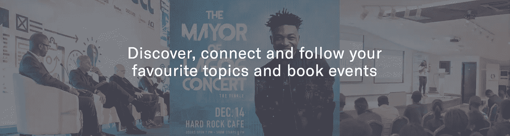
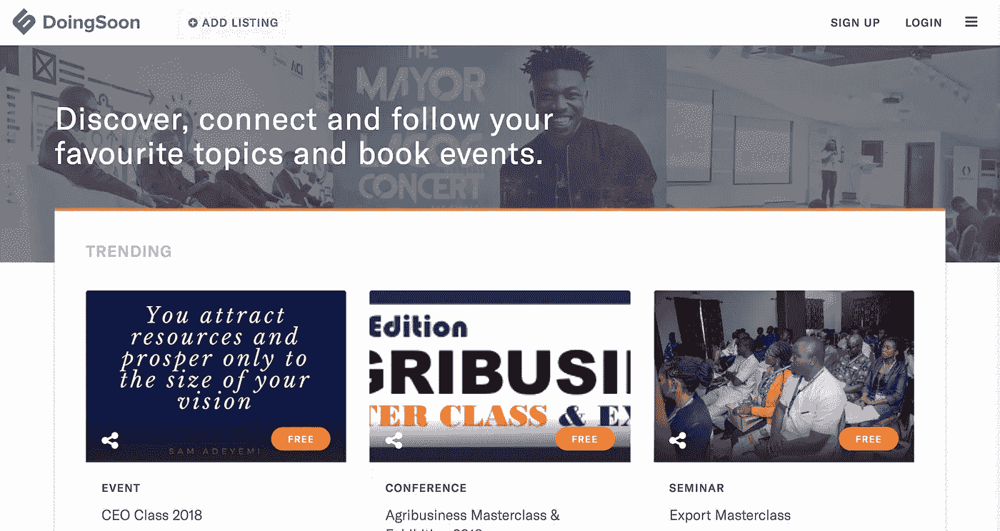
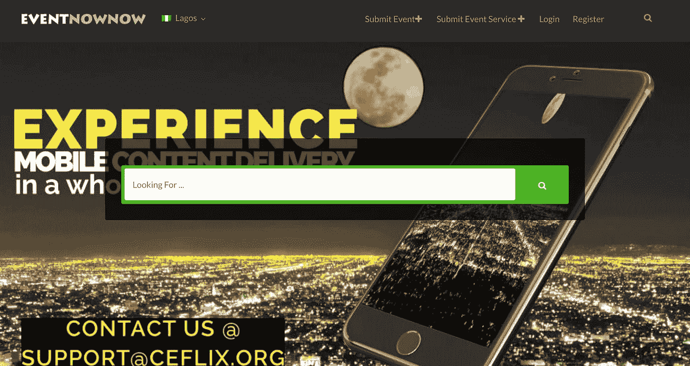
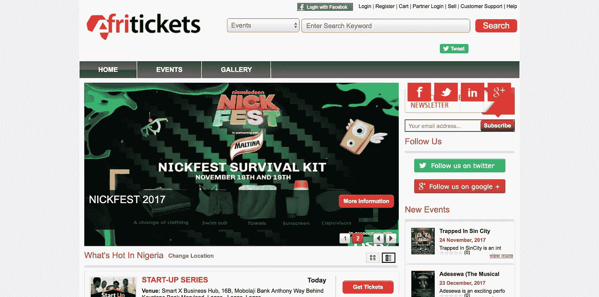

# 尼日利亚 4 大活动预订网站

> 原文：<https://medium.com/hackernoon/top-4-event-booking-sites-in-nigeria-1caa21936c2>

DoingSoon preview image

解决尼日利亚的社交活动发现和门票预订问题

我们都知道或者至少大多数人知道(如果你参加过任何会议),几乎 80%的在线会议门票都是通过 Eventbrite 售出的，它工作得很好。句号。

问题是，大多数西方平台，如 Eventbrite，并不是真正为所有市场构建/设计的。以尼日利亚为例。Eventbrite 不接受来自尼日利亚的付款，这意味着来自尼日利亚的组织者不能接受他们活动的付款，这迫使他们接受线下付款。在线支付曾经是一个问题，但多亏了 [Paystack](http://paystack.com) 解决了这个问题，他们做得非常好。

另一个颇具挑战性的问题是，当地平台的设计很差，内容质量很低，我相信这是促使大多数尼日利亚人使用 Eventbrite 的原因，因为它提供并展示更高质量的内容。

很少有服务解决这些问题，并试图让组织者更容易预订活动，同时改善用户的活动发现体验。任何活动票务平台要想在尼日利亚取得成功，都必须解决支付问题，创建更好的 UI/UX 平台，并提高内容质量。

# 迄今为止做得不错的 4 大平台:

# DoingSoon.com

发现、联系和关注您最喜欢的主题和图书活动。这不仅是一个票务平台，也是一个根据您关注的主题或组织者进行活动发现和通知的平台。

doingsoon landing page

# 【Eventnownow.com 

了解您身边发生的激动人心的事件的在线门户。当您想找点事做，并且需要关于当地事件的最简明、最新的信息时。

eventnownow landing page

# [Afritickets.com](http://www.afritickets.com/)

Afritickets 是一家专注于非洲票务活动和相关商品的零售商。我们充当消费者和活动组织者之间的中介。

Afriticket landing page

# [Naijaticketshop.com](http://naijaticketshop.com/)

Naija 票务商店是尼日利亚排名第一的在线票务买卖平台。我们致力于帮助我们的客户在安全可靠的线上和线下环境中找到他们最喜爱的场馆和活动的门票和信息。

naijaticketshop landing page

这是一个渐进的过程，任何好的事情都需要时间。我认为 Afriticket 是这一领域的先行者之一，他们仍然保持着强劲的势头。在这个领域，我们需要更多的创业和创新。我们建造得越多，竞争就越激烈，创新就越多，从而为每个人提供更好的服务。

#naija