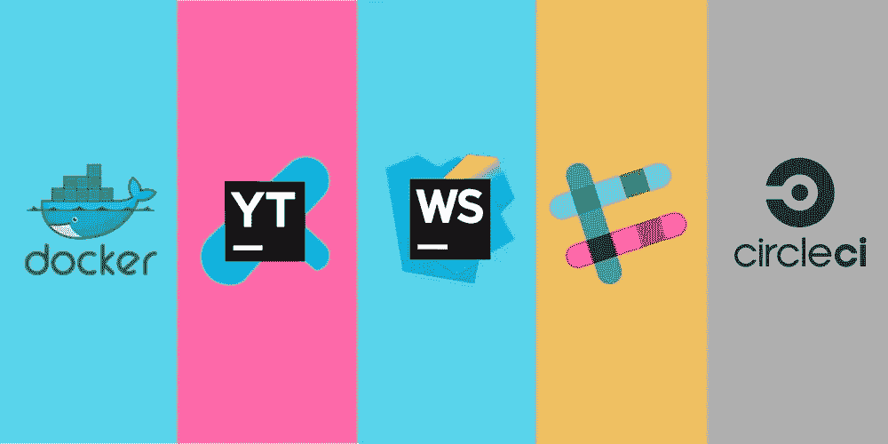
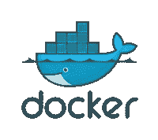
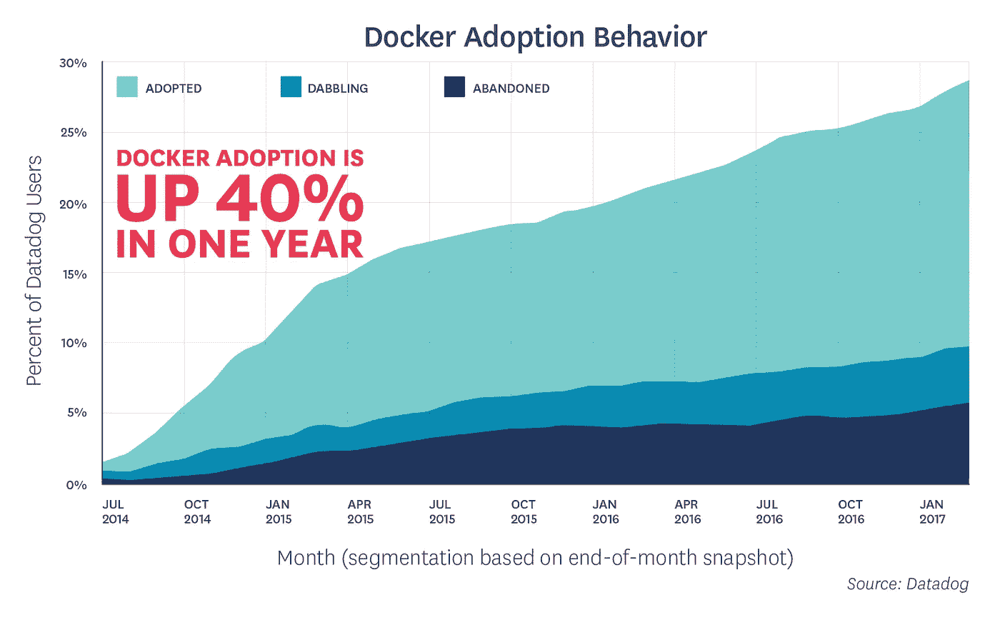
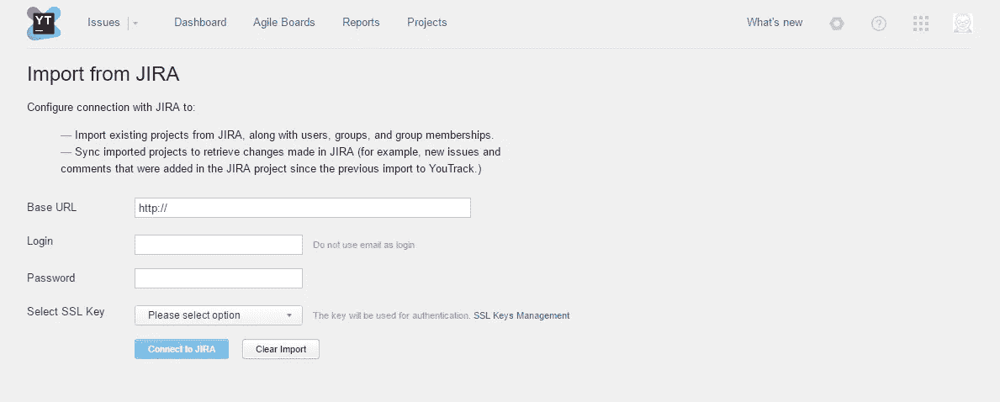
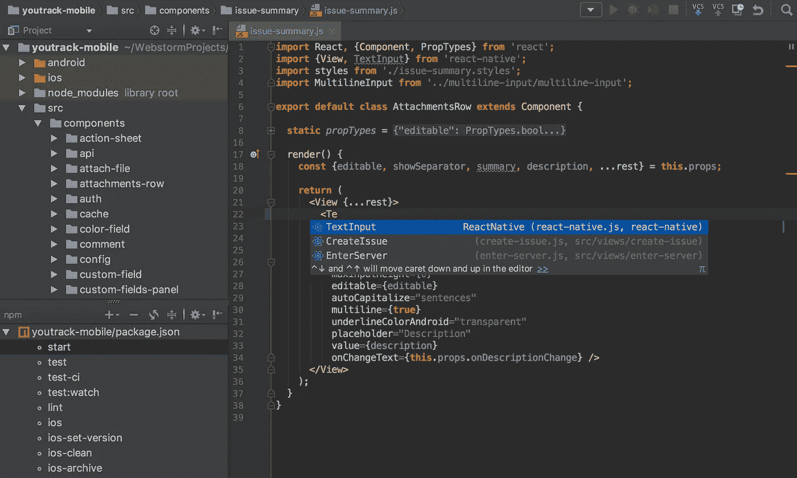
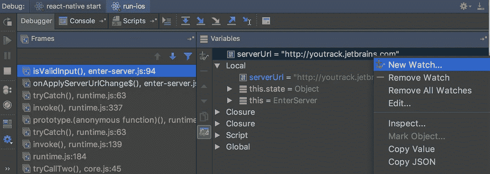
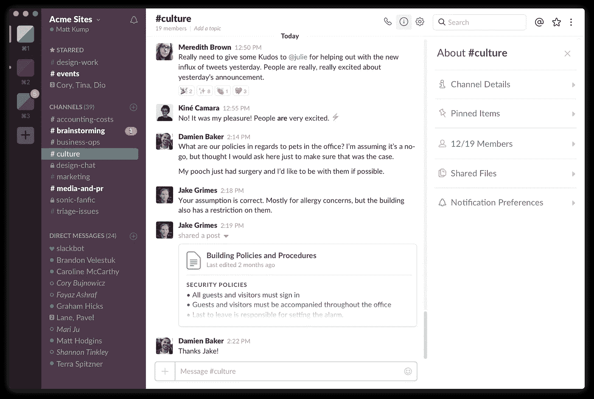
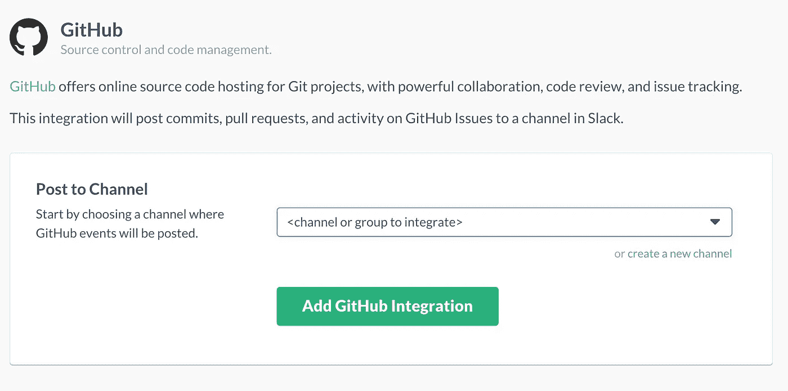
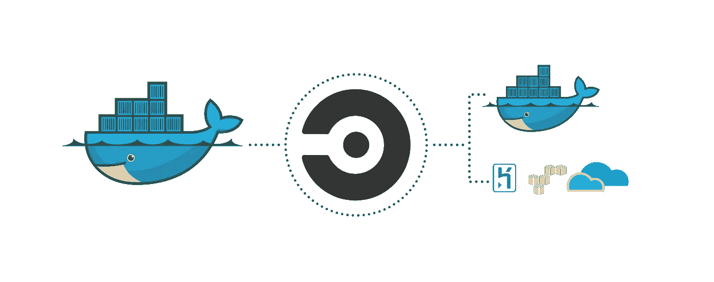

# IT 公司日常使用的五大云服务

> 原文：<https://medium.com/hackernoon/top-5-%D1%81loud-based-services-for-it-companies-to-use-in-a-daily-routine-8acf674638dd>

在我们的工作中，我们一直在不断改进我们的工具、技能和实践，以便在工作、沟通甚至客户与我们之间的关系方面取得更好的效果。因此，我们提出了一个云服务列表，我们认为这对任何 IT 公司都是必不可少的，无论大小，并且对日常工作有很大帮助。我们发现这些服务真的很有帮助，我们将在下面讨论它们，给你一个快速的概述。

# 1.码头工人

Docker 是一种在 Linux 和 Windows 上提供额外的操作系统级虚拟化自动化层的技术。Docker 允许组织一个受控的环境来运行编程产品。在任何时候，运行任何数量的相同进程(微服务)都是可能的，这有助于我们确保我们的服务器在必要的操作系统版本上工作，该版本具有所有功能。

用户也不必执行任何附加功能。为了部署项目，你只需要执行一个命令，而不是安装几十个应用程序。Docker 的另一个优势是可以多次使用每个构建版本。

你为什么需要它？省时、高效且不复杂的工作。

根据 2016 年 3 月初[**data dogs**](https://www.datadoghq.com/docker-adoption/)的报告，他们的客户中有 13.6%采用了 Docker。一年后，这个数字上升到了 18.8%。这相当于 12 个月内市场份额增长了近 40%。

# 2.JetBrainstm Youtrack

JetBrainstm Youtrack 是一个 bug 和问题跟踪器，是一个非常有用的工具。它也是一个项目管理软件。

它的主要焦点是基于查询的问题搜索，该程序可以批量处理问题，自定义属性集并创建自定义工作流。

Youtrack 的另一个很酷的地方是它能够集成许多外部工具，包括 CVS、Clearcase、TeamCity 等等。它甚至可以从 JIRA(被许多公司广泛使用)导入问题，也可以与 GitHub 建立集成。

**为什么需要？**在 bug 跟踪和问题跟踪方面有很大帮助，与许多工具兼容。

如果相信 JetBrains Youtrack 的 [**问题跟踪工具调查 2016**](https://www.jetbrains.com/youtrack/promo/tracking-tools-report-2016/) 没有吉拉那么受欢迎，因此与吉拉(80%)具有相同的满意率，并且也排名为最佳功能。报告称，Youtrack 是最值得推荐的工具。

# 3.JetBrainstm 网络风暴

JetBrainstm Webstorm 是一个 JavaScript IDE(“集成开发环境”-一个用于软件开发的软件应用程序)，它配备了 Node.js 的客户端和服务器端开发。它有许多很酷的功能，最突出和最重要的是:代码完成、代码检查和“在旅途中”分析、方便的导航、方便的重构和调试系统、使用版本控制系统的机会、活动模板等。

在第一次安装 Webstorm 之后，开发者得到了一个具有广泛功能的编辑器。你几乎可以改变任何东西，从主题到 FTP 同步。

Webstorm 支持用 JavaScript 编译的语言(TypeScript，CoffeeScript 等。).对于更详细的设置，有许多可用的软件包。

你为什么需要它？易于开发，有许多很酷的功能可供选择。

根据 [**偏**](https://www.slant.co/versus/1958/5980/~intellij-idea_vs_webstorm) 的说法，WebStorm 是 Node.js(调试 Node.js 的工具)和 Dart 语言的最佳 IDE。是最好的 JavaScript (TypeScript，React Native) IDE 和编辑器之一，对学生有折扣。

# 4.松弛的

我们已经说过很多次了，团队成员之间以及你和客户之间保持良好沟通的重要性。Slack 是一个工具，可以帮助你保持沟通，存储所有必要的文件，轻松搜索任何东西，从文件到关键字。

除了将所有通信保持在一个地方，它还集成了许多熟悉的服务，如 GitHub(启用通知并允许您查看代码检查)、Trello(任务管理和跟踪的另一个伟大来源)、Google Hangouts 等。

此外，您可以在 Slack 中共享和测试代码片段，并拥有私人一对一小组。

**为什么需要？**良好的沟通环境，共享文件和追踪大量信息的机会。

我们为你找到了一些数据。有多少人用 slack？这份 [**报告**](https://expandedramblings.com/index.php/slack-statistics/) 称，slack 截至 2017 年 6 月 15 日拥有 500 万 DAU(日活跃用户)。每个工作日用户在空闲状态下的平均活动时间为 320 分钟。

# 5.切尔莱西

首先，CircleCI 允许您优化许多开发流程。它最重要的特性之一是能够测试开发人员添加的代码。测试是自动的，因此将这部分工作从开发人员转移到程序中。

CircleCI 还允许组织项目的自动部署。根据设置，程序可以独立地在 Amazon、Heroku 等服务上部署项目。此外，DevOps 工程师可以为可能的设置列表中未包括的服务使用自己的设置。

另一个优点是执行任何其他脚本和调试功能。

你为什么需要它？工作优化、节省时间、质量控制。

这些是我们在[**dash bounk**](https://dashbouquet.com)日常使用的工具，强烈推荐任何 IT 公司部署。如果你对有用的 app 有什么其他想法，请和我们分享！因为我们总是渴望学习新事物，尝试新事物。

[*德米特里·布科*](https://www.linkedin.com/in/dmitrybudko/\) 撰写

*想了解更多？* [*在这里查看*](https://dashbouquet.com/blog)