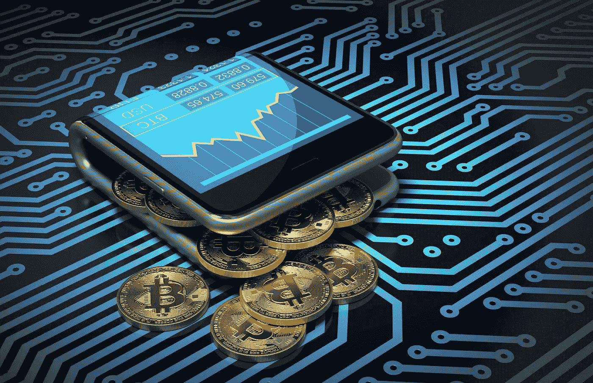
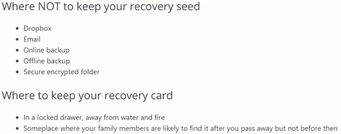
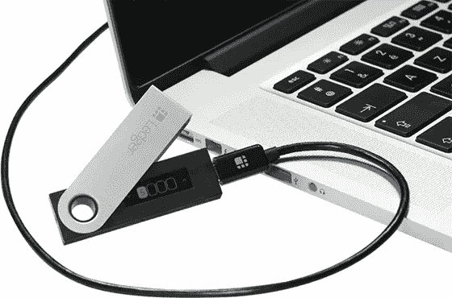
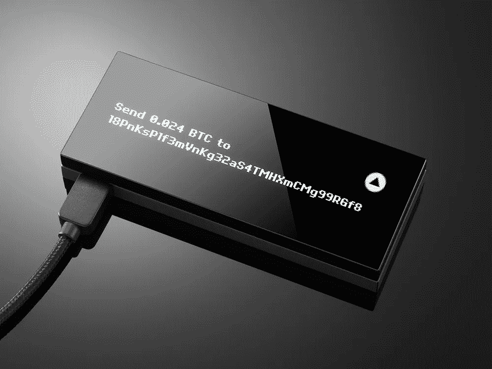
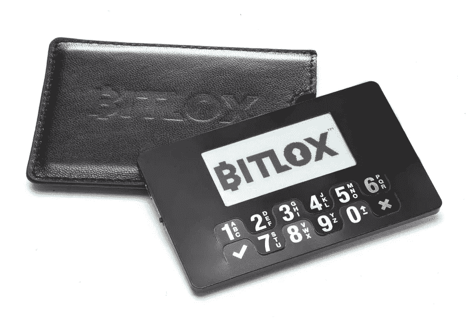
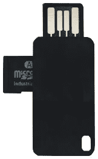

# 2017-2018 年前五名比特币硬件钱包(支持 Altcoin)

> 原文：<https://medium.com/hackernoon/top-5-bitcoin-hardware-wallets-of-2017-2018-altcoin-supported-3a1dac5884b1>

你可能知道，几天前我写了一篇文章[什么是比特币硬件钱包(以及你为什么必须使用它)](https://hackernoon.com/what-is-a-bitcoin-hardware-wallet-and-why-you-must-use-it-3fceeae2b21)。我建议你在继续之前阅读它，但这不是强制性的。

正如我之前提到的，今天我们将比较 2017 年**最佳硬件钱包——从 2018 年**开始。请随意评论并在下面的评论中完成这个列表。

# 特雷佐

该设备于 2014 年推出。主要特点:

*   支持比特币、以太币、(+所有 ERC20 代币)、以太币经典、ZCash、莱特币、Dogecoin、Dash 和比特币 Testnet。
*   全息贴纸，确保设备在到达您家门口之前没有被篡改。
*   Trezor 密码管理器将先进的加密技术带给计算机用户，无论他们的技术水平如何。只需点击一个简单的按钮，用户就可以用他的个人 TREZOR 设备对每个密码条目进行加密。然后，密码管理器会自动将加密的数据上传到用户的私有云存储中，以便在需要时随时可用。
*   U2F 支持(通用第二因子)。
*   宋承宪/GPG 代理。
*   许多软件和在线服务都支持 Trezor(完整列表请点击查看[)。](https://doc.satoshilabs.com/trezor-apps/index.html)
*   每次将设备连接到桌面或移动设备时，您都必须输入 PIN 码才能解锁钱包。

解锁的过程还是挺有新意的。它显示在下面的视频中:

制造商给出了一些关于如何储存恢复种子的有用提示:

**价格**:99 美元。

**缺点**:支持的加密货币比总账少。

# 莱杰纳米 S

主要特点:

*   支持方舟、比特币、比特币现金、Dash、Dogecoin、以太坊、以太坊经典、科莫多、莱特币、PoSW、Ripple、Stratis、Zcash 以及所有 ERC20 代币。
*   U2F 支持(通用第二因子)。
*   宋承宪/GPG 代理。
*   使用 2 个微控制器:ST31H320 + STM32F042。

下面的视频显示了如何输入 PIN 码。这个过程不是很容易，尤其是如果你想恢复一个备份，需要输入你的恢复种子词。

**价格** : 58€。

**缺点**:设备质量。左键有时会触发两次。

# KeepKey

主要特点:

*   支持比特币、莱特币、Dogecoin、Namecoin、Testnet、以太坊和 Dash。
*   3.12 英寸有机发光二极管屏幕(256 像素×64 像素)。
*   这是唯一一个允许你使用自己的固件的钱包。当你打开它的时候，它会显示一个警告。
*   FIPS 酒吧 140-2 和 FIPS 酒吧 180-2 认证。
*   像 Trezor 钱包一样，它受到全息贴纸的保护。

与 Trezor 钱包的解锁过程相同。

**价格**:129 美元

**缺点**:比其他钱包贵，但是屏幕确实不错。

# Bitlox

与其他设备不同，Bitlox 看起来更像一张智能卡。主要特点:

*   支持比特币和以太坊。
*   包含内部电池。
*   通过蓝牙 LE 通信。
*   只有 4mm 厚。
*   E-Ink 2 英寸屏幕。
*   支持多种 PIN 码:连接设备，使用不同的钱包，进行交易。
*   NIST 认证的随机数发生器。
*   一种特殊的密码可以清除设备上存储的所有数据。
*   支持 Tor 服务(BITLOX2twvzwbzpk.onion)或 I2P (BITLOX.i2p)。

制造商的网站看起来太旧了。

**价格**:98 美元。

# 数字位盒

主要特点:

*   没有屏幕。
*   支持比特币、以太坊(ETH 等，以及 ERC20 代币)。
*   U2F 支持(通用第二因子)。
*   您可以随时备份 microSD 卡。
*   支持 Tor 和 Tails 操作系统。
*   存储在受保护芯片上的私钥。
*   非常简单的设计。
*   通过移动应用程序进行交易验证和 2FA。
*   不要求显示或输入恢复种子词。其实你只要插入一个有备份的 microSD 卡就行了。
*   USB 连接由 AES-256-CBC 加密。
*   只有一个物理按键。

**价格** : 54€。

这是对 2017 年上市的前五大硬件钱包的简短且非详尽的比较，从 2018 年开始。我希望它能给你一个关于这个话题的概述。但在为你选择一款之前，请不要犹豫，访问官方网站，阅读更多关于每款设备的详细评论。请随意在评论中填写这些信息！

> 感谢阅读！如果你喜欢，请鼓掌支持👏👏👏还有分享帖子。欢迎在下面留下你的评论💭。

> ***丹*** *是区块链* ***开发商*******投资方*** *。**
> 
> **他是*[***LiveMarketCap.com***](https://livemarketcap.com)*的 CEO。它提供所有活跃加密货币的实时排名，包括最新的加密货币新闻、市场价格、图表和分析。**
> 
> **有反馈吗？关注 LiveMarketCap 上的* [*推特*](https://twitter.com/livemarketcap) *！👋**