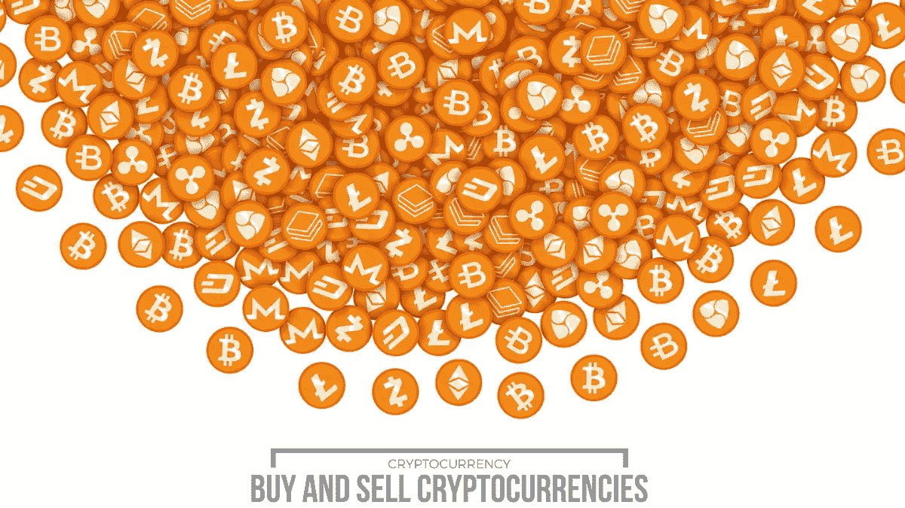
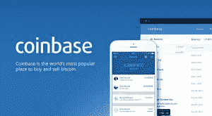
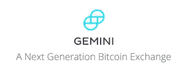
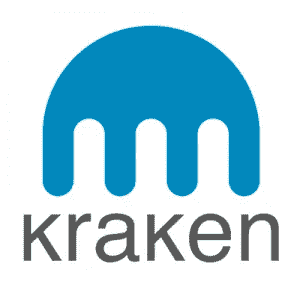
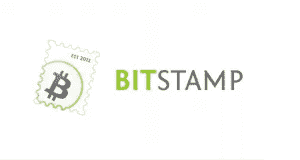

# 支持菲亚特的五大比特币/加密货币交易所(2019 年更新)

> 原文：<https://medium.com/hackernoon/top-5-fiat-to-cryptocurrency-exchanges-b944ae30d6c4>

任何希望进入[加密货币](http://news.fundyourselfnow.com/2017/09/19/cryptocurrency-how-does-it-work/)市场的人都需要加密货币交易所的服务。拿到钱包后，这往往是议事日程上的下一项。2017 年，加密货币在全球范围内的受欢迎程度大幅飙升。因此，越来越多的人开始积极投资股市。这使得加密交易所在加密货币世界中的作用变得更加重要。在深入研究五大法定转加密交易所之前，了解什么是加密交易所是很重要的。

## 什么是加密货币交易所？

加密交易所是一个在线网站，为比特币、以太币和莱特币等加密货币与美元、欧元和英镑等法定货币的购买、销售或交换提供平台。

## 加密货币交易所的类型

基本上有三种不同类型的加密货币交换平台。这种差异是由于什么决定了交换平台上加密硬币的价格。

## 交易平台

这些网站是加密货币的潜在买家和卖家可以发出“购买”或“出售”订单的市场。买方和卖方彼此不互动。每个人只和平台互动。这项服务在每笔交易结束时收取费用。

## 点对点(P2P)交换平台

这些服务不是仅仅与平台互动，而是直接连接买家和卖家。没有固定的市场价格，因为一切都取决于双方达成协议。加密货币交易所的作用是提供托管和交易中介服务。

## 密码经纪人

这些功能就像外汇经纪人服务。潜在买家可以访问这些平台并购买加密货币。经纪人设定加密硬币的价格。

互联网上有大量的加密交换服务。本文的重点是介绍五大在线加密交换服务，人们可以在这里将他们的法定货币兑换成加密硬币。

## 1.CEZEX

Cezex 是一个基于亚洲的加密货币交易平台。除了美国和中国，它在大多数国家都有售。目前，定期存款和取款是免费的，处理起来也相对较快。与其他法定密码交易相比，交易费用要低得多。

Cezex 也是一家获得许可的证券令牌和衍生品交易所。它提供在其他菲亚特交易所不常见的产品，如使用加密买入传统衍生品(外汇、大宗商品)和证券交易。

## 2.比特币基地

[比特币基地](https://www.coinbase.com)是一家受欢迎的加密货币交易所和钱包服务提供商。他们有来自世界各地的数百万顾客。这项服务于 2012 年推出。

比特币基地因其易用性以及在许多不同国家的可用性而闻名。比特币基地交易所服务的另一个受欢迎的功能是 [GDAX 平台](https://www.gdax.com/)。GDAX 代表全球数字资产交易所，它是加密货币的交易平台。

信用卡/借记卡以及银行转账是该平台上最受欢迎的两种支付方式。通过信用卡/借记卡进行交易比银行转账要快得多。前者需要几分钟，而后者可能需要 3 到 5 天。信用卡交易的费用可能高达 5%。

在比特币基地可以用法定货币购买的加密货币有比特币(BTC)、以太币(ETH)和莱特币(LTC)。在平台上购买加密货币需要进行账户验证。该验证需要照片 ID、银行详细信息和电话号码。

## 3.双子星座

[Gemini](https://exchange.gemini.com/register) 是美国监管的最重要的加密货币兑换服务。总部设在纽约，他们经营完全许可和注册，以提供 BTC 和瑞士联邦交易所服务。这个平台是由著名的文克莱沃斯双胞胎卡梅隆和泰勒·文克莱沃斯创建的。

双子座最大的卖点是它为客户提供的保证和安全。所有美元法定存款都存放在联邦存款保险公司承保的银行。它还确保将大部分的 ETH 和 BTC 冷藏起来。

Gemini 接受银行转账和信用卡/借记卡支付。他们还为下高额订单的人提供合理的折扣。Gemini 在美国的 42 个州以及日本、加拿大和新加坡等其他几个国家都有销售。阅读双子座交易指南。

## 4.北海巨妖

许多加密交换服务试图提供一些稍微不同的东西，以便在市场上给自己一个优势。在北海巨妖的案例中，它的关键价值主张是围绕着提供保证金交易。这使得它成为加密货币交易者的绝佳选择。

北海巨妖成立于 2011 年，已经成为流动性和欧元价值方面最大的比特币交易服务平台。北海巨妖也是 Fidor 银行股份公司的合伙人；第一家加密货币银行。北海巨妖不仅从事比特币交易服务。它为其他加密硬币提供兑换服务，如 ETH、XMR (Monero)、ETC(以太坊经典)、LTC 和 XRP (Ripple)。

北海巨妖接受美元、日元、加元和英镑等货币的电汇付款。他们非常重视提供强大的安全功能。他们的帐户安全框架包括双因素认证协议以及 [PGP 电子邮件加密](https://www.openpgp.org/software/)。开户时需要进行身份验证。

## 5.位戳

[Bitstamp](https://www.bitstamp.net/account/register/) 是欧洲流行的加密交换服务。这是因为通过 SEPA 进行的存款 100%免费。它成立于 2011 年，是市场上最古老、最受信任的加密货币交易平台之一。

在安全功能方面，Bitstamp 有相当不错的设置。他们的服务采用多重签名(multisig)技术和双因素认证协议。他们持有的大部分密码也是离线保存的，以免被在线黑客窃取。价值低于 2 万美元的加密货币购买收取 0.25%的费用。

Bitstamp 网站提供多种语言支持，并接受多种货币，如瑞士法郎、欧元和英镑。

## 结束语

像任何其他投资类别一样，加密货币包含相当大的风险。在选择加密交换平台之前，进行适当的尽职调查是很重要的。在一个人可以舒适地满足于交换服务之前，必须做大量的研究。费用、支付方式和账户安全功能等参数只是声誉良好的加密货币交易所的一些关键指标。通过适当的研究和尽职调查，成为外汇欺诈受害者的风险会大大降低。

渴望了解更多关于 FundYourselfNow 的信息吗？在我们的 [Telegram](https://t.me/fundyourselfnow) 群组上加入我们的众筹革命对话，或者在 [Twitter 上关注我们。](https://twitter.com/fundyourselfnow)