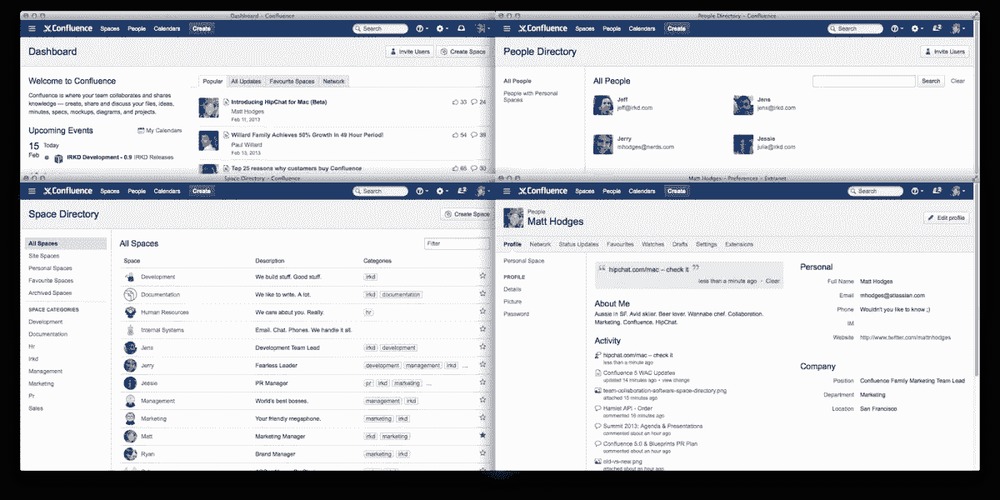
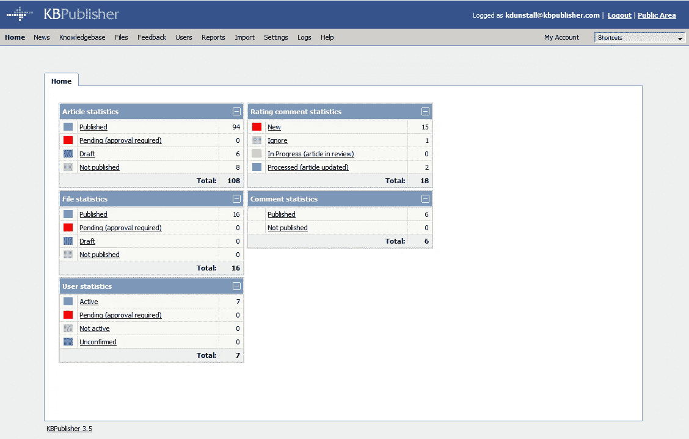
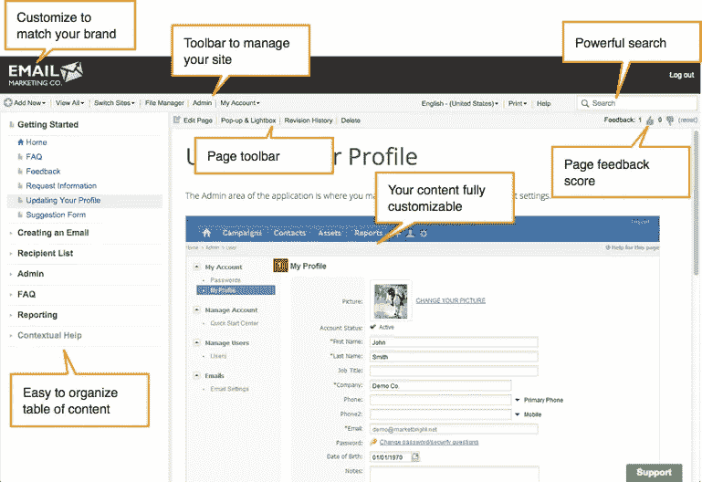
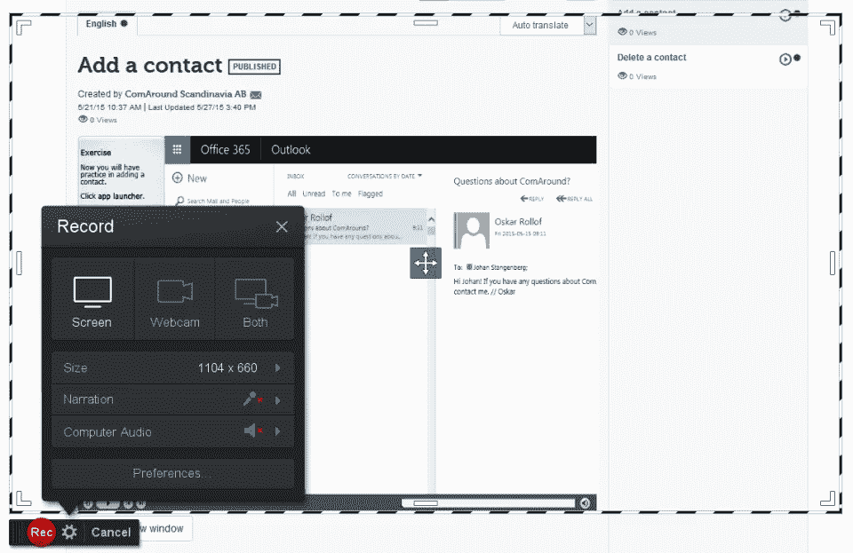
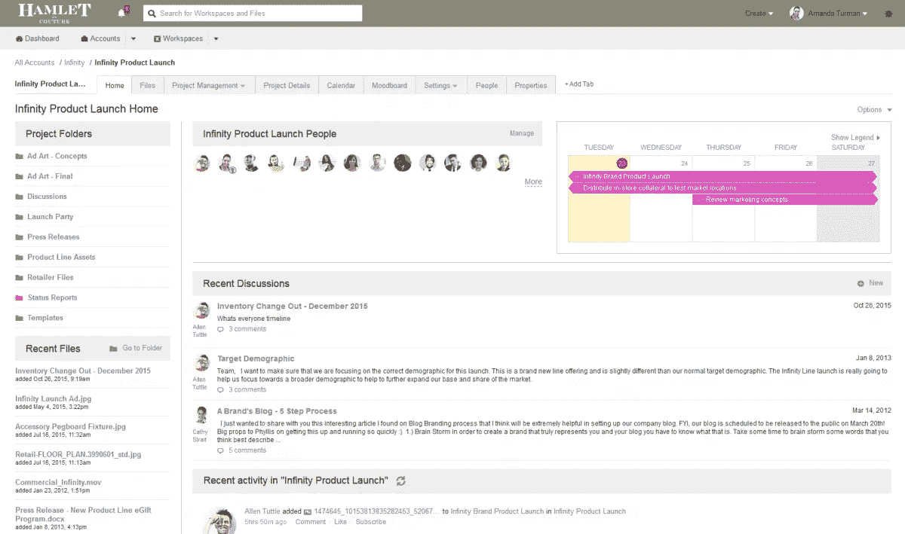

# 创业公司的 5 大知识管理软件。你的公司需要定制的吗？

> 原文：<https://medium.com/hackernoon/top-5-knowledge-management-software-for-startups-does-your-company-need-a-custom-one-d6e1a6a40235>

知识管理软件侧重于公司内每个人如何编辑、组织、存储和访问信息。它不仅仅是一组数字和事实。这是一种保留员工专业技能和知识的方式，尽管今天，大多数公司都忽略了这一点。这些公司相信和信任传统的知识共享，然而，这一切都归结于在浪费几个小时弄清楚问题的来龙去脉后，与坐在你旁边的同事取得联系。此外，我们不应该忘记人员流动。

换句话说，用于知识管理的软件包括保留、共享和应用公司的专业知识，以建立业务流程，提高员工绩效，从而提高公司效率。投资知识管理软件开发和战略可以帮助初创企业和小型企业保持竞争力，以下是方法:

## 跨部门及时传播知识

在大型企业中，人们通常有专门的角色，有一套明确定义的职责，而初创公司主要涉及多面手，需要轻松访问各个部门的文档。知识管理工具为行政人员、项目经理、开发人员、营销人员和其他员工提供了最好的资源，并使他们更有效地工作。

## 补偿劳动力流动

目前，人们在职业生涯中平均会换 10 到 15 次工作，在每个职位上花费大约 4-5 年时间。然而，对于初创公司来说，员工流动是一个真正的问题，因为他们的知识更依赖于每个特定的员工。知识管理系统软件有助于缓和这种变化，并以所有工人都能获得必要文件的方式安排资源。

## 减少培训所需的时间和资源

通常，培训和新员工入职培训需要时间和投入，以及初创公司难以负担的人力资源。有了[定制的知识管理软件](https://da-14.com/services/web-app-development)，每当有新员工来的时候，小企业就不必分配资源和兜圈子了。可以根据多年来收集的信息和自己的经验创建培训材料和介绍文档，因此，新员工可以参考公司知识库中的特定部分。

## 业务增长前景

选择最好的知识管理软件的主要原因之一是小公司对进一步扩张的需求以及在未来保持竞争力的能力。有了知识管理系统，所有的信息都将被很好地组织和结构化，所以当时机成熟时，它将很容易被用来支持增长。

要尝试的最佳知识管理系统应该与您现有的平台无缝集成，并包含必要的功能来改善您公司内部的知识共享流程。

## 创业的最佳工具包括:

[**汇合**](https://www.atlassian.com/software/confluence)

*Photo credit:* [*Confluence*](https://confluence.atlassian.com/alldoc/atlassian-documentation-32243719.html)

**Atlassian 的 Confluence**是所有团队的最佳协作软件解决方案之一，无论公司规模如何。这个工具帮助企业创建、构建、分享和讨论所有应该由他们的团队完成的任务。此外，有了 Atlassian Confluence，数据更容易查找、更新和使用。

**主要特性:**

*   方便的文件协作
*   能够插入行内注释
*   内容/文档/项目管理
*   丰富内容编辑器
*   版本控制
*   高级搜索
*   有序的协作工作空间
*   任务跟踪
*   JIRA 一体化
*   庞大的插件生态系统

**起始费用:**7 天免费试用，然后每月 10 美元起

[**知识库发布者**](https://www.kbpublisher.com/)

*Photo credit:* [*KBPublisher*](https://www.kbpublisher.com/)

**KBPublisher** 是一款基于网络的知识管理软件，可以与员工、合作伙伴和客户轻松共享信息。这个开源工具可以提高人员效率，缩短搜索时间，减少对客户支持的需求。

**主要特点:**

*   内容/数据/文档管理
*   LDAP /远程用户认证
*   全文搜索
*   方便地控制用户权限和角色
*   分类/编目
*   从任何浏览器和任何位置轻松访问
*   在管理/公共视图之间快速切换
*   批量加载文件

**起始费用:** 21 天免费，然后每月 19 美元起

[**proproprofs 知识库**](http://www.proprofs.com/)

*图片来源:* [*ProProfs 知识库*](http://www.proprofs.com/knowledgebase/)

ProProfs 是一个强大的在线平台，旨在有效地组织和传播员工的知识，丰富集体经验，提高信息的可访问性和可搜索性。它确保对所有文件和文档的集中访问，促进新员工的入职流程，提高生产率和产量。

**主要特性:**

*   基于云的平台，可随时随地轻松访问
*   支持 word 文档、pdf、电子书、excel 表格、图像、视频等。
*   角色和权限管理
*   与 SaaS 工具无缝集成
*   一个有你自己标志和公司颜色的品牌
*   提示导入和导出文件
*   版本历史
*   高效的谷歌式搜索

**起始费用:** 40 页免费，然后每月 18 美元起

[**共圆知识**](https://www.comaround.com/)

*Photo credit:* [*Capterra*](http://www.capterra.com/knowledge-management-software/spotlight/147409/ComAround%20Knowledge/ComAround)

**ComAround Knowledge** 是一款基于云的知识管理软件和自助服务解决方案，专注于在整个组织中收集、管理和分发知识。它与现有流程和 ITSM 应用程序及工具无缝集成，以实现更高效的支持。

**主要特性:**

*   文章的自动翻译
*   显像记录
*   可定制的外观，与您的视觉形象相匹配
*   游戏化支持，鼓励创建质量知识库
*   智能手机/平板电脑友好

**起始费用:**30 天免费试用

[**iMeetCentral**](http://imeetcentral.com/)

*Photo credit:* [*iMeetCentral*](http://imeetcentral.com/)

**iMeet Central by PGI** 是一款基于云的协作和项目管理软件，它简化了文件共享，集中了团队之间的通信，使他们更有组织性和生产力。该解决方案允许您实施项目和设置任务、分配提醒、跟踪工作流程、自动执行日常任务并促进持续的业务流程。

**主要特点:**

*   项目/任务管理
*   同步编辑
*   内容/文档管理
*   版本控制
*   关于项目状态和生产率的高级报告
*   群组日历
*   与第三方工具轻松集成

**起始费用:** 15 天免费试用，然后每月 25 美元起

然而，在现有的顶级知识管理工具中，这些是利用生产力、员工参与度、客户满意度和企业价值的最佳选择。

然而，今天越来越多的公司选择定制开发，并决定构建一个知识管理软件解决方案来完美地满足他们的特定需求和目标。这种定制的网络应用依赖于现有的公司管理和组织结构。它们确保迅速集成到业务工作流中，对系统的完全控制，以及随着公司的发展而具有良好的可伸缩性。如果你决定开发一个知识管理软件，你就增加了你的商业价值并获得了独特的竞争优势。

> [黑客中午](http://bit.ly/Hackernoon)是黑客如何开始他们的下午。我们是 [@AMI](http://bit.ly/atAMIatAMI) 家庭的一员。我们现在[接受投稿](http://bit.ly/hackernoonsubmission)，并乐意[讨论广告&赞助](mailto:partners@amipublications.com)机会。
> 
> 如果你喜欢这个故事，我们推荐你阅读我们的[最新科技故事](http://bit.ly/hackernoonlatestt)和[趋势科技故事](https://hackernoon.com/trending)。直到下一次，不要把世界的现实想当然！

